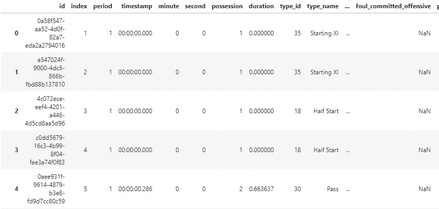
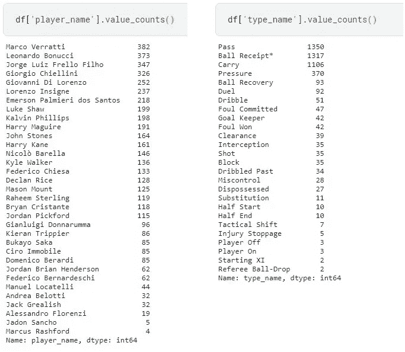
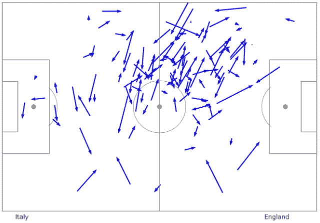
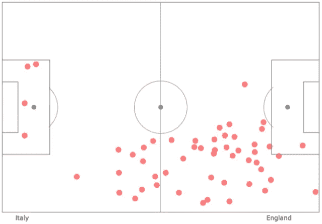
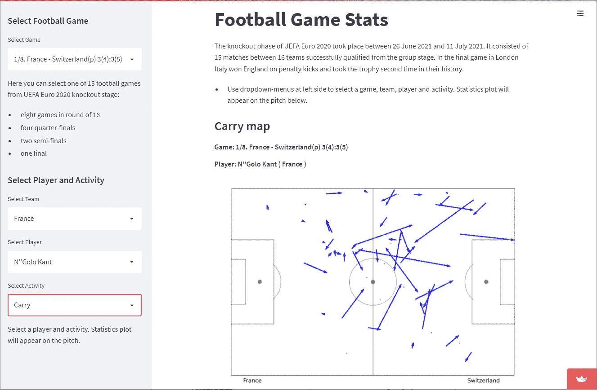

# 可视化足球比赛数据

> 原文：<https://towardsdatascience.com/visualizing-football-game-data-6a124fab911b?source=collection_archive---------9----------------------->

## 使用 Python、JSON、Matplotlib 和 Streamlit


由[法布里西奥·特鲁希略](https://www.pexels.com/de-de/@fabtruji?utm_content=attributionCopyText&utm_medium=referral&utm_source=pexels)拍摄于[像素](https://www.pexels.com/de-de/foto/weisses-und-grunes-gras-wahrend-des-tages-54567/?utm_content=attributionCopyText&utm_medium=referral&utm_source=pexels)

*   在 Streamlit 上查看申请:[https://share . Streamlit . io/andriigoz/football _ game _ stats/main . py](https://share.streamlit.io/andriigoz/football_game_stats/main.py)
*   GitHub 库:[https://github.com/AndriiGoz/football_game_stats](https://github.com/AndriiGoz/football_game_stats)

## 浏览数据

我总是对显示足球运动员在球场上表现的热图感到兴奋。让我们尝试构建我们的应用程序，在其中我们可以选择一个玩家和他的动作，并将其可视化。用于分析的数据在 StatsBomb 开放数据存储库中的[处找到。StatsBomb 是一家收集和存储足球比赛数据的英国公司。对于我的应用程序，我取了 15 个 JSON 文件，代表 2020 年欧锦赛淘汰赛阶段的 15 场比赛，比赛发生在 2021 年 6 月 26 日至 2021 年 7 月 11 日之间。](https://github.com/statsbomb/open-data)

让我们打开并发现意大利和英格兰之间的决赛。

```
# Read JSON file
with open('3795506.json', 'r', errors="ignore") as f:
    game = json.load(f)
df = pd.json_normalize(game, sep='_')
```



4796 行× 122 列

让我们先来看看数据框架。共 4796 行，122 列，有*时间戳*、*玩家名*、*类型名位置、*等列。它告诉我们整个游戏的故事，从开始到结束:发生了什么，谁做的，什么样的行动，在哪里等。有一个大约 120 分钟长的游戏和一个 4796 行的数据帧，我们得到每 1.5 秒捕获的动作列表。

那场比赛玩家做了几个动作？那是什么样的行动？使用 *pd.value_counts* 我们可以看到 *player_name* 和 *type_name* 列的唯一值的计数，并了解那里发生了什么。



玩家名称和类型名称的动作数量

马尔科·维拉蒂以他的 382 次行动成为游戏中最活跃的玩家。最常见的动作是*传球、接球*和*持球*。对于我的应用程序，我决定采取四个最频繁的动作加上 *Shot* 动作。*app 的思路是做一些下拉菜单，我们可以在里面选择一场比赛、一名球员、其中一个动作，然后在球场上画出这个具体动作的可视化。*

## *创建音高*

*在*之友的追踪库*中的[这里](https://github.com/Friends-of-Tracking-Data-FoTD/SoccermaticsForPython/blob/master/FCPython.py)找到了 Pitch Plot 函数。他们用*长度、宽度、单位*和*线条颜色*参数创建了一个很好的函数，返回给我们一个现成的足球场作为次要情节。所以我们只是拿着它，并不太坚持这一部分。*

```
*from FCPython import createPitch
# Create pitch plot
pitch_width = 120
pitch_height = 80
fig, ax = createPitch(pitch_width, pitch_height, 'yards', 'gray')*
```

## *通过绘图功能*

*我们通过选择包含某些*类型名称*和*玩家名称*的行来启动通道绘图功能。 *type_name* 在这里等于“Pass”， *player_name* 将由用户从下拉菜单中选择分配(这将在 Streamlit 应用程序部分完成)。接下来，我们得到*位置*和 *pass_end_location* 系列并将它们转换成两个列表:(x1，y1)坐标，这里给出了一个 pass；和(x2，y2)坐标，其中接收到传球。使用*py plot . fibble(x1，y1，u，v)* 方法，我们现在可以绘制代表通道的箭头。此外，我们为主队分配蓝色，为客场队分配红色。*

**

*马尔科·维拉蒂通行证地图(意大利)。作者图片*

*这样，我们就有了一个函数，它返回游戏中所选玩家的所有传球的可视化效果。进位图和 Shot 图功能具有相同的结构，因此不必在本文中描述。*

## *接球图*

*对于球收据绘图功能，我们选择*type _ name = =‘球收据’*的行。这里我们只得到一个(x，y)坐标列表，并用 *plt 将它们可视化为点。*圆(x，y)法。压力绘图功能具有相同的逻辑。*

**

*哈里·马奎尔(英国)的球收据地图。作者图片*

## *简化应用程序*

*Streamlit 是每个数据科学家都应该知道的强大工具。它非常简单，同时，它让您有可能通过 web 应用程序可视化和共享您的数据见解。首先，我们创建了一个侧边栏，它有四个下拉菜单和一些只有几行代码的文本:*

```
*# Drop-down menu 'Select Football Game'
st.sidebar.markdown('## Select Football Game')
menu_game = st.sidebar.selectbox('Select Game', games_list, index=14)

# Drop-down menus 'Select Team, Player and Activity'
st.sidebar.markdown('## Select Player and Activity')
menu_team = st.sidebar.selectbox('Select Team', (team_1, team_2))
if menu_team == team_1:
    menu_player = st.sidebar.selectbox('Select Player', player_names_1)
else:
    menu_player = st.sidebar.selectbox('Select Player', player_names_2)
menu_activity = st.sidebar.selectbox('Select Activity', activities)
st.sidebar.markdown('Select a player and activity. Statistics plot will appear on the pitch.')*
```

*这里我们让用户通过从相应的*‘选择玩家’*和*‘选择活动’*下拉菜单中选择来指定*玩家名称*和*类型名称*。这些参数将定义必须显示哪个特定的玩家和活动。然后 activity 的 plot 会被 *st.pyplot* 函数调用。使用 *st.head* 、 *st.write* 和 *st.markdown* 方法，我们用一些文本填充我们的主区域。*

**

*Streamlit 上的[应用程序](https://share.streamlit.io/andriigoz/football_game_stats/main.py)*

*要创建 Streamlit 应用程序，您需要为您的 Python 安装 Streamlit 库。为了分享它，你必须在 [streamlit.io](http://streamlit.io) 注册，制作一个新的应用程序，并将其连接到 GitHub 存储库中的项目文件夹。将自动创建一个随时可用的 web 应用程序。*

## *参考*

*[1] StatsBomb 公开数据:【https://github.com/statsbomb/open-data *

*[2]创建 Pitch 资源库:[https://github . com/Friends-of-Tracking-Data-FoTD/SoccermaticsForPython/blob/master/fc python . py](https://github.com/Friends-of-Tracking-Data-FoTD/SoccermaticsForPython/blob/master/FCPython.py)*

*[3] [Irfan Alghani Khalid](https://medium.com/@irfanalghani11?source=post_page-----2f4070d551ff-----------------------------------) ，如何使用 Python 分析足球赛事数据:[https://towards Data science . com/How-to-Analyze-Football-Event-Data-Using-Python-2f 4070d 551 ff](/how-to-analyze-football-event-data-using-python-2f4070d551ff)*

*[4]2020 年欧锦赛淘汰赛阶段:[https://en.wikipedia.org/wiki/UEFA_Euro_2020_knockout_phase](https://en.wikipedia.org/wiki/UEFA_Euro_2020_knockout_phase)*