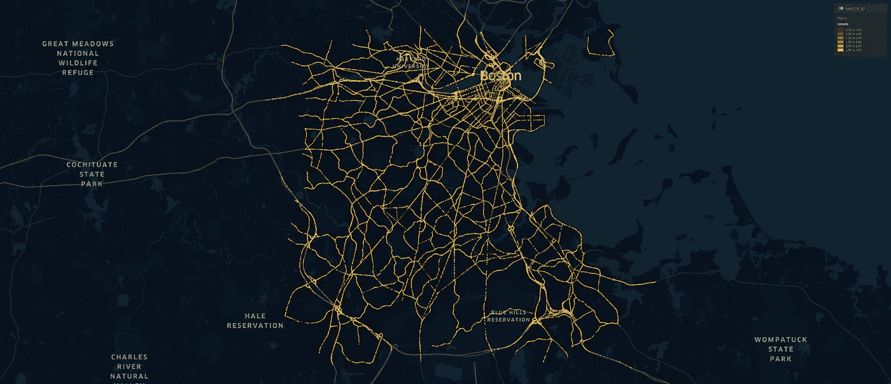
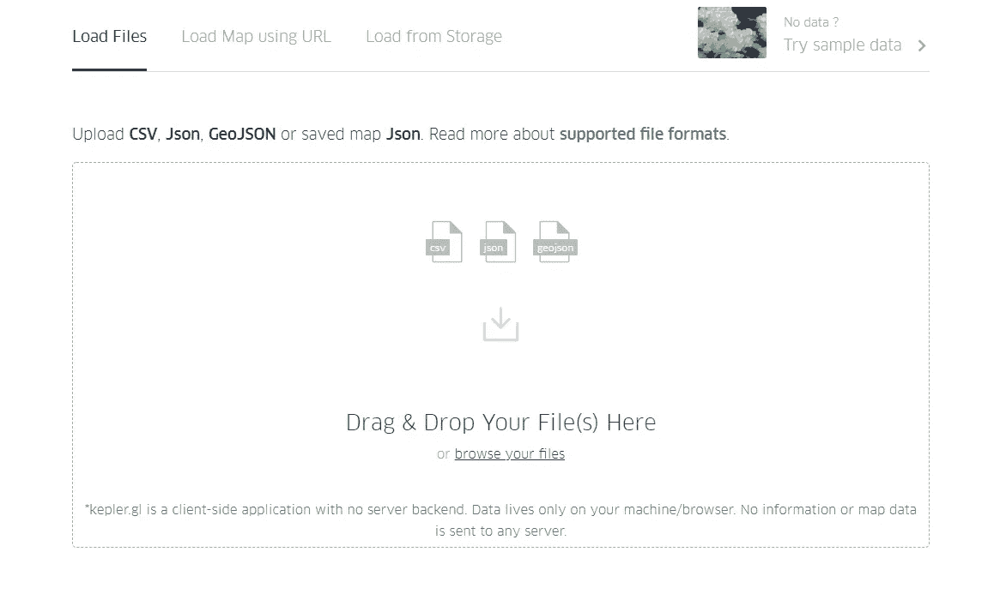
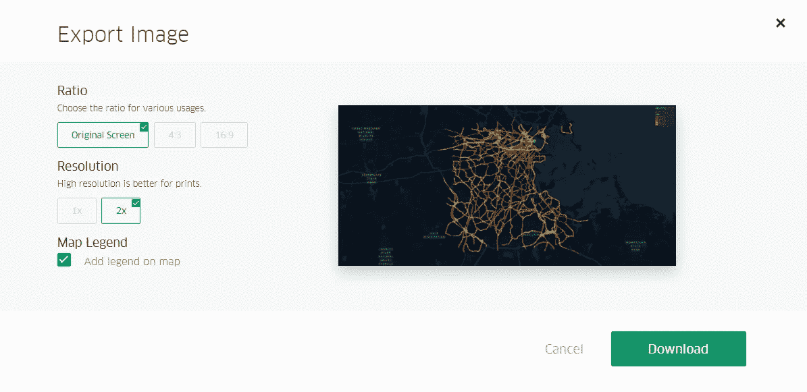
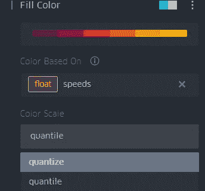
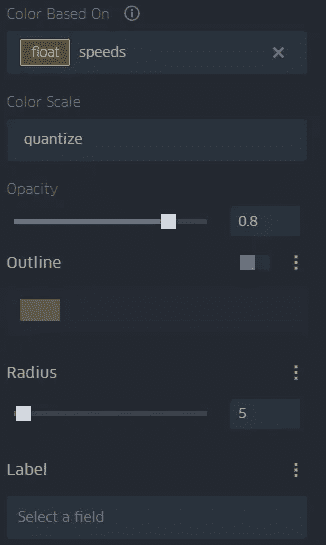

# 在 Kepler.gl 中可视化地理空间交通数据

> 原文：<https://towardsdatascience.com/visualizing-geospatial-traffic-data-in-kepler-gl-773dd14fc98a?source=collection_archive---------15----------------------->

## 使用 Kepler.gl 和 HERE traffic data，对数十万个交通数据点进行快速、优雅的地理空间可视化

使用 Kepler.gl |塞犍陀·维维克可视化波士顿交通

Kepler.gl 是优步的开源地理空间工具箱。通常，可视化大规模地理空间数据集可能相当具有挑战性。有很多 Python 包包括 leav、GeoPandas 和 Plotly 都做得很好；但是找到合适的情节背景可能是一个挑战。在本地机器上绘制数千或数十万个数据点在计算上也具有挑战性。

这就是 Kepler.gl 有巨大优势的地方。Kepler.gl 是一个基于浏览器的框架，可以轻松加载 CSV、JSON 或 GeoJSON 数据，并以最少的格式生成优雅的可视化效果。在这个例子中，我在几秒钟内可视化了从 HERE Traffic API 获得的成千上万的流量数据点。

我们开始吧！

# 获取交通数据:

我已经从[HERE Technologies traffic flow API](https://developer.here.com/pricing)获得了交通数据。我写过几篇文章，重点介绍如何提取交通流量数据:

 [## 使用 HERE traffic api 可视化实时交通模式

### 虽然谷歌地图显示的是实时交通状况，但却无法访问底层的交通数据。这里的技术提供了…

towardsdatascience.com](/visualizing-real-time-traffic-patterns-using-here-traffic-api-5f61528d563)  [## 骚乱后宵禁期间 DC 实时交通可视化

### 流动性是城市的生命线。让我们想象一下，在今天不幸的混乱之后，宵禁期间的 DC…

towardsdatascience.com](/visualizing-dc-real-time-traffic-during-the-curfew-after-riots-2007cc6838f6) 

# 保存文件

Kepler.gl 喜欢将文件保存为 CSV 格式，有不同的列。如果您想要一个即时的地理空间图，您需要将这两列标记为“纬度”和“经度”，用于空间位置，第三列用于颜色偏好(在交通信息的情况下是速度)。

# 在 Kepler.gl 中可视化

既然我们已经以正确的格式保存了数据，我们就可以拖放了——就这么简单！

在 Kepler.gl 中加载文件

你会自动得到一个可以保存的漂亮图像。

从 Kepler.gl 导出图像

然而，当你仔细观察时——色阶是根据分位数显示的——这取决于数据以及数据的比例和速度。例如，如果大部分交通是快速移动的(通常是在深夜或清晨)，颜色味觉将偏向这些更高的速度。然而，这不是我们想要的。我们希望颜色能清楚地表明绝对速度:就像谷歌地图中的交通一样。在这种情况下，我们根据量化值而不是分位数来选择颜色，如下所示。

选择是基于 Kepler.gl 中的量化值还是分位数来着色

还有一些选项可以改变符号的外观和颜色。这样做，我们可以生成一些非常优雅的可视化效果——如本文的标题图片所示！

在 Kepler.gl 中修改颜色和符号

# 结论

Kepler.gl 非常适合以最小的努力相对快速地生成优雅的可视化效果。相比之下，使用 OSMnx 和其他 Python 库在我的本地机器上绘制成千上万个点需要更长的时间。

然而，在 Kepler.gl 以最少的输入在可视化方面做得很好的地方，人们也遇到了最小可定制性的问题。例如，基本上只有 3 种背景——黑暗、明亮和卫星。可能存在需要其他类型背景的情况。

但是 Kepler.gl 在地理空间可视化方面做得很好。

[*关注我*](https://medium.com/@skanda.vivek) *如果你喜欢这篇文章——我经常写复杂系统、物理学、数据科学和社会的界面。*

*如果你还不是中会员，想支持我这样的作家，可以通过我的推荐链接随意报名:*[*https://skanda-vivek.medium.com/membership*](https://skanda-vivek.medium.com/membership)