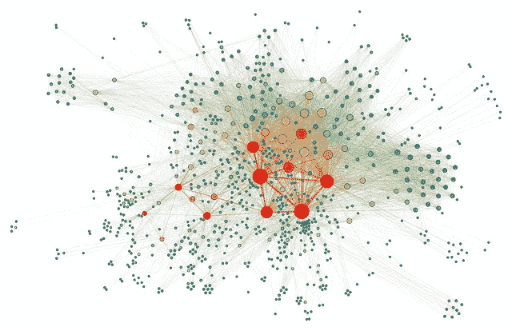
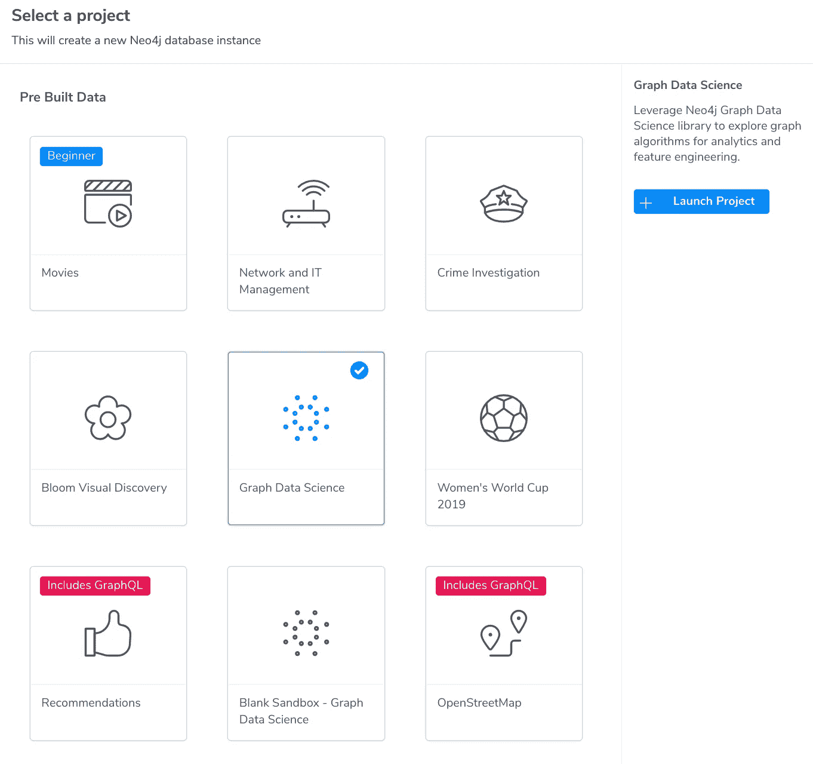
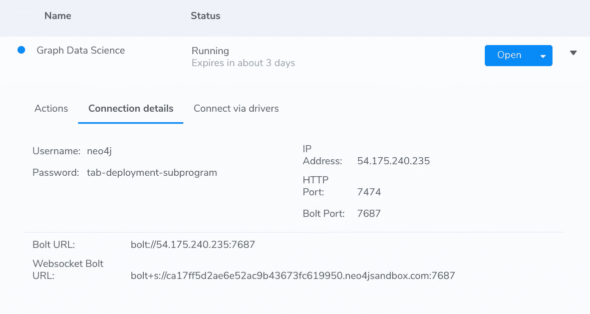
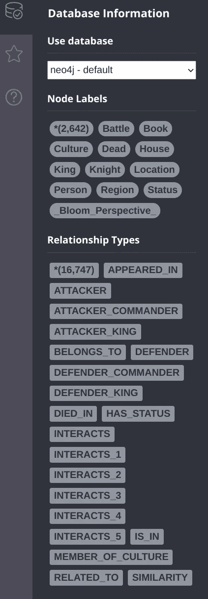
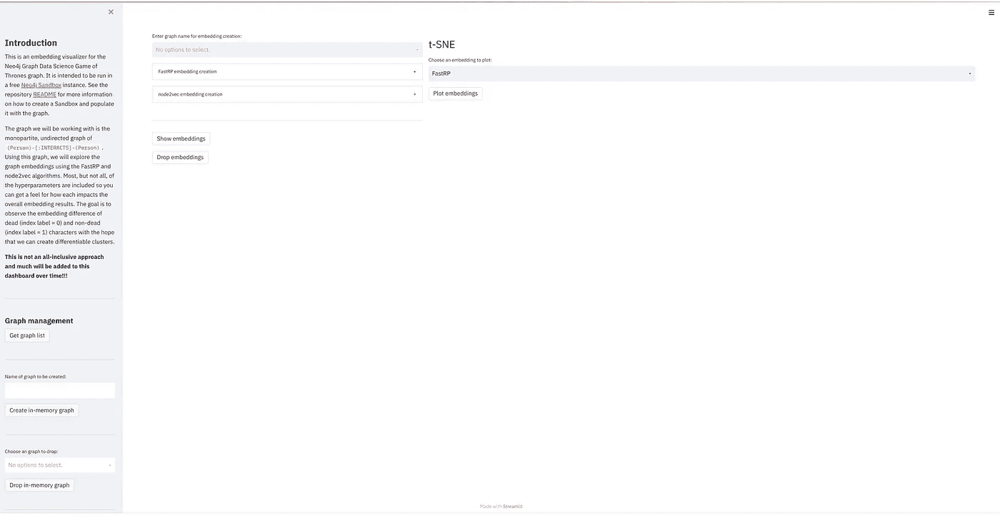
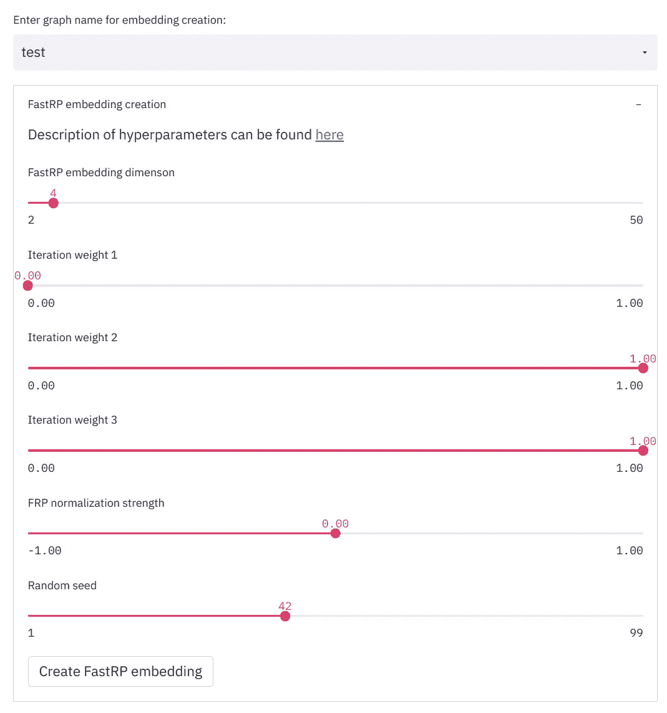
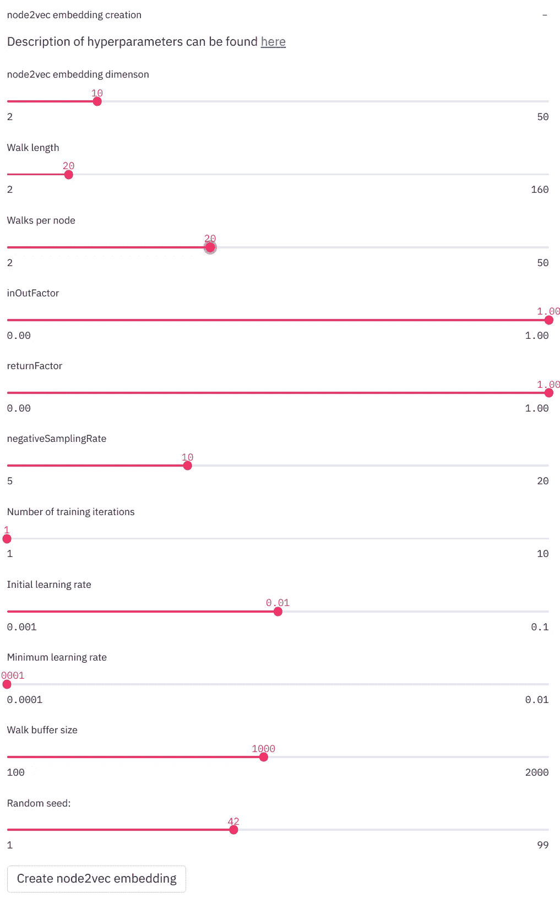
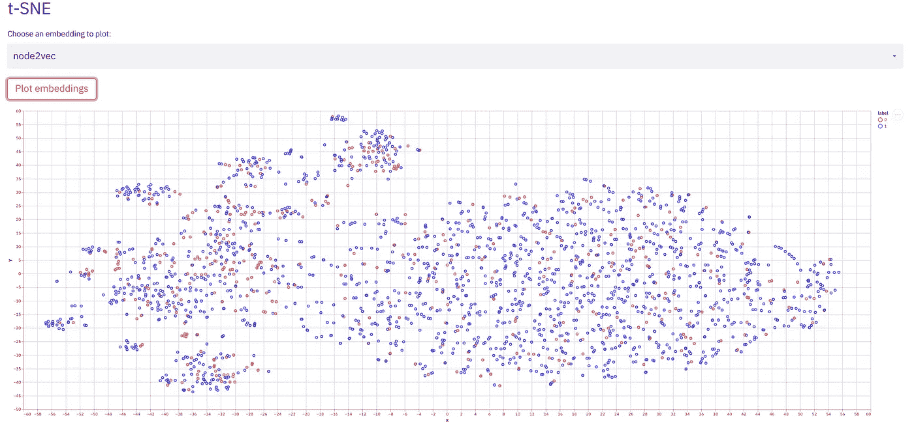

# 用 Python 中的 t-SNE 可视化图形嵌入

> 原文：<https://towardsdatascience.com/visualizing-graph-embeddings-with-t-sne-in-python-10227e7876aa?source=collection_archive---------12----------------------->

## [实践教程](https://towardsdatascience.com/tagged/hands-on-tutorials)

## 如何定性评估 Neo4j 图嵌入



图片由 [Martin Grandjean](https://commons.wikimedia.org/wiki/User:SlvrKy) 提供，根据[知识共享](https://en.wikipedia.org/wiki/en:Creative_Commons) [署名-分享相似 4.0 国际](https://creativecommons.org/licenses/by-sa/4.0/deed.en)许可授权。未对原始图像进行任何更改。

# 介绍

在我的[上一篇文章](https://dev.neo4j.com/intro_graph_emb_tds)中，我们讨论了图嵌入的目的和本质。主要思想是，为了在图上进行机器学习，我们需要将图转换成一系列向量(嵌入)，然后我们可以使用这些向量来训练我们的机器学习(ML)模型。

问题是图嵌入可能很难调优。与创建嵌入和它们所用于的模型的其他方法类似，我们需要考虑很多超参数，并且针对特定的应用对它们进行优化需要时间。关于调整嵌入的主题，我将留到以后的文章中讨论。

这篇文章是关于开发关于嵌入的超参数的直觉。更具体地说，我将向您展示如何在 [Neo4j](https://dev.neo4j.com/neo4j) 中注入由[图形数据科学](https://dev.neo4j.com/graph_data_science) (GDS)库创建的图形嵌入，然后用 [Streamlit](https://streamlit.io) 仪表板可视化它们。Tomaz Bratanic 开发了[功能](https://dev.neo4j.com/nneuler_embeddings)来可视化 NEuler Neo4j 工具中的嵌入，但是我将演示如何以一种纯粹的 pythonic 方式来实现这一点。

你可以在 GitHub repo 中找到本教程的所有代码。

# 入门指南

我们需要做的第一件事是使用免费的 Neo4j [沙箱](https://dev.neo4j.com/sandbox)实例创建一个用于嵌入创建的图。在本次演示中，我们将使用一个预先构建在沙盒中的图表，即《权力的游戏》图表，它是许多图表示例的来源。(这张图贯穿了前 5 本书，我要警告你，《权力的游戏》剧透就要来了！)

<https://dev.neo4j.com/sandbox>  

当您到达主沙盒页面时，您将希望选择带有预构建数据的图表数据科学类型，并启动项目:



选择带有预建数据的图形数据科学图像。(图片由作者提供。)

您将看到实例被创建。然后，您需要使用右边的下拉菜单获取连接详细信息:



实例的连接详细信息。(图片由作者提供。)

酷毙了。请务必获取 Bolt URL 和密码，因为这些将用于建立我们的连接。如果您单击 Open: Open with Browser，然后单击左上角的数据库图标，您应该会看到一个预先填充的 2642 个节点的图表，这些节点代表人员、地点等。以及各种类型的 16，474 个关系。



《权力的游戏》图表的节点和关系。(图片由作者提供。)

在这一点上，你会想进入回购(你克隆了它，对不对？)并且我们将用这些信息调整 Dockerfile 文件。我喜欢使用 Docker，这样结果是可重复的。因此，根据上面的图像，您将编辑 Dockerfile 文件的最后一行，以读取

(在本文发布时，这个沙盒实例将被关闭。)

太棒了。现在我们可以构建用于建立连接的 Streamlit 容器。我非常喜欢 Streamlit，因为它允许您以最少的编码开销快速创建非常复杂的仪表板。我们现在将通过命令行使用标准命令来构建容器:

```
docker build -t neo_stream .
```

然后我们会用

```
docker run -p 8501:8501 -v $PWD/src:/examples neo_stream
```

(请注意，如果您在 Windows 上，您将需要调整这些命令。)

# 在仪表板中可视化嵌入

现在，我们已经启动并运行了 Streamlit 容器，并将其连接到 Neo4j 沙盒实例。现在容器正在运行，它将为您提供您应该使用浏览器导航到的 URL。它看起来会像 [http://172.17.0.2:8501。](http://172.17.0.2:8501.)当您这样做时，您应该会看到类似这样的内容:



Streamlit 仪表板的屏幕截图。(图片由作者提供。)

很好。现在让我们看看这里有什么。我们可以做的第一件事是点击“获取图表列表”这将做两件事。首先，如果您得到一些文本，您知道您已经正确地连接到沙箱。其次，如果有任何由 GDS 创建的内存图形(参见 [API 文档](https://neo4j.com/docs/graph-data-science/current/management-ops/)和[本帖](/how-to-get-started-with-the-new-graph-data-science-library-of-neo4j-3c8fff6107b)了解这些)，那么它们将在此列出。既然我们才刚刚开始，应该不会有。

但是我们现在要创建一个，因为他们是整个 GDS 的支柱。给图形命名并点击“创建内存图形”(没有空格！).这将创建一个单边无向图，查看《权力的游戏》中的哪些人与其他人互动，或`(person1:Person)-[:INTERACTS]-(person2:Person)`。当我们这样做时，我们将得到一个有 2166 个节点和 7814 个关系的图。注意，无向图将使关系的数量加倍，因为它考虑了从人员 1 到人员 2 和人员 2 到人员 1 的两个方向。剧透:如果你沿着图的自然方向走，你的嵌入看起来会不同:`(person1:Person)-[:INTERACTS]->(person2:Person)`。

好了，现在是开始工作并创建一些嵌入的时候了。在撰写本文时，我已经实现了 GDS 内置的两个更简单的嵌入，即 [FastRP](https://neo4j.com/docs/graph-data-science/current/algorithms/fastrp/#algorithms-embeddings-fastrp) 和 [node2vec](https://neo4j.com/docs/graph-data-science/current/algorithms/node2vec/#beta-algorithms-embeddings-node2vec) 。如果你阅读了 API 文档，你可以并且应该使用很多超参数，因为正如我们所知，缺省值往往不会给出最好的结果。我只包含了每种方法的一个子集，但将来会添加更多。对于 FastRP，我有以下内容:



仪表板中包含的 FastRP 超参数。(图片由作者提供。)

您还可以单击 node2vec 的下拉菜单，查看其中有哪些可调参数。我强烈建议您查阅每种嵌入方法的 API 文档，以获得更多关于每种方法的含义的信息，因为详细描述每种方法超出了本文的范围(尽管在以后关于嵌入调优的文章中，我们将深入讨论这一点！).

因此您可以创建 FastRP 和 node2vec 嵌入。现在我们想把它们形象化。但是为了什么目标呢？我们来看看，在这一点上，我们是否无法预测哪些角色是活着的，哪些是死了的。这是一个非常基本的节点分类问题，也是一个很好的起点，因为这是一个监督学习问题。对于这个数据，我将每个人节点标记为 1(如果他们活着), 0(如果他们死了)。

我们将使用`[scikit-learn](https://scikit-learn.org/stable/modules/generated/sklearn.manifold.TSNE.html)`中可用的[t-分布式随机邻居嵌入](https://en.wikipedia.org/wiki/T-distributed_stochastic_neighbor_embedding) (t-SNE)来执行维度缩减，以便在 2 维空间中可视化。(您可以使用任何降维方法，如 PCA。我对 SNE 霸王龙的选择是任意的。)

我将选取一些随机值并生成一些 node2vec 嵌入，如下所示:



my node2vec 嵌入的演示超参数。(图片由作者提供。)

接下来，我将使用 t-SNE 选项卡来可视化这些嵌入。当我这么做的时候，我得到了这个:



基于以上 node2vec 嵌入的 2D t-SNE 向量。(图片由作者提供。)

哦不！这太可怕了！红色的数据点是死去的人，蓝色的是活着的人。我们希望我们的红色和蓝色点会比这更好地聚集！我把它作为一个练习留给读者，让他们来修补这些值，看看他们是否能做得更好。(相信我，你可以！)

# 后续步骤

这里需要考虑一些事情。首先，这是一个非常小的图表。所以真正的优化通常会很难。第二，如果我们真的想优化它们，我们需要做的不仅仅是在 2D 看一张更高维度的嵌入的漂亮图片。我们可以使用这样的工具来获得对我们的图最重要的超参数的直觉，然后在 ML 模型中使用这些参数进行网格搜索，以优化我们的相关指标。因此，我鼓励您修改这些超参数，看看会发生什么。

在未来的帖子中，我计划使用更大的图，我们希望可以得到更好的嵌入结果，并在 ML 模型中测试它们。