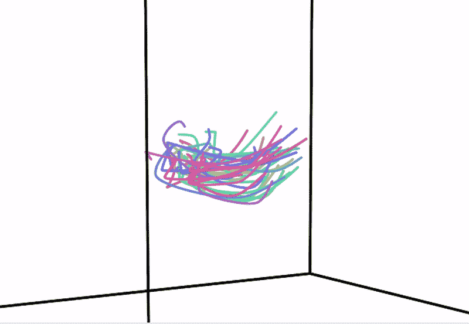
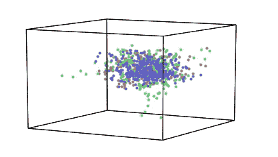
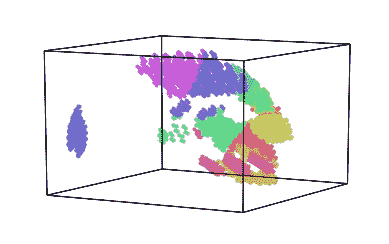
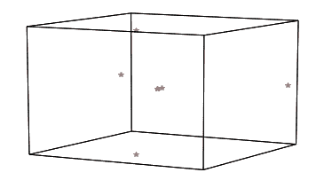
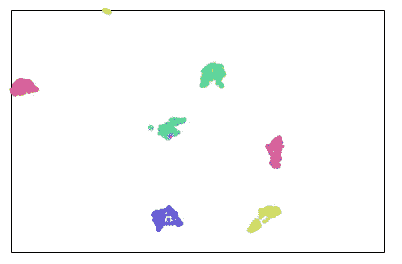

# 可视化高维数据

> 原文：<https://towardsdatascience.com/visualizing-high-dimensional-data-f59eab85f08b?source=collection_archive---------14----------------------->

## 使用 Hypertools——Python 工具箱



来源:https://hypertools.readthedocs.io/en/latest/

数据可视化有助于识别不同数据列之间的隐藏模式、关联和趋势。我们制作不同类型的图表、绘图、图形等。为了理解数据是什么以及不同的列是如何相互关联的。

很容易可视化具有较低维度的数据，但是当涉及具有较高维度的数据时，很难分析或可视化它们，因为在可视化中不可能显示大量维度。

但是，如果我告诉你，有一个 python 工具箱，它不仅创建了视觉上吸引人的可视化效果，而且在单个函数调用中简化了维数约减。

Hypertools 是一个开源的 python 工具箱，它通过自身降维来创建高维数据集的可视化。它主要构建在 matplotlib、sklearn 和 seaborn 之上。在本文中，我们将探索一些可以使用 hypertools 创建的可视化。

让我们开始吧…

# 安装所需的库

我们将从使用 pip 安装 hypertools 开始。下面给出的命令可以做到这一点。

```
pip install hypertools
```

# 导入所需的库

在这一步中，我们将导入用于创建可视化的所需库。

```
import hypertools as hyp
```

# 创建可视化

现在我们将开始创建不同的可视化效果，看看 hypertools 是如何工作的。

1.  **基本剧情**

```
# data loading
basic = hyp.load('weights_sample')
# Creating plot
basic.plot(fmt='.')
```



来源:作者

2.**集群剧情**

```
clust = hyp.load('mushrooms')
# Creating plot
clust.plot(n_clusters=10)
```



来源:作者

3.**文集情节**

此图用于文本数据集。

```
text = ['i am from India', 'India is in asia', 'Asia is the largest continent',
        'There are 7 continents', 'Continents means earth surfaces ', 'Surfaces covers land area',
        'land area is largest in asia']# creating plot
hyp.plot(text, '*', corpus=text)
```



来源:作者

**4。UMAP**

```
from sklearn import datasets data = datasets.load_digits(n_class=6)
df = digits.data
hue = data.target.astype('str')hyp.plot(df, '.', reduce='UMAP', hue=hue, ndims=2)
```



来源:作者

5.**动画剧情**

```
ani = hyp.load('weights_avg')# plot
ani.plot(animate=True, chemtrails=True)
```


来源:作者

继续尝试不同的数据集，并创建美丽的可视化来解释数据。如果您发现任何困难，请在回复部分告诉我。

本文是与 [Piyush Ingale](https://medium.com/u/40808d551f5a?source=post_page-----f59eab85f08b--------------------------------) 合作完成的。

**参考:**[https://hypertools.readthedocs.io/en/latest/](https://hypertools.readthedocs.io/en/latest/)

# 在你走之前

***感谢*** *的阅读！如果你想与我取得联系，请随时通过 hmix13@gmail.com 联系我或我的* [***LinkedIn 个人资料***](http://www.linkedin.com/in/himanshusharmads) *。可以查看我的*[***Github***](https://github.com/hmix13)**简介针对不同的数据科学项目和包教程。还有，随意探索* [***我的简介***](https://medium.com/@hmix13) *，阅读我写过的与数据科学相关的不同文章。**