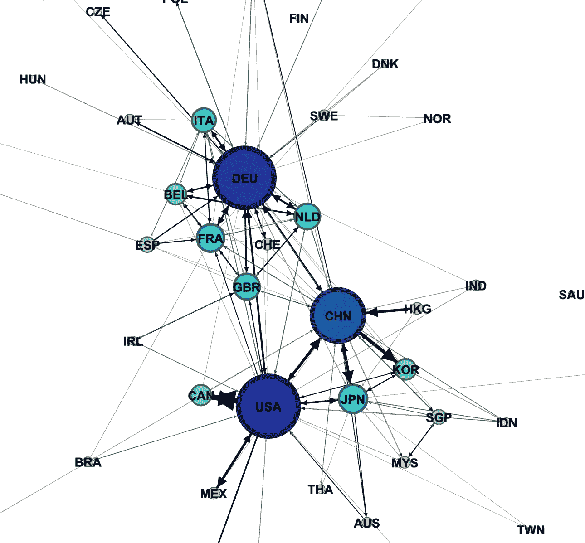
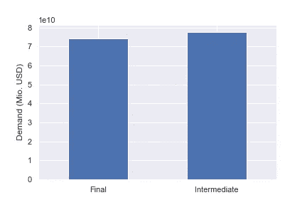
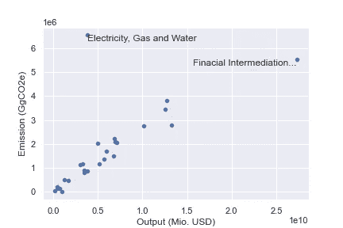
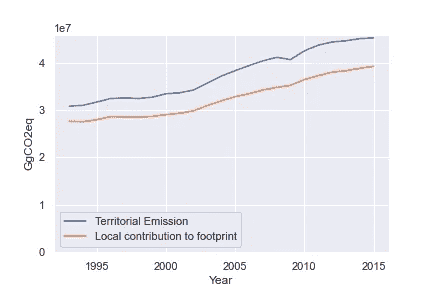
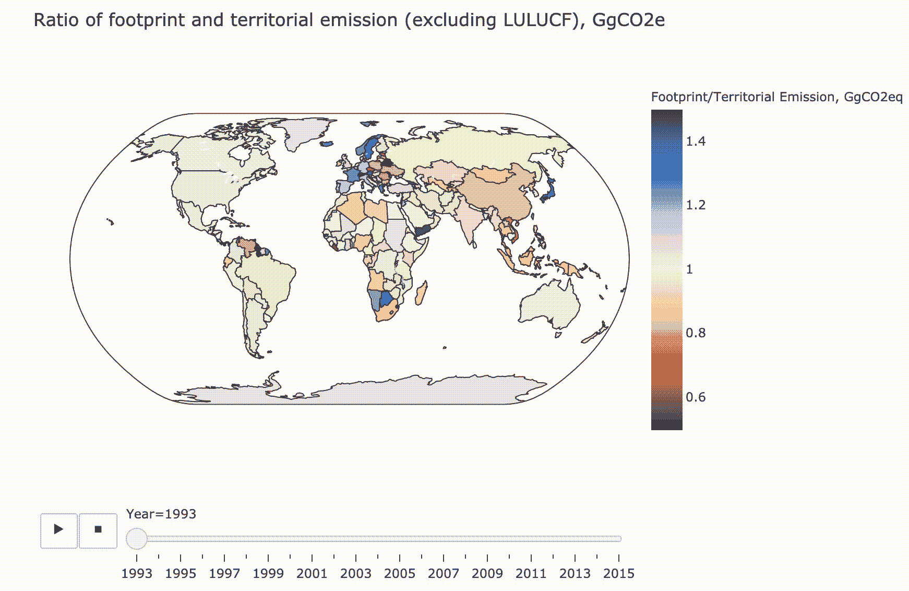
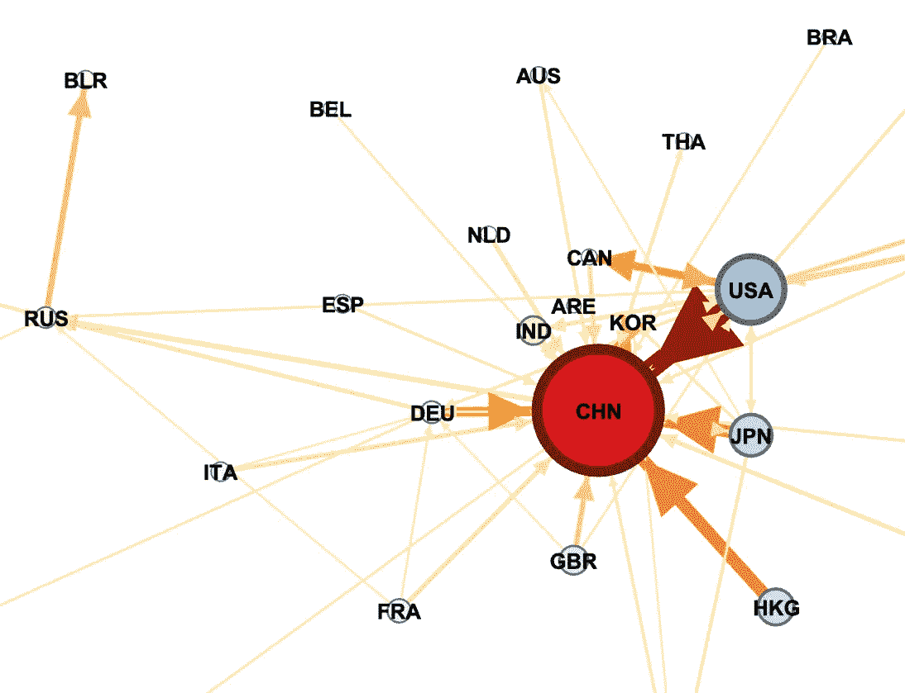

# 可视化全球贸易如何塑造气候危机

> 原文：<https://towardsdatascience.com/visualizing-how-global-trade-shapes-the-climate-crisis-849f7e7b5c75?source=collection_archive---------31----------------------->

## 全球贸易和气候危机有什么关系？很复杂，但是一张图胜过千言万语。

如果决策者想要履行《巴黎协定》中的义务，他们的时间很紧。幸运的是，有很多关于从金融角度理解气候危机的研究可以帮助他们。作为一名数据科学家，我认为查看一些数据并看看是否能找出一些模式会很有趣。

图一。从我以前的博客帖子的中间需求。图片作者。

在我之前的博文中，我使用数据科学工具挖掘全球经济。我使用 [Pymrio](https://pymrio.readthedocs.io/en/latest/) 和其他几个库以及 [Gephi](https://gephi.org/) 来可视化基于 Eora26 数据集的全球经济。我发现有一个紧密相连的核心经济体相互进行贸易。世界上大约一半的国家属于这一核心，而其余的国家起着次要的作用。我还发现，在整个 90 年代，美国是全球经济的动力，但中国正在快速赶上。在图 1 中，您可以看到 2014 年几个核心经济体之间的贸易情况。

在这篇博文中，我将尝试使用 PRIMAP-hist 数据集[3]将国际贸易与全球排放数据联系起来，该数据集包括《京都议定书》中包含的所有温室气体，但不包括土地使用变化和林业。该数据包含在 Eora26 中。我将首先解释投入产出理论背后的经济建模思想，以及如何将其与排放数据相结合。之后，我们将深入研究数据。

## 投入产出表速成班

在投入产出理论中，通过考虑资本流入、流出和在经济中的流动来模拟经济。这种观点认为，最终用户推动经济发展，因为他们提供了对产品的最终需求，而最终需求又产生了供应产品的中间需求。考虑下面的例子。你花 1 美元从木匠那里买了一把钉子。然后你是钉子的最终用户，所以你的购买构成了最终需求。这个木匠没有做钉子，他是从一个批发商那里买的，这个批发商是从一个工厂买的。工厂需要钢材、机器和一堆其他材料来制造钉子。钢铁制造商需要天然气、电力和计算机，并从其他供应商那里购买。这样，所有部门都联系起来，产生中间需求，以满足最终需求。经济中的资本数量不是恒定的，所以为了平衡经济，你还需要关于经济增加值的信息。投入产出表反映了资本如何流入和流出经济，以及经济各部门之间的流动。所有这些信息都被收集到巨大的表格中，例如 Eora26。

不过，首先让我们试着了解一下中间需求和最终需求的规模。

## 最终和中间需求

在下面的柱状图(图 2)中，我以基本价格(税前)绘制了 2015 年全球最终和中间需求的规模。

图二。2015 年最终和中间需求总量。图片作者。

我们可以看到，平均而言，对全球经济而言，价值 1 美元的最终需求(比如一把钉子)会产生大约 1 美元的中间需求。如果你假设最终需求和经济总产出(中间+最终)之间呈线性关系，你就可以计算出满足最终需求的部门间的资本流动。如果你对这个模型的细节感兴趣，我推荐你阅读这个介绍[4]或者看一看包含我的代码的笔记本。但是我们来看一个例子。

## 可视化供应链

在下面的图 3 中，我展示了满足建筑部门 1 美元最终需求所需的计算中间需求的可视化(你从那里买了钉子，记得吗？).用于建立模型的数据来自 2015 年。我用 NetworkX 搭建了网络，写了一些代码在 Gephi 中可视化。

图 3。“建筑”部门 1 美元最终需求产生的中间需求。图片作者。

经济中的每个部门都用一个点(节点)来表示，每个部门都用一个箭头(有向边)与所有其他部门相连，箭头通过其大小和黑色来指示资本流动的方向和流动的大小。你会看到也有箭头会自己绕成圈。这表明一个部门内的资本流动。我使用了一个弹簧算法来放置这些点，它们之间的距离对应于中间需求(Force Atlas 2 算法)。节点的颜色对应于建筑部门 1 美元最终需求对总产出的贡献。您可以通过将进入每个节点的所有箭头相加来找到该值(入度)。

我们看到，对“建筑”部门的最终需求平均而言会导致“石油、化工……”、“金属产品”和“金融中介”产生大量产出。相反，在“旅馆和餐馆”以及“电力、煤气和水”部门，该部门似乎没有产生大量产出。但你可以看到供应链中的其他部门在“电、气和水”部门产生产出。尤其是“石油、化工……”和“金属制品”部门。这种类型的可视化使得可视化资本流动和识别供应链中的潜在热点变得非常容易。但你会问，这与气候危机有什么关系？坚持住，因为我们快到了！

## 排放核算

我们已经学会了一种将最终需求归因于不同部门产出的方法。如果我们知道每个部门的排放量，那么我们可以认为，与该部门产品的最终需求相关的足迹应该与该部门的产出和排放量成比例。这样我们就可以计算出经济的总产出和与经济相关的总排放量。对于给定的最终需求，我们可以计算总足迹，并将其理解为不同部门的贡献。这当然只是一个模型——但是一个直观且可解释的模型。所以让我们开始研究排放数据。

**排放与产出的关系** 我想知道全球范围内不同行业的产出与排放之间关系的本质。在下面的图 4 中，我展示了一个散点图，其中每个部门的排放量与该部门的总产出一起绘制。

图 4。总排放量散点图，不包括 PRIMAP-hist 数据集中的 LULUCF 和 Eora26 数据集中的输出。

正如你所看到的，每个部门的排放量和其产出之间似乎有一个几乎线性的关系。不过有一个例外。“电力、燃气和水”部门产出一般，但排放量巨大。因此，在包括“电、气和水”的所有供应链中(都是供应链)，该部门对碳足迹的贡献远远大于对总产出的贡献(平均而言)。让我们暂时回到我们的例子。

在图 3 中，您将看到每个节点都有不同的大小。大小表示该部门对总足迹的贡献。你可以看到，虽然“电、气、水”并没有真正贡献间接产出(进入其中的箭头很小，节点离“建设”节点很远)，但它对间接足迹的贡献很大。

像这样的可视化使得识别全球供应链中的排放热点变得容易。例如，即使建筑部门减少了对"电、气和水"的需求，也不会使总足迹发生很大变化，因为所有其他部门也需要"电、气和水"，其中一些部门甚至比"建筑"部门更需要。因此，一个更好的解决方案是改造“天然气、水和电力”部门，以减少单位产出的排放量。

## 做预测

该模型的强大之处在于，我们还可以预测需求的“微小”变化对整个供应链的影响(微小，因为该模型假设线性，还记得吗？).例如，如果我们将“天然气、水和电力”部门的排放效率提高 10%，我们可以减少多少建筑部门的全球足迹？像这样的信息可能对决策者很重要，但对消费者也很重要，因为是他们的最终需求推动了中间需求。例如，一种类似于本文中概述的方法最近被用来[计算丹麦 500 种最受欢迎的食品杂货的足迹](https://denstoreklimadatabase.dk/en)。这使得消费者能够就他们的消费习惯如何影响他们的个人足迹做出明智的决定。在丹麦，许多食品杂货都是进口的。因此，与最终需求相关的大量排放发生在国外。我有兴趣了解这在全球范围内的真实程度。接下来让我们来看看。

## **可视化排放的输出/输入**

我解决这个问题的方法是，首先计算所有地区对当地足迹的贡献大小。然后，我将全球总排放量与这些地方排放量的总和进行了比较。我在下面的图 5 中绘制了 1993 年至 2015 年的图表。

图 5。区域总排放量和满足区域需求的排放量。图片作者。

您可以看到，全球排放量在此期间有所增加，总排放量的 85–90%可归因于本地需求的本地贡献。但是，10-15%是进口/出口排放，这仍然是一个很大的贡献，尽管不一定是一件坏事。为了了解一段时间内的发展情况，我在图 6 中绘制了每个地区的足迹与该地区领土排放量的比率。

图 6。Eora26 数据集中各区域的碳足迹与地域排放的比率。

一些较小的国家有非常高和非常低的比率，所以我不得不限制颜色范围从-0.5 到 0.5。你可以看到随着时间的推移，地图变得更加丰富多彩。这一趋势表明排放量的进出口增加。我们还可以从蓝色和红色看出，西方的最终需求似乎倾向于导致向国外排放。对亚洲和非洲部分地区来说，国外的最终需求往往会导致当地的排放。但是该图没有告诉我们在哪些区域之间发生了导出/导入。所以我做了另一个图表…

## 绘制排放流图

我想了解哪些国家推动了与国际贸易相关的排放。为了做到这一点，我可以绘制每个地区的供应链，并像我们对每个部门一样寻找模式。相反，我计算了 A 地区的最终需求在多大程度上可以归因于所有其他地区的排放。然后，我在区域 A 和所有其他区域之间画了一个箭头，每个箭头的大小和红色反映了该国排放的方向和幅度，这是区域 A 最终需求的结果。我对所有区域都画了一个箭头，并再次使用 Gephi 和 Force Atlas 2 spring 算法显示了图表。您可以在下面的图 7 中看到结果。

图 7。不同国家最终需求导致的当地排放可视化。仅显示高于特定阈值的箭头。图片作者。

记住，箭头指向发射的方向，大小和红色表示发射的大小。我为何时绘制箭头设置了一个阈值，以使可视化效果更漂亮。点(节点)的大小反映了总输入或输出排放量的大小。如果一个区域是排放的净输出者，那么节点的色调是蓝色，如果该区域是排放的净输入者，那么节点的色调是红色。颜色的饱和度和节点的大小表示向/从该区域排放的总输入/输出的量级。例如，美国是最大的排放出口国，因此美国节点是最大的蓝色节点，具有最清晰的蓝色。相反，中国是最大的排放进口国，所以它的红色最明显。中国节点的大小大于美国节点，这表明中国的净排放量进口大于美国的净排放量出口。

我们看到，西方和一些亚洲国家的最终需求推动了中国的排放。有趣的是，中国的最终需求似乎推动了俄罗斯的排放，而俄罗斯的最终需求似乎推动了白俄罗斯的排放。香港的最终需求似乎也推动了中国的排放。但是一张图胜过千言万语，所以我鼓励你自己去探索可视化，看看你是否能发现一些有趣的模式。让我知道你有什么意见。

所有这些排放的进口和出口并不一定是坏事。如果中国和印尼的单位产出排放效率高于它们出口产品的国家，那么这实际上是一件好事。不幸的是，他们不是。因此，虽然一些西方国家的本土排放正在减少，但这是以更大的海外足迹为代价的。决策者应该记住这一点。

我是博客新手。所以，如果你有任何意见或建议，请告诉我。你可以在这里找到 [*代号*](https://github.com/andersborges/io-blog) *。也可以在*[*LinkedIn*](https://www.linkedin.com/in/anders-borges-16611060/)*上找我。*

[1] Lenzen M，Kane moto K；Moran D 和 Geschke A (2012 年)[绘制世界经济结构图](https://worldmrio.com/pdf/LenzenEtAl2012_EST_MappingTheStructure.pdf)。*环境科学&技术*46(15)PP 8374–8381。 [DOI: 10.1021/es300171x](http://dx.doi.org/10.1021/es300171x)

[2] Lenzen，m .，Moran，d .，Kanemoto，k .，Geschke，A. (2013) [建立 Eora:高国家和部门分辨率的全球多区域投入产出数据库](https://worldmrio.com/pdf/LenzenEtAl_2013_BuildingEora_ESR.pdf)。*经济系统研究*，25:1，20–49，[DOI:10.1080/09535314 . 2013 . 769938](http://dx.doi.org/10.1080/09535314.2013.769938)

[3] Gütschow，j .，Jeffery，M. L .，Gieseke，r .，Gebel，r .，Stevens，d .，Krapp，m .，& Rocha，M. (2016 年)。[PRIMAP-hist 国家历史排放量时间序列。](https://doi.org/10.5194/essd-8-571-2016) *地球系统科学数据*， *8* (2)，571–603。https://doi.org/10.5194/essd-8-571-2016

[4]莱昂蒂夫，W. (1970 年)。[环境影响和经济结构:投入产出方法，《经济学和统计学评论》](https://www.jstor.org/stable/pdf/1926294.pdf?casa_token=adx_we4tqMYAAAAA:uST3iVUu10KWbiTSZGmDhM9eiG3MSkbqLNVzqp5B7Dqg3iyEhjhArXoRko81kBoPBFqDn-A-XO4W0ozChFaPgPbS_B-P2MWW0Lb1BjUeO2e3s1_Ontc)，第 52 卷，第 3 期(1970 年 8 月)，第 262-271 页，麻省理工学院出版社。*经济与统计评论*， *52* (3)，262–271。