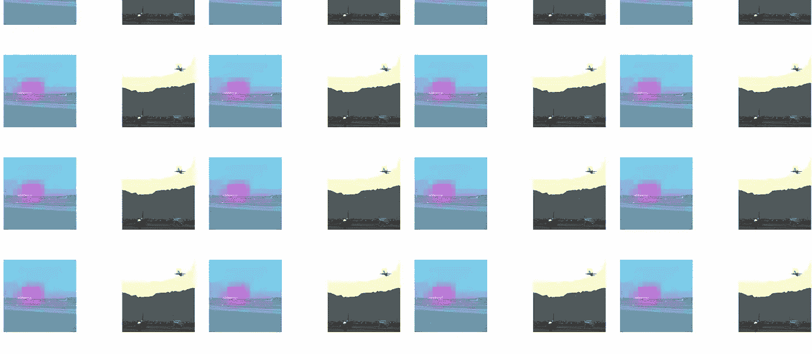

# 使用 CNN 以有趣的新方式提取特征

> 原文：<https://towardsdatascience.com/visualizing-image-similarities-54d4aa3d27c3?source=collection_archive---------11----------------------->

Everingham 等人的图片来自 [PASCAL VOC2012 数据集](http://host.robots.ox.ac.uk/pascal/VOC/voc2012/)

## 使用分类模型分割图像。

解开由深度卷积神经网络(CNN)学习的特征是一项涂抹任务。通过每一层来可视化过滤器或功能与网络深度的比例很低，尽管通过这一过程可以创建一些很酷的图形，但结果可能非常抽象，甚至是[迷幻](https://ai.googleblog.com/2015/06/inceptionism-going-deeper-into-neural.html)。诸如 [gradCAM](https://openaccess.thecvf.com/content_ICCV_2017/papers/Selvaraju_Grad-CAM_Visual_Explanations_ICCV_2017_paper.pdf) 或[制导反向投影](https://arxiv.org/abs/1311.2901)之类的技术，通过计算哪些输入像素在受到干扰时会导致网络输出的最大变化，从而避开了检查单个激活的需要。如 [Adebayo et al.](https://arxiv.org/pdf/1810.03292.pdf) 早在 2018 年所示，一些基于显著性的模型可解释性技术给出的结果与基本边缘检测算法过于相似。例如，引导反向投影被发现产生看起来独立于模型参数和数据标签的可视化。

今天，我们探索了一种理解 CNN 内部工作的替代方法，通过创建一个交互式可视化来显示网络中任何给定层的两个图像的特征之间的相似性。程序很简单:

*   对每个图像执行正向传递，以提取所需网络层的特征
*   在每幅图像上创建一个不可见的格网覆盖，其中像元的数量等于所提取特征的尺寸
*   从 **img1** 中选择一个方格，并计算该特征与 **img2** 中所有可能特征位置的相似性

我们使用 ResNet-18 模型在来自 PASCAL VOC2021 数据集的一些随机选择的图像对上可视化该过程。使用双线性插值将图像调整为 512x512 像素。请注意，由于我们使用的是 ResNet 模型中的第 4 个块，网络的这一部分会以 32 倍的因子对原始分辨率进行下采样，因此我们最终会得到 16x16 维的要素地图。在左边的图片( **img1** )中，用户可以点击任意一个高亮显示为黄色的方块。这个正方形的 **x** 和 **y** 索引随后被用于索引该图像的特征图，该图像仅仅是 512 通道向量。余弦相似性被用作相似性度量，以将该特征向量与 **img2** 的特征图中的所有 16×16 特征向量进行比较。

特征相似性热图块 Everingham 等人从 [PASCAL VOC2012 数据集](http://host.robots.ox.ac.uk/pascal/VOC/voc2012/)获得的图像

结果有些令人惊讶，因为这些特征图中每个神经元的感受野几乎是整个图像，然而可视化的相似性仍然严重依赖于位置。这表明学习的过滤器和汇集的组合减弱了激活，以防止蓝天特征泄漏到飞机机翼特征中。

那么，我们能从这样的可视化中得出什么结论呢？如果我们观察像下面这样网格分辨率较大的较浅的层，很明显这些特征的相似性可用于分段目的:

特征相似性热图块 Everingham 等人从 [PASCAL VOC2012 数据集](http://host.robots.ox.ac.uk/pascal/VOC/voc2012/)获得的图像

这是一个有趣的结果，因为我们正在寻找的 ResNet-18 是为图像分类而不是分割而训练的。假设你有一个训练图像和一个分割蒙版。可以通过从训练图像和测试图像的所有可能区域计算前景区域的特征相似性来分割测试图像。那么可以通过视觉检查来设置阈值，以控制所生成的分割掩模的 IoU。这项任务听起来很像[少数镜头语义分割](https://paperswithcode.com/sota/few-shot-semantic-segmentation-on-fss-1000)，模型应该在测试时通过将我们有遮罩的图像的特征相似性传播到我们没有遮罩的图像来概括新的对象。让我们看看使用第 4 块中的特性效果如何，这次使用的是 ResNet-50 模型:

使用 ResNet-50 block 4 特征的特别分割 Everingham 等人从 [PASCAL VOC2012 数据集](http://host.robots.ox.ac.uk/pascal/VOC/voc2012/)中获得的图像

考虑到这种无需任何培训的开箱即用的工作方式，结果令人惊讶地好。在如此低分辨率的网格(仅 16x16)下，生成的蒙版捕捉了太多平面周围的区域，因此让我们看看是否可以通过使用 block 3 功能来解决这个问题:

使用 ResNet-50 block 3 特征的特别分割 Everingham 等人的图像来自 [PASCAL VOC2012 数据集](http://host.robots.ox.ac.uk/pascal/VOC/voc2012/)

遗憾的是，这个区块中的特征并没有表现出足够高的水平，并且过于关注纹理，正如飞机的白色机身与灰色天空过于相似所证明的那样。这是可以通过任务特定的调优来解决的问题，尽管这不是本文所关注的。

在试图理解 CNN 的内部工作方式时，我们偶然发现了一种特别的方法，它可以用作少量镜头分割的基线。我们还可以使用这种技术来可视化自相似性，即在左右面板中使用相同的图像来查看模型在训练过程中是否正在学习语义上有意义的特征。例如，我们期望图像中的前景对象区域与其他前景区域比与背景更相似。对于分割，这种技术的性能并不接近实际训练用于分割任务的方法。然而，它确实证明了为分类而学习的特征可以重新用于分割。这些可视化的代码将很快发布到我的[博客](http://alexadam.ca/)上，所以请继续关注这个系列的下一篇文章。