# 可视化印度的地震活动

> 原文：<https://towardsdatascience.com/visualizing-indias-seismic-activity-4ed390de298c?source=collection_archive---------15----------------------->

## 在 Jupyter 笔记本中无缝分析和可视化地震数据

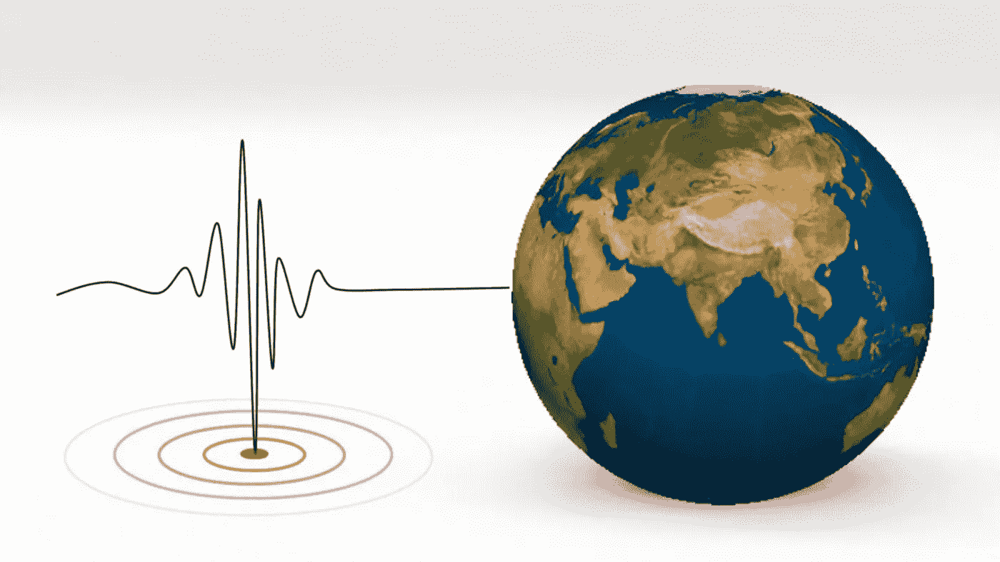

原创图片由[图米苏](https://pixabay.com/users/tumisu-148124/?utm_source=link-attribution&utm_medium=referral&utm_campaign=image&utm_content=3167693)来自 [Pixabay](https://pixabay.com/?utm_source=link-attribution&utm_medium=referral&utm_campaign=image&utm_content=3167693) |作者编辑

上周，我住的地方附近发生了一次轻微的地震。它发生在清晨，几乎感觉不到(感谢上帝)。事实上，我们只是从每日新闻中知道这件事的。

这让我开始寻找印度地震的模式和历史。在网上搜索资源的时候，我偶然发现了一篇来自 [Giuseppe Macrì](https://medium.com/u/e52bdd907e00?source=post_page-----4ed390de298c--------------------------------) 的精彩文章，标题为 [*制作了 40 年来加州地震的动画*](https://medium.com/vis-gl/animating-40-years-of-california-earthquakes-e4ffcdd4a289) ，他分析了 40 年来加州的地震数据。事实上，朱塞佩之所以决定可视化地震数据集，是因为当时加州发生了一场小地震。我想这太巧合了😃。他写道:

> 一天，在看新闻时，我注意到加利福尼亚发生了一次小地震。我认为地震数据将会是一个有趣的可视化。

在阅读这篇文章时，我对用于分析的工具 Kepler.gl 印象深刻。所以我决定复制印度地震数据集的结果，结果如下所示:

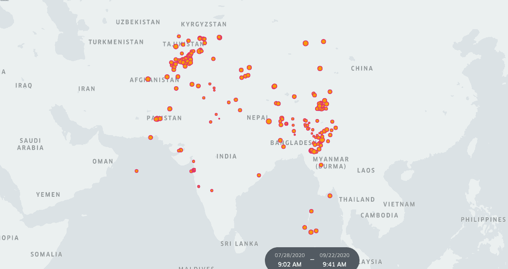

分析印度自 2019 年以来的地震数据|作者图片

相当酷！没错。因此，在本文中，我将帮助您了解 Kepler.gl 是什么，以及它如何使可视化和分析地理空间数据成为一项无缝任务。我希望读完这篇文章后，您能够将它用于您的数据集。

# 使用 Kepler.gl 实现地理空间数据可视化

地理空间数据是指与地球表面特定位置相关的基于时间的数据。这是有用的，因为它可以揭示景观中的重要模式和趋势。有许多库可以用来分析这样的数据，但是通常需要大量的手工操作。地理空间数据的内存管理是另一个问题。这意味着此类数据的数量级使得轻松处理和分析数据变得有些困难。

[Kepler.gl](https://kepler.gl/) 是一款强大的开源地理空间分析工具，适用于大规模数据集。Kepler.gl 由优步开发，是一个数据无关的高性能网络应用程序，适用于大规模地理定位数据集。您可以非常容易地在数据集中找到模式，组合不同的数据集，实时执行聚合和操作。如果数据集有时间戳、地理点和一些元信息，Kepler.gl 可以自动提取信息并将其可视化。[文档](https://docs.kepler.gl/)非常强大，我强烈建议您阅读它以获得更多信息。

# 装置

开普勒有多种使用方式。gl。用户可以直接在[网络浏览器](https://kepler.gl/demo)中使用，也可以在本地安装。还为常见的数据分析工具构建了一系列插件，如 [Jupyter](https://github.com/keplergl/kepler.gl/blob/master/docs/keplergl-jupyter/README.md) 、 [Tableau](https://github.com/keplergl/kepler.gl-tableau) 和 [Visual Studio Code](https://github.com/RandomFractals/geo-data-viewer) 。然而，在本文中，我将只关注 Jupyter，但是它也可以与其他两个无缝地协作。

## 虚拟环境

为了轻松安装，建议创建一个虚拟环境。让我们使用`venv`来创建这个新的虚拟环境，并将其命名为`**geoviz.**`

```
# Creating virtual environment in Mac/Linux
python3 -m venv geoviz #Creating virtual environment in Windows
py -m venv geoviz# Activating the environment
source geoviz/bin/activate
```

一旦环境被激活，用 pip 安装 Kepler.gl。

```
#Run the following cell in your command line
pip install keplergl
```

推出 Jupyter 笔记本

```
jupyter notebook
```

与 Jupyter 笔记本不同，Jupyter 实验室需要一些额外的安装，如`[node](https://nodejs.org/en/download/package-manager/#macos) > 10.15.0` 和 `jupyter labextension`。详细说明参见[详细用户指南](https://docs.kepler.gl/docs/keplergl-jupyter#install)。

# 资料组

有一个名为[国家地震学中心](https://seismo.gov.in/)的门户网站，它是印度政府监测该国地震活动的节点机构。它监测、操作和维护由 115 个台站组成的国家地震网络。你可以从[这里](https://www.kaggle.com/parulpandey/indian-earthquakes-dataset2018-onwards)下载公开可用的数据集。我正在寻找一个更广泛的数据库，但根据门户网站，我们无法在 2019 年 8 月 1 日之前访问数据。

[](https://www.kaggle.com/parulpandey/visualizing-india-s-seismic-activity)

## 探索数据

让我们导入数据并查看各种属性。

```
df = pd.read_csv('Indian_earthquake_data.csv')
df.head(10)
```

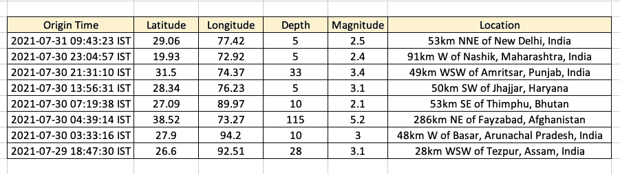

2021 年 7 月 31 日，当我写这篇文章的时候，印度北部发生了地震

该数据集包括自 2019 年 8 月 1 日以来每一次地震的`date`、`time`、`location`、`depth`和`magnitude`的记录。震级是指震源产生的地震波的振幅或大小。《大英百科全书》对此有一个极好的、直观的解释。它指出:

> 地震[震级](https://www.britannica.com/science/magnitude-astronomy)是由地震源产生并由地震仪记录的地震波“大小”或振幅的量度。(这些波的类型和性质在[地震波](https://www.britannica.com/science/earthquake-geology/Shallow-intermediate-and-deep-foci#ref247992)一节中描述。)因为地震的大小变化很大，为了进行比较，有必要用数学方法压缩地震图上测得的波幅范围。1935 年，美国地震学家查尔斯·f·里克特(Charles F. Richter)建立了一个地震震级表，以标准地震仪(Wood-Anderson 扭摆地震仪)记录的最大地震波振幅(以千分之一毫米为单位)的以 10 为底的对数作为地震震级表。

## 预处理数据

数据是干净的，格式是正确的，但是我们将通过从`Location`列中提取`Place`来做一些小的预处理。这就是要有短标签而不是长句，这样会把地图挤得水泄不通。如果我们手动分析数据，我们也可以提取其他基于时间的特征，但是我们将在这里跳过这一部分。

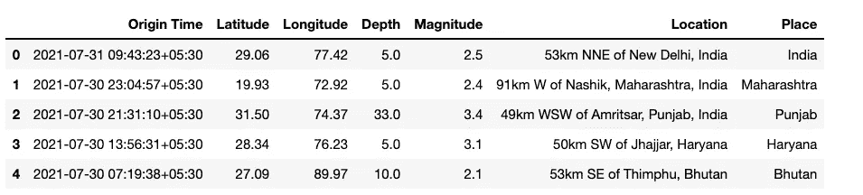

预处理数据集|按作者分类的图像

# 用 Kepler.gl 可视化

现在我们已经有了想要的格式的数据集，是时候开始了。

## 步骤 1:加载底图

第一步是使用 **KeplerGl()** 类创建一个地图对象，它可以接受三个**可选的**参数:

*   高度 Kepler.gl 微件的高度
*   数据—要添加到地图中的数据，
*   配置 Kepler.gl 映射的配置文件

```
from keplergl import KeplerGl
map_1=KeplerGl(height=600)
map_1
```

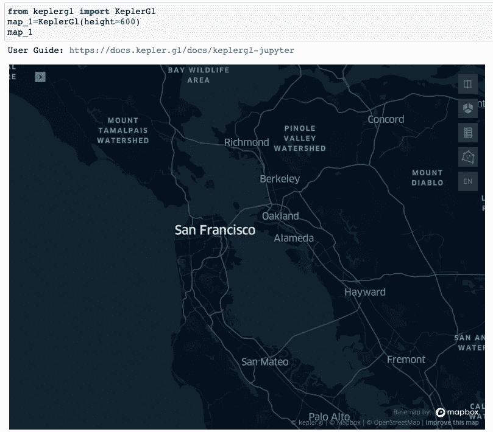

加载底图|图片 b 作者

## 步骤 2:向地图添加数据

接下来，我们将把我们的数据帧添加到 Kepler.gl 中，并为其指定一个名称。

```
map_1.add_data(data=df, name='Indian Earthquake Visualization')
```

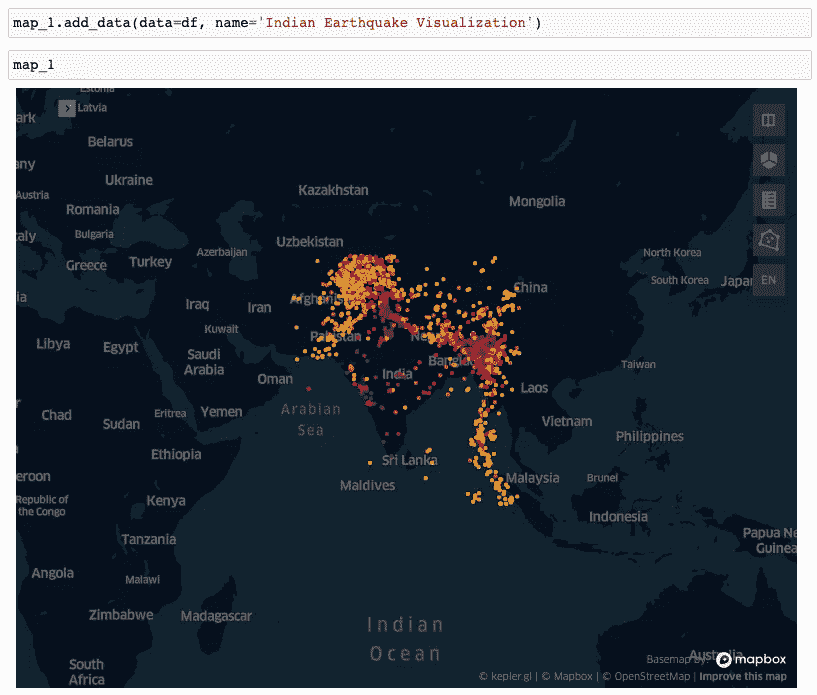

将数据添加到地图|图像 b 作者

Kepler.gl 自动检测纬度和经度列，并为它们创建绘图。

# 自定义

Kepler.gl 提供了一些重要的定制，可以真正增强可视化。如果您单击地图左侧的箭头，将会看到几个选项。这些使您能够对您的地图进行一些更改，如添加更多的层，应用过滤器，互动，以及更改底图。让我们一个一个地看。

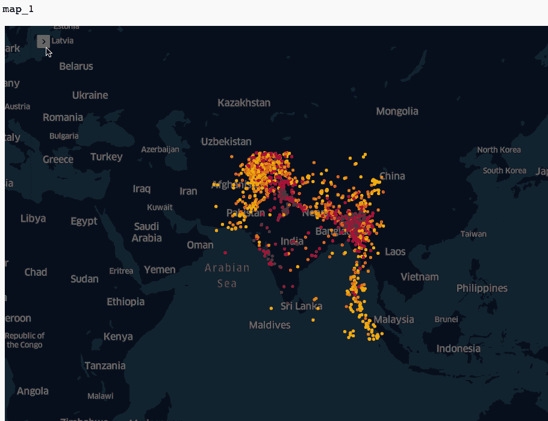

自定义|作者图片

## [**层层**](https://docs.kepler.gl/docs/user-guides/c-types-of-layers)

图层是可以在彼此之上构建的特定数据可视化。例如，上面的可视化显示了一个点图层，其中每个事件都根据其位置呈现为一个点。同样，也可能有弧图层、线图层、热点图等等。每一层都有特定的属性，可以根据用户的需求进行调整。在下图中，我们实验了不同的图层选项，然后改变了点的半径和颜色。

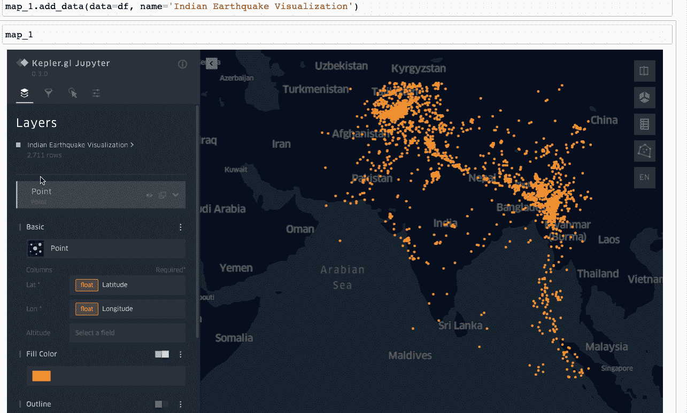

自定义图层|作者图像

此外，我们还可以根据选定的字段给点着色。假设我们希望看到数据点的颜色和大小与它们的大小有关。

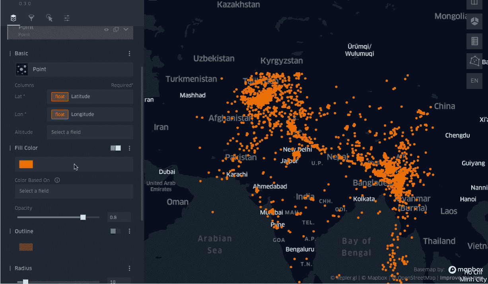

数据点的颜色和大小取决于它们的大小|图片由作者提供

## [互动](https://docs.kepler.gl/docs/user-guides/g-interactions)

交互意味着用户如何与地图交互。这包括定制[工具提示显示](https://docs.kepler.gl/docs/user-guides/g-interactions#tooltips)，[用光标高亮显示](https://docs.kepler.gl/docs/user-guides/g-interactions)区域，显示[坐标](https://docs.kepler.gl/docs/user-guides/g-interactions#display-coordinates)。

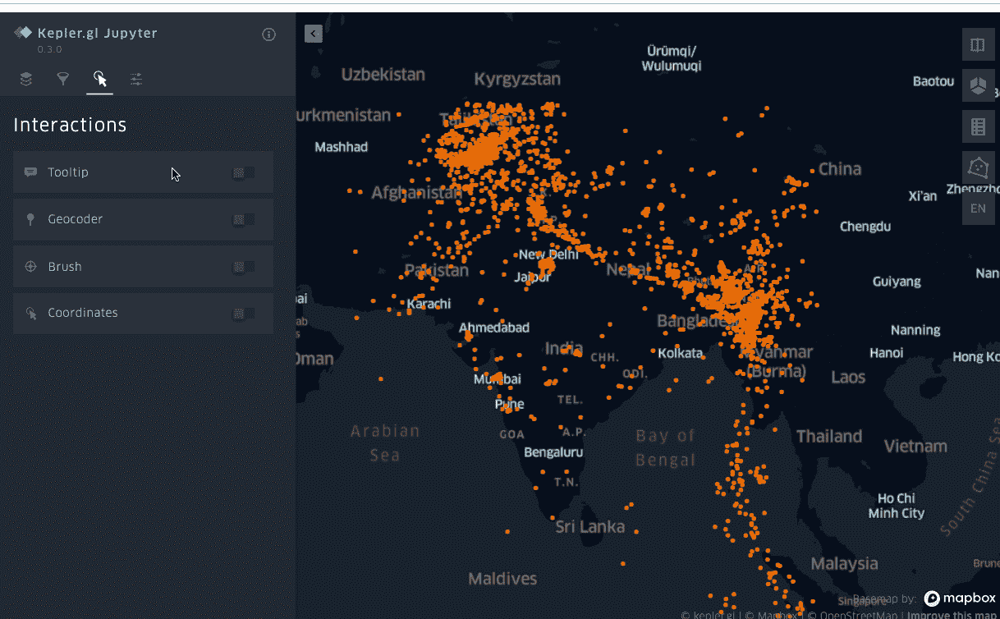

自定义互动|作者图片

## [地图样式](https://docs.kepler.gl/docs/user-guides/f-map-styles)

还有一个修改底图样式的选项。您也可以使用地图框样式链接添加自己的自定义地图样式。

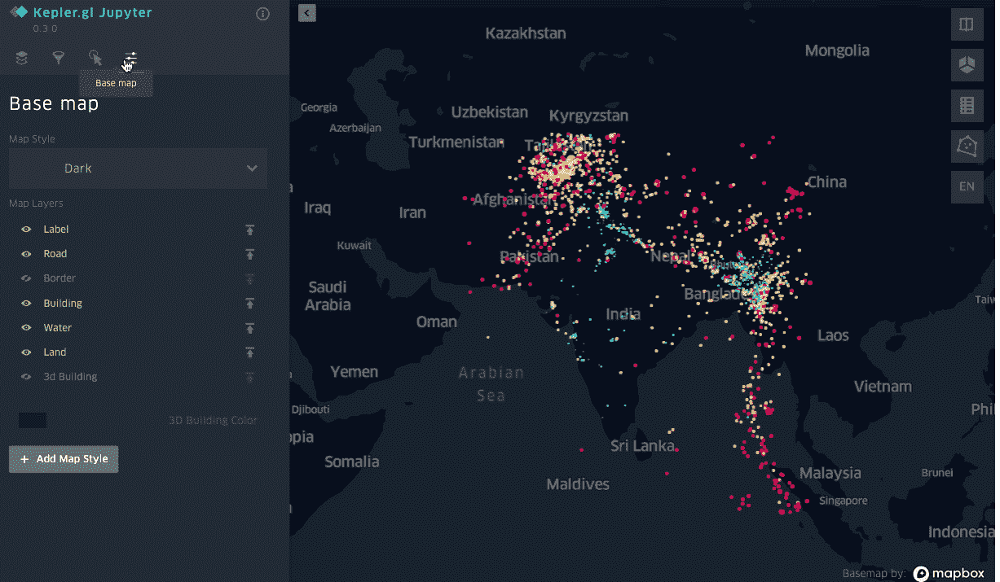

按作者修改底图样式|图像

## [时间回放](https://docs.kepler.gl/docs/user-guides/h-playback)

这是 Kepler.gl 最显著的特性之一。您可以通过添加一个基于时间相关字段的过滤器来创建一个事件的回放视频，在我们的例子中是`Origin Time.`

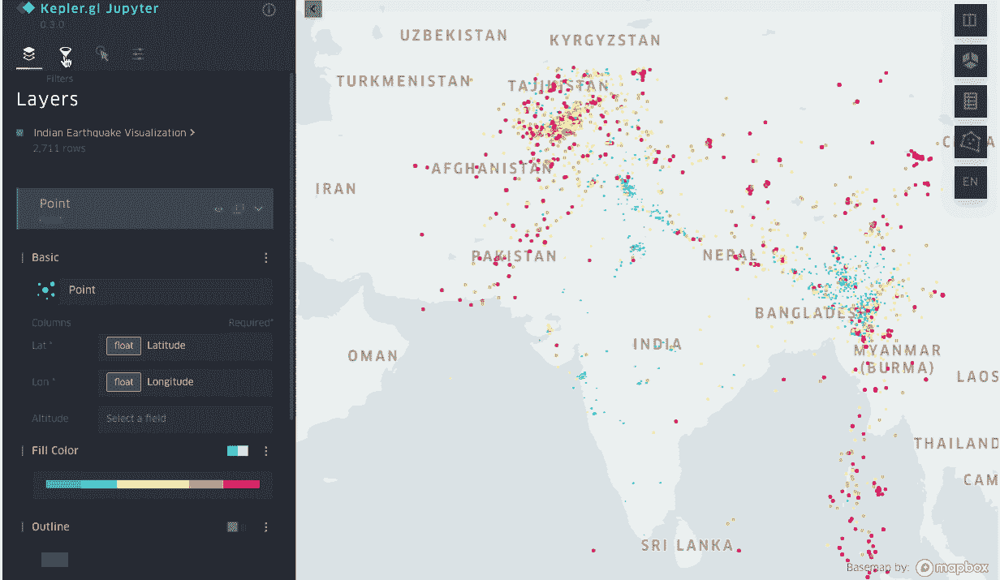

时间回放功能|作者图片

## 保存和导出地图

对可视化效果感到满意后，您可以将地图导出为交互式 HTML 文件，也可以保存 Jupyter 笔记本的微件状态，以便每次打开笔记本时加载当前地图。

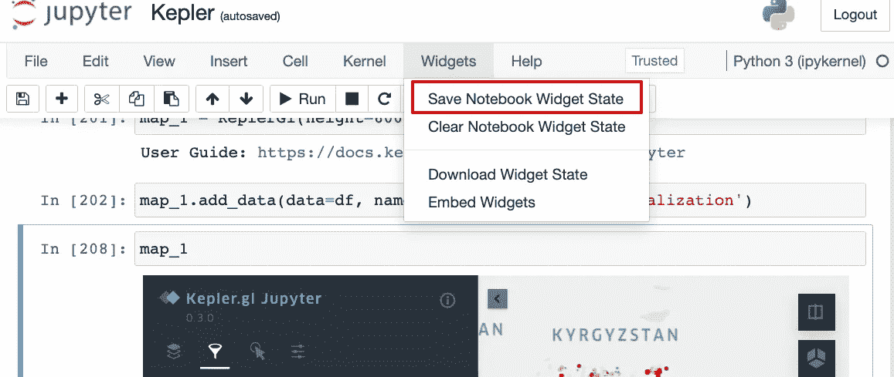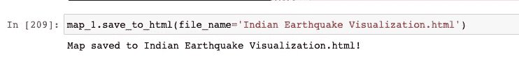

按作者保存和导出地图|图像

[](https://www.kaggle.com/parulpandey/visualizing-india-s-seismic-activity)

# Visual Studio 中的 Kepler.gl

对于那些喜欢使用 VS 代码的人来说，你不需要失望。检查此[链接](https://github.com/RandomFractals/geo-data-viewer)以安装扩展。

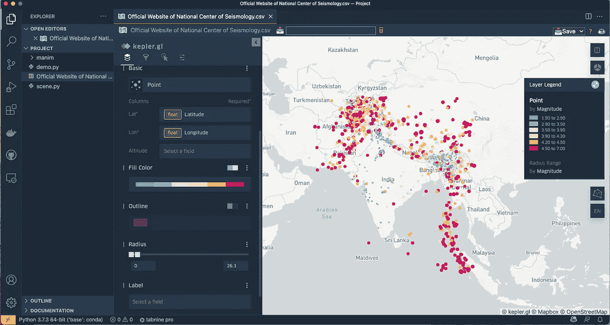

Visual Studio 中的 Kepler.gl 作者图片

# 结论和进一步阅读

地理空间数据分析是一个重要的研究领域。它提供关于实时发生的事件的非常有用的信息，如人口普查数据、卫星图像、天气数据等。可视化这样的数据具有巨大的价值，因为不可能通过电子表格和表格来衡量这样的数据。像 Kepler.gl 这样的工具可以广泛地帮助解决这个问题，从而使分析变得更快、更容易、更准确。