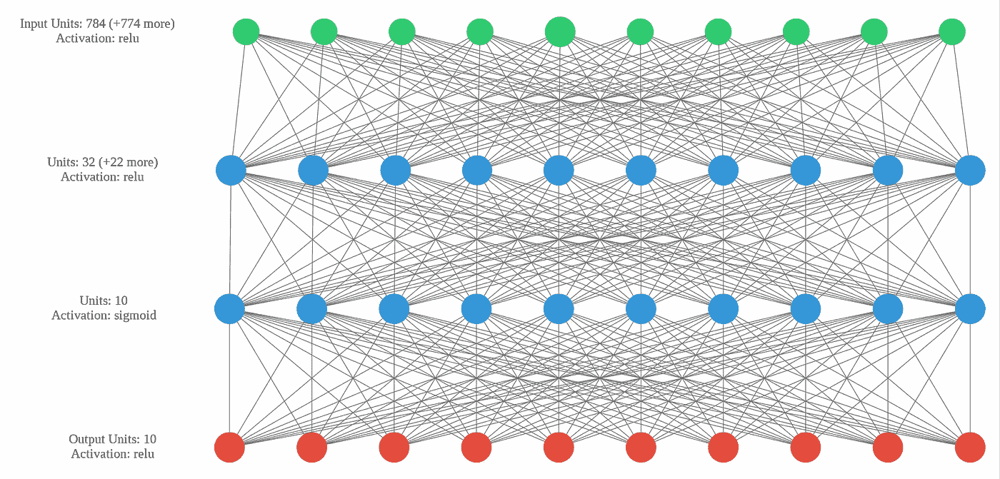
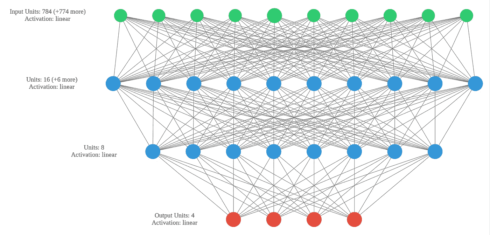
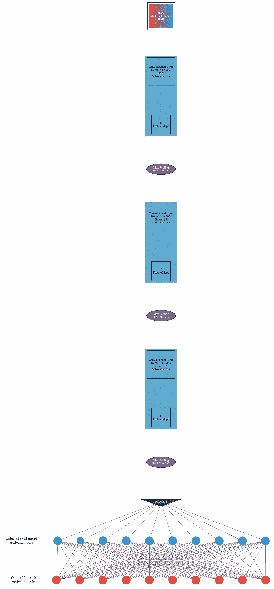

# 可视化 Keras 模型

> 原文：<https://towardsdatascience.com/visualizing-keras-models-4d0063c8805e?source=collection_archive---------4----------------------->

## 创建模型摘要的图像



Keras 模型可视化(来源:作者)

你有没有想过你的神经网络实际上是如何连接不同的神经元的？如果你能把你设计的模型架构可视化，那不是很好吗？如果您可以下载您的模型架构作为图像，以便在演示时使用，这不是很好吗？如果你对所有这些都有肯定的回答，那么你就来对地方了。

在本文中，我将向您展示一个令人兴奋的 python 包/模块/库，它可以用来可视化您的 Keras 模型。无论是卷积神经网络还是人工神经网络，这个库都将帮助您可视化您所创建的模型的结构。

Keras Visualizer 是一个开源 python 库，在可视化模型如何逐层连接方面非常有用。所以让我们开始吧。

# 安装 Keras 可视化

我们将使用 pip install 像安装任何其他 python 库一样安装 Keras Visualization。我们将在本文中使用 google collab，所以您需要复制给定的命令，并在 Google Collab 中运行它来安装库。

```
!pip3 install keras-visualizer
```

# 创建神经网络模型

为了理解这篇文章，你应该对如何创建一个神经网络有一个基本的了解。

</neural-network-using-native-python-1d16117486d6>  

现在让我们使用 Keras 及其函数创建一个基本的人工神经网络。在这个神经网络中，我将输入形状作为(784，)并相应地设计它，您可以创建自己的网络，因为在这里我们不是学习如何创建 NN，我们只是将我们创建的最终模型可视化。

```
from keras import models  
from keras.layers import Dense, Conv2D, MaxPooling2D, Flatten, Activation  
from keras_visualizer import visualizer 
from keras import layers 
model1 = models.Sequential()  
model1.add(Dense(16, input_shape=(784,)))
model1.add(Dense(8))
model1.add(Dense(4))
```



人工神经网络(来源:作者)

在图中，您可以清楚地看到我们的模型是如何构建的，不同的层是如何通过大量的神经元和每层的激活功能相互连接的。

让我们想象一个卷积神经网络，它将使我们更好地了解这个库如何帮助我们可视化 CNN。

```
# Building model architecture
model = models.Sequential()
model.add(Conv2D(8, (3, 3), padding="same",input_shape=(224,224,3), activation="relu"))
model.add(MaxPooling2D(pool_size=(3, 3)))
model.add(Conv2D(16, (3, 3), padding="same", activation="relu"))
model.add(MaxPooling2D(pool_size=(2, 2)))
model.add(Conv2D(32, (3, 3), padding="same", activation="relu"))
model.add(MaxPooling2D(pool_size=(2, 2)))
model.add(Flatten())
model.add(Dense(32, activation="relu"))
model.add(Dense(10))
model.summary() 

visualizer(model, format='png', view=True)
```



卷积神经网络(来源:作者)

在这里，您可以清楚地看到在不同层上执行的所有操作，包括过滤器数量、过滤器大小、神经元数量等。

这就是如何使用 Keras Visualizer 可视化您的深度学习模型。试试这个，让我知道你在回复部分的经历。

**本文与** [**皮尤什·英格尔**](https://medium.com/u/40808d551f5a?source=post_page-----4d0063c8805e--------------------------------) **合作。**

# 在你走之前

***感谢*** *的阅读！如果你想与我取得联系，请随时通过 hmix13@gmail.com 联系我或我的* [***LinkedIn 个人资料***](http://www.linkedin.com/in/himanshusharmads) *。可以查看我的*[***Github***](https://github.com/hmix13)**简介针对不同的数据科学项目和包教程。还有，随意探索* [***我的简介***](https://medium.com/@hmix13) *，阅读我写过的与数据科学相关的不同文章。**