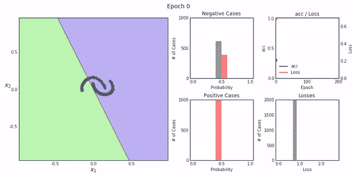
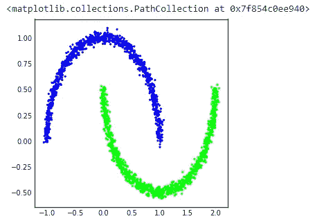
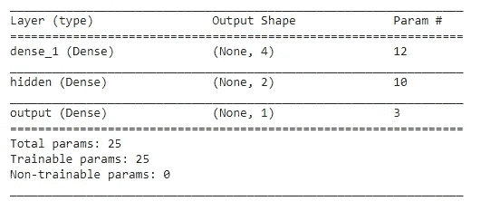

# 深度神经网络的可视化学习

> 原文：<https://towardsdatascience.com/visualizing-learning-of-a-deep-neural-network-b05f1711651c?source=collection_archive---------29----------------------->

## 使用深度重放来可视化神经网络学习



Keras 模型学习(来源:作者)

深度学习通常被认为是一种黑箱技术，因为你通常无法分析它在后端是如何工作的。你创建一个深度神经网络，编译它，然后将其应用于你的数据，我们知道它将使用神经元来传输信息，使用不同的层和所有的激活和其他重要的超参数。但是我们无法想象信息是如何传递的，或者模型是如何学习的。

如果我告诉你，有一个 python 包可以创建模型在每个迭代/时期如何工作或学习的可视化。您可以将这种可视化用于教育目的，或者向其他人展示您的模型是如何学习的。如果这让你兴奋，那么你来对地方了。

Deep Replay 是一个开源的 python 包，旨在让您可视化地回放您的模型训练过程是如何在 Keras 中进行的。

让我们开始吧……

# 设置 Colab 笔记本

对于本文，我们将使用 google colab，为了使用它，我们首先需要设置一个笔记本。复制并运行下面给出的代码，以准备好您的笔记本。

```
# To run this notebook on Google Colab, you need to run these two commands first
# to install FFMPEG (to generate animations - it may take a while to install!)
# and the actual DeepReplay package!apt-get install ffmpeg
!pip install deepreplay
```

该命令还将安装我们需要的库，即深度重放。

# 导入所需的库

因为我们正在创建一个深度神经网络，所以我们需要导入所需的库。

```
from keras.layers import Dense
from keras.models import Sequential
from keras.optimizers import SGD
from keras.initializers import glorot_normal, normalfrom deepreplay.callbacks import ReplayData
from deepreplay.replay import Replay
from deepreplay.plot import compose_animations, compose_plotsimport matplotlib.pyplot as plt
from IPython.display import HTML
from sklearn.datasets import make_moons%matplotlib inline
```

# 加载数据并创建重放回调

在这一步中，我们将加载我们将要处理的数据，并且我们将为可视化的重放创建一个回调。

```
group_name = 'moons'X, y = make_moons(n_samples=2000, random_state=27, noise=0.03)replaydata = ReplayData(X, y, filename='moons_dataset.h5', group_name=group_name)fig, ax = plt.subplots(1, 1, figsize=(5, 5))
ax.scatter(*X.transpose(), c=y, cmap=plt.cm.brg, s=5)
```



数据(来源:作者)

# 创建 Keras 模型

现在，我们将使用不同的层、激活和所有其他超参数来创建 Keras 模型。此外，我们将打印模型的摘要。

```
sgd = SGD(lr=0.01)glorot_initializer = glorot_normal(seed=42)
normal_initializer = normal(seed=42)model = Sequential()

model.add(Dense(input_dim=2,
                units=4,
                kernel_initializer=glorot_initializer,
                activation='tanh')) model.add(Dense(units=2,
                kernel_initializer=glorot_initializer,
                activation='tanh',
                name='hidden'))model.add(Dense(units=1,
                kernel_initializer=normal_initializer,
                activation='sigmoid',
                name='output'))model.compile(loss='binary_crossentropy',
              optimizer=sgd,
              metrics=['acc'])model.summary()
```



摘要(来源:作者)

## **现在让我们训练模型**

在训练模型时，我们将把回调传递给 fit 命令。

```
model.fit(X, y, epochs=200, batch_size=16, callbacks=[replaydata])
```

# 构建空图形

现在，我们将创建一些空白图，在这些图上我们将绘制与模型学习相关的数据。

```
fig = plt.figure(figsize=(12, 6))
ax_fs = plt.subplot2grid((2, 4), (0, 0), colspan=2, rowspan=2)
ax_ph_neg = plt.subplot2grid((2, 4), (0, 2))
ax_ph_pos = plt.subplot2grid((2, 4), (1, 2))
ax_lm = plt.subplot2grid((2, 4), (0, 3))
ax_lh = plt.subplot2grid((2, 4), (1, 3))
```

下一步，我们只需要将数据传递到这些空的可视化中，并创建所有迭代/时期的视频。视频将包含每个时期的学习过程。

```
replay = Replay(replay_filename='moons_dataset.h5', group_name=group_name)fs = replay.build_feature_space(ax_fs, layer_name='hidden',
                                xlim=(-1, 2), ylim=(-.5, 1),
                                display_grid=False)
ph = replay.build_probability_histogram(ax_ph_neg, ax_ph_pos)
lh = replay.build_loss_histogram(ax_lh)
lm = replay.build_loss_and_metric(ax_lm, 'acc')
```

## 创建样本图

```
sample_figure = compose_plots([fs, ph, lm, lh], 160)
sample_figure
```

## 制作视频

```
sample_anim = compose_animations([fs, ph, lm, lh])
HTML(sample_anim.to_html5_video())
```


可视化视频(来源:作者)

这就是我们如何将深度重放用于深度神经网络训练过程。试试这个，让我知道你在回复部分的经历。

**本文与** [**皮尤什**](https://medium.com/u/40808d551f5a?source=post_page-----b05f1711651c--------------------------------) **合作。**

# 在你走之前

***感谢*** *的阅读！如果你想与我取得联系，请随时通过 hmix13@gmail.com 联系我或我的* [***LinkedIn 个人资料***](http://www.linkedin.com/in/himanshusharmads) *。可以查看我的*[***Github***](https://github.com/hmix13)**简介针对不同的数据科学项目和包教程。还有，随意探索* [***我的简介***](https://medium.com/@hmix13) *，阅读我写过的与数据科学相关的不同文章。**