# 用 7 美元的智能灯泡观察当地电网污染。

> 原文：<https://towardsdatascience.com/visualizing-local-electric-grid-pollution-with-a-7-smart-lightbulb-2cf16abe5f4e?source=collection_archive---------32----------------------->

## 气候爱好者的物理数据可视化。

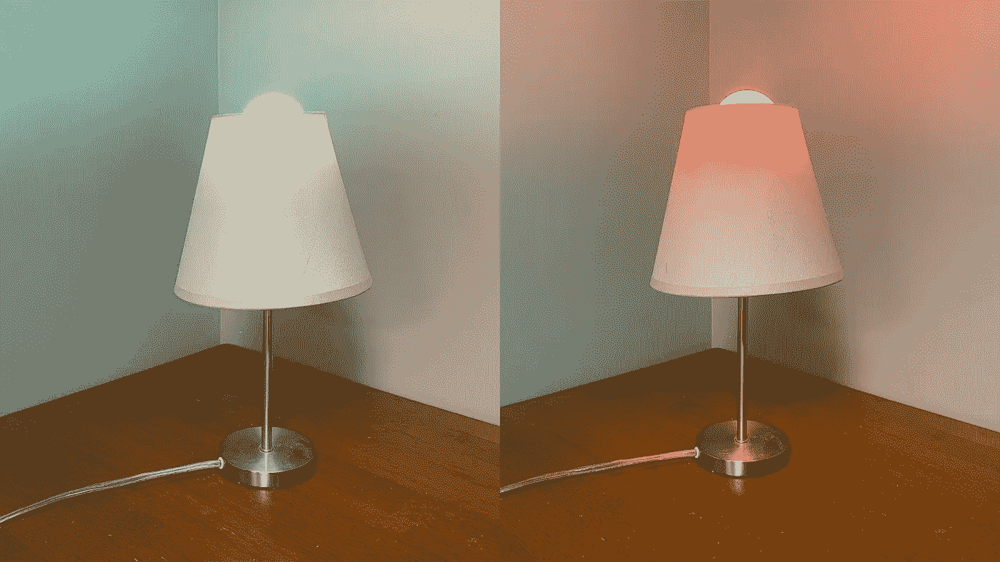

作者图片

结合来自 [WattTime](https://www.watttime.org/) API 的电网清洁度评分和[的廉价智能灯泡](https://www.amazon.com/gp/product/B087D22ZVT/ref=as_li_tl?ie=UTF8&camp=1789&creative=9325&creativeASIN=B087D22ZVT&linkCode=as2&tag=benbogart09-20&linkId=2ca835c418d8fcc8986acde5b82e3871)，我将演示“电网灯泡”的创建过程，它可以可视化当地电网在任何时刻有多脏。知识就是力量，知道我们当地的能源生产何时更清洁，使我们能够通过决定何时消耗一些电力来选择减少污染和碳排放。在 WattTime 与 Geoff Hancock 的一次谈话激发了这个项目。

在我们开始之前，你应该知道，我通过本帖中的代销商链接购买任何物品都会获得佣金。该委员会有助于支持今后设立像这样的职位。

每当你打开插在墙上的电气设备，你就增加了对电网的少量需求。发电厂通过增加产量向电网提供必要的能量来满足这一需求。如果发电厂燃烧煤炭，插入你的设备会比发电厂甚至天然气发电厂产生更多的碳排放。你的设备消耗的能量越多，差别就越大。因此，通过了解什么时候你的电网是最干净的，你可以通过选择什么时候给你的电动汽车充电来减少你的排放量。

但是我们怎么知道什么时候我们的网格是最干净的呢？我使用了由 [WattTime](https://www.watttime.org/) 提供的创新 API。WattTime 是一个非盈利组织，旨在回答“我现在用的电有多干净？”他们已经为美国、加拿大和其他强制要求发电厂报告排放的国家回答了这个问题。他们目前正致力于通过与 ClimateTrace 的合作将这种能力扩展到世界其他地方。

WattTime API 对每个网格进行评分，分值范围为 0-100，其中 0 表示最干净，100 表示最脏。这是为我们的“电网灯泡”供电的实时数据

我正在使用这个 [$7 灯泡](https://www.amazon.com/gp/product/B087D22ZVT/ref=as_li_tl?ie=UTF8&camp=1789&creative=9325&creativeASIN=B087D22ZVT&linkCode=as2&tag=benbogart09-20&linkId=2ca835c418d8fcc8986acde5b82e3871)，它像大多数廉价智能设备一样，连接到图雅平台。这些灯泡暴露了一个本地 API，可以从我们局域网上的任何计算机直接与它们通信，这意味着我们不需要智能集线器或任何其他智能设备来工作。如果您通过本文中的链接购买灯泡，我可能会收到

结合这两个 API 和一点 Python，我们将创建一个显示当前网格清洁度的灯，绿色表示最干净，红色表示最脏。

# WattTime API

WattTime API 使用起来很简单，文档[提供了很好的例子。虽然数据计划页面有点混乱，但我发现免费计划允许访问当前的本地电网条件。](https://www.watttime.org/api-documentation/#introduction)

我们将通过以下方式获得排放分数:

*   注册 WattTime API。
*   认证。
*   用谷歌地图确定我们的纬度和经度。
*   获得实时排放量。

## 注册 WattTime API

你通过 API 本身注册 API，效率非常高。记得用你的信息替换`USER_NAME`、`PASSWORD`、`EMAIL`和`ORG`。

```
import requestsparams = {'username': 'THE USER_NAME YOU WANT',
         'password': 'THE PASSWORD YOU WANT',
         'email': 'YOU EMAIL',
         'org': 'ORG NAME'}register_url = '[https://api2.watttime.org/v2/register'](https://api2.watttime.org/v2/register')
rsp = requests.post(register_url, json=params)
print(rsp.text)
```

如果一切顺利，您将获得一条成功消息，显示您已经成功注册了该 API。

```
{"user":"benbogart","ok":"User created"}
```

如果出现错误，请相应地调整参数。在下面的情况下，我们将不得不选择一个不同的用户名，然后再试一次。

```
{"error":"That username is taken. Please choose another."}
```

## 鉴定

WattTime API 使用 HTTP 基本认证将您的用户名和密码交换为访问令牌。这也很简单，使用`requests.auth`中的`HTTPBasicAuth`。

```
from requests.auth import HTTPBasicAuthlogin_url = 'https://api2.watttime.org/v2/login'
auth = HTTPBasicAuth(params['username'], params['password']))rsp = requests.get(login_url, auth=auth)
token = rsp.json()['token']print(rsp.json())
```

检查响应以确保您收到了令牌。如果是这样，我们可以继续前进。

## 用谷歌地图确定我们的纬度和经度

在这个例子中，我将使用位于市政厅的布鲁明顿。你应该用你的地址。

搜索您的地址，然后右键单击、双指单击或 ctrl+单击地图上的红色大头针。这将弹出一个对话框，显示大头针的纬度和经度。单击纬度和经度，这会将它们复制到您的剪贴板。

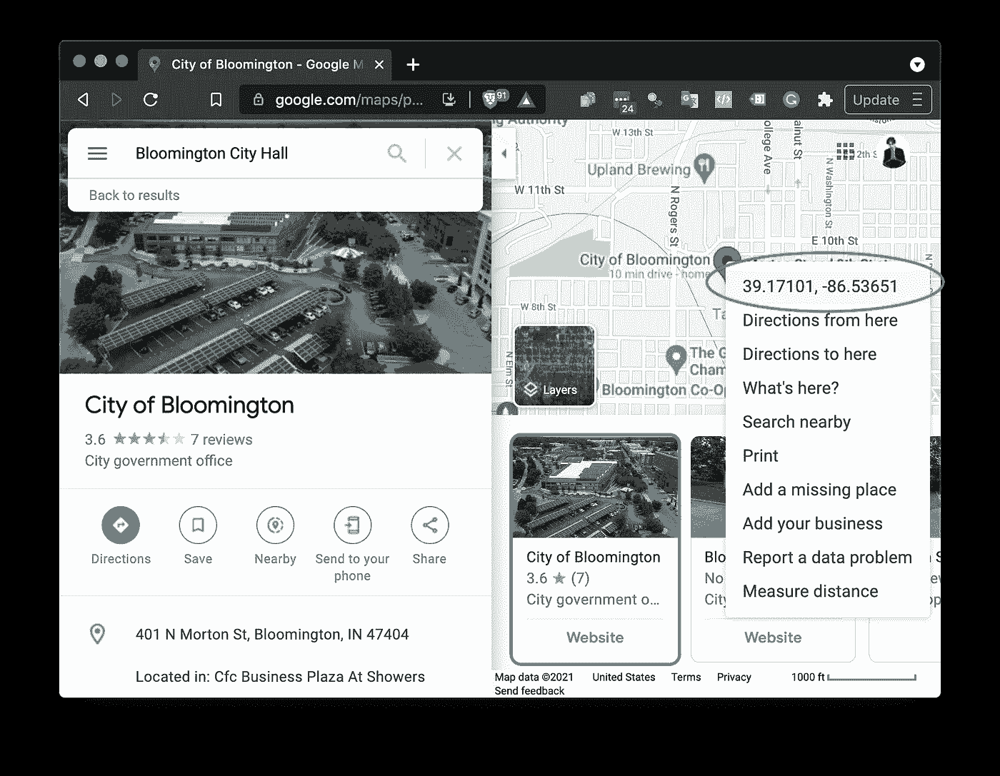

作者图片

我们现在将这些值分配给`latitude`和`longitude`。

```
lat = 39.17100708872063
long = -86.53651334662412
```

## 获取实时排放

现在，我们拥有了获取本地区实时排放量所需的一切。

```
index_url = '[https://api2.watttime.org/index'](https://api2.watttime.org/index')params = {'latitude': lat, 'longitude': long}rsp=requests.get(index_url, headers=headers, params=params)print(rsp.text)
```

它会返回类似这样的内容:

```
{
    "freq": "300", 
    "ba": "MISO_INDIANAPOLIS",
    "percent": "57",
    "point_time": "2021-07-31T17:00:00Z"
}
```

*   `freq`显示数据更新的频率。
*   `ba`是地区。
*   `percent`是我们地区当前的污染值。
*   `point_time`是最后一次更新分数的时间。

我们将使用`percent`来更新智能灯泡的颜色。

# 连接到智能灯泡

这里的指示是连接到专为图雅平台设计的 wifi 智能灯泡。绝大多数低成本智能设备都使用这个平台，包括任何使用智能生活 app 的灯泡。

这些灯泡暴露了一个 API，允许我们通过本地网络直接控制它们。不幸的是，我们需要经历一些困难才能获得灯泡的 API 密钥。此外，这些灯泡通常只能在 2.4Ghz 网络上工作。

图雅使用智能手机应用程序将智能设备连接到当地的 wifi 网络，并在图雅网络上注册。在图雅平台上注册设备可以让我们检索灯泡的 API 密钥，因此虽然我们不会使用图雅平台或智能生活应用程序来控制灯泡，但我们仍然必须注册灯泡以获得 API 密钥来访问灯泡的 API。

以下是我们连接灯泡的步骤。

*   下载并设置智能生活应用程序。
*   将灯泡连接到我们的 wifi，并在智能生活应用程序中注册。
*   通过图雅开发者平台获取灯泡的 API 密钥。
*   连接灯泡。

## 下载并设置智能生活应用程序

*   下载并安装智能生活 app。[ [苹果](https://apps.apple.com/us/app/smart-life-smart-living/id1115101477) ] [ [安卓](https://play.google.com/store/apps/details?id=com.tuya.smartlife) ]
*   登录或创建一个用户帐户。

## 将灯泡连接到我们的 wifi，并在智能生活应用程序中注册

大多数现代 wifi 网络在一个网络 id 上同时使用 2.4Ghz 和 5Ghz 频道。我们的廉价灯泡只能使用 2.4Ghz 网络，当使用智能生活应用程序的默认 EZ 配对方法时，它会变得混乱。我们将它与“AP 模式”配对，这似乎可以解决这个问题。这个方法比“EZ”方法长一点，但这是我们为便宜付出的代价。

*   在智能生活应用程序中，点击“添加设备”或屏幕左上角的+图标。
*   在“手动添加”标签中，选择照明和您购买的灯泡种类。我选了“光源(Wi-Fi)。”

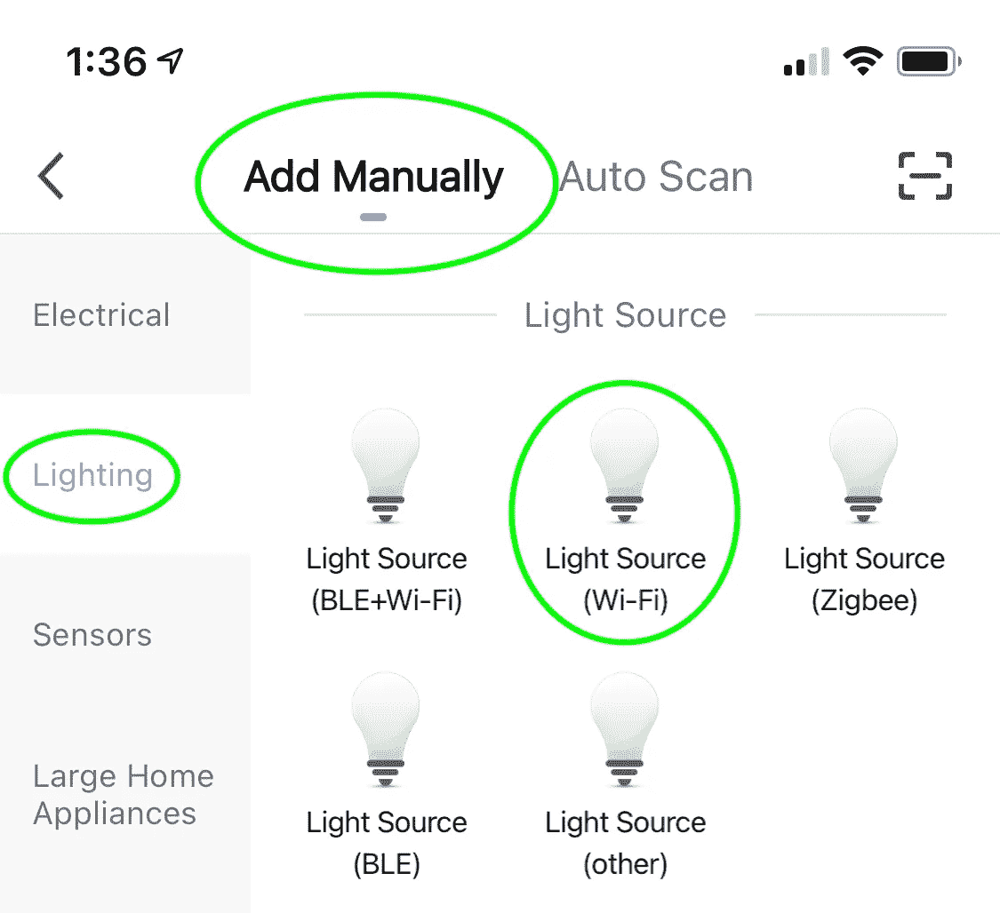

作者图片

*   **更改配对模式。**以下屏幕将要求我们重置设备。在此之前，请点击右上角的“EZ 模式”然后，从出现的菜单中选择“AP 模式”

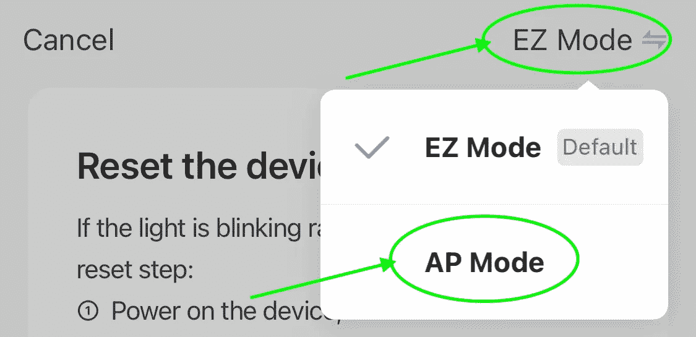

作者图片

*   接下来，连续两次复位灯泡:先关再开 3 次，等灯泡开始快速闪烁，再关再开，等开始缓慢闪烁*。*
*   *当缓慢闪烁时，灯泡会创建一个 wifi 热点。智能生活应用程序会引导你进入 wifi 设置并连接灯泡。*

*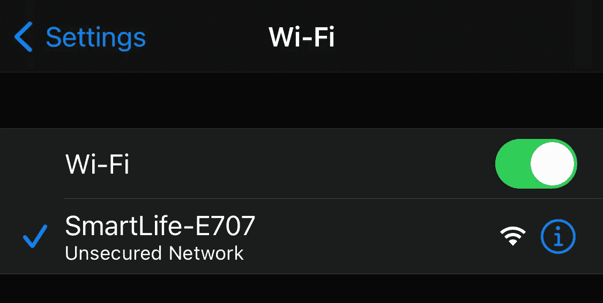*

*作者图片*

*   *返回应用程序并完成配对。现在你应该可以在智能生活应用中看到你的灯泡了。这是一个玩应用程序的好时机，看看你的灯泡能做什么。*

*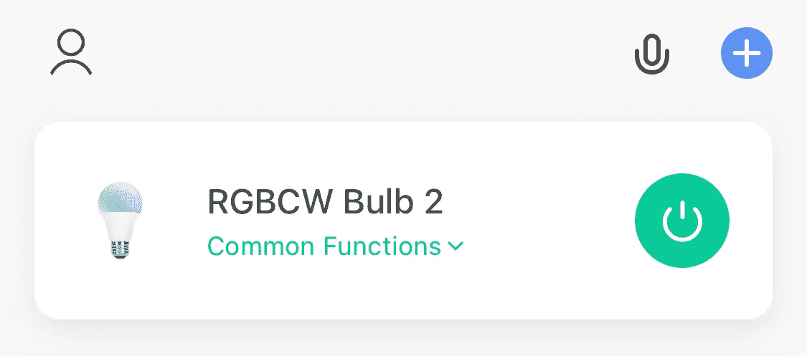*

*作者图片*

## *通过图雅开发者平台获取灯泡的 API 密钥*

*现在灯泡连接到我们的本地网络，我们可以从我们的手机控制它，下一步是获得设备 id，并从图雅开发者平台提取 API 密钥。*

***第一部分:图雅设置***

*   *在 iot.tuya.com[创建一个免费的图雅开发者账户](https://iot.tuya.com/)。(选择登录框下方的“注册”)。*
*   *您可以跳过“组织类型”对话框。*
*   *登录后，选择左侧导航栏中的“云”。第一次这样做时，图雅会让你选择一个计划。选择免费的“试用版”并查看。您必须像购买该计划一样结账，但您不会被收取任何费用，也不必提供任何付款信息。*

**

*作者图片*

*   *回到物联网平台，再次选择云。这次选择“创建云项目”*

*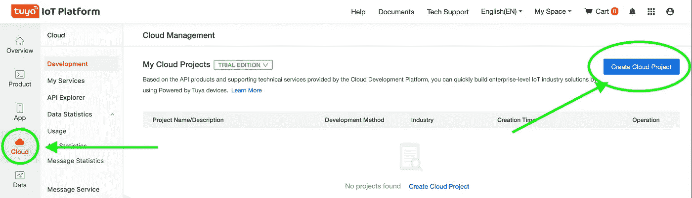*

*   *填写“创建云项目”对话框，确保选择“智能家居”作为开发方法。*

*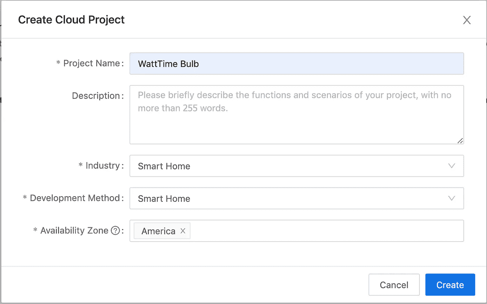*

*作者图片*

*   *在下一个屏幕上，验证“*智能家居设备管理*”、“*授权*”和“*智能家居家庭管理”*是否列在选定的 API 产品下，然后单击授权。*

*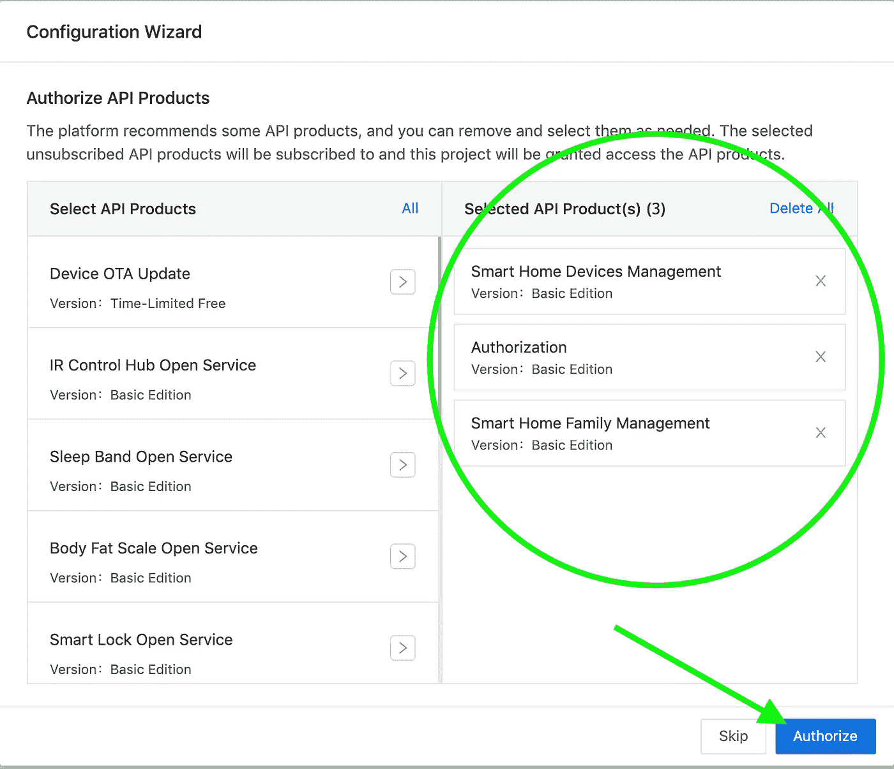*

*作者图片*

*   *在这一步之后，图雅将带你去你的新项目。前往“设备”选项卡，选择“链接图雅应用程序帐户”*

*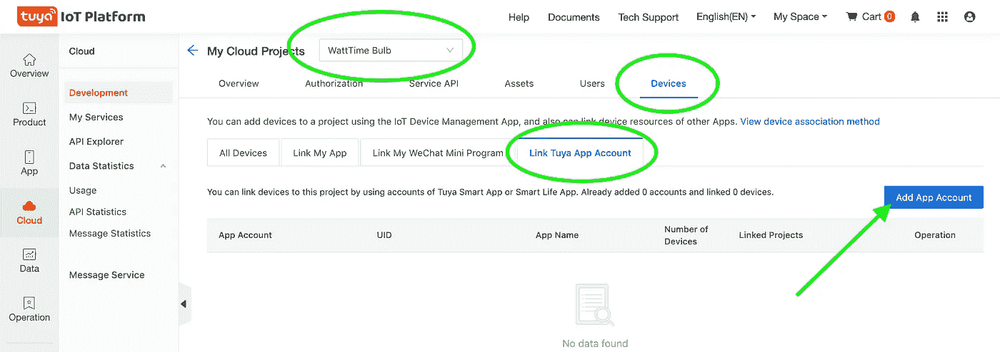*

*作者图片*

*图雅将展示一个二维码，我们需要用我们的智能生活应用程序扫描。在手机的智能生活应用程序中，进入“我”和屏幕右上角的扫描图标。这将调出一个二维码阅读器。*

*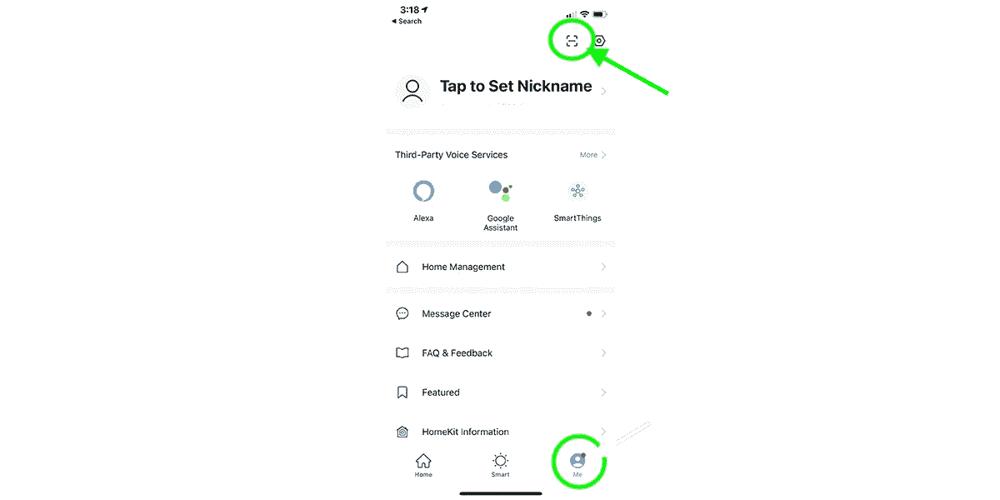*

*作者图片*

*   *扫描二维码后，点击“确认登录”，您的设备将出现在物联网平台的图雅物联网平台设备选项卡中。*

*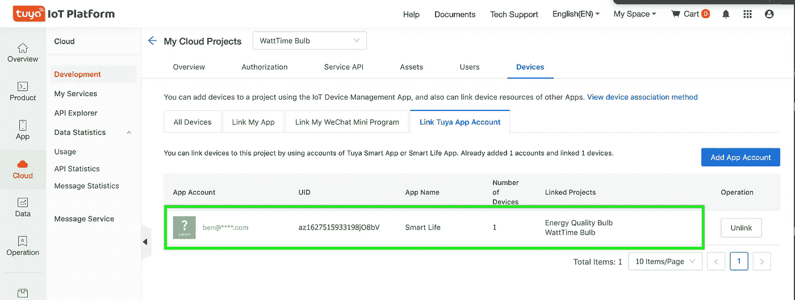*

*作者图片*

*先不要关闭这一页。我们还需要两条信息，但是我们已经完成了帐户设置。*

***第 2 部分:获取 API 密钥***

*现在一切就绪，我们可以提取灯泡的 API 密钥了。我发现`tinytuya`包既有提取 API 密钥的最简单的方法，也有连接灯泡的最简单的方法。*

*   *安装`tinytuya`*

```
*pip install tinytuya*
```

*   *获取设备 id:要登录 API，我们需要与帐户相关联的任何智能设备的 Id。因为我们只有一个灯泡，所以我们需要获取它的设备 id。我们可以从命令行使用`tinytuya`来完成这项工作。*

```
*$ python -m tinytuya scan*
```

*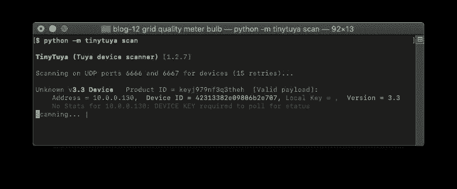*

*作者图片*

*这将轮询本地网络上设备的端口 6666 和 6667，并返回任何图雅设备。我们可以从上面的扫描中看到，设备 ID 以蓝色列出。*

*   *导航至将在其中创建 python 脚本的目录。下面的向导生成一个 JSON 文件，该文件必须保存在与脚本相同的目录中。*
*   *在命令行上运行以下命令，然后继续阅读在哪里检索每个请求的项目。*

```
*python -m tinytuya wizard*
```

*   *从图雅项目页面输入您的 API 密钥(又名客户端 ID)和 API 秘密(又名客户端秘密)。*

*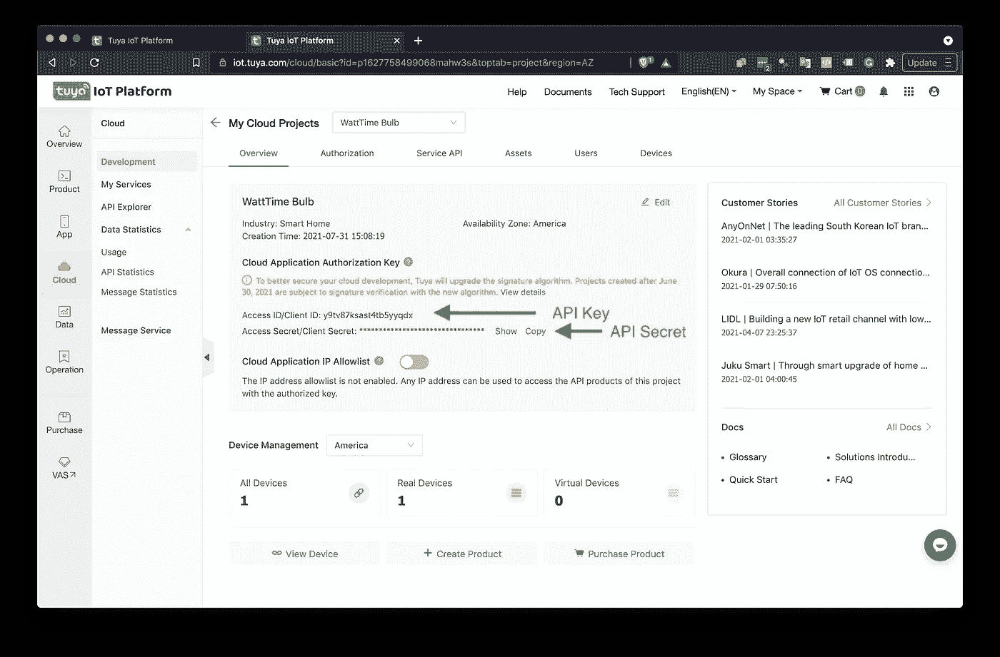*

*作者图片*

*   *输入您在上一步中通过微型 tuya 扫描获得的设备 ID*
*   *从列表选项中输入最近的区域。*

*结果看起来会像这样。*

*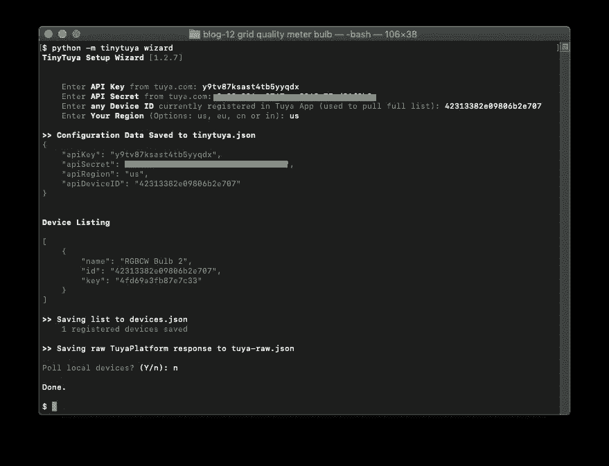*

*作者图片*

*好了，所有的难题都解决了！我们不需要图雅 API 来做任何其他事情，但如果你从你的智能生活应用程序中移除灯泡，你将需要重复上述步骤。*

*现在来看看魔术。*

## *连接灯泡*

*我们有直接连接灯泡所需的一切。在一个地方看到这一切的最简单的方法是重复设备扫描，现在我们已经连接到图雅 API。*

*   *在命令提示符下重复设备扫描…*

```
*$ python -m tinytuya scan*
```

*…或者在 Jypyter 笔记本中。*

```
*import tinytuya
intytuya.scan()*
```

*这次扫描给了我们连接灯泡所需的一切，包括本地 API 密钥。*

> *注意:这需要访问由`tinytuya wizard`生成的 devices.json 文件。确保从同一目录运行该命令，或者将 devices.json 复制到您的工作目录。*

*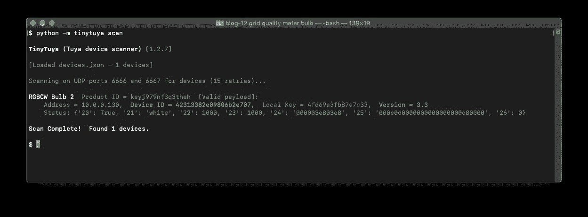*

*作者图片*

*   *在您的笔记本或代码编辑器中，通过替换下面代码中灯泡的详细信息来连接灯泡。*

```
*bulb = tinytuya.BulbDevice(dev_id='DEVICE ID',
                           address='ADDRESS',
                           local_ley='LOCAL KEY')
bulb.set_version(VERSION)
print(f'set status result {bulb.status()}')*
```

*如果连接成功，您将得到类似如下的响应:*

```
*set status result {'devId': '42313382e09806b2e707', 'dps': {'20': True, '21': 'white', '22': 1000, '23': 1000, '24': '000003e803e8', '25': '000e0d0000000000000000c80000', '26': 0}}*
```

*   *摆弄一下灯泡。当这个成功的时候，你可以尽情地大笑。*

*试着打开灯泡:*

```
*bulb.turn_on()*
```

*关闭灯泡:*

```
*bulb.turn_off()*
```

*在 0-100 的范围内设置亮度:*

```
*bulb.set_brightness_percentage(25)*
```

*设置灯泡的颜色:*

```
*bulb.set_colour(0,255,255)*
```

*你可以在`[tinytuya](https://pypi.org/project/tinytuya/)` [文档中找到`tinytuya`支持命令的完整列表。](https://pypi.org/project/tinytuya/)*

# *可视化智能灯泡上的瓦特时间分数*

*剩下的就是使用智能灯泡来显示灯泡上的 watt time grid dirty 得分。我选择红色代表最脏的，绿色代表最干净的，因为我觉得这很直观，也因为数学很简单。*

*你可以在下面或者在 [Github 库](https://github.com/benbogart/emissions-bulb)中找到代码。将文件另存为`gridbulb.py`并用`python gridbulb.py`运行。脚本会一直运行，直到你用`ctrl` + `c`停止它。不要忘记用您的信息替换方括号中的字段。*

> *注意:你可以通过添加`&`在后台运行脚本。这将派生脚本，给它自己的进程 id。如果你以前没有这样做过，我在这里推荐一些关于这个主题的轻松读物。*

# *结论*

*虽然这篇文章是关于在一个智能灯泡上可视化您的本地能源网格有多干净，但是每个组件都可以应用于其他任务。你可以将一个智能开关连接到你的电动汽车充电器上，这样你的汽车只能用最清洁的能源充电。你可以在你的智能灯泡上想象比特币的波动分数。可能性只受到你想象力的限制。*

*连接一个便宜的智能灯泡需要大量的努力，但我们只需经历一次磨难。不过，如果我不得不再次这样做，我可能会考虑多花几美元买一个可以直接连接到我的三星智能集线器的灯泡。不过，希望使用 7 美元的灯泡能让更多人接触到它。*

*现在去用你的智能灯泡做点好事吧。*

# *资源*

*   *[GitHub 库](https://github.com/benbogart/emissions-bulb)为本帖*
*   *[WattTime API 文档](https://www.watttime.org/api-documentation/)*
*   *`[tinytuya](https://pypi.org/project/tinytuya/)` [文档](https://pypi.org/project/tinytuya/)*
*   *亚马逊上售价 7 美元的智能灯泡*