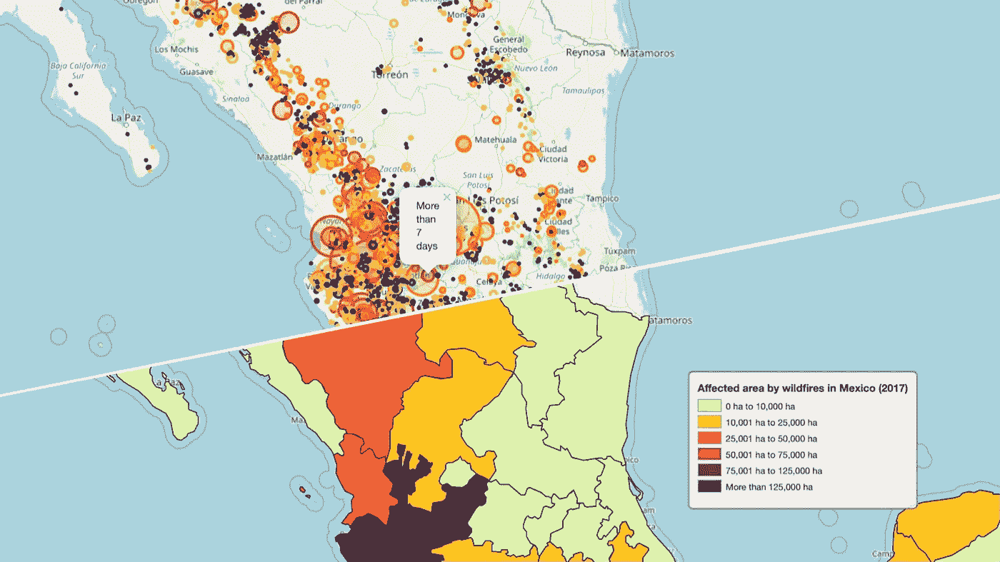
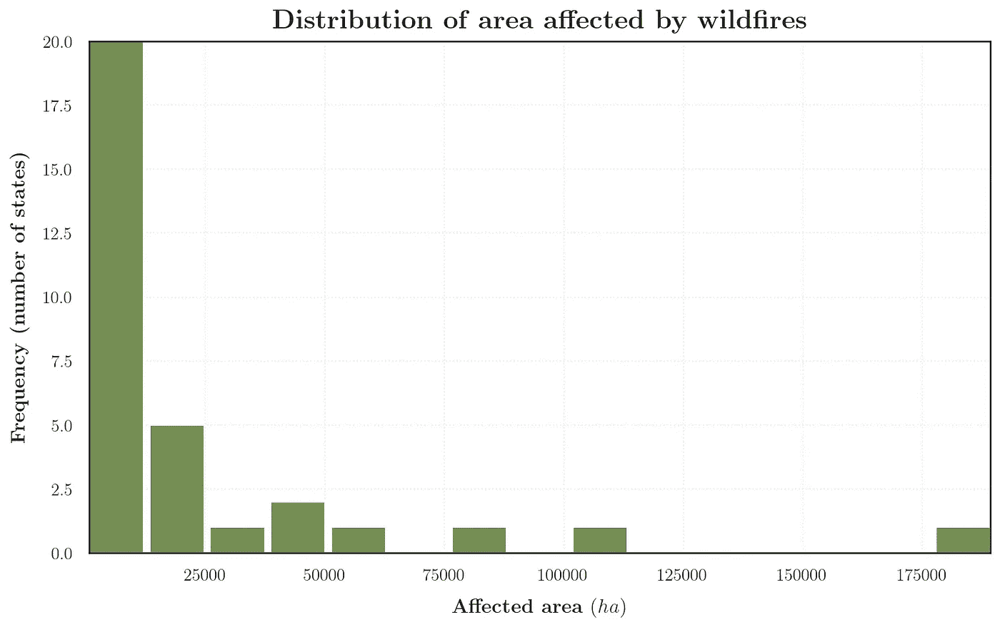

# 用树叶可视化 2017 年墨西哥野火

> 原文：<https://towardsdatascience.com/visualizing-mexican-wildfires-during-2017-with-folium-8917fc1f491d?source=collection_archive---------15----------------------->

## [数据新闻](https://towardsdatascience.com/tagged/data-journalism)

## 一个难以置信的，强大的和友好的工具来显示地理空间数据

最后用**叶可视化。由 E. Camacho 制作**

# 作者:

阿罗约-贝拉斯克斯·艾萨克；卡马乔-佩雷斯·恩里克

# 介绍

在世界范围内，火灾发生的规模、频率和强度都显著增加。墨西哥是一个非常多样化的国家，经常发生森林火灾，尤其是在厄尔尼诺年。然而，在墨西哥，火灾主要是由人类引起的，道路可达性和到城镇的距离等因素通常与火灾的频率和分布有关。

本教程的总体目标是展示如何使用数据科学可视化工具，但以一种特殊的方式，即`**folium**`模块，来了解 2017 年墨西哥的火灾。

# CONAFOR 数据库

在墨西哥，森林火灾的预防和控制由国家森林防火计划(CONAFOR，其西班牙语缩写)执行，我们将通过以下链接使用其 2017 年的数据库:[【2】](https://www.datos.gob.mx/busca/organization/conafor)[【3】](http://187.218.230.4/OpenData/Incendios/)

 [## 墨西哥酋长协会

### 地图以文件和图像的形式表现了易受项目影响的表面…

www.datos.gob.mx](https://www.datos.gob.mx/busca/organization/conafor)  [## /open data/incidendios 的索引

### 墨西哥野火数据库

187.218.230.4](http://187.218.230.4/OpenData/Incendios/) 

# 数据探索

首先，将对国家森林委员会的数据进行基本探索。

*   行数:8896
*   列数:53
*   数据集的统计摘要:

# 单位转换

## 可疑数据

在进行任何转换之前，我们必须确保数据是数值类型:

我们必须将 **19** 改为数字数据

## 转换功能

使用“度”、“分”和“秒”列，我们通过以下函数找到纬度和经度的十进制度:

有了经度和纬度数据，我们就去掉了“度”、“分”和“秒”这几列

# 用`**Folium**`可视化野火

当我们有涉及位置、区域或地理区域的数据时，将它们清晰且用户友好地可视化是至关重要的。

Python 的库，`**Folium**`[【4】](https://python-visualization.github.io/folium/)，是这种情况下最可靠、最理想的工具。在这本笔记本中，我们将解释如何可视化 2017 年在墨西哥记录的野火。显示的每张地图都有其详细的程序，可与其他数据一起重新创建。

`**import folium**`

首先，我们将使用数据的经度和纬度信息创建一个数组。

每一张用树叶制成的地图都应该装在底图的上面。这个基地是由`**Map()**`函数创建的:

*   `**location**` *(tuple)* :中心的地图位置为元组*(纬度，经度)*
*   `**zoom_start**`*【int】*:显示地图时你想要的缩放量

## 野火接近度

当我们谈到一些自然灾害时(虽然野火很大程度上是人为造成的)，每个人都想知道它离你住的地方有多近，如果很近，有多少或者已经发生了多少？这种情况就是 ***热图*** 有助于显示各点(数据)的接近程度的地方。幸运的是，叶有这个工具:

`**from folium.plugins import HeatMap**`

相关参数(以及我们将要使用的参数)是:

*   `**data**` *(列表或数组)*:地图上要绘制的数据的地理位置。
*   `**name**` *(字符串)*:图层的名称。这个会出现在`LayerControls`里。[默认:`None` ]
*   `**radius**` *(int)* :地图上每个数据点的半径。[默认:`15` ]
*   `**max_val**` *(浮点)*:一个点的最大强度值。[默认:`1` ]
*   `**min_opacity**` *(float)* :最小不透明度值，在该值处*热图*将开始“加热”。[默认:`1` ]
*   `**blur**` *(int)* :点中*模糊*的量。数字越大，重点就越模糊。[默认:`15` ]

**重要提示:**如果我们想修改任何地图参数，重新运行创建地图的代码(`**Map()**`)是很重要的，因为如果我们只运行`**HeatMap()**`函数，它会在地图上叠加一个新的图层。处理这个问题的最好方法是，一旦代码准备好了，就将所有内容放在同一个单元格中，以便在需要更改某些参数时可以重新运行所有内容:

## 野火持续时间(天)

我们可以看到我们的*数据集*包含有价值的信息，其中之一是火灾的持续时间。此外，尽管我们有开始和结束日期，但我们有一个名为`**Duration time (days)**`的变量，它已经对时间进行了分类。

为了更好地形象化，我们可以用颜色对各个时期进行分类。

野火持续时间的颜色表示。图片作者:艾萨克·阿罗约

下一步，我们将把颜色代码添加到我们的*数据集*中，并将数据从西班牙语翻译成英语

我们将如何处理这些信息？我们将画一些小圆，它们的中心在**纬度**和**经度**，它们的颜色由**持续时间(颜色)给出。**该选项将通过功能`**Circle():**`实现

*   `**location**` *(元组或列表)*:经纬度(对)。
*   `**popup**` *(字符串 o* `*folium.Popup*` *)* :为点击时显示的对象输入文本或可视化。
*   `**radius**` *(浮点)*:圆的半径，单位为米。
*   `**color**` *【字符串】*:圆轮廓的颜色，十六进制代码。
*   `**fill**` *(字符串)*:如果`fill = True`则该函数要求一个`**fill_color**`
*   `**fill_color**` *(bool)* :圆的填充颜色。

为了显示该国的所有火灾，我们将在`**for**`循环中使用`**Circle()**`:

## 组合:持续时间+受影响区域

继续圆图，我们可以给`**radius**`参数一个更好的理解火的尺寸。

**受灾面积(ha)** 的单位是**公顷**，因此我们可以用它来确定我们的圆的半径，以便对这些自然灾害的程度有一个初步的直观了解(和近似)。

其中𝑅以**百米** (1 hm = 100 m)为单位，翻译成 Python 为:

`**radius = np.sqrt( df[‘Affected area (ha)’].values[i]/np.pi )*1000**`

末端的`***1000**`用于将圆缩放 10 倍(真实数据中的 1 米=可视化数据中的 10 米)

## 受影响的总面积(公顷)

仅用圆圈还不足以全面了解情况，我们还有关于受影响面积(公顷)的信息，可变名称为**受影响面积(公顷):**。

我们可以按州对它们进行分组，并在*数据帧*中获得受影响区域的总和

为了获得因野火造成的绿色区域损失的清晰而醒目的地图，我们将使用额外的资源:

*   墨西哥各州的 ID 代码
*   用于可视化的 JSON 文件

## **墨西哥各州 ID 代码**

**affected_area_states** 的 El *数据框*对于我们想要绘制的地图来说有些不完整，因此我们需要使用以下 csv 文件中的信息来完成:

我们可以注意到两个州在名称上不匹配，因此执行`merge`对我们不利，因此我们将更改名称:

`affected_area_states.iloc[6,0] = ‘CDMX’
affected_area_states.iloc[16,0] = ‘Estado de México`

## **JSON 文件**

有了`**IDNAMES**`，我们只需在墨西哥各州上“绘制和绘画”，这些州的几何图形将由下面的 **JSON 文件给出:** *states_mx.json*

让我们看看我们的数据分布，以便按受影响的区域进行分类:

## 彩色地图

我们将要使用的函数是`**GeoJson()**`，它的参数是:

*   `**data**` *(file，dict* 或 *str)* :您想要绘制的 GeoJSON 数据。
*   `**style_function**` *(函数)*:将 GeoJSON 特征映射到样式字典的函数。在我们的例子中，风格字典如下:

而`**COLOR_FUNCTION**` 则如下:

最后我们得到了这个结果:

要在地图中添加图例，您可以使用本文末尾我的 GitHub 库中的 *Jupyter 笔记本*中显示的步骤。

环境和自然资源部长(SEMARNAT)有一个向公众开放的每年各州野火数量的登记册，所以我们可以很容易地检查他们提供的数据是否是向公众开放的。进行这种练习，即使听起来很愚蠢，也是很重要的。

 [## SEMARNAT

### 《森林燃烧结果报告》中的森林燃烧数据

dgieawf . semarnat . gob . MX](http://dgeiawf.semarnat.gob.mx:8080/ibi_apps/WFServlet?IBIF_ex=D3_RFORESTA05_01&IBIC_user=dgeia_mce&IBIC_pass=dgeia_mce&NOMBREENTIDAD=*&NOMBREANIO=*) 

在审查结束时，我们可以看到，他们在网站上与我们分享的信息确实与我们从国家森林委员会的公开数据中收集的信息相同。

# 结论

多亏了叶，我们可以呈现 2017 年墨西哥野火的行为，比如:

*   野火接近度
*   野火持续时间
*   每场野火和每个州的总受灾面积，这一切都要归功于以下 leav 功能:
*   `**Map()**`
*   `**HeatMap()**`
*   `**Circle()**`
*   `**GeoJson()**`

因此，下次当您遇到带有地理信息的数据时，请立即使用`**folium**`。

我们知道还有其他工具；我们不想把它们最小化。我们只是展示了另一个工具。

要查看完整教程，请访问:

 [## data _ visualization _ practice/Python/visualizing _ Mexican _ wild fires _ TDS at master…

### 作者:Camacho-Perez Enrique，Arroyo-Velázquez Isaac 尚未发现任何记录表明野火是一种自然灾害，在…

github.com](https://github.com/isaacarroyov/data_visualization_practice/tree/master/Python/visualizing_mexican_wildfires_tds) 

# 参考

**【1】**华雷斯·奥罗兹科，S. *墨西哥米却肯州森林火灾风险模型*【国际地理信息科学与地球观测研究所硕士论文】
[https://library . ITC . ut wente . nl/papers _ 2008/MSC/NRM/orozco . pdf](https://library.itc.utwente.nl/papers_2008/msc/nrm/orozco.pdf)

**【2】**墨西哥开放数据-confor-institutions
[https://www . data . gob . MX/search/organization/confor](https://www.datos.gob.mx/busca/organization/conafor)

**【3】**【指数】
[【http://187 . 218 . 230 . 4/openata/fire/](http://187.218.230.4/OpenData/Incendios/)

**【4】**【文件】
[【https://python-visualization . github . io/folum/](https://python-visualization.github.io/folium/)

**周刊。专题查询
[【http://dgeiawf . semarnat . gob . MX:8080/ibi _ apps/wfservlet？IBF _ ex = D3 _ erformesta 05 _ 01&【IBC _ user = dgeia _ MCE】&【IBC _ pass = dgeia _ MCE】&【nomanio =](http://dgeiawf.semarnat.gob.mx:8080/ibi_apps/WFServlet?IBIF_ex=D3_RFORESTA05_01&IBIC_user=dgeia_mce&IBIC_pass=dgeia_mce&NOMBREENTIDAD=*&NOMBREANIO=)***