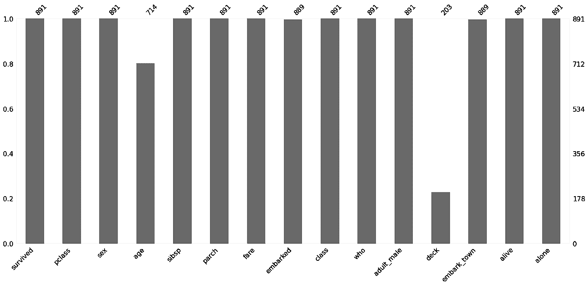
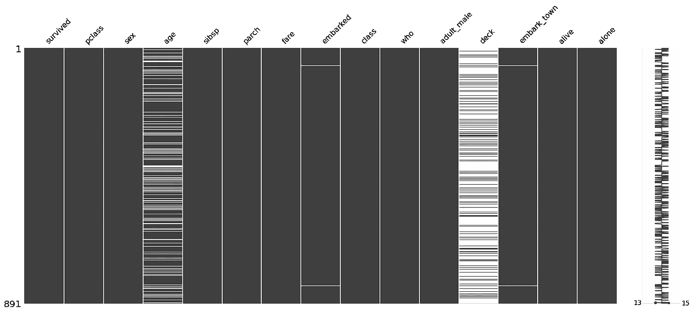
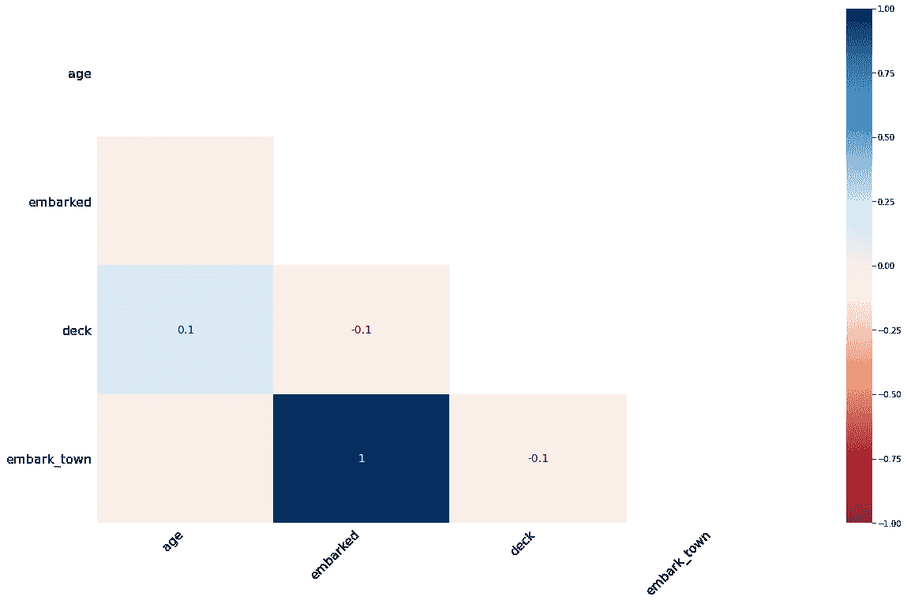

# 在 Python 中可视化缺失值非常容易

> 原文：<https://towardsdatascience.com/visualizing-missing-values-in-python-is-shockingly-easy-56ed5bc2e7ea?source=collection_archive---------4----------------------->

## 如何使用 Missingno 库查看所有缺失的值


[伊丽莎白·杜舍奇娜](https://unsplash.com/@kallyua?utm_source=medium&utm_medium=referral)在 [Unsplash](https://unsplash.com?utm_source=medium&utm_medium=referral) 上的照片

# 您的旅程概述

1.  [设置舞台](#ceba)
2.  [什么是 Missingno？](#f0b3)
3.  [加载数据](#e739)
4.  [条形图](#88ae)
5.  [矩阵图](#3c12)
6.  [热图](#ae8c)
7.  [你学到了什么？](#cad0)
8.  [收尾](#3186)

# 1 —搭建舞台

缺少价值观是生活的现实。如果你是数据科学家或者数据工程师，接收数据，那么缺失值比比皆是。您应该如何处理缺失值是高度依赖于上下文的:

*   也许删除所有缺少值的行？
*   可能会删除包含太多缺失值的整个要素？
*   也许用一种巧妙的方式来填充缺失的值？

第一步应该始终是了解缺少什么以及为什么缺少。要开始这一发现，没有什么比获得丢失值的良好可视化更好的了！下面两个选项中哪个更容易理解？

```
0   survived     891 non-null    int64   
1   pclass       891 non-null    int64   
2   sex          891 non-null    object  
3   age          714 non-null    float64 
4   sibsp        891 non-null    int64   
5   parch        891 non-null    int64   
6   fare         891 non-null    float64 
7   embarked     889 non-null    object  
8   class        891 non-null    category
9   who          891 non-null    object  
10  adult_male   891 non-null    bool    
11  deck         203 non-null    category
12  embark_town  889 non-null    object  
13  alive        891 non-null    object  
14  alone        891 non-null    bool 
```



条形图

绝对是条形图，对吧？😋

这两个选项都提供了著名的 **Titanic 数据集**中缺失值的信息。只需看一眼条形图，您就可以发现有两个特性(`age`和`deck`)丢失了大量数据。

在这篇博文中，我将向您展示如何使用 Python 库 [missingno](https://github.com/ResidentMario/missingno) 。这个库为你提供了几个实用函数，用来绘制熊猫数据帧的缺失值。如果你更喜欢视觉学习，那么我也制作了一个关于这个主题的视频😃

# 2 —缺少什么？

是一个 Python 库，可以帮助你可视化熊猫数据帧中缺失的值。该库的作者以如下方式描述了 missingno:

> 杂乱的数据集？缺少值？`missingno`提供了一个灵活易用的缺失数据可视化工具和实用程序的小型工具集，可让您快速直观地总结数据集的完整性(或缺失)。—没有遗漏任何文件

在这篇博文中，您将使用 missingno 来理解著名的 [Titanic 数据集](https://github.com/mwaskom/seaborn-data/blob/master/titanic.csv)中缺失的值。数据集预装了库 seaborn，所以不需要单独下载。

首先，我们来安装 missingno。我将使用 Anaconda，因此用简单的命令安装了 missingno:

```
conda install -c conda-forge missingno
```

如果您正在使用 PIP，那么您可以使用以下命令:

```
pip install missingno
```

因为我通过 Anaconda 使用 Jupyter 笔记本，所以我已经安装了 pandas 和 seaborn。如果你想遵循这篇博文中的代码，确保你已经安装了这些😉

# 3-加载数据

您应该从导入包开始:

```
# Package imports
import seaborn as sns
import pandas as pd
import missingno as msno
%matplotlib inline
```

推荐使用别名`msno`导入 missingno。

现在，您可以使用 seaborn 导入泰坦尼克号数据集。seaborn 预装了这个数据集，您可以简单地运行命令:

```
# Load the Titanic data set
titanic = sns.load_dataset("titanic")
```

现在，泰坦尼克号的数据集被储存在熊猫数据库`titanic`中。

很难想象熊猫身上缺失的价值观。您唯一能做的就是使用 pandas 方法`.info()`来获得缺失值的汇总:

```
titanic.info()**Output:** <class 'pandas.core.frame.DataFrame'>
RangeIndex: 891 entries, 0 to 890
Data columns (total 15 columns):
 #   Column       Non-Null Count  Dtype   
---  ------       --------------  -----   
 0   survived     891 non-null    int64   
 1   pclass       891 non-null    int64   
 2   sex          891 non-null    object  
 3   age          714 non-null    float64 
 4   sibsp        891 non-null    int64   
 5   parch        891 non-null    int64   
 6   fare         891 non-null    float64 
 7   embarked     889 non-null    object  
 8   class        891 non-null    category
 9   who          891 non-null    object  
 10  adult_male   891 non-null    bool    
 11  deck         203 non-null    category
 12  embark_town  889 non-null    object  
 13  alive        891 non-null    object  
 14  alone        891 non-null    bool    
dtypes: bool(2), category(2), float64(2), int64(4), object(5)
memory usage: 80.7+ KB
```

方法`.info()`对于检查不同特性的数据类型非常有用。然而，这对于了解不同特性所缺少的东西并不是很好。您将为此使用 missingno😍

# 4 —条形图

可视化缺失值的最基本绘图是**条形图**。为此，您可以简单地使用 missingno 库中的函数`bar`:

```
# Gives a bar chart of the missing values
msno.bar(titanic)
```

这将显示图像:


条形图

这里您可以立即看到`age`和`deck`特性严重缺失值。仔细观察还会发现特性`embarked`和`embark_town`各缺少两个值。

您应该如何处理缺失值取决于上下文。在该设置中，应该可以用适当的值填充特征`age`、`embarked`和`embark_town`。然而，对于`deck`功能，有太多的缺失，我会考虑完全放弃这个功能。

虽然条形图很简单，但是没有办法看出缺少了特性的哪一部分。在下一节中，我将向您展示如何使用 missingno 的`matrix`函数看到这一点。

# 5 —矩阵图

missingno 提供的另一个实用可视化是**矩阵图**。简单地使用`matrix()`功能如下:

```
# Gives positional information of the missing values
msno.matrix(titanic)
```

这将显示图像:



矩阵图

从矩阵图中，您可以看到缺失值的位置。对于 Titanic 数据集，丢失的值到处都是。然而，对于其他数据集(如时间序列)，缺失的数据通常被捆绑在一起(例如由于服务器崩溃)。

矩阵图重申了我们最初的假设，即很难保存任何关于`deck`特性的东西😟

# 6 —热图

您可以使用的最后一个可视化工具是**热图**。这比条形图和矩阵图稍微复杂一些。然而，它有时可以揭示不同特征的缺失值之间的有趣联系。

要获得热图，只需使用 missingno 库中的函数`heatmap()`:

```
# Gives a heatmap of how missing values are related
msno.heatmap(titanic)
```

这将显示图像:



热图

首先，请注意热图中只有四个功能。这是因为只有四个要素缺少值。所有其他特征都将从图中删除。

要理解热图，查看对应于`embarked`和`embark_town`的值。该值为 1。这意味着`embarked`中的缺失值和`embark_town`中的缺失值完全对应。从你之前做的矩阵图也可以看出这一点。

热图中的值介于-1 和 1 之间。值-1 表示负对应关系:特征 A 中的一个缺失值意味着特征 B 中没有缺失值。

最后，值 0 表示在*特征 A* 中的缺失值和*特征 B* 中的缺失值之间没有明显的对应关系。其余所有特性(或多或少)都是如此。

对于 Titanic 数据集，热图显示在`age`要素中的缺失值和`deck`要素中的缺失值之间没有明显的对应关系。

# 7—你学到了什么？

从你所做的想象中，可以得出以下结论。

*   **条形图**—Titanic 数据集大多缺少特征`age`和`deck`的值。
*   **矩阵图**—`age`和`deck`中缺失的值分布在所有行上。
*   **热图**—`age`和`deck`特征中的缺失值之间没有很强的相关性。

这给了你比开始时更多的直觉。可视化丢失的数据只是漫长过程的第一步。你还有很长的路要走，但至少现在你已经开始了旅程🔥


照片由[张家瑜](https://unsplash.com/@danielkcheung?utm_source=medium&utm_medium=referral)在 [Unsplash](https://unsplash.com?utm_source=medium&utm_medium=referral) 上拍摄

# 8 —总结

如果您需要了解更多关于思念号的信息，请查看[思念号 Github](https://github.com/ResidentMario/missingno) 或[我的思念号视频](https://youtu.be/RHko-U5db1Y)。

**喜欢我写的？查看我的博客帖子**

*   [用漂亮的类型提示使你罪恶的 Python 代码现代化](/modernize-your-sinful-python-code-with-beautiful-type-hints-4e72e98f6bf1)
*   SymPy 符号数学快速指南
*   [5 个牛逼的数字功能，能在紧要关头救你一命](/5-awesome-numpy-functions-that-can-save-you-in-a-pinch-ba349af5ac47)
*   5 个专家提示，让你的 Python 字典技能一飞冲天🚀

获取更多 Python 内容。如果你对数据科学、编程或任何介于两者之间的东西感兴趣，那么请随意在 LinkedIn 上加我，并向✋问好