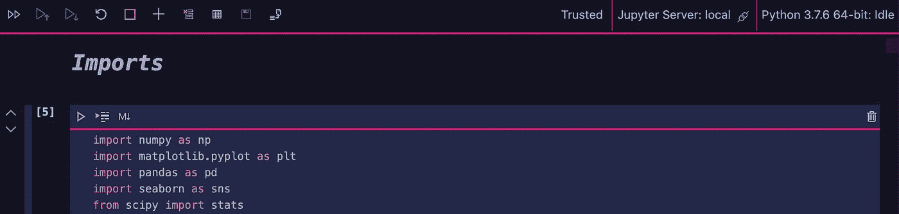

# 可视化美国宇航局的陨石数据集

> 原文：<https://towardsdatascience.com/visualizing-nasas-meteorite-dataset-pt-1-407cdc1d189e?source=collection_archive---------26----------------------->

## Python 中用于数据科学和机器学习的探索性数据分析(EDA)

在 [Unsplash](https://unsplash.com/s/photos/meteor?utm_source=unsplash&utm_medium=referral&utm_content=creditCopyText) 上 [Austin Human](https://unsplash.com/@xohumanox?utm_source=unsplash&utm_medium=referral&utm_content=creditCopyText) 的照片

当你进入数据科学领域时，你很快就会意识到有两个主要的分支可以发展。一个是更多的业务面对。另一部分用于研发。

我自己更像一个科学家。总是问问题并寻找答案。此外，我是一个超级太空迷。我总是仰望星空，想知道:“我们在哪里”，“上面有什么”，“我们如何到达那里”，“我们如何保护自己”。

这最后一个问题从童年起就一直萦绕在我心头。当你看科幻和奇幻电影时，你会有很多这样的想法。尤其是在看过《世界之战》和《银河系漫游指南》这样的电影之后。哪怕只是知道一颗流星对恐龙做了什么都会让你有点紧张。

年轻时，我希望长大后能够在地球周围建立一个保护我们免受外星人、流星、太阳耀斑等伤害的屏障。我会怎么做？还是未知。但这确实让我开始思考…

***毁灭行星的流星撞击地球的可能性有多大？***

当然，作为一名数据科学家，我必须找到答案。

# 预处理

## 数据收集

> 找到好的数据来源。你的结论和你使用的数据一样好。数据越多，标签越多样化越好。

直到我有了一些研究工作，我才能开始寻找答案。就这样，我开始了对数据的搜寻！

我首先关注的是 Kaggle.com，因为它以数据收集、挑战和其他令人惊叹的数据科学功能而闻名。

Kaggle Gif — [Kaggle](http://kaggle.com)

我做这个已经有一段时间了。在互联网的巨大数据森林中搜寻有用的数据集。最终，我选定了美国宇航局的[**【陨石降落】**](https://www.kaggle.com/nasa/meteorite-landings) 数据集。它包含大约 46，000 行和 10 列信息，如名称、位置、类别、质量等。

似乎是个不错的起点。

从那里，我将数据下载为 CSV 文件(我处理数据的首选文件时间),并将其上传到我的编码环境中。我使用 VSCode 的 Jupyter 笔记本扩展。

Github 上的 [@robotgyal](https://github.com/RobotGyal) 预处理. ipynb

Github 上的 [@robotgyal](https://github.com/RobotGyal) 预处理. ipynb

我打印出了列名和形状，只是为了验证加载的所有内容是否符合我的预期。此外，查看列名可以告诉您任何奇怪的命名约定或重复的数据。例如，此数据集的“reclat”和“reclong”(纬度和经度)包含与“GeoLocation”相同的信息，但格式不同。

意识到这些事情是很重要的，因为它们可能导致误解、歪曲或重复的结果。更不用说在将来训练和测试模型时节省时间了。

我快速浏览了一些数据(我最终添加了另一个来自[IMO——国际流星组织](https://www.imo.net/)的数据集，并将其与 NASA 的数据集合并)。

Github 上的 [@robotgyal](https://github.com/RobotGyal) 预处理. ipynb

在这里，我不仅可以看到位置数据的相似性，还可以看到许多“NaN”值。这是因为有些标注存在于一个数据集中，而不存在于另一个数据集中，例如，NASA 有地理定位，但 IMO 有高程。当它们结合在一起时，该功能使所有丢失的数据都变得“难”。

结合不必要的列，这意味着是时候清理它了！

## 数据清理

> 清洁会影响你今后所做的一切。确保数据的格式正确，可以被你的模型读取，不重复，和/或处理丢失的数据。

我先做了最简单的事情，**去掉不需要的标签**。

Github 上的 [@robotgyal](https://github.com/RobotGyal) 预处理. ipynb

这些要么根本无助于找到我想要的答案，要么在数据集中重复出现。

然后，我需要**处理‘Nan’值**，因为我知道它稍后会出现问题。

Github 上的 [@robotgyal](https://github.com/RobotGyal) 预处理. ipynb

其步骤如下:

*   找出每列中“南”的总数
*   用另一个数据集中的相应数据替换每个列中缺少的数据。另一种选择是用 0 填充，但这会扭曲以后的一些统计数据。
*   根据需要重命名和删除列。
*   再次检查以确保没有“NaN”值

我通常在预处理中采取的最后一步是采样。然而，对于这个项目，我决定将采样留给特定的机器学习脚本，而不是在预处理中。

部分原因是，在清理结束时，我将数据导出到一个新的 CSV 文件中。

> *永远不要覆盖您的原始数据*

当我开始做视觉和机器学习时，这个文件被用作我的数据源。

最后，看到数据是一回事，到 ***看到*** 数据又是另一回事。

# 画面

当我第一次学习数据科学时，我学会了使用硬编码来绘制数据。随着时间的推移，我意识到这不是最好的解决方案。

归根结底，直观地查看数据的目的是让任何人都容易理解数据，从而得出结论。通过硬编码，我花费了大量不必要的时间和精力来制作不容易理解或视觉上不吸引人的情节。

经过一些研究和反复试验，我发现了 Tableau。我可以简单地上传我的 CSV 文件，并使用它的图形用户界面工具非常快速和容易地创建视觉效果。

从左到右:美国宇航局数据集-按位置绘制-按坠落和发现状态和质量过滤，美国宇航局数据集:通过地理位置绘制的陨石-按质量过滤，美国宇航局数据集-坠落与坠落-按质量和年份过滤— — — [项目撞击视觉效果](http://project-impact.space/visuals.html)

从左至右:IMO 数据集:报告数量-按国家和平均海拔过滤，IMO 数据集-报告数量-按年份和国家过滤— — [项目影响视觉效果](http://project-impact.space/visuals.html)

从左至右:IMO 数据集:
报告数量-按月份过滤，IMO 数据集:
报告数量-按年份和海拔过滤— — [项目影响视觉效果](http://project-impact.space/visuals.html)

好多了！

以这种方式查看数据会使理解变得容易得多。例如，在“IMO Dataset:Report Count-Filtered by Month”条形图中，很容易看到 8 月份出现峰值。通过一点研究，我发现这是因为每年发生的英仙座流星雨。这是非常明显的肉眼可见的，因此有理由相信这个月会有更多的人报告观测到流星。

 [## 深入|英仙座-美国宇航局太阳系探索

### 英仙座流星雨在八月中旬达到顶峰，被认为是一年中最好的流星雨。非常快而且…

solarsystem.nasa.gov](https://solarsystem.nasa.gov/asteroids-comets-and-meteors/meteors-and-meteorites/perseids/in-depth/) 

如果你从事商业或营销数据科学，视觉可能是你的终点。您应该投入大量的工作来掌握创建它们，将它们转换成仪表板，和/或将它们合并到报告中。

如果你是做机器学习的数据科学，那么这只是一个开始。经过清理和预处理的数据只是缩放、特征选择、编码、构建、测试和训练模型以及执行度量的链中的第一步。

敬请关注！因为将会有第二部分！在这个过程中，我们更深入地将这些数据转化为我们最初问题的解决方案。

***行星毁灭流星撞击地球的可能性有多大？***

只有数据知道…

***在此签出当前状态的完整项目:*** [***项目影响***](http://project-impact.space)