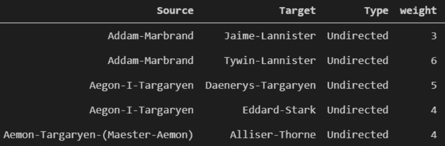
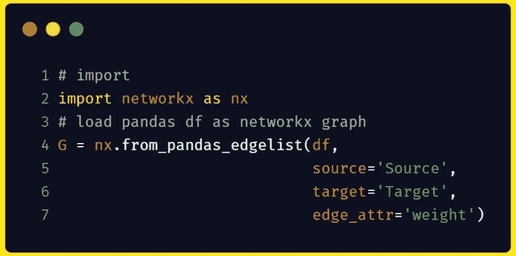
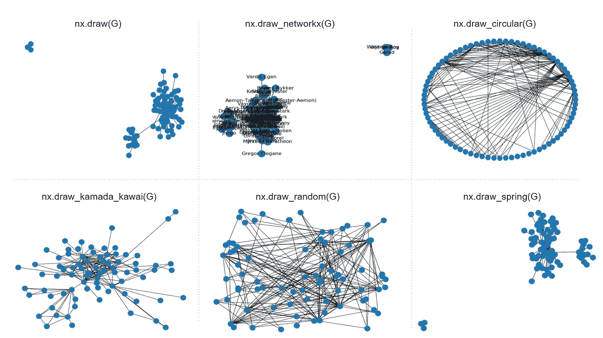
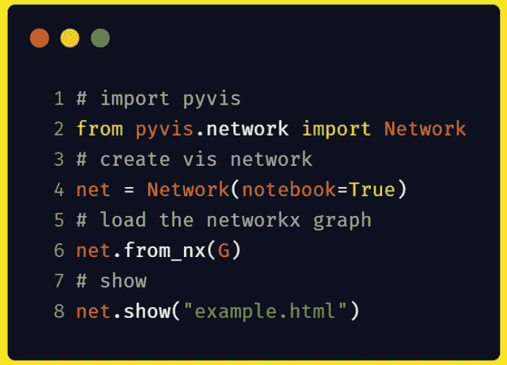
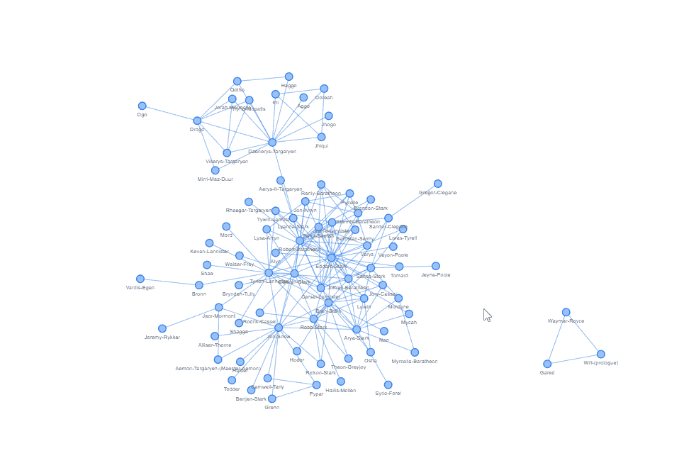
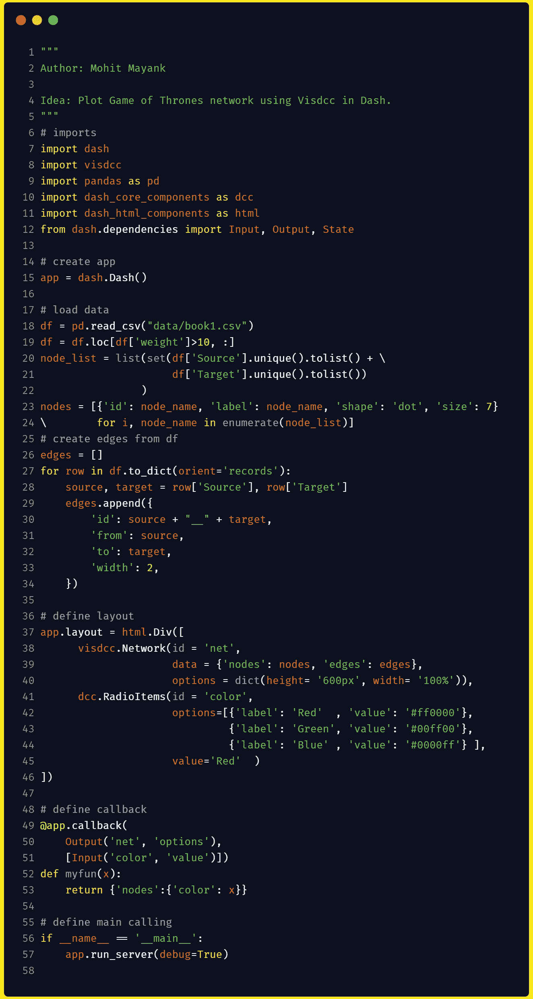
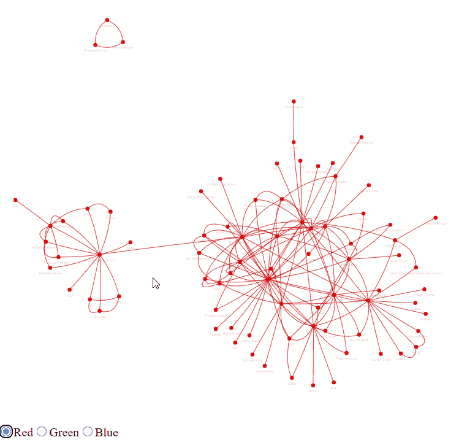

# 用 Python 可视化网络

> 原文：<https://towardsdatascience.com/visualizing-networks-in-python-d70f4cbeb259?source=collection_archive---------0----------------------->

## 帮助您“看到”网络的实用工具指南

斯科特·韦伯在 [Unsplash](https://unsplash.com/s/photos/network?utm_source=unsplash&utm_medium=referral&utm_content=creditCopyText) 上拍摄的照片

> *本文中的每一段代码都发布在这个* [*资源库*](https://github.com/imohitmayank/got_network_viz_python) *中。*
> 
> **2021 年 2 月 2 日更新:**我最近发布了 [Jaal](https://github.com/imohitmayank/jaal) ，一个用于网络可视化的 python 包。它可以被认为是下面讨论的列表中的第四个选项。一定要试一下。更多细节，请看[这篇独立的博客](https://mohitmayank.medium.com/introducing-jaal-interacting-with-network-made-easy-124173bb4fa)。Thnx！

# 介绍

网络或图是相互之间有关系的实体的特殊表示。它由两个通用对象的集合组成— (1) node:代表一个实体，以及(2) edge:代表任意两个节点之间的连接。在复杂的网络中，我们也有与每个节点和边相关联的属性或特征。例如，表示为节点的人可能具有年龄、性别、工资等属性。类似地，代表“朋友”联系的两个人之间的边可以具有诸如“自从朋友”、“上次见面”等属性。由于这种复杂的性质，我们有必要直观地展示一个网络，这样它就能展示尽可能多的信息。为此，我们首先需要熟悉不同的可用工具，这就是本文的主题，即浏览帮助我们可视化网络的不同选项。我们开始吧！

# 使用 NetworkX 进行网络分析

在开始可视化之前，让我们先了解一下图形数据是什么样子，以及如何使用 Python 中的 [NetworkX](https://networkx.org/) 将它加载到内存中。下面我们可以看到《权力的游戏》社交网络的表格公式。这里，节点表示 GoT 的字符，两个字符之间的边意味着它们的名称在书中彼此相距 15 个单词的范围内同时出现。

前两列包含节点(这里是 get 字符)，一对源和目标表示两个字符之间的一条边。只看第一本书的数据集，我们有 187 个独特的字符和 684 个连接(行)。此外，权重栏给出了这种联系的重要性，这里是我们在第一本书中看到两个角色的名字在附近的次数(如上所述)。为了使网络易于管理，我们只考虑与`weights>10`保持边的强连接。这会将图形削减到 80 个节点(字符)和 175 条边(连接)。

将熊猫数据帧格式的数据作为一个网络来加载是非常容易的。这可以使用 NetworkX 来完成，如下所示:

就是这样！变量`G`现在是一个 networkx 图，我们可以在其上执行与图相关的操作。现在，完成了先决条件，让我们逐一探索不同的可视化选项。

# 选项 1:网络 x

NetworkX 有自己的[绘图](https://networkx.org/documentation/stable//reference/drawing.html)模块，提供多种绘图选项。下面我们可以在包中找到一些绘制模块的可视化。使用它们中的任何一个都相当容易，因为你需要做的就是调用模块并传递`G`图形变量，剩下的工作由包来完成。

虽然可视化选项内置在默认的 python graph 包中，并且很容易调用，但它非常不直观，仅适用于小型网络。大多数时候，对于大型网络，任何内置的模块调用都没有多大意义。如果您使用较大的网络数据，这使得默认选项不是显而易见的选择。另一个缺点是，它不是交互式的，所以图形是固定的。这是一个主要的缺点，因为还有其他选项可以让你手动交互和处理图表。有了这个提示，让我们进入下一个选项。

# 选项 2: PyVis

PyVis 是一个交互式网络可视化 python 包，以 NetworkX 图作为输入。它还提供了[多种样式选项](https://pyvis.readthedocs.io/en/latest/tutorial.html)来定制节点、边缘甚至整个布局。最棒的是，它可以在移动中使用设置面板来完成，您可以在其中使用各种选项，并以 python 字典的形式导出最终设置。这个字典可以在调用函数时作为 config 传递，从而得到网络的原样图。除此之外，在可视化方面，你有缩放、选择、悬停等基本选项。很酷不是吗！😉

默认情况下，绘制我们的 GoT 网络可以很容易地通过，

这将网络绘制为，

# 选项 3:仪表板中的 Visdcc

以前的选项的一个主要缺点是它们很难与交互式仪表板一起使用，如 [Dash](https://plotly.com/dash/) 。这是因为除了支持手动交互，如选择、缩放等，一个包应该自动调整程序交互，如数据变化、属性变化等。这个特性由 Python 中的 [visjs](https://github.com/visjs/vis-network) 的一个端口 [visdcc](https://github.com/jimmybow/visdcc) 支持。这使得通过回调来修改图形甚至图形的某些选择属性变得相当容易，在 Dash 中，回调可以连接到按钮或单选选项之类的小部件。我们的 GoT 数据集的 Dash 应用程序示例如下所示，

这里，代码像我们以前做的那样绘制了 GoT 网络。除此之外，我们还在图形上添加了一个回调函数，这样在选择一个选项时，我们可以改变整个图形的颜色。请注意，这是一个虚拟示例，所以完整的范围非常大，比如添加搜索选项(查找任意一个字符)、根据权重调整过滤器(从我们的固定值 10 移动)等。带有虚拟示例的 Dash 应用程序如下所示，

# 结论

本文的目的是向读者介绍网络数据以及 Python 中可视化的不同选项。我们的选项列表从内置的 NetworkX 绘图模块开始，该模块可用于可视化小型和不复杂(较少连接)的图形。对于较大的图形，我们可以使用 PyVis，因为它支持自动布局(迫使节点尽可能分开)并提供手动交互(缩放、拖动、选择等)。最后，在极端情况下，我们希望通过分析网络 w.r.t .节点和边属性的变化来进一步处理网络，我们可以使用 visdcc 在 Dash 中绘制网络，并通过回调将功能连接到图形。希望这有所帮助🙂

干杯。

在 [LinkedIn](https://www.linkedin.com/in/imohitmayank/) 上与我联系，在我的[网站](http://mohitmayank.com)上阅读类似文章。