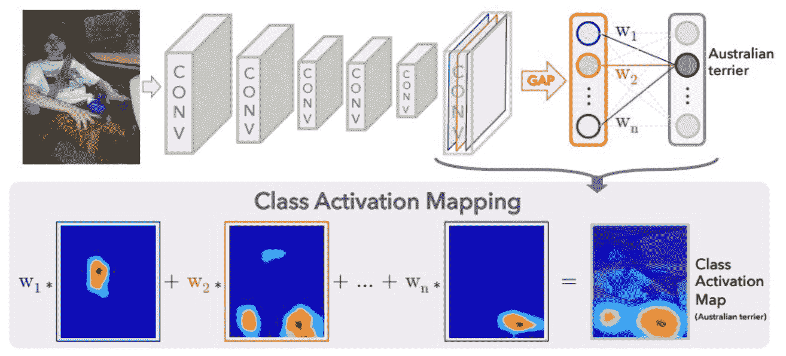
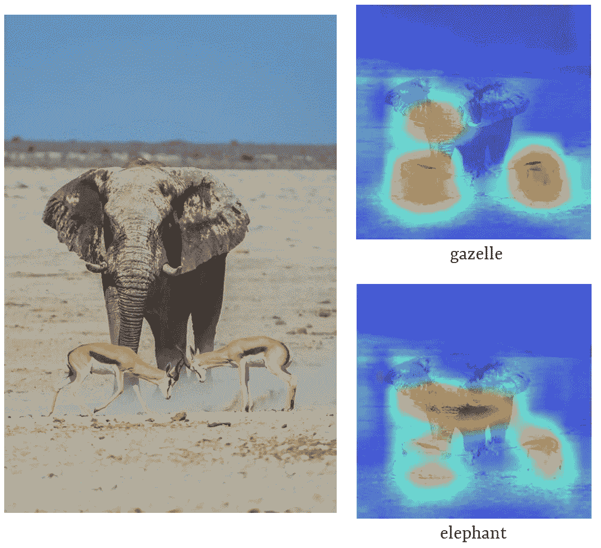

# 可视化神经网络的决策过程第一部分——类激活图(CAMs)

> 原文：<https://towardsdatascience.com/visualizing-neural-networks-decision-making-process-part-1-class-activation-maps-cams-bd1a218fa977?source=collection_archive---------30----------------------->

卷积神经网络(CNN)构成了一类极其强大的机器学习算法。它们在大多数[计算机视觉](https://neurosys.com/services/computer-vision-services/)任务中实现了最先进的性能，例如图像分类、[物体检测](https://neurosys.com/article/objects-counting-by-estimating-a-density-map-with-convolutional-neural-networks/)或[图像生成](https://neurosys.com/article/artificial-data-generation-with-generative-adversarial-networks-gans-part-2-cyclegan/)。

然而，通常我们对 CNN 是如何学习的以及他们使用什么样的特征来进行预测知之甚少，这是由于他们的黑盒性质。而洞察神经网络的决策过程不仅对于创建性能更好的模型至关重要，对于确保模型在应用于现实问题时的公平性和可问责性也至关重要。

*有点老生常谈，但很能说明问题的例子是一辆无人驾驶汽车出了问题，撞到了一名行人。一方面，不理解决策背后的原因，我们就无法识别和解决问题。另一方面，如果不解释算法最初是如何工作的，以及什么使下一个版本更安全，你很难找到愿意使用这样一辆车的人。*

将 CNN 的决策过程可视化正处于研究阶段。目前，有几种技术被提出来增加可解释性和理解神经网络如何做出决定。其中之一是类激活映射(CAMs) [1]，我想在这篇博文中更详细地讨论它。

# 类激活图(CAMs):它们是如何工作的？

摄像头有助于可视化输入图像的哪些区域有助于 CNN 的最终预测。这可以通过生成热图来实现，该热图突出显示输入图像中影响将该图像分配到某个类别的像素。

为了使 CAMs 工作，我们需要使用在最后一个卷积层和最终全连接层之间注入的全局平均池(GAP)层来训练分类网络。间隙图层通过取所有值的平均值将每个要素地图缩减为一个数字。

因此，GAP 图层中的每个结点都对应于一个要素地图。此外，连接间隙图层和最终图层的权重编码了每个地图对预测的贡献(某个特征地图有多重要)。

为了获得某个类别的热图，我们将特征图与相应的权重相乘，并将它们相加。您可以在下图中看到生成凸轮的过程。

生成凸轮的过程。改编自参考文献。[1].

cam 是可视化神经网络决策过程的一个非常强大的工具。但是，它们有一定的局限性:

1)只有当 CNN 包含间隙层时，我们才能应用 CAMs，2)只能为最后一个卷积层生成热图。

为了解决这些问题，提出了梯度加权类激活映射(Grad-CAM) [2]。

# 梯度加权类激活映射(Grad-CAM)

Grad-CAM 是 CAM 的推广，可以应用于任何类型的 CNN。此外，可以生成每一层的热图(不仅仅是最后一层)。

cam 和 Grad-cam 之间的区别在于计算每个特征图的权重的方式。准确地说，对于 Grad-CAM，计算某个类别相对于卷积层的特征图的分数梯度。

接下来，对这些梯度进行全局平均，以获得神经元权重。因此，与 cam 类似，计算的权重对目标类的特征映射的重要性进行编码。

通过将特征图与它们的权重相乘，对它们求和，并将 ReLU 函数应用于结果，我们获得定位图，其中输入图像的重要区域被突出显示。

下面给出了两个类的激活图，即瞪羚和大象。

两个不同类别的激活图(照片由 Unsplash 上的 Hidde Rensink 提供)

摄像头是解释 CNN 决策的绝佳工具。从上面可以看出，它们突出显示了输入图像中与预测相关的像素。这有助于我们了解 CNN 在决策过程中考虑的因素，并创建更强大的模型。

这是这个系列的第一部分。在下一篇文章中，我将重点介绍一种解释神经网络决策的不同技术:分层相关性传播(LRP)。

更多类似的文章请看神经系统博客。

# 参考

[1]周，，等.“学习深层特征用于鉴别性定位”*IEEE 计算机视觉和模式识别会议论文集*。2016.

[2] Selvaraju，Ramprasaath R .等人，“Grad-cam:通过基于梯度的定位从深度网络中进行可视化解释”IEEE 计算机视觉国际会议论文集。2017.