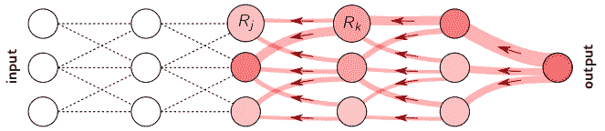

# 可视化神经网络的决策过程第二部分

> 原文：<https://towardsdatascience.com/visualizing-neural-networks-decision-making-process-part-2-layer-wise-relevance-propagation-50cd913cc1c7?source=collection_archive---------35----------------------->

## 逐层相关性传播

解释神经网络(NNs)预测是一个正在进行的研究领域。由于他们的黑箱性质，我们通常对他们如何决策知之甚少。然而，理解神经网络非常重要，特别是在现实世界的应用中，如自动驾驶汽车，其中确保模型的可靠性和鲁棒性至关重要。

在我的[上一篇文章](/visualizing-neural-networks-decision-making-process-part-1-class-activation-maps-cams-bd1a218fa977)中，我描述了一种叫做类激活映射(CAM)的方法，这种方法用于突出显示输入图像中影响该图像分配到某个类的像素。在今天的帖子中，我将介绍另一种方法来找出哪些像素与预测相关，即逐层相关性传播(LRP) [1]。

**LRP 算法**

LRP 算法背后的主要思想在于追溯输入节点对最终预测的贡献。

首先，将最后一层中指定节点的相关性分数设置为其输出。接下来，使用重新分布规则将相关性值传播回输入层。基本的再分配规则(所谓的 LPR-Z)如下所示:

其中 *j* 和 *k* 表示连续层中的神经元，zjk=ajwjk 是神经元 *j* 的激活度乘以神经元 *j* 和神经元 *k* 之间的权重。

传播回相关性值的过程示意性地呈现如下:

LRP 程序的说明。改编自参考文献。[2]

作为 LRP 算法的结果，预测被分解成指示节点对最终决策贡献多少的像素相关。

除此之外，还提出了许多其他更稳健的再分配规则，例如 LRP-ε规则，它在分母中增加了小的正项ε，或者 LRP-γ规则，它有利于正贡献超过负贡献(参见参考文献 1)。[2]了解更多信息)。虽然存在多个版本的重新分布规则，但它们都共享守恒原理，即输出的激活强度在每层都是守恒的，或者换句话说，神经元相关性分数的总和在所有层中都是相同的。

**结果**

下面你可以看到使用[3]中的 5 种不同的重新分配规则为识别为西伯利亚哈士奇的图像生成的关联图，以及在 CAM 技术的帮助下生成的热图，我在我的[上一篇文章](/visualizing-neural-networks-decision-making-process-part-1-class-activation-maps-cams-bd1a218fa977)中更详细地谈到了这一点。

*使用 LRP 算法产生的热图，使用 5 种不同的关联规则(图片由* [*路易莎·萨伊芙莉娜*](https://unsplash.com/@muzaluiza?utm_source=unsplash&utm_medium=referral&utm_content=creditCopyText) *在*[*Unspla*](https://unsplash.com/s/photos/husky?utm_source=unsplash&utm_medium=referral&utm_content=creditCopyText)*sh 上拍摄)。*

*使用类激活映射算法生成的热图。*

正如您在上面的图片中所看到的，热图互不相同，这取决于计算相关性分数时使用的原则和应用的方法(LRP 或 CAM)。然而，在所有的图片中，狗的头部被清楚地突出显示，这表明图像的这一部分与分类结果相关。

LRP 方法成功地应用于解释面部表情识别中的神经网络决策[4]和寻找与文档分类相关的单词[5]。

想要更多类似的文章，请看一下 NeuroSYS 的博客。

**文学**

[1] Bach，Sebastian 等人，“通过逐层相关性传播对非线性分类器决策的逐像素解释”《公共科学图书馆综合杂志》 10.7 (2015)

[2] Montavon，Grégoire 等人，“分层相关性传播:概述”*可解释的 AI:解释、说明和可视化深度学习*。施普林格，查姆，2019。193–209

[3] Alber，Maximilian，等,“研究神经网络”*机器学习研究杂志*20.93(2019):1–8。

[4]阿尔巴布扎达、法尔哈德等人，“通过解构神经网络识别个人面部表情”*德国模式识别会议*。施普林格，查姆，2016

[5] Arras，Leila，等.“在文本文档中什么是相关的？":一种可解释的机器学习方法." *PloS one* 12.8 (2017)。