# 用和弦图可视化纽约自行车共享旅行

> 原文：<https://towardsdatascience.com/visualizing-nyc-bike-share-trips-with-a-chord-diagram-eb4c8e14366?source=collection_archive---------20----------------------->

## 将 Holoviews 弦图与 Citi 自行车旅行数据结合使用

纽约市自行车共享系统 Citi Bike 提供出行数据文件，允许任何人分析该系统的使用情况。弦图提供了一种可视化实体间流动的方式。在这篇文章中，我将展示一旦你有了所需格式的数据，就很容易创建一个交互式的和弦图来帮助理解这些共享自行车是如何使用的。

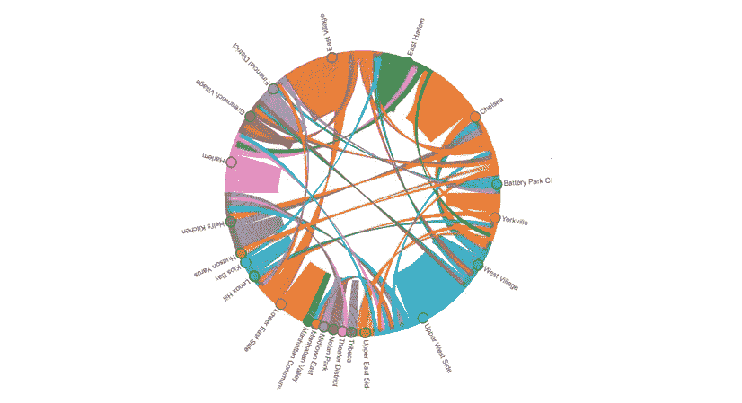

曼哈顿街区自行车旅行——作者图片

上图是使用[全息视图和弦](https://holoviews.org/reference/elements/bokeh/Chord.html)元素创建的。如果您使用的是 Anaconda，您可以使用以下命令安装 Holoviews 库:

```
conda install holoviews
```

对于这篇文章，我还使用了 Jupyter 笔记本，熊猫，Seaborn 和 Pyarrow。参见我之前的文章[探索纽约市自行车共享数据](/exploring-bike-share-data-3e3b2f28760c)，了解如何安装这些库。

本文中使用的所有 Python 代码及其生成的输出可以在 Jupyter 笔记本 [chords.ipynb](https://github.com/ckran/bikeshare/blob/main/chords.ipynb) 中的 GitHub 上找到。

# 下载花旗自行车旅行数据

[花旗自行车系统数据](https://www.citibikenyc.com/system-data)页面描述了所提供的信息，并提供了一个可下载数据的页面链接。在这篇文章中，我使用了 2020 年 9 月的数据。从 Windows 中找到 202009 年的 NYC 文件，下载并解压到一个`bikeshare`目录。在 Linux 上发出以下命令:

```
mkdir bikeshare && cd bikeshare 
wget [https://s3.amazonaws.com/tripdata/202009-citibike-tripdata.csv.zip](https://s3.amazonaws.com/tripdata/202003-citibike-tripdata.csv.zip)
unzip 202009-citibike-tripdata.csv.zip
rm 2020009-citibike-tripdata.csv.zip
```

Citi Bike 是一个传统系统，有固定的站点，用户可以在那里取放共享自行车。行程数据文件中的每条记录都是一个单独的行程，有一个起点和终点站名和 ID。然而，唯一的地理数据包括纬度和经度。

为了理解旅行数据，我创建了一个文件，其中包含了每个车站的区、社区和邮政编码。(在纽约市，区是一个行政单位。虽然有五个，但有花旗自行车站的四个是曼哈顿、布鲁克林、皇后区和布朗克斯区。

你可以从 [202009-stations.parquet](https://github.com/ckran/bikeshare/raw/main/202009-stations.parquet) 下载这个文件。在 Linux 上，发出以下命令:

```
wget [https://github.com/ckran/bikeshare/raw/main/202009-stations.parquet](https://github.com/ckran/bikeshare/raw/main/202009-stations.parquet')
```

要从 Python 中读取拼花文件，请安装 pyarrow。如果您使用的是 conda，您可以安装:

```
conda install -c conda-forge pyarrow
```

该文件是使用 OpenStreetMaps 中的数据创建的。如果你想知道怎么做，请阅读我的文章[用纽约自行车共享数据进行反向地理编码](/reverse-geocoding-with-nyc-bike-share-data-cdef427987f8)。

# 导入库和数据

启动 Jupyter 并在您的`bikeshare`目录中创建一个新笔记本。将每个代码块输入到一个单元格中并运行它。

导入这些库并设置选项，如下所示:

```
import pandas as pd
import seaborn as sns
import matplotlib.pyplot as plt
from holoviews import opts, dim
import holoviews as hvhv.extension('bokeh')
hv.output(size=200)
```

然后读取花旗自行车旅行数据文件。这些文件对每次旅行都有一个记录，并且包括关于乘坐的信息(旅行持续时间、车站名称和地理坐标)和乘坐者的信息(出生年份、性别、用户类型)。如果我想按时间、日期或骑手类型分析行程，我会读取整个文件。然而，对于这个分析，我只需要通过开始和结束位置来计算乘坐次数，所以我需要的只是`start station id`和`end station id`。

```
dfa = pd.read_csv('202009-citibike-tripdata.csv',\
 usecols=['start station id','end station id'])dfa.shape
```

输出显示行数和列数。这个月几乎有 200 万次乘坐！

```
(2488225, 2)
```

然后将电台文件读入数据帧，查看前十行。

```
dfstations=pd.read_parquet('202009-stations.parquet')
dfstations.head(10)
```

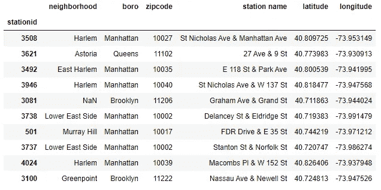

前十个花旗自行车站

然后，我们可以使用 Pandas `merge`函数将 tripdata 表(带有起点和终点站点 ID)连接到 stations 表(在站点 ID 上)。我们将对*执行两次，*一次用于起点站，一次用于终点站。

```
dfa = pd.merge(dfa, dfstations[['boro','neighborhood','zipcode']],\ how = 'left', left_on='start station id', right_on='stationid')
dfa = pd.merge(dfa, dfstations[['boro','neighborhood','zipcode']],\ how = 'left', left_on='end station id', right_on='stationid')dfa.head(10)
```

注意在下面的输出中，为每个属性创建了两列。例如`boro_x`代表起始位置，而`boro_y`代表结束位置。

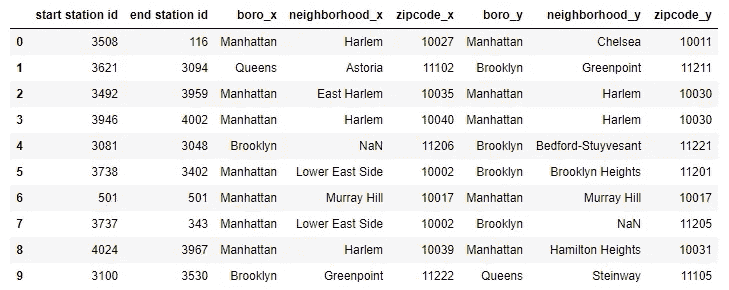

按行程开始和结束行政区和社区

## 格式化数据

现在，我需要将数据转换成 Holoviews 弦图所要求的格式，同时将数据限制为仅在曼哈顿开始和结束的行程。对于这个分析，我使用起始和结束邻域，但是如果我进一步限制数据，我也可以使用邮政编码进行更详细的分析。使用`value_counts()`返回邻域间乘坐次数的排序列表。

```
trips=dfa[['neighborhood_x','neighborhood_y']]\
.loc[((dfa['boro_x']=='Manhattan')&(dfa['boro_y']=='Manhattan'))]\
.value_counts()trips.head()
```

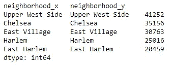

按邻域统计乘车次数

现在我需要格式化一个三列熊猫数据框架中的数据。我将列称为`start`、`end`和`trips`。

```
links=pd.DataFrame.from_records(list(trips.index),\
columns=['start','end']) 
links['trips']=trips.valueslinks.head(10)
```

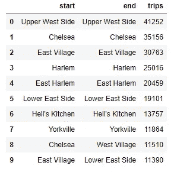

显示游乐设备计数的数据框

在酒吧聊天中可以很容易地看到这些数据。首先，我将创建一个包含`start`和`end`邻居名称的列表`names`，然后绘制`trips`。

```
names = links.start + '/' + links.end
plt.figure(figsize=(12,10))
sns.barplot( x=links.trips[:60], y=names[:60], orient="h") ; ;
```

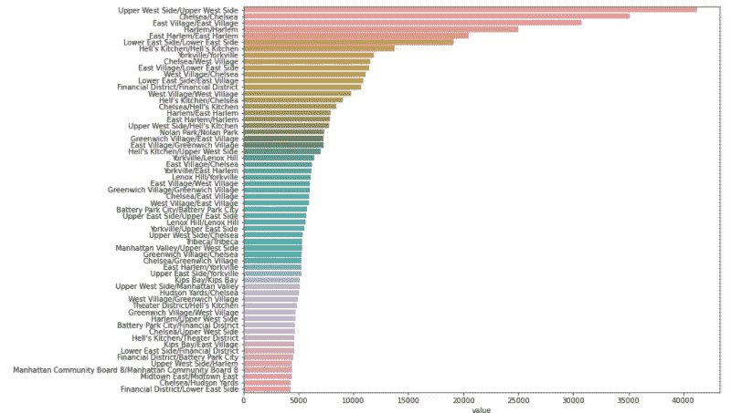

按起始和结束邻域显示乘车次数的条形图-按作者显示图像

我们在这里看到一个经典的“长尾”；我将图表限制在开始/结束对的前 60 个。

我很容易看出，第二受欢迎的旅行是那些以切尔西为起点和终点的旅行。但是以切尔西为起点*或终点*的旅行呢？我必须阅读图表上的标签才能找到它们。如果我只想查看旅行次数，我可以通过旋转数据来查看。

```
pd.pivot_table(links,index='start',values='trips',columns='end')
```

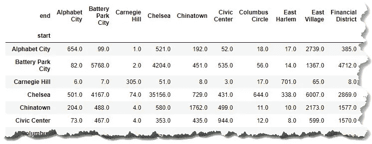

透视数据-按作者分类的图像

但是如果我想看到这些数据的图形化表示呢？

# 查看弦图

这就是和弦图出现的地方。它可以让我轻松地创建一个显示始发站和终点站的图表。

但是如果我尝试使用整张表，我会得到一个无法理解的猫的和弦摇篮，这实在是太多的信息了。

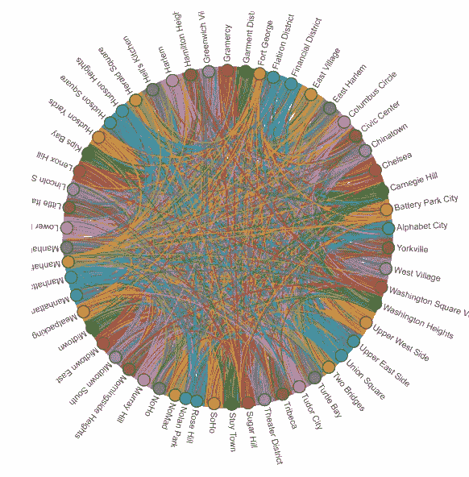

曼哈顿所有街区的弦图-图片由作者提供

所以我要把这张图限制在乘坐次数最多的 60 对。这里的选项设置边和节点的颜色。

```
chord=hv.Chord(links[:60])
chord.opts(node_color='index', edge_color='start',\
label_index='index',cmap='Category10', edge_cmap='Category10' )
```

在这里，我可以清楚地看到最受欢迎的社区之间的花旗自行车使用量。

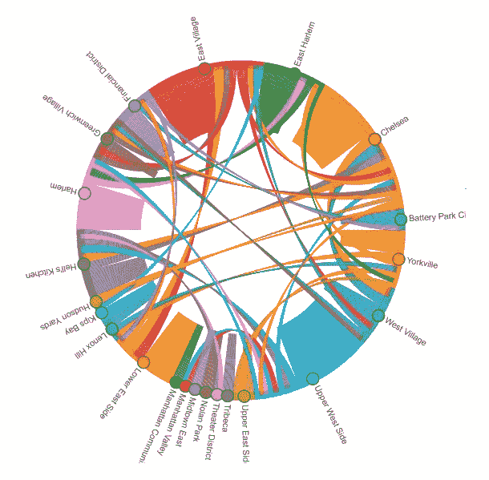

显示邻里之间乘坐情况的弦图-图片由作者提供

在 Jupyter 中，该图会自动启用以供浏览。因此，当我将*悬停在*前往切尔西的节点上时，从那里开始的行程以绿色突出显示，我可以看到它们在圆圈周围的目的地。

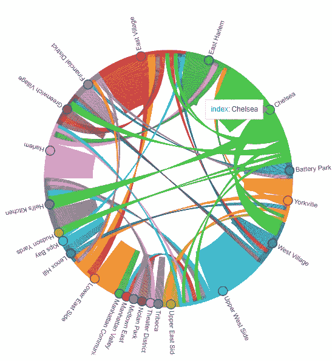

悬停在显示切尔西-作者的图像

如果我在一个节点上点击*按钮，图表的其余部分会变暗，这样我就可以看到在所选位置开始和结束的旅行数量。在这里，我看到大多数从切尔西开始的旅行也在那里结束，而那些不是主要去邻近社区的旅行。*

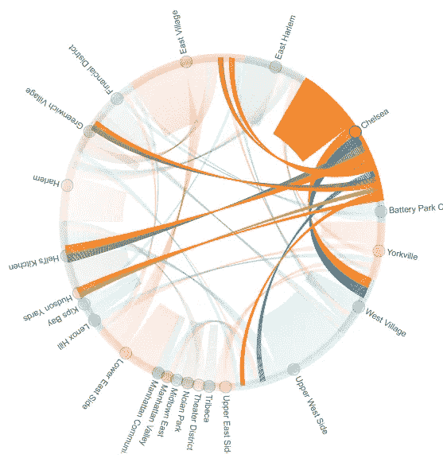

选择切尔西—作者图片

而如果*我不想去切尔西*呢？我只需点击不同的节点。

# 结论

当您在探索包括实体(如自行车共享系统中的停靠站)之间的流的数据时，和弦图是可视化数据的一种很好的方式，并且可以引导您进行进一步的探索。