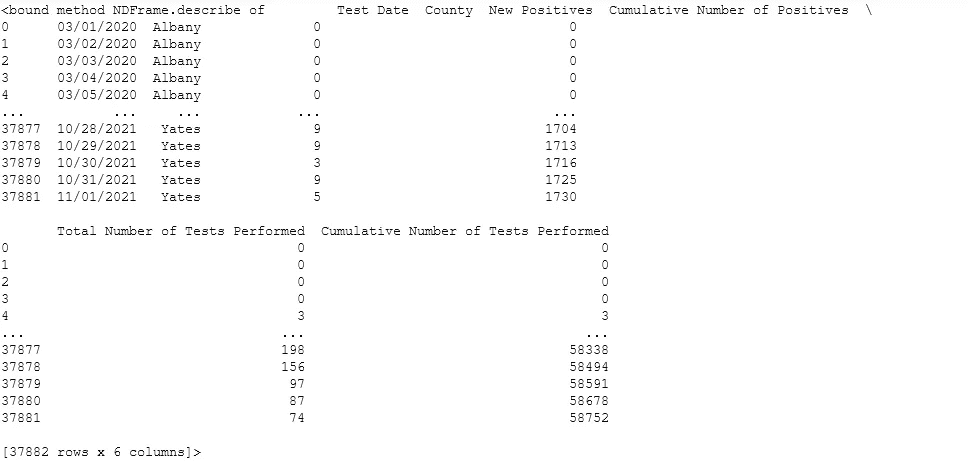
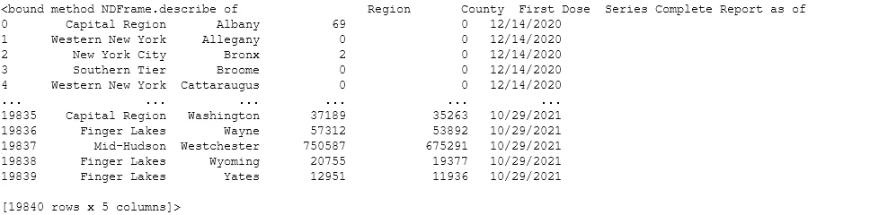
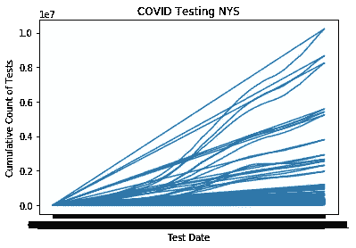
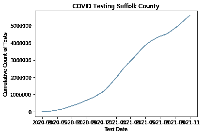

# 可视化 NYS 新冠肺炎数据

> 原文：<https://towardsdatascience.com/visualizing-nys-covid-19-data-ed97f539b921?source=collection_archive---------18----------------------->

## 使用 Python Matplotlib 和 Plotly


在 [Unsplash](https://unsplash.com/s/photos/healthcare-data?utm_source=unsplash&utm_medium=referral&utm_content=creditCopyText) 上由 [Carlos Muza](https://unsplash.com/@kmuza?utm_source=unsplash&utm_medium=referral&utm_content=creditCopyText) 拍摄的照片

作为一名全职数据分析师，我每天花大量时间使用 SQL 来提取工作项目的相关数据。然而，另一方面，我也喜欢通过探索性研究和图形来磨练我的 python 技能。下面这个(简单的)项目着重于使用 plotly 绘制来自 Health.Data.NY.Gov[的纽约州新冠肺炎数据。](https://health.data.ny.gov/)

# 目标

这个项目的目标是从 matplot 库创建一个简单的可视化开始，然后使用 plotly 增强它并在它的基础上构建。

# **数据**

我使用两个数据集进行描述性分析和可视化:

1.  [新冠肺炎测试数据](https://health.data.ny.gov/Health/New-York-State-Statewide-COVID-19-Testing/xdss-u53e)
2.  [新冠肺炎疫苗接种数据](https://health.data.ny.gov/Health/New-York-State-Statewide-COVID-19-Vaccination-Data/duk7-xrni)

这两个数据集都包含 NYS 各县的最新统计数据。

在我导入数据后，我做了一个快速总结来理解结构。首先，我查看了 COVID 测试数据:



测试数据.描述

一个快速描述功能向我展示了基本知识。我的数据框有 37882 行和 6 列。我将关注的列是 County、Test Date 和已执行测试的累积数量。



疫苗数据.描述

对于疫苗数据，快速描述功能也向我展示了基础知识。有 1980 行和 5 列。我将关注的栏目是地区、县、报告日期和首剂。

# Matplotlib 可视化

我的第一个可视化是使用测试数据集的全部数据从 matplotlib 创建的。我使用了下面的代码块(如果您想要一个有意义的可视化，我不推荐使用它)。

```
plt.plot(df['Test Date'],df['Cumulative Number of Tests Performed'])
plt.title('COVID Testing NYS')
plt.xlabel('Test Date')
plt.ylabel('Cumulative Count of Tests')
plt.show()
```



正如你所看到的，这个图表并没有很好地讲述一个故事，主要是因为所有的县数据都是一起绘制的。另外，你看不到考试日期，因为分数太多了。因此，我采取的第一步是清理数据。我将分析重点放在长岛，因此我选择了萨福克县和拿骚县。

首先，我设置日期时间索引，按计数分组，并重新采样:

```
dftest=dfdftest['date']=pd.to_datetime(df['Test Date'])dftest=df.set_index('date')dfcounty1=dftest.groupby(['County']).resample('D').mean().reset_index()
```

接下来，我将萨福克郡的数据与拿骚郡的数据分开:

```
Suffolk=dfcounty1[dfcounty1['County']=='Suffolk']
Nassau=dfcounty1[dfcounty1['County']=='Nassau']
```



这个稍微好一点，但是还是很乱，没有给我想要的所有信息。至此，我认为我的目标无法用 matplotlib 实现，所以我转向了 plotly。

# 基本情节视觉

这个简单的代码块允许我绘制出萨福克郡的数据:

```
fig = px.line(dfcounty2, x = 'date',
y='Cumulative Number of Tests Performed', color='County',
title = 'COVID Tests by County')
fig.show()
```

现在，这更多的是我在寻找的格式，但现在是时候结合我的数据了。下面的代码允许我将拿骚县和萨福克县的测试数据和疫苗数据绘制在一起。

为了分解它，首先我创建了支线剧情来考虑双 y 轴。然后我绘制了萨福克和拿骚的疫苗数据。我为我想要添加的每一行添加了跟踪。然后我格式化了标题并添加了注释。我想强调李身上的第一次 COVID 测试和李身上的第一次 COVID 疫苗的日期，所以我用文本注释添加了这一点。

最后，我用 updatemenus 参数创建了下拉过滤器。

```
fig2 = make_subplots(specs=[[{"secondary_y": True}]])
fig2.add_trace(go.Scatter(x=S['date'], y=S['First Dose'], name = 'Suffolk First Dose of Vaccine',
                         line=dict(color='red', width=1, dash='dash')), secondary_y=True)
fig2.add_trace(go.Scatter(x=N['date'], y=N['First Dose'], name = 'Nassau First Dose of Vaccine',
                         line=dict(color='blue', width=1, dash='dash')), secondary_y=True)fig2.add_trace(go.Scatter(x=Suffolk['date'], y=Suffolk['Cumulative Number of Tests Performed'], name = 'Suffolk Tests',
                         line=dict(color='red', width=1, dash='solid')), secondary_y=False)
fig2.add_trace(go.Scatter(x=Nassau['date'], y=Nassau['Cumulative Number of Tests Performed'], name = 'Nassau Tests',
                         line=dict(color='blue', width=1, dash='solid')),secondary_y=False)
fig2.update_layout(title_text='COVID Test and Vaccines LI', title_x=0.4,
                 xaxis_title='Date')
fig2.update_yaxes(title_text="COVID Tests", secondary_y=False)
fig2.update_yaxes(title_text="First Dose of Vaccine (Count)", secondary_y=True)fig2.add_annotation(x='2020-03-05', y=100,
                    xref="x",
        yref="y",
        text="First Test: 3/5/20",
        showarrow=True,
        font=dict(
            family="Courier New, monospace",
            size=10,
            color="black"
            ),
        align="center",

        ax=20,
        ay=-30,
        bordercolor="black",
        borderwidth=1,
        borderpad=2,
        bgcolor="#ffffff",
        opacity=1
        )
fig2.add_annotation(x='2020-12-14', y=20,
                    xref="x",
        yref="y",
        text="First Vaccine: 12/14/20",
        showarrow=True,
        font=dict(
            family="Courier New, monospace",
            size=10,
            color="black"
            ),
        align="center",

        ax=20,
        ay=-30,
        bordercolor="black",
        borderwidth=1,
        borderpad=2,
        bgcolor="#ffffff",
        opacity=1
        )fig2.update_layout(

    updatemenus=[
        dict(active=0,
            buttons=list([
            dict(label="All",
                 method="update",
                 args=[{"visible":[True,True,True, True]},
                       {"title":"ALL"}]),
            dict(label="Suffolk",
                 method="update",
                 args=[{"visible":[True, False, True, False]},
                       {"title":"Suffolk"}]),
            dict(label="Nassau",
                 method="update",
                 args=[{"visible":[False,True,False, True]},
                       {"title":"Nassau"}]),
            dict(label="First Dose",
                 method="update",
                 args=[{"visible":[True, True, False,False]},
                       {"title":"First Dose"}]),

            dict(label="Total Tests",
                 method="update",
                 args=[{"visible":[False,False, True, True]},
                       {"title":"Total Tests"}])

        ]),
        )
    ]
)fig2.show()
```

# 调查的结果

总的来说，我发现拿骚县和萨福克县在 COVID 测试和疫苗方面遵循非常相似的趋势。然而，还是有一些不同之处:

1.  第一次检测是在拿骚县，结果呈阳性。因此，我不能准确地绘制疫情开始时的阳性率，因为纳索在测试的第一天显示为 100%阳性，这是有道理的，因为人们没有被测试，除非他们相当确定他们是阳性的。
2.  尽管在萨福克县进行了更多的测试，拿骚县还是更快地获得了第一剂疫苗。这也是有道理的，因为萨福克县(一般来说)更保守/共和党，拿骚县(一般来说)更自由，因为它更接近纽约市。

感谢您花时间阅读这篇文章。我知道这是相当基本的，但我希望这是对那些想使用 plotly 来可视化数据的人的一个很好的介绍。

请随时留下与调查结果或视觉效果相关的评论，我一定会用新数据更新它们。

互动公开图此处:[https://chart-studio.plotly.com/~meagvo/2/#/](https://chart-studio.plotly.com/~meagvo/2/#/)

github 上有完整的笔记本:[https://github . com/meag VO/towards data science/blob/main/health project . ipynb](https://github.com/meagvo/TowardsDataScience/blob/main/HealthProject.ipynb)