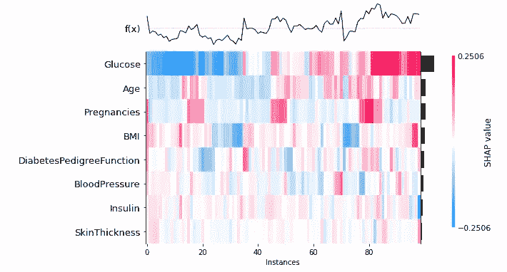

# 机器学习模型的可视化输出

> 原文：<https://towardsdatascience.com/visualizing-output-of-machine-learning-model-9a87136ccdbf?source=collection_archive---------29----------------------->

## 使用 Shap 进行机器学习可视化


由 [Unsplash](https://unsplash.com?utm_source=medium&utm_medium=referral) 上的 [Pietro Jeng](https://unsplash.com/@pietrozj?utm_source=medium&utm_medium=referral) 拍摄

解释一个机器学习模型是一项艰巨的任务，因为我们并不真正知道这个模型在那个黑匣子里是如何工作的。需要进行解释，以便我们能够为我们的数据选择最佳模型，并使其稳健。

Shap 是一个用于解释模型的开源 python 库。它可以创建多种类型的可视化，帮助解释模型和解释模型是如何工作的。

在本文中，我们将看到不同类型的机器学习模型可视化，可以使用 Shap 创建。

让我们开始吧…

# 安装所需的库

我们将从使用 pip 安装 Shap 开始。下面给出的命令可以做到这一点。

```
pip install shap
```

# 导入所需的库

在这一步中，我们将导入加载数据、创建模型以及创建该模型的可视化所需的库。

```
import pandas as pd
import numpy as np
import matplotlib.pyplot as plt
import shap
from sklearn.model_selection import train_test_split
import xgboost as xgb
```

# 创建模型

在这一步，我们将创建机器学习模型。对于本文，我将创建一个 XGBoost 模型，但是您可以选择自己喜欢的任何模型。我们将在这个模型中使用的数据集是著名的糖尿病数据集，可以从 Kaggle 下载。

```
df = pd.read_csv('/content/Diabetes.csv')
features = ['Pregnancies', 'Glucose','BloodPressure','SkinThickness','Insulin','BMI','DiabetesPedigreeFunction','Age']
Y = df['Outcome']
X =  df[features]
X_train, X_test, Y_train, Y_test = train_test_split(X, Y, test_size = 0.2, random_state = 1234)
xgb_model = xgb.XGBRegressor(random_state=42)
xgb_model.fit(X_train, Y_train)
```


模型(来源:作者)

# 创建可视化

现在，我们将为 shap 创建解释器，找出模型的形状值，并使用它们创建可视化效果。

```
explainer = shap.Explainer(xgb_model)
shap_values = explainer(X_test)
```

1.  **酒吧剧情**

```
shap.plots.bar(shap_values, max_display=10)
```


条形图形状值(来源:作者)

2.**组群图**

```
shap.plots.bar(shap_values.cohorts(2).abs.mean(0))
```


群组图(来源:作者)

3.**热图**

```
shap.plots.heatmap(shap_values[1:100])
```



热图(来源:作者)

4.**瀑布图**

```
shap.plots.waterfall(shap_values[0]) # For the first observation
```


瀑布 P{lot(来源:作者)

5.**力图**

对于这个情节，我们还需要初始化“js”。

```
shap.initjs()
explainer = shap.TreeExplainer(xgb_model)
shap_values = explainer.shap_values(X_test)
def p(j):
    return(shap.force_plot(explainer.expected_value, shap_values[j,:], X_test.iloc[j,:]))
p(0)
```


力情节(来源:作者)

6.**决定情节**

```
shap_values = explainer.shap_values(X_test)[1]
print("The expected value is ", expected_value)
print("The final prediction is ", xgb_model.predict(X_test)[1])
shap.decision_plot(expected_value, shap_values, X_test)
```


决定情节(来源:作者)

这就是如何使用 Shap 来创建与机器学习模型相关的可视化并分析它们。继续尝试不同的数据集和机器学习模型，并让我知道你在回复部分的评论。

本文是与[皮尤什·英格尔](https://medium.com/u/40808d551f5a?source=post_page-----9a87136ccdbf--------------------------------)合作完成的。

# 在你走之前

***感谢*** *的阅读！如果你想与我取得联系，请随时通过 hmix13@gmail.com 联系我或我的* [***LinkedIn 个人资料***](http://www.linkedin.com/in/himanshusharmads) *。可以查看我的*[***Github***](https://github.com/hmix13)**简介针对不同的数据科学项目和包教程。还有，随意探索* [***我的简介***](https://medium.com/@hmix13) *，阅读我写过的与数据科学相关的不同文章。**