# 可视化量子计算

> 原文：<https://towardsdatascience.com/visualizing-quantum-computation-7f2c911b0a63?source=collection_archive---------9----------------------->

## 从零开始了解黑客是怎么回事！

*照片由* [*动脉*](https://unsplash.com/@arteum?utm_source=medium&utm_medium=referral) *上* [*下*](https://unsplash.com?utm_source=medium&utm_medium=referral)

你好。我是比萨大学的博士生，研究课题是量子计算！

# 我第一次尝试量子计算

我必须诚实地说，量子计算的第一步非常艰难，特别是对于那些拥有计算机科学学位的人来说(*就像我一样:)*。基于你经典的计算机科学家经验，有一点你可以坚持。

量子计算中的一个问题肯定是一个 ***可视化问题*** 。

> 你能理解下面的量子电路是做什么的吗？

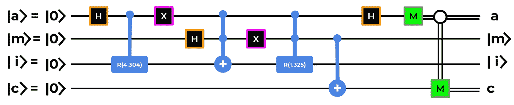

图一。这个量子电路是什么？[图片由作者提供]

> 如果你是初学者，可能没有。我也有同样的问题！

**我确实相信，这种在量子电路中表示量子算法代码的方式，遗漏了“一个维度”。这种表现欺骗了我。它隐含地强迫我在 2D 维度中推理，而现实是在 3D 中，所以我不能正确地可视化它。**

[Gif via Giphy](https://i.embed.ly/1/image?url=https%3A%2F%2Fmedia4.giphy.com%2Fmedia%2FLgtiQ2yVbjq63sbxv1%2Fgiphy.gif&key=a19fcc184b9711e1b4764040d3dc5c07)

## ***缺少*** *尺寸:****叠加的尺寸*** 。

量子计算的强大之处在于，一个物体同时是“*蓝色和红色*”、“*真与假*”、“ *0 和 1*”……不幸的是，量子电路并不适合代表这个 ***“缺失维度*** ，让人很难理解到底发生了什么。

> **不过不用担心！在这篇文章中，我将向你展示我的量子计算方法。我会尽我所能让你看到引擎盖下的量子现象！**

为此，我将借用由 *Schuld、Fingerhuth 和 Petruccione* 在**【1】**中提出的“*基于量子距离的分类器*”。

> 在本文的最后，你会发现我的 Github 库实现了这个基于量子距离的分类器。

## ⚠️免责声明⚠️

*为了避免这篇文章没有重点且太长，我假设你已经熟悉了以下概念:*

*   *什么是量子位，以及它在数学上是如何描述的。*
*   *哈达玛、受控非、托弗利和受控旋转门是如何工作的。*
*   *什么是量子电路。*
*   *什么是测量。*

> 你准备好了吗？

[Gif via Giphy](https://i.embed.ly/1/image?url=https%3A%2F%2Fmedia2.giphy.com%2Fmedia%2F0DYipdNqJ5n4GYATKL%2Fgiphy.gif&key=a19fcc184b9711e1b4764040d3dc5c07)

# 量子电路计算什么？

下面的电路已经在图 1 中示出，是*基于量子距离的分类器*。

> 为了防止不一致，我必须注意到在[1]中，电路是通过叠加|a >和|m >开始的。在图 2 中，为了便于说明，我决定推迟在|m >上应用 H。然而，这种差异不会以任何方式影响计算。

图二。基于量子距离的分类器[图片来自作者]

> 电路计算什么？

***我们来超简单的说一下，给定:***

*   属于 2 个不同类别的 2 个训练向量
*   1 个测试向量(*未知类别*)
*   电路将最接近的训练向量*(即，使与测试向量的欧几里德距离最小的训练向量)*的类别分配给测试向量

***只是为了固定点*** :让我们给每个训练向量分配一个颜色( *=class* ):

*   training_0 =蓝色
*   培训 _1 =红色

> A 根据 ***基于距离的分类器*** 和图 3 中的例子，*测试向量的颜色(=* 类*)会是什么？*
> 
> S 由于 training_1 向量是最接近测试向量的向量，所以测试向量颜色为红色！

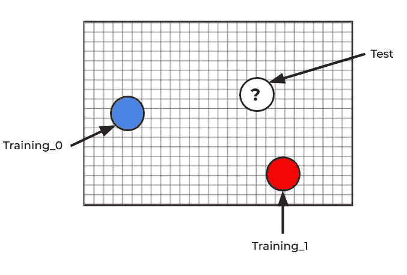

图 3。基于距离的分类[图片由作者提供]

希望问题陈述清楚:)

## 走向量子:让我们打破量子电路！

电路通常分为三个宏阶段*(图 4* ):

*   **量子编码**:将经典数据编码成量子数据。
*   **计算**:计算解。
*   **测量**:将量子表示解解码成经典数据。

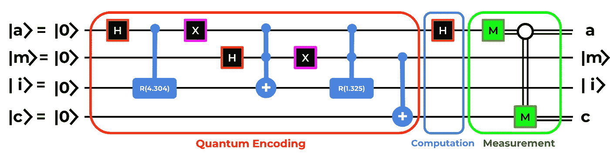

图 4。这三个阶段[图片由作者提供]

因为我们在寻找叠加态的维度，而且从这个角度来看，量子编码阶段是最有趣的，所以我将把重点放在这一个上。

# 量子编码阶段

我们处于非常低的抽象层次，*没有内置的数据结构*。我们的责任是将数据映射到“*存储器*中，这是电路在此阶段的工作。

> ⚠️ **ACHTUNG** :量子计算机中没有**内存**。他们只是处理器。然而，“记忆”这个词唤起了我们在电路中做什么的良好直觉(即，给量子位的特定组合分配特定的编码值)。

**特别是在这个阶段，我们需要:**

1.  选择一个编码器。
2.  将编码数据映射到“内存”中。

在我们观察的基于量子距离的分类器中，选择的编码器是**振幅编码**。*来了解一下吧！*

## 振幅编码

这是一种有趣的编码类型，可以对振幅中的连续值进行编码。

> 嗷？

我记得你是如何定义量子位的:

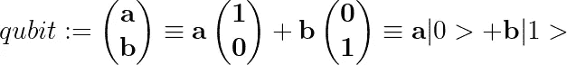

量子位定义[图片由作者提供]

因为幅度的绝对平方等于概率，所以可以得出:

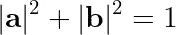

[图片由作者提供]

你注意到了吗？这个条件看起来像…圆周方程！

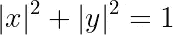

[图片由作者提供]

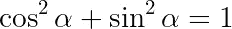

[图片由作者提供]

> 那又怎样？

你也可以如下定义一个量子位:

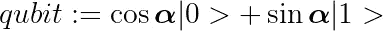

[图片由作者提供]

给定某个 ***角度* α** ，可以在一个圆周内映射一个量子位！

## 让我们把它们放在一起。

给定标准化和规范化数据集的条目 *[0.789，0.615】***，我们必须找到一个 ***角度* α** 使得:**

**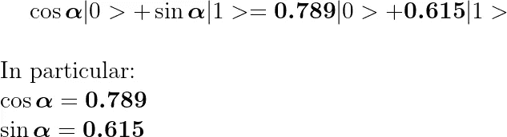**

**[图片由作者提供]**

**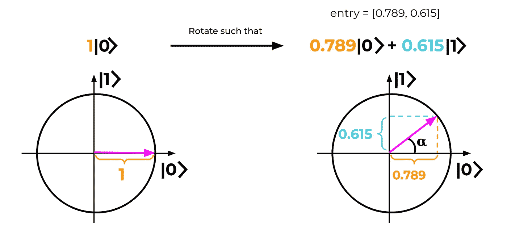**

**[图片由作者提供]**

> **如何才能算出这个**角度** **α** 进行正确的旋转？**

**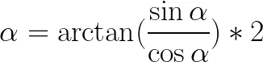**

**现在我们必须将这个 ***角度* α** 插入我们的受控旋转门，它将如前所述旋转量子位！**

> ***敏锐的读者会注意到，****arctan(sin*α*/*cosα)****被乘以了一个因子* ***2*** *。“*为什么*”已经超出了本文的范围，但是，它涉及了一个事实，即一个量子位自然地绘制在一个球面上(* [布洛赫球面](https://en.wikipedia.org/wiki/Bloch_sphere) *)，而不是圆周上。无论如何，在我看来，通过圆周比通过布洛赫球更容易理解振幅编码的思想:****

> ***那就是幅度编码:)***

## ***回到赛道上***

***回到*图 5* 中的电路，我们将对以下向量进行*振幅编码*:***

*   ***2 个训练向量(*训练 _0，训练 _1* )***
*   ***1 个测试向量。***

***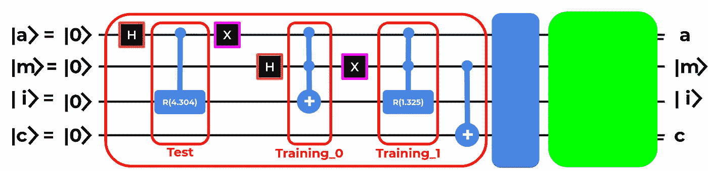***

***图 5。量子编码阶段[图片由作者提供]***

> ***为简单起见，我们将使用[1]中使用的相同条目。***

***这些值属于*虹膜数据集*；它们已经标准化和规范化了。如果你想重现这个实验，每一个条目都标注了样本号(*希望有所帮助:)*)。***

*   *****测试:** [-0.549，0.836】**→α=**反正切 2(0.836，-0.549)*2 **= 4.304** (虹膜样本 28)***
*   *****Training _ 0:**【0，1】**→**通过一个托夫里门旋转到|1 >即可。(虹膜样本 33)***
*   *****Training _ 1:**【0.789，0.615】→**α=**arctan 2(0.615，0.789)*2 **= 1.325** (虹膜样本 85)***

***给定前面的 alphas，我们可以绘制圆周上的 3 个向量(数据)(图 6 )。***

***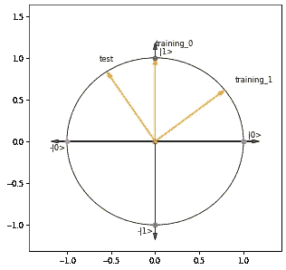***

***图 6。圆周上绘制的数据[图片由作者提供]***

# ***缺失的维度:叠加***

***这是我想强调更多的部分，因为你将能够理解绿色突出显示的门做什么(*图 7* )，从而 ***可视化缺失的维度*** 。***

***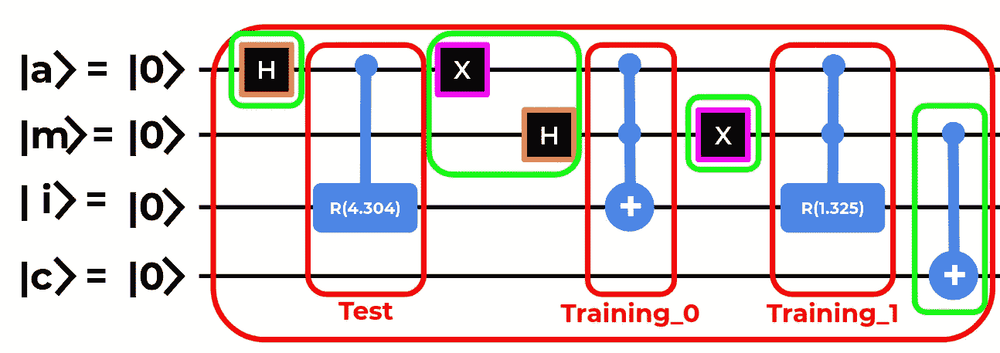***

***图 7。量子编码阶段[图片由作者提供]***

> *****你可能想知道的一个问题是:*****
> 
> ***如何将 3 个不同的向量加载到电路的同一个量子位上？***

*****为了回答这个问题，从而找到我们的“缺失维度”，我们来逐门分析一下量子编码相位。*****

***[Gif via Giphy](https://i.embed.ly/1/image?url=https%3A%2F%2Fmedia1.giphy.com%2Fmedia%2FvnOQdGt1ILQEo%2Fgiphy.gif&key=a19fcc184b9711e1b4764040d3dc5c07)***

# ***逐门量子电路***

## ***HADAMARD on |a >***

***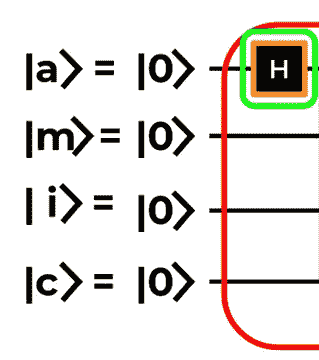***

***图 8。电路步骤 1[图片由作者提供]***

***第一个哈达玛门 ***将*** 的运算 ***分成两个分支*** ，可以用一棵树来表示(*图 9* )。***

***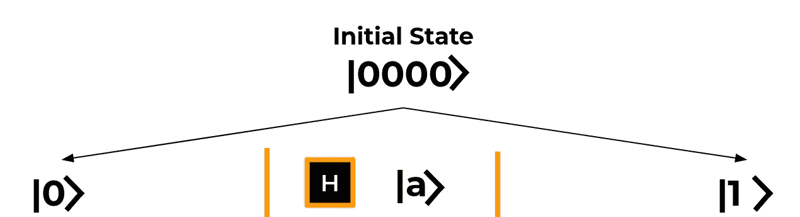***

***图 9。树步骤 1[图片由作者提供]***

> ***H 如何解读这棵树？很简单！***

******在树的中间我们标明:******

*   ***应用**门**(此处为哈达玛门)***
*   ***受门影响的**量子位*****

****这两个分支表明量子位(|a >)如何受到门(H)* 的影响。在这里，量子位已经被置于相等的叠加态。***

> ***我知道…我知道…在树上没有振幅，但这对我们的视觉实验并不重要。重要的是不要让画面“超载”。***

*****第一个带走的信息**是，到目前为止，两个分支同时存在**并从一个**独立发展到另一个**！*****

## *******在|i >上传测试向量** [-0.549，0.836】*****

*****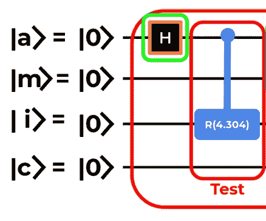*****

*****图 10。电路步骤 2[图片由作者提供]*****

*****正如我们已经指出的，这种旋转通过振幅编码将经典数据映射成量子表示。*****

******映射的条目是测试向量:[-0.549，0.836] → alpha = 4.304******

*****我们可以观察到，由于它是一个控制量子位为|a >的受控旋转(*图 11* )，算符只影响|a >为|1 >的右分支。*****

*****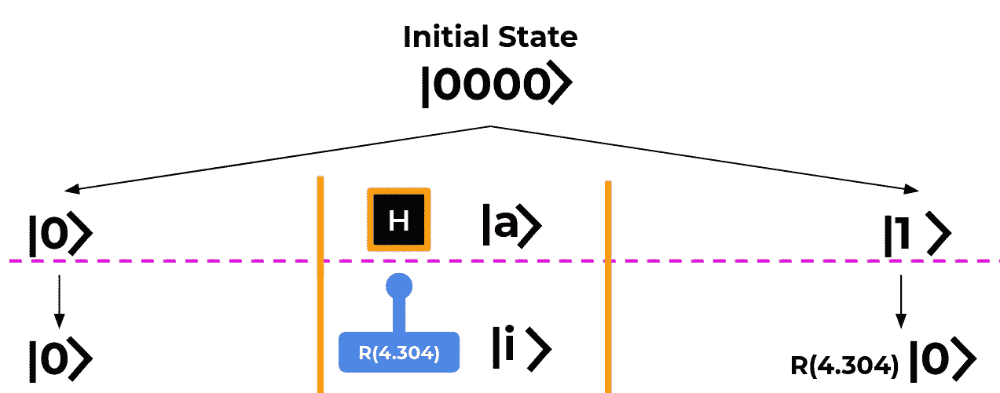*****

*****图 11。树步骤 2[图片由作者提供]*****

> *******注意**:语法“R(4.304)|0 >”是一种简洁的方式来表达|0 >已经被受控旋转所旋转。*****

## *******泡利 X 门**开|a >*****

**********

*****图 12。电路步骤 3[图片由作者提供]*****

> *****|a >上这个 X-gate 的用途是什么？*****

*****这里的重点是，你不要“ ***覆盖*** ”刚刚上传到右边分支的测试向量(***)R(4.303)| 0>***)。因此，我们必须将下一个计算移到左分支，而不改变右分支。*****

*****为了保持右分支不变，由于 *Training_0* 和 *Training_1* 是*的双重控制，并且由于 ***的第一个控制量子位是|a >*** 和 ***，X 门刚刚翻转|a >到|0 >*** ，那么，到现在，*的任何双重控制旋转*******

******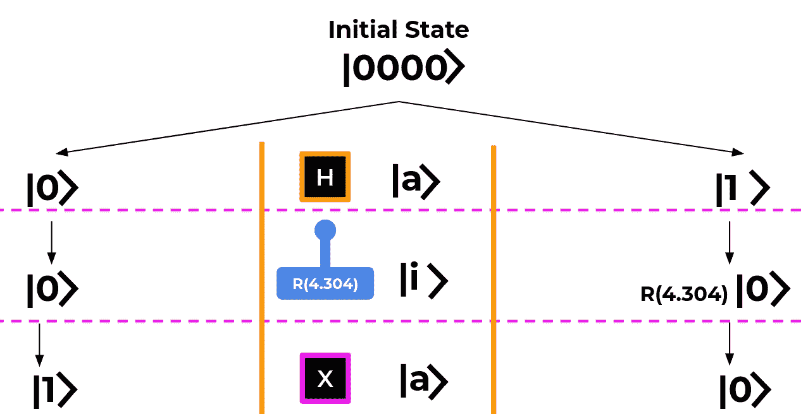******

******图 13。树步骤 3[图片由作者提供]******

*********这种模式避免了测试向量的覆盖！*********

## ******HADAMARD on |m >******

******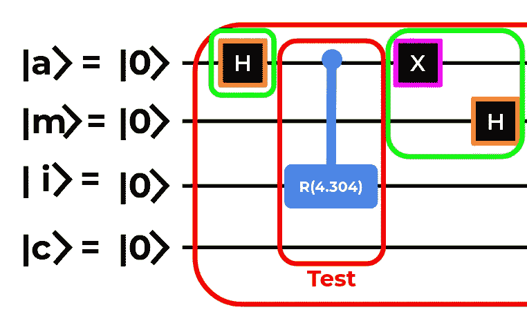******

******图 14。电路步骤 4[图片由作者提供]******

******同样，我们通过应用 Hadamard 来分割计算。这次受哈达玛影响的量子位是|m >。******

******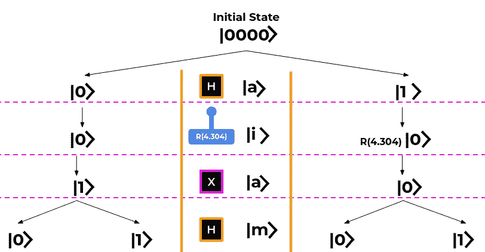******

******图 15。树步骤 4[图片由作者提供]******

******到目前为止，我们有四个分支同时存在**和**并且从一个到另一个独立发展**！(*图 15* )********

## ******正在上传|i >上的 TRAINING_0 [0，1]******

******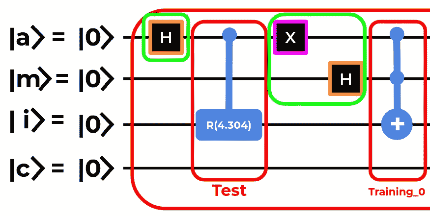******

******图 16。电路步骤 5[图片由作者提供]******

******Toffoli 门只影响左边第二个分支。此外，正如我们在图 17 中看到的，右分支中|i >的值没有受到影响，事实上，它仍然包含正确编码的测试向量(R(4.304)|0 >)。******

******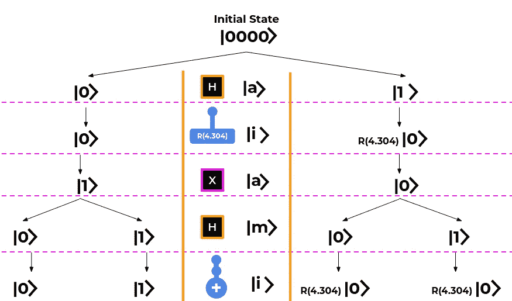******

******图 17。树步骤 5[图片由作者提供]******

> ********问题**:为什么？******
> 
> ********答**:因为 Toffoli 是双控的，而且由于右边分支的|a >是|0 >，那么 Toffoli 不适用。此外，Toffoli 也不影响第一个分支，因为即使|a >是|1 >，第二个控制量子位|m >也是|0 >******

## ******泡利 X 门开启|m >******

******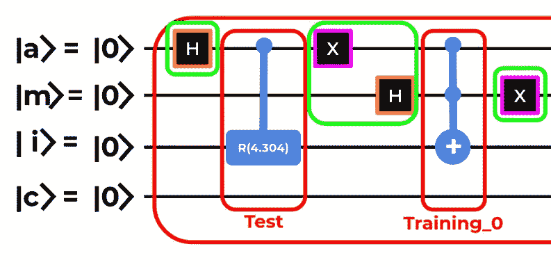******

******图 18。电路步骤 6[图片由作者提供]******

******在|m >上应用 X-gate 遵循我们在第三步中在|a >上应用的相同模式逻辑。 ***由于我们不想覆盖上一步上传的[0，1]*** ***条目*** ，我们翻转|m >，这样在第二个分支中它变成了|0 >，在第一个分支中它是|1 >。这样，只有第一个分支会受到下一个双控操作器的影响(*图 19* )。******

******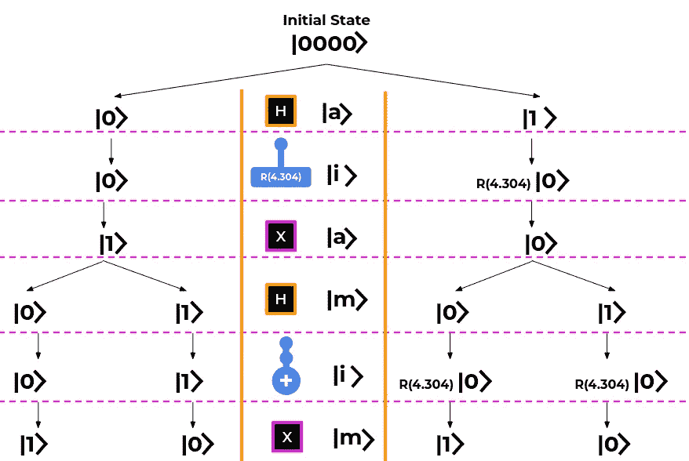******

******图 19。第六步[作者图片]******

## ******在|i >上传训练向量[ **0.789，0.615********

******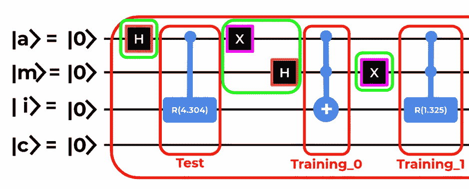******

******图 20。电路步骤 7[图片由作者提供]******

******由于之前讨论的原因，第二、第三、第四分支不受双控旋转的影响，而唯一受影响的分支是第一分支，因为它的控制量子位都|1 >在这个特定的子分支中(*图 21* )。******

************

******图 21。树步骤 7[图片由作者提供]******

## ********将类别映射到每个训练向量********

************

******图 22。电路步骤 8[图片由作者提供]******

*******到目前为止，我们没有明确地将类别映射到每个训练向量。我们开始吧！*******

******具体来说，我们按如下方式分配类别:******

*   ******Training_0 属于类 0******
*   ******Training _1 属于类别 1******

*******对训练向量的类别进行编码的量子位是|c >*******

******在 Training_0 的情况下，我们不需要对|c >应用任何门，因为在那个分支(**第二个**)中，|c >已经被设置为|0 >。******

******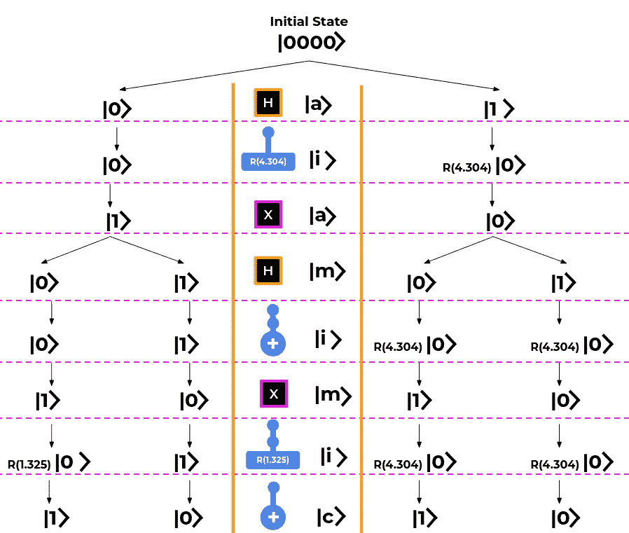******

******图 23。第八步树[作者图片]******

******关于 Training_1 的情况是不同的。加载 Training_1 的分支是**第一个**。由于我们只想翻转到这个分支的|1 >类量子位|c >，我们应该应用一个 Toffoli 门，它的控制量子位是|a >和|m >，它的目标量子位是|c >。那是可行的，因为在这个分支中，|a > = |1 >和|m > = |1 >。******

******但是你可能注意到了，在*量子编码阶段*的最后一步，有一个 CNOT 门(*图 23* )而不是一个托夫里门！ ***那么为什么呢？*********

******由于 CNOT 具有作为控制量子位|m >和作为目标量子位|c >，这意味着 CNOT 将影响所有分支，其中|m> = |1 >(即 CNOT 将影响第一分支和第三分支)。最终的量子位设置如图 24 所示。******

******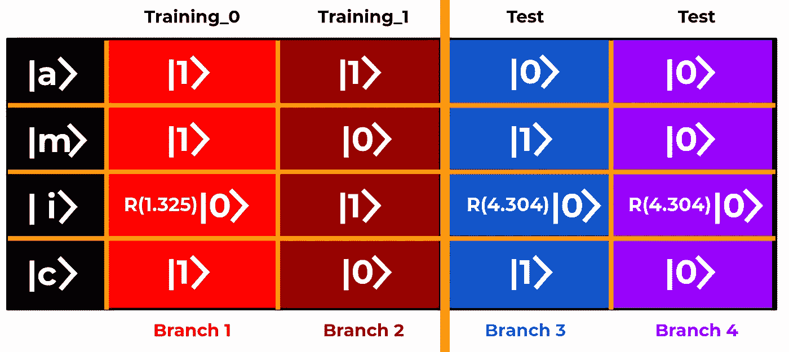******

******图 24。最终量子位设置[图片由作者提供]******

******为了直观地了解为什么电路采用 CNOT 而不是托夫里，请注意我们有相同测试向量的两个副本(分支 3 和分支 4)。不同之处在于，一个副本被分配给类|1 >(分支 3)，而另一个被分配给类|0 >(分支 4)。******

## ******“记忆”******

******但是等等！你还记得之前我用了一个不恰当的术语“记忆”吗？******

> ******查看图 24 每一列中量子位|a >和|m >的组合。******

******从某种意义上来说，|a >和|m >充当索引，在那里你存储一个特定的向量，它的值用量子位|i >编码，它的类用量子位|c >编码******

********特指*:*特指********

*   ********|00 >:分支 4 →分配给类|0 >** 的测试向量******
*   ********|01 >:分支 3 →分配给类|1 >** 的测试向量******
*   ********|10 >:分支 2 →训练 _1 向量分配给类|0 >********
*   ********|11 >:分支 1→训练 _0 向量分配给类|1 >********

******[Gif via Giphy](https://i.embed.ly/1/image?url=https%3A%2F%2Fi.giphy.com%2Fmedia%2F4cUCFvwICarHq%2Fgiphy.gif&key=a19fcc184b9711e1b4764040d3dc5c07)******

******现在我们可以回到为什么有两个测试向量副本的原因:)******

# ******量子计算——H 门******

******根据这种设置，您可以“碰撞”(=interfere) *分支 3* 上的*分支 1* 和*分支 4* 上的*分支 2* 。换句话说，我们能够**一次比较**相同的测试向量(用不同的类别标记)和两个不同的训练向量。******

******为了使它们“冲突”，电路在|a > ( *图 25* )上应用**计算阶段**的哈达玛。******

******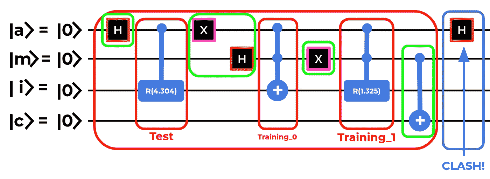******

******图 25。电路步骤 9[图片由作者提供]******

******通过应用 Hadamard 门，直观地了解在**计算阶段**发生了什么，如下所示(*图 26* )。******

******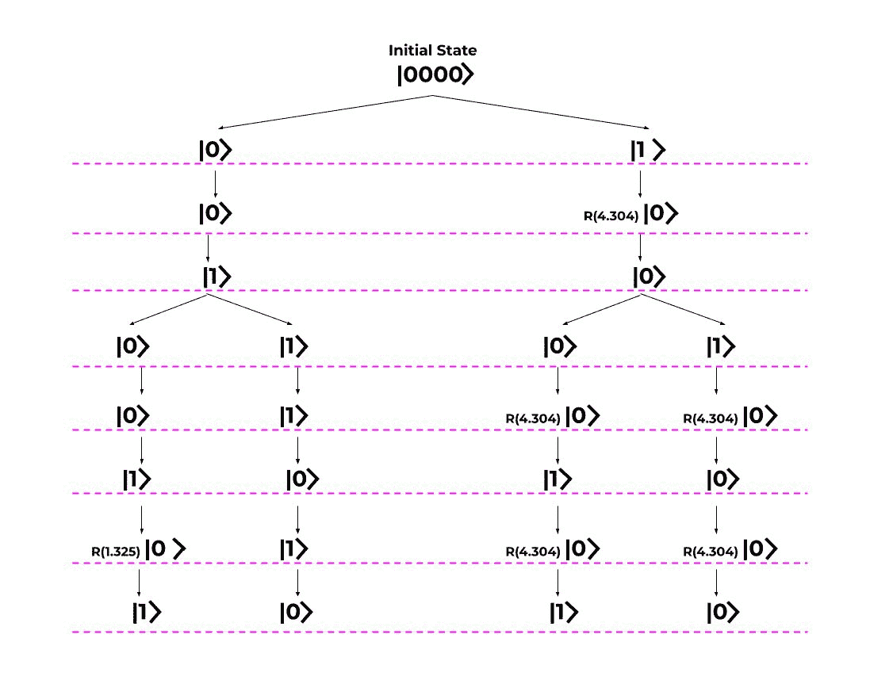******

******图 26。计算阶段的哈达玛效应[作者 Gif******

******本质上，由于 Hadamard 门，电路计算两个训练向量和测试向量之间的距离，这是本电路的目的。在“冲突”之后，电路测量结果并输出测试向量所属的类。******

*******测量阶段*超出了本**视觉实验**的范围，但是，您可以在我的 [Github](https://github.com/Brotherhood94/quantum_distance_based_classifier) 上找到基于量子距离的分类器的实现，以及一些手写的 PDF 笔记，其中量子编码阶段在数学上有所发展。******

****** [## brotherhood 94/quantum _ distance _ based _ classifier

### Schuld、Fingerhuth 和 Petruccione 在论文中提出的基于量子距离的分类器的实现…

github.com](https://github.com/Brotherhood94/quantum_distance_based_classifier) 

# 我们终于找到了缺失的维度！

从 CS 的角度来看，我们正处于量子世界的旅程的终点！

对比*电路可视化* ( *图 27* )和*树形可视化* ( *图 28* )，就能明白我对“ ***缺维*** ”的意图了。事实上，*电路可视化*并没有明确显示一个量子位是如何受到一个门在“*分支*”方面的影响。这就是*树可视化*来拯救的地方！树形可视化的分支以图形化的方式代表了叠加和电路“存储”的内容。

图 27。电路可视化[图片由作者提供]

图 28。树可视化[图片由作者提供]

这种树形可视化对于所展示的电路来说效果很好，而对于其他电路来说就不那么有效了。然而，我希望这个可视化帮助你更好地理解“叠加”的概念，至少和它帮助我一样多！

为了清楚起见，我在本文中省略了一些对于寻找“缺失的维度”不重要的细节。但是，如果你需要澄清，只需留下评论:)****** 

## ******🚀你觉得这种视觉表现有用吗？******

******如果有，请随意留下**拍拍**让我们继续在碰上[**LinkedIn**](https://www.linkedin.com/in/aleberti/)**和 [**Twitter**](https://twitter.com/Brotherhood94) ！********

******我会超级感激它！:)******

********见 yaaaaa！** ✌🏼******

******拜拜！[ [Gif by Giphy](https://i.embed.ly/1/image?url=https%3A%2F%2Fmedia4.giphy.com%2Fmedia%2F1jkVi22T6iUrQJUNqk%2Fgiphy.gif&key=a19fcc184b9711e1b4764040d3dc5c07) ]******

# ******参考******

******[[1]舒尔德，米，芬格胡斯，米，&彼得鲁乔内，F. (2017)。用量子干涉电路实现基于距离的分类器。 *EPL(欧洲物理快报)*， *119* (6)，60002。](https://arxiv.org/pdf/1703.10793.pdf)******