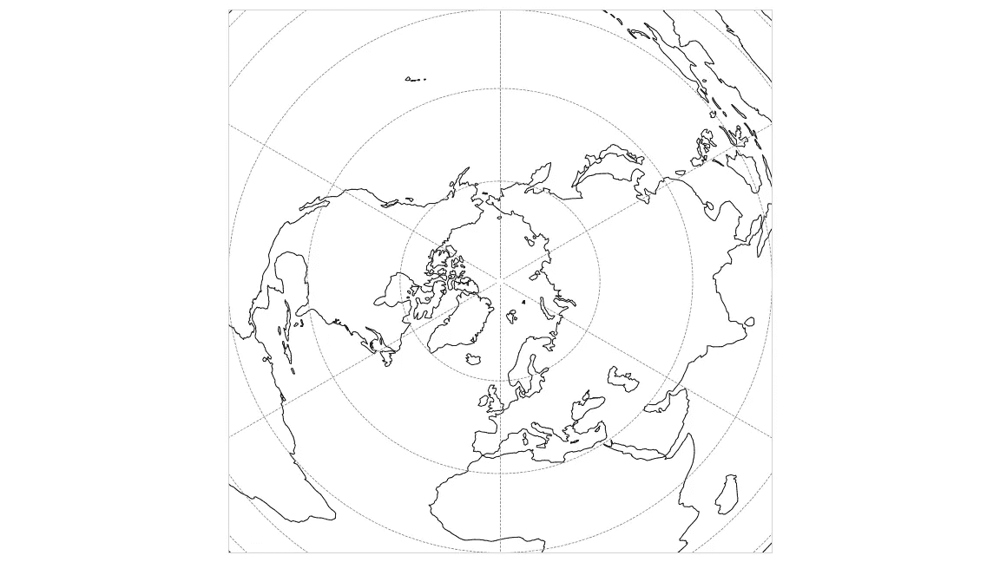

# 使用 Matplotlib 和 Cartopy 可视化卫星数据

> 原文：<https://towardsdatascience.com/visualizing-satellite-data-using-matplotlib-and-cartopy-8274acb07b84?source=collection_archive---------11----------------------->

## [实践教程](https://towardsdatascience.com/tagged/hands-on-tutorials)

## 使用 Python 和被动微波数据探索我们不断变化的气候


北半球亮温图像(作者创建)

我最近给[写了一篇帖子](/can-we-study-snowpack-with-satellites-e83d1f7720aa)，讲述我们如何利用从卫星上获得的被动微波图像来研究积雪。利用卫星来研究积雪，可以解开一些区域的信息，否则这些信息是不可能研究的，尤其是在大范围内。除了覆盖范围大之外，携带被动微波传感器的太阳同步卫星每天在相似的时间拍摄两极的图像。这些一致的测量产生了令人难以置信的每日时间序列，可以追溯到 1978 年 Nimbus 7 卫星的发射。Nimbus 计划是 NASA 和 NOAA 首次合作发射专门用于气象研究的卫星，40 多年后，我们仍然受益于研究气候的早期投资。

在本帖中，我们将通过各种方法来使用 Matplotlib 和 Cartopy 可视化卫星图像。在制作演示地图时，这两个库是我最喜欢的工具；虽然网络地图风靡一时，但我们经常需要一种非在线托管的高质量可视化。

我们将从使用 Matplotlib 快速绘制信息丰富的图像开始，然后深入到使用 Cartopy 使用 Matplotlib 绘制地理坐标。最后，我们将讨论如何用 Matplotlib 制作动画图像和地图，以显示随时间的变化。所以，请坐好，放松，让我们学习如何使用 Matplotlib 来可视化阿拉斯加的积雪。

# 数据

## 背景

我们将使用 MEaSUREs 校准的高分辨率被动微波数据集，该数据集是 NASA 制作地球系统数据记录用于研究环境(MEaSUREs)计划的一部分。这个数据集是特殊的，因为它被重采样到比传感器最初捕获的分辨率高得多的分辨率；原始像素为 25 公里宽，但新数据的像素为 6.25 公里宽。这意味着我们现在有 16 个像素，而原来只有一个。

这些无源微波传感器测量的辐射能量非常低，这迫使我们在大范围内进行测量，以获得良好的读数。虽然与其他类型的卫星图像相比，6.25 公里仍然是一个宽像素，但它使我们能够比以前更详细地研究积雪。

被动微波辐射计测量的主要参数之一是亮温(TB)，它是对朝向卫星上的传感器移动的辐射的辐射率的测量。我们在不同的频率下测量结核，用千兆赫(GHz)表示。对于积雪分析，我们主要关注 37GHz 和 19GHz 频率。当地面上没有雪时，两种频率相似，但随着雪在地面上积累，37GHz 频率的散射要多得多。这种差异使我们能够找到雪水当量(SWE)的替代变量，即储存在雪堆中的水量。


由作者创建

在该图中，您可以看到 19GHz 和 37GHz 频段在冬季如何发散，这是由于 37GHz 频段更多地从雪中散射。

在这篇文章的[中，我深入研究了这个数据集，以及我们如何使用被动微波传感器测量的亮度温度来估计积雪中储存的水量。如果你对使用被动微波成像研究雪背后的科学感兴趣，请阅读那篇文章的前半部分。](/can-we-study-snowpack-with-satellites-e83d1f7720aa)

## 选择研究区域

可通过 FTP 获得的完整数据集将近 70TB。幸运的是，为了研究 SWE，我们只需要在我们的时间序列期间每天下载两个文件。我已经写了一个 Python 库来为我们做这项工作，确保我们每年都能得到最佳的文件；有多种传感器可用，某些传感器的错误率低于其他传感器。

为了处理合理数量的数据，我们需要选择一个研究区域，因为使用完整北半球影像的时间序列(如帖子顶部所示)需要存储大量数据！下面你会看到我们将要绘制的阿拉斯加地区。


由作者使用谷歌地球创建

由于该数据使用 EASE-Grid 2.0 投影，我们必须通过选择左上角和右下角的一组坐标来选择边界框。等面积可缩放地球(EASE)格网是全球范围的网格数据的通用格式，可以很好地保留映射对象的面积。虽然缓和网格不使用纬度和经度；相反，他们选择以米为单位的行/列系统。稍后我将展示如何在纬度/经度和行/列坐标之间进行转换，这被称为重新投影。

# 用 Matplotlib 绘制 SWE

Matplotlib 是 Python 程序员可以使用的绘图库。虽然它在图形上比交互式绘图库更简单，但它仍然是一个强大的工具。Matplotlib 是我的首选库，用于快速绘制和演示我想要传达的特定观点。交互式地图根本难以清晰呈现；除非你正在做一个现场编码演示，否则你永远不会真的想在和观众说话的时候和你的电脑互动。

## 用 imshow 绘制简单图像

绘图是探索性数据分析的一个重要组成部分，Matplotlib 非常适合我们 EDA 所需的快速绘图。利用我们的 SWE 数据，简单地绘制时间序列中的一天就可以有力地证实我们对图像进行了正确的子集划分。

```
fig = plt.figure(figsize=(12,6))
im = plt.imshow(swe[0,:,:])
```


由作者创建

使用 Matplotlib 的 imshow 函数，我们可以像绘制任何图像一样绘制光栅数据。我们可以看到这个图中的海岸线和我用来创建上面的边界框的谷歌地球轮廓之间的大致相似之处，这意味着我们确实正确地选择了数据！

然而，这个情节缺少一些关键的组成部分。让我们用一些基本的 Matplotlib 格式使它更丰富一些:

```
fig = plt.figure(figsize=(12,6))
im = plt.imshow(swe[0,:,:],cmap='gist_rainbow')
plt.colorbar(im)
plt.title("SWE (mm) on Jan 23, 1993 | North Slope, Alaska");
```


由作者创建

这是我喜欢在演讲中使用的情节；这很简单，有助于避免分心，并且可以很快被消化，以便听众可以专注于我所说的内容。当在投影仪上呈现色彩不总是最饱和的地块时，使用对比度更高的色彩映射表会有所帮助。强烈对比的颜色使人们能够很快看出细微的差异，而这些差异在更微妙的颜色图上很难分辨出来。

## 利用支线剧情

支线剧情通过允许我们在一张画布上组合多个情节，为我们提供了许多扩展的功能。我们可以使用支线剧情来查看我们的研究区域在第一年不同季节的快照。

由作者创建


由作者创建

这是个很酷的情节。有趣的是，看到雪在秋天积累，在冬天达到高峰，并通过春天的图像几乎完成融化。在夏季/秋季图像和冬季/春季图像之间，海洋也在明显地改变温度；我们可以看到海洋重新变暖的时间可能比陆地上的雪融化的时间要长。

虽然这些图提供了丰富的信息，但由于我们将数据视为普通图像，因此我们失去了坐标参考系统，该系统实际上将网格与地球相一致。当我们像这样绘制空间数据时，我们失去了许多适当的形状和空间背景；接下来让我们尝试使用 Cartopy 在地图上绘制它。

## 添加投影

默认情况下，Matplotlib 设计用于在传统网格空间中绘图。为了在地图上显示数据，我们必须有一个带有匹配投影的底图。幸运的是，有一个名为 Cartopy 的库，它被设计用来处理地理空间数据，以便使用 Matplotlib 进行制图。我最喜欢 Matplotlib 的一点是，开发人员在它的基础上进行构建是多么容易；Cartopy 在某种程度上类似于 Seaborn，它建立在 Matplotlib API 之上，为用户带来了一个更加定制化的工具。

我们从定义制图坐标参考系统(CCRS)对象开始。这些告诉 Cartopy 我们的数据正在使用什么坐标参考系统(CRS)。

```
geod = ccrs.Geodetic()
proj = ccrs.LambertAzimuthalEqualArea(central_latitude=90.0)
```

我们数据的投影是以北极为中心的 Lambert 方位角等面积。让我们通过定义我们的投影和范围，使用我们的新坐标系来绘制地球的北半球。

由作者创建



由作者创建

在这张地图中，我们俯视北极，北美在左边，非洲在底部作为参考。您会注意到，我们没有绘制任何数据，这是因为这本质上是我们的新“画布”。Matplotlib 现在将 EASE-Grid 2.0 坐标视为绘图空间。

如果我们想在这个底图上分层数据，那么我们也需要找到数据的范围。您会注意到，当我们绘制底图时，我们用四个数字定义了范围。这些是边界框左上角和右下角的 x/y 坐标。在这种情况下，-9，000，000–9，000，000 米是 EASE-Grid 2.0 格网中两个 x/y 坐标的最大范围，北极位于点(0，0)。

我知道我学习区域的左上坐标是[-145，66]，右下坐标是[-165，72]。这些是以度为单位的大地坐标，可以使用前面定义的 Cartopy 对象转换为米(由 EASE-Grid 2.0 使用)。

找到我们的边界坐标(由作者创建)

您会注意到我们将源坐标参考系统设置为`geod`，这是另一个 CCRS 对象，表示使用度数、纬度和经度的大地坐标参考系统。我们使用兰伯特方位角等面积 CCRS 物体来转换坐标，因为那是我们的目标投影。

现在，我们在正确的 CRS 中有了新的边界坐标，我们可以继续绘制我们的研究区域:

由作者创建


覆盖数据(由作者创建)

不错！现在，我们已经将数据叠加到地图上，我们可以使用海岸线来验证我们是否使用了正确的投影和方向。我最初将 SWE 数据上下颠倒绘制，因为它的“原点”与基础地图不同，所以如果有些东西偏离了，不要害怕调整方向。

这张地图有点缩小了。很难非常清楚地看到 SWE 数据。我们可以通过调整底图的范围来放大:

```
ease_extent = [-3000000., 1000000., -1000000., 3000000.]
```


由作者创建

Cartopy 为 Matplotlib 带来了强大的功能，支持许多投影。

# 动画 Matplotlib 图

我总是发现用 Matplotlib 显示连续的变化非常困难。我们可以制作支线图来显示离散的变化，但是如果不使用动态绘图工具，显示变化是有挑战性的。解决这个问题的一个方法是使用动画。创建随时间变化的图形的电影或 gif 并不困难，这对于可视化地理空间数据的变化非常有用！

让我们试着用动画演示我们的原始绘图，它使用`plt.imshow()` 来绘制我们的 SWE 数据。

由作者创建


动画 SWE(由作者创作)

制作动画剧情真的那么容易！关键是我们有一些迭代绘图的方法。在这种情况下，我简单地遍历 1000 天的时间序列，并保存每个图的快照，然后将其转换为 gif。因此，我们首先创建一个 Matplotlib 图形`fig`，并将其传递给`Camera()`实例化器。现在，每次我们迭代创建一个新的图形时，我们只需用`camera.snap()`对当前的 Matplotlib 图形进行快照。

有多种方法可以创建动画 Matplotlib 图。大多数例子可能会使用内置的`Matplotlib.animation`模块。总的来说，这个模块工作得很好，但是，我遇到了依赖问题，阻止了在 Windows 10 上导出动画。Matplotlib 的动画模块也不能导出为 GIF 格式，而 GIF 是我用来分享演示和文章的首选格式。

为了避免依赖性问题并直接导出为 GIF 文件，我们可以使用一个叫做赛璐珞的库。赛璐珞是一个轻量级的库，用于从现有的情节中创建动画。它的开发并不活跃，但是如果您对内置的 Matplotlib 功能有问题，我建议您尝试一下。我喜欢它可以很容易地添加到现有的情节与任何功能的最低限度的返工。

实际上，在 Matplotlib 图形上绘制的任何东西都可以被动画化。所以我们也可以在地图上制作 SWE 图像的动画！

由作者创建


动画漫画/Matplotlib 图(由作者创建)

我觉得这些动画情节挺好玩的。能够看到陆地和海洋上的数值如何随着相应的日期变化，确实有助于显示每年的积累和融化周期。我们还可以以各种方式聚合数据，然后将这些聚合动画化。

# 包扎

虽然有时可能会觉得在 Python 中有比 Matplotlib 更好的绘图选项，但它仍然是最可靠和有效的绘图工具之一。Matplotlib 做得很好，为我们提供了一个可以根据我们的每一个愿望进行定制的画布。如果您需要为演示文稿、论文或文章绘制图表，Matplotlib 的可定制性是无可争议的。

除非您需要交互式地图，否则您可能会在某个时候使用 Matplotlib 来可视化 Python 中的地理空间数据。幸运的是，Cartopy 这样的库为 Matplotlib 提供了处理各种地理空间数据的能力。

# 资源

*   [Matplotlib imshow 文档](https://matplotlib.org/stable/api/_as_gen/matplotlib.pyplot.imshow.html)
*   [赛璐珞文件](https://pypi.org/project/celluloid/)
*   [测量 CETB 数据](https://nsidc.org/data/nsidc-0630)
*   [多克卡宾枪](https://scitools.org.uk/cartopy/docs/latest/)