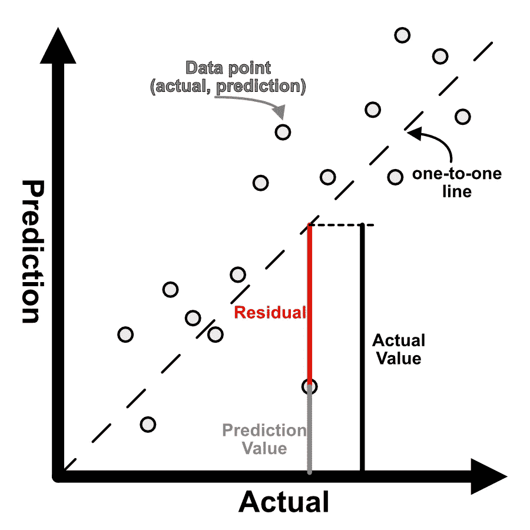
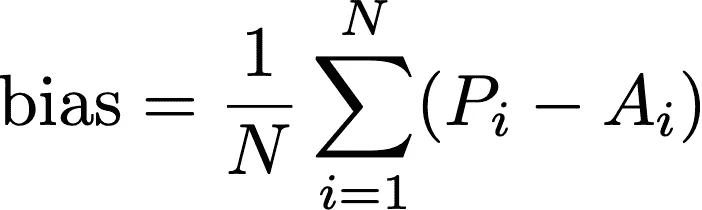
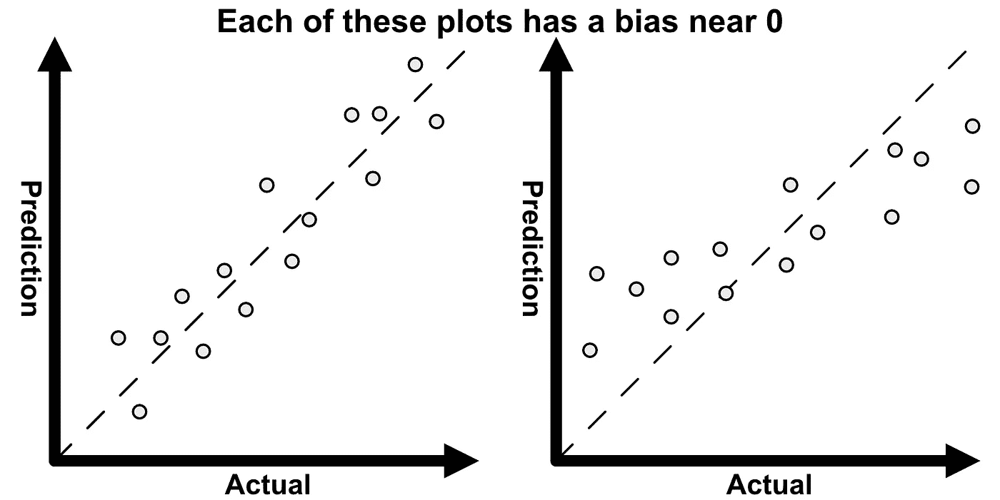
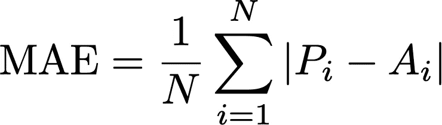
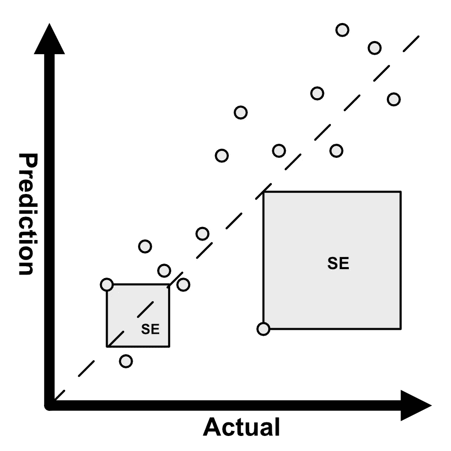
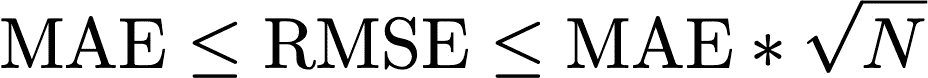
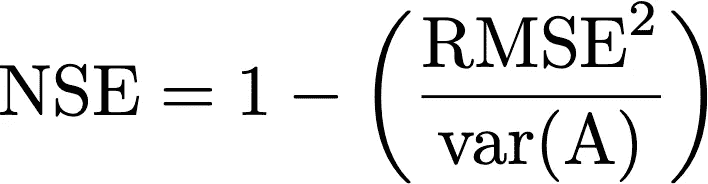
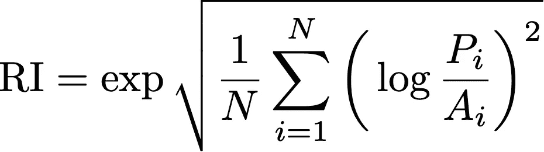

# 可视化技能评估指标

> 原文：<https://towardsdatascience.com/visualizing-skill-assessment-metrics-24454e63385c?source=collection_archive---------23----------------------->

## 评估你的模型有多“好”


[弗拉德·基塞洛夫](https://unsplash.com/@wladkiselev?utm_source=medium&utm_medium=referral)在 [Unsplash](https://unsplash.com?utm_source=medium&utm_medium=referral) 上拍摄的照片

无论是评估回归模型还是地球系统模型，我们都需要能够量化它的“好”，这可能是主观的。这篇文章讨论了一套常用的技能评估指标，它们的优点，以及如何可视化或解释它们。每个指标将模型的 ***预测值(P)*** 与一组 ***实际观察值(A)*** *进行比较。*

我不主张选择一个度量标准来量化好，而是提倡综合并呈现一套标准。在这篇文章中，我将讨论:`bias`、`MAE`、`RMSE`、`NSE`和`RI`。我将描述每个指标，展示它的可视化，并展示如何用 Python 对它进行编码。前三个(`bias`、`MAE`和`RMSE`)是一个数字，用来量化预测的偏差程度。每一种都提供不同的信息，应该在分析中提出。

其他两个指标`NSE`和`RI`应谨慎解读，因为它们涉及比率。`NSE`量化模型的预测能力，而`RI`量化预测在乘法意义上的偏离程度。

# 0.交叉绘图

虽然不是一个技能指标，但这个情节非常重要，值得讨论。每当将预测值与实际数据进行比较时，总是从交会图开始，y 轴上的 ***预测值*** ，x 轴上的 ***实际值*** ，以及一条一对一的对角线。

将预测值放在 y 轴上，将实际值放在 x 轴上是很重要的。有了这个约定，一对一线以上的点被高估，线以下的点被低估。因此，坚持这一惯例可以对预测进行快速的视觉评估，并可以告诉你是否存在系统性偏差。

## 残差

下图显示了交叉图上的数据点，并说明了如何可视化单个数据点的***【R】****。*

**

*单个数据点的残差示意图。*

*为了得到正确的符号，残差必须计算为预测值减去实际值。在 Python 中，残差可以通过按元素减去两个数据集来计算，这通常适用于大多数数据类型:*

```
*residual = prediction - actual*
```

*残差是预测值和实际值之间的差值，它告诉您两条信息:*

1.  *量级:预测与实际观测的差距有多远*
2.  ***符号:**正表示高估，负表示低估*

> *总是从一个交会图开始，y 轴上的 ***预测值*** ，x 轴上的 ***实际值*** ，以及一条一对一的对角线。*

# *1.平均误差(偏差)*

*平均误差或偏差是所有残差的平均值，与符号无关。*

**

*偏差方程(图片由作者提供)*

*一个等价的表达偏差的方式是这样的:`bias = mean(P) — mean(A)`，因为你可以分配总和。这清楚地表明，偏见仅仅是手段的不同。对偏差的解释是量化预测是否过度或低估的一种快速而肮脏的方法。*

## *计算*

*无论你计算的平均误差是所有残差的平均值，*

```
*import numpy as npresidual = prediction - actual
mean_error = np.mean( residual )*
```

*或者作为两个平均值之间的差异，*

```
*import numpy as npbias = np.mean(prediction) - np.mean(actual)*
```

*答案完全一样。*

> *平均误差是平均残差，与符号无关。*

## *无偏见是什么意思？*

*解释偏差时一定要小心，因为接近零的值可能会引起误解。例如，如果较低的实际值被高估，而较大的值被低估，那么`bias`也将出现在零附近。这在下面右边的图中有所说明。*

**

*两个交叉图，每个都有接近零的偏差。*

*这是因为大小相似的正负残差相互抵消，从而导致接近零的`bias`。因此，要小心不要过于强调偏见，总是要参考交叉图来为`bias`添加上下文。*

*也可以计算交会图的线性回归斜率，为`bias`添加上下文。如果预测与实际观测完全一致，则斜率为 1。*

> *谨慎解释偏见是很重要的*

# *2.平均绝对误差*

*平均绝对误差`MAE`与平均误差相似，只是我们忽略了符号。数学上，这是通过取绝对值来完成的。换句话说，`MAE`是残差的平均幅度。值得注意的是没有告诉你错误的方向。*

**

*平均绝对误差方程。这与偏置方程非常相似，只是我们取绝对值。(图片由作者提供)*

> *MAE 是残差的平均幅度*

## *计算*

*使用`numpy`，`MAE`是这样计算的:*

```
*import numpy as npmae = np.mean(np.abs(prediction - actual))*
```

*`sklearn`的实现如下所示。*

```
*from sklearn.metrics import mean_absolute_error
mae = mean_absolute_error(actual, prediction)*
```

*实际值通常是`sklearn.metrics`中的第一个参数，但顺序与 MAE 无关。*

> *MAE 告诉你，平均来说，一个数据点距离一对一的直线有多远*

# *3.均方根误差(RMSE)*

*了解 RMSE 的最好方法是把它分成以下几个部分:*

1.  ***平方误差** : SE*
2.  ***均方误差** : MSE*
3.  ***均方根误差:** RMSE*

## *平方误差:标准误差*

*这是通过对每个数据点的残差求平方来计算的，并显示在一个十字图上，就像正方形一样。见下图:*

**

*交会图上的平方误差示意图。*

*更准确地说，它被想象成一个区域。如果我们预测的是开尔文温度，那么误差平方的单位是开尔文平方。*

## *均方差:MSE*

*均方误差 MSE 就是平均“误差面积”。然而，MSE 不是一个好的技能指标，因为单位仍然是平方的。MSE 随残差呈指数增长，因为它代表一个面积，并且通过对残差求平方来计算。*

## *均方根误差:RMSE*

*求 MSE 的平方根解决了单位问题，并得到均方根误差(RMSE)。这可以解释为 MSE 正方形的边长。*

**

*RMSE 方程(图片由作者提供)*

## *计算*

*下面是一个`numpy`实现。*

```
*import numpy as np# squared error
se = (actual - prediction)**2# mean squared error
mse = np.mean(se)# root mean squared error
rmse = np.sqrt(mse)*
```

*下面是一个`sklearn`实现:*

```
*from sklearn.metrics import mean_squared_error# mean squared error
mse = mean_squared_error(actual, prediction)# take square root of mse
rmse = np.sqrt(mean_squared_error)*
```

## *RMSE 边界*

*看起来似乎`RMSE`和`MAE`是同一个数字。然而，`RMSE`被限制在`MAE`和`MAE*sqrt(N)`之间。下限是当所有的误差具有相同的幅度时，而上限是当所有的`N`点除了一个以外都为零时的情况。*

**

*RMSE 误差界限(图片由作者提供)*

*见[这篇文章](https://medium.com/human-in-a-machine-world/mae-and-rmse-which-metric-is-better-e60ac3bde13d)关于 RMSE 及其误差范围的详细讨论。*

> *MSE 告诉你平均面积，RMSE 告诉你面积的平方长度。*

## *RMSE 对重大失误的处罚力度更大*

*RMSE 对大错误的惩罚比 MAE 多，这可能是一个可取的特征。例如，考虑以下两个残差，5 和 10*

*   *梅说，10 点下班比 5 点下班“糟糕”两倍。*
*   *RMSE 说，10 点前的失误是 5 点前的两倍多。这是因为残差首先被平方。*

> *RMSE 对重大失误的处罚力度超过了 MAE*

# *其他指标*

*以下两个指标与后三个不同。它们是作为比率计算的，因此需要小心解读。每当涉及一个比率时，总有被零或一个非常小的值除的风险。解释 NSE 和 RI 时要小心*

# *4.纳什-萨特克利夫效率*

*Nash-Sutcliffe 效率衡量的是预测值相对于观测平均值的准确程度。这与 RMSE 的根据有关:*

**

*纳什-苏特克利夫效率方程(图片由作者提供)*

*其中`var(A)`是实际观测值的方差。*

## *计算*

*这里是`NSE`的一个`numpy`实现。*

```
*import numpy as np# squared error
se = (actual - prediction)**2# mean squared error
mse = np.mean(se)# nse
nse = 1 - (mse/np.var(actual))*
```

## *解释*

*   ***NSE = 1** :满分*
*   ***NSE = 0** :表示预测并不比观测平均值好。*
*   ***NSE < 0** :表示观察平均值是比您的模型更好的预测器*

# *5.可靠性指数*

*可靠性指数被解释为预测值与实际观测值不同的平均因子。例如，RI 为 2 表示，平均而言，预测值与观测值在乘法因子 2 的范围内一致。理想情况下，RI 应该接近 1。*

**

*可靠性指数方程(图片由作者提供)*

## *计算*

*在数学上，RI 从对预测和观测值进行对数转换开始。然后计算 RMSE，最后对结果求幂。因此，RI 是对数变换预测和观测值的指数 RMSE。*

*下面是一个`numpy`实现。*

```
*import numpy as np# logged squared error
log_se = np.log(prediction/actual)**2# log rmse
log_rmse = np.sqrt(np.mean(se))# reliability inded
ri = np.exp(log_rmse)*
```

# *最后的想法*

*这篇文章描述了评估模型预测的五个标准，无论是回归模型还是海洋模型。对于`bias`、`MAE`和`RMSE`，越接近零预测越好。对于`NSE`和`RI`，1 分被认为是完美的。我主张显示所有这些指标的完整性。关于海洋科学背景下这些指标的详细讨论，我鼓励你阅读 [Stow et al. 2009](https://www.ncbi.nlm.nih.gov/pmc/articles/PMC5375119/) 。*

*我没有讨论的一个常见指标是相关性，它也与决定系数(R2)相关。这个在别处已经讨论过了(见**相关帖子**)。*

*讨论的每个度量都是空间和时间上的敏感相移。因此，每个指标都可以用“滞后”来计算例如，通常通过计算滞后相关性来确定任何滞后-超前效应。*

# *相关职位*

*[](https://medium.com/human-in-a-machine-world/mae-and-rmse-which-metric-is-better-e60ac3bde13d) [## 梅和 RMSE——哪个指标更好？

### 平均绝对误差与均方根误差

medium.com](https://medium.com/human-in-a-machine-world/mae-and-rmse-which-metric-is-better-e60ac3bde13d)  [## R 平方与调整后的 R 平方

### 回归模型的评价指标及其比较

medium.com](https://medium.com/analytics-vidhya/r-squared-vs-adjusted-r-squared-a3ebc565677b) [](/avoid-r-squared-to-judge-regression-model-performance-5c2bc53c8e2e) [## 避免用 R 平方来判断回归模型的性能

### 依靠 R 来判断一个回归模型的表现是被误导的

towardsdatascience.com](/avoid-r-squared-to-judge-regression-model-performance-5c2bc53c8e2e) [](https://medium.com/@SilentFlame/pearson-correlation-a-mathematical-understanding-c9aa686113cb) [## 皮尔逊相关，一种数学理解！

### 我一直注意到，只是得到一个方法的想法，而不了解背后的数学…

medium.com](https://medium.com/@SilentFlame/pearson-correlation-a-mathematical-understanding-c9aa686113cb) 

*感谢阅读和支持媒体作者*

[](https://lukegloege.medium.com/membership) [## 通过我的推荐链接加入 Medium—Luke Gloege 博士

### 作为一个媒体会员，你的会员费的一部分会给你阅读的作家，你可以完全接触到每一个故事…

lukegloege.medium.com](https://lukegloege.medium.com/membership)*