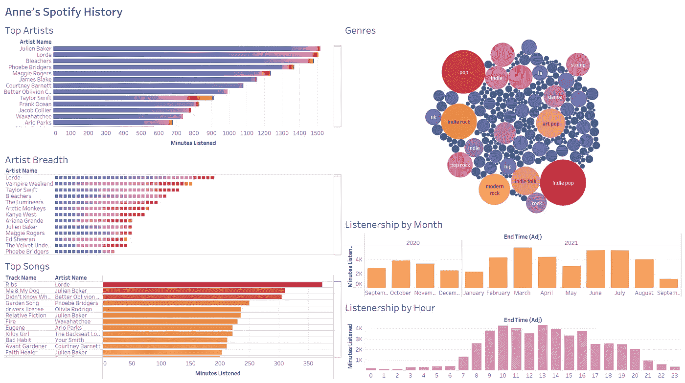
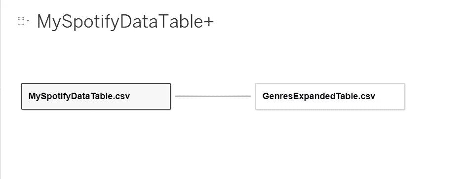
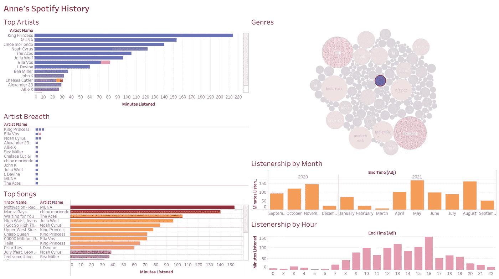

# 用 Python 和 Tableau 可视化 Spotify 数据

> 原文：<https://towardsdatascience.com/visualizing-spotify-data-with-python-tableau-687f2f528cdd?source=collection_archive---------1----------------------->

## 使用您的流数据和 Spotify 的 API 创建一个动态仪表板

我不需要做这个项目来发现我仍然沉迷于 Lorde 的'****'**'排骨，但尽管如此，工作还是很有趣。参见下文，了解如何使用您自己的 Spotify 数据轻松复制它！**

**[**Tableau 公共仪表盘**](https://public.tableau.com/app/profile/anne.bode/viz/SpotifyPREMIUMDashboard/PremiumDashboard)
[**Jupyter 笔记本**](https://jovian.ai/abode118/spotify-data-prep)**

****

**[https://public . tableau . com/app/profile/Anne . bode/viz/spotifypremiumdash/PremiumDashboard](https://public.tableau.com/app/profile/anne.bode/viz/SpotifyPREMIUMDashboard/PremiumDashboard)**

# **步骤 1:请求数据**

**在此 向 Spotify [**索取您的数据副本。耐心等几天。*可能有一种方法可以直接使用 Spotify 的 API 请求这些数据，但那是另外一个项目了！***](https://www.spotify.com/account/privacy/)**

# **步骤 2:准备流/库数据**

**使用 Spotify 给我们的文件，我们现在将创建一个数据帧，其中包括我们所有的流媒体数据，以及每首歌曲是否在我们的资料库中，以及每首歌曲的 Spotify“URI”(唯一标识符，以后会派上用场)**

**创建 **df_stream** :**

**接下来，我从 Spotify 清理了我的“YourLibrary”文件，这样它就只包含了“tracks”字典，用方括号[ ]括起来，并保存为一个新文件“YourLibrary1”。更擅长清理 json 文件的人可能会自动执行这个步骤，并使用原始文件。**

**创建 **df_library** :**

**创建我们的最终数据帧， **df_tableau:****

# **步骤 3:创建新的 Spotify 项目**

**在这里 登录你的开发者账号 [**。在仪表板中，创建一个新项目。创建后，您可以检索您的“客户 ID”和“客户机密”我们将在步骤 4 中使用这些。**](https://developer.spotify.com/dashboard)**

# **步骤 4:使用 Spotify 的 API 创建流派数据框架**

**首先，我们将使用我们的客户端 ID 和客户端密码来生成一个访问令牌，这样我们就可以从 Spotify 的 API 中提取数据。注意:此令牌必须在一小时后重新生成。我在 [**这篇文章**](https://stmorse.github.io/journal/spotify-api.html) 的帮助下想出了如何做到这一点。**

**现在，我们将从库中提取与每个 track_uri 相关联的艺术家和流派，并添加到字典*(查看 Spotify 的* [***控制台***](https://developer.spotify.com/console/)**以了解如何提取您感兴趣的数据点)。****

***我们将把这个字典转换成一个 dataframe ( **df_genre** )并扩展它，以便每个曲目/艺术家的每个流派都在它自己的行中(我使用了这个解决方案)。这将创建 **df_genre_expanded** 。***

***然后，我们将把 **df_tableau** 和 **df_genre_expanded** 保存为 csv 文件，以便加载到 tableau 中。***

# ***步骤 5:将数据加载到 Tableau 中***

***连接到 Excel 文件(MySpotifyDataTable.csv)作为数据源。这应该也会在左侧弹出您的 GenresExpandedTable.csv 文件。将后一个文件拖到右边，并在两个表之间添加一个关系。确保基于 track_uri *创建关系(注意:您可能需要单击 GenresExpandedTable.csv 旁边的向下箭头，然后单击“字段名在第一行”)*。***

******

# ***步骤 6:编辑 Tableau 中的字段***

***我们将在数据表中添加两个计算字段。我们可以用 Python 来完成这个，但是我想用 Tableau 来做实验。***

1.  ***将 **Ms 播放**转换为**分钟收听**:
    *【Ms 播放】/60000****
2.  ***将**结束时间** (UTC)转换为**结束时间(Adj)** (您的时区，已考虑夏令时):
    *IF【结束时间】<DATE(2020–03–08)THEN DATEADD('小时'，-5，[结束时间])
    ELSEIF【结束时间】<DATE(2020–11–01)THEN DATEADD('小时'，-4，[结束时间****

# ***步骤 7:创建可视化效果***

***[**下载仪表板**](https://public.tableau.com/app/profile/anne.bode/viz/SpotifyPREMIUMDashboard/PremiumDashboard) 来看看我是如何创建下面的可视化效果的。请注意，它们在仪表板中都是链接在一起的，因此可以互相过滤，这很不正常！***

******

***仪表板过滤了风格为“alt z”的歌曲/艺术家——我是一个酷 Z 一代的孩子吗？***

1.  ***顶级艺人:收听分钟数最多的流行艺人，个人歌曲构成了丰富多彩的片段***
2.  *****艺人广度** : 我听了> 1 分钟和> 1 流的每位艺人的歌曲数量***
3.  *****热门歌曲**:收听分钟数最多的流行歌曲***
4.  *****流派**:我听过的所有流派，用大小和颜色表示流的数量***
5.  *****按月统计的听众人数**:不言而喻的*(编辑 9/29:我将“在图书馆中”字段从一个度量转换为一个维度，这样我就可以将它包含在一个堆叠条形图中，以查看我每个月总共听了多少分钟，其中有多少分钟在我的图书馆中)****
6.  *****每小时听众人数**:不言自明***

# ***最后***

***通过分析您的 Spotify 流媒体和图书馆数据，您可以收集到大量有趣的见解，尤其是结合通过 Spotify API 获得的其他数据字段(即流派)时。我知道今年我真的很喜欢朱利安·贝克，我对洛德的爱没有时间限制。8 月份，我听了太多阿德里安娜·伦克的'****'**(# sadgirlvibes)，但 12 月份，我最喜欢的歌当然是玛丽亚·凯莉的' [**我想要的圣诞礼物就是你**](https://open.spotify.com/track/0bYg9bo50gSsH3LtXe2SQn) '。现在我知道如何连接到 Spotify 的 API，在未来的项目中，我想检查我听的歌曲/艺术家的音乐质量(不仅仅是流派)。我特别感兴趣的一个领域是“可跳舞性”，因为每当我被指派为家庭公路旅行的 DJ 时，我母亲的唯一标准就是“我能跟着跳舞的东西。”不管那是什么意思。*****

*****祝你好运分析你自己的收听历史，继续收听 2013 年以来你最喜欢的歌曲！*****