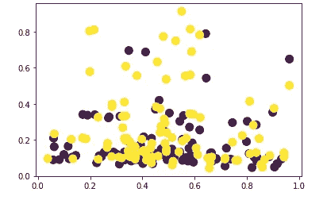

# 用 Python 可视化 Spotify 歌曲:探索性数据分析

> 原文：<https://towardsdatascience.com/visualizing-spotify-songs-with-python-an-exploratory-data-analysis-fc3fae3c2c09?source=collection_archive---------6----------------------->

## [实践教程](https://towardsdatascience.com/tagged/hands-on-tutorials)

## 需要回答的一些问题:是什么让流行音乐流行？今天的音乐与 30 多年前有什么不同？

[sgcdesignco](https://unsplash.com/@sgcreative?utm_source=medium&utm_medium=referral) 在 [Unsplash](https://unsplash.com?utm_source=medium&utm_medium=referral) 上的照片

在过去的一年里，我一直在使用 Spotify 应用程序收听我最喜欢的艺术家，并获得新歌推荐。最近，我了解到该应用程序根据音频特征系统对曲目进行分类，并将它们存储在一个数据库中，通过其 API 可以轻松访问。所以，我想:我们能不能利用这个数据库更好地了解其中的轨迹？也就是说，我们可以根据音乐的流行程度或发行年份等因素来划分音乐分组，从而发现任何趋势吗？让我们开始吧:

**音频特性:**

根据 Spotify 网站的说法，他们所有的歌曲都在以下每个类别中得到了分数(摘自 Spotify API 文档，[https://developer . Spotify . com/documentation/we b-API/reference/](https://developer.spotify.com/documentation/web-api/reference/)):

*   **情绪**:可跳性、效价、能量、节奏
*   **特性**:响度、语音、乐器性
*   **语境**:活跃度，声音

我将要使用的数据来自这个 Kaggle 数据集:[https://www . ka ggle . com/yamerenay/Spotify-dataset-19212020-160k-tracks？select=tracks.csv](https://www.kaggle.com/yamaerenay/spotify-dataset-19212020-160k-tracks?select=tracks.csv) 。

## **1。前 100 首最受欢迎的歌曲对比所有数据集**

首先，让我们将前 100 首歌曲与数据集的其余部分进行比较。这是通过对“受欢迎程度”列进行排序来完成的:

现在我们有了数据，让我们来看看每首歌的特点。具体到这一部分，我们将查看前 100 首最流行歌曲以及所有数据集的平均值。为了形象化这一点，我们可以使用如下雷达图。下面的代码是:

*   获取数据的所有标签，在我们的例子中是音频特征，并获取它们的含义。有两个变量:“特征”，具有前 100 首歌曲的音频特征的平均值，以及“特征 _ 全部”，具有所有数据集的平均值。
*   用不同的颜色在同一雷达图上绘制“特征”和“特征 _ 全部”。

前 100 首歌曲和其余数据集的特征平均值雷达图

从剧情来看，这两个歌曲分组在几乎所有的音频特征上似乎都有一些不同。也就是说，最流行的歌曲更“有活力”，“可跳舞”，并且具有更高的“明确性”值。根据 Spotify 对这些特征的定义，其余歌曲在“声音”和“效价”类别中得分较高，这可以被解释为传达了更多的积极信息。

## 比较盒式图中的歌曲

既然我们看到两组人的特征有一些不同，我们来更好地看看他们怎么样？下面，您可以找到这些功能的方框图，0 表示数据取自前 100 首歌曲，1 表示数据取自数据集的其余部分。

前 100 首歌曲和其余数据集的特征的方框图

箱形图还显示了两组特征的一些差异:在“活泼”子图中，流行歌曲部分比数据集的其余部分短。然而，在很大程度上，这些图证实了我们对这些群体的观察。

## 精力与舞蹈能力

现在让我们画一个散点图，看看“活力”和“可跳舞性”特征之间是否有关联。除了前 100 首最受欢迎的歌曲，我还从数据集中随机选择了 100 首歌曲。在下图中，有两种不同的颜色，黄色表示 100 首随机歌曲，紫色表示前 100 首歌曲。

能量与舞蹈性散点图

计算的皮尔逊相关系数是:0.35156523(对于黄色/所有数据集点)和 0.20520467(对于前 100 首歌曲)。

## 价和活泼

我们可以画的另一个散点图是化合价与活跃性的关系。“生动性”代表一首歌曲是否在观众面前现场表演的概率。该图的图例同上:

化合价和活度散点图

有趣的是，这两个变量之间似乎没有很强的线性关系。在这里，我还计算了皮尔逊系数，就像上面的散点图一样:-0.09403765(黄色点)和 0.02555036(紫色点)。

## 3.比较时代:90 前与 90 后

除了比较流行歌曲和数据集的其他部分，我们还可以看看不同时代之间歌曲的差异。出于本教程的目的，我将把年代定义为 1990 年之前和 1990 年之后。现在让我们看一个与上面类似的雷达图，但是有这两个类别(图的代码基本相同，所以我不会在这里再次展示)。

对比 20 世纪 90 年代前后音乐的雷达图

根据盒子情节，两个时代的音乐有几个不同之处:首先，90 年代后的音乐更“有活力”、“适合跳舞”和“明确”。而其他特征如“效价”和“活泼性”在两者中非常相似。20 世纪 90 年代以前的音乐在“声音性”和“乐器性”方面也往往得分较高。

## 4.可视化最受欢迎的艺术家

该数据集还包括每首歌曲的艺术家姓名，但采用列表格式。为了解析单个的名字，我们可以使用“re”，这是一个非常有用的文本操作包。首先，我们从列表中删除“[”和“]”，并构建一个文本模式来搜索数据。由于艺术家通常使用他们的全名或一个艺术名称，该模式查找一个或两个单词，由一个字符分隔，如下所示:

然后，我们在数据集的列中执行搜索，并使用另一个名为“collections”的 Python 包来计算每个艺术家的出现次数:

以下是统计前 100 名艺术家的结果:

按歌曲数量排名前 100 位的艺术家

顶级艺术家是贾斯汀比伯(5 首歌曲)和坏兔子(4 首歌曲)，反映了 2021 年 4 月收集该数据集时公众的偏好。

## 5.图形音频功能相似

对于这一部分，我们将使用 networkx 包来绘制图表，以可视化歌曲之间的相似性。要使用的功能将是 Spotify 音频功能，我们将使用**余弦相似度、**来计算歌曲相似度，这是一种常用的测量对象(如歌曲、电影或书籍)之间相似度的方法。我们可能试图回答的一个问题是，哪些歌曲与许多其他歌曲相似。也就是说，有没有“听起来”和别人差不多的歌？让我们将一首歌曲与另一首歌曲的相似度的下限设定为余弦相似度 0.95。下面是计算余弦相似度和绘制图形的代码:

余弦相似度高于 0.95 的前 100 首歌曲的图表

正如你在下图中看到的，没有多少歌曲是彼此非常相似的，因为图中包含的节点少于 100，这是我们最初的数字。但是，哪些歌曲的“度”最高，这意味着它们与图中的许多其他歌曲相似？

代码返回数据库中的第 55 个条目，对应于 23 度，这意味着这首歌与其他 23 首歌相似。这首歌是这样的:

与前 100 名中的其他人相比度数最高(边缘最多)的歌曲

让我们也获得一些关于该图的其他信息，例如平均程度，它告诉我们一个音轨有多少首歌曲的平均值是相似的:

*   **平均度:** 12.494845360824742(歌曲平均类似其他 12 首左右)
*   **节点数:** 97

## 6.获取歌词数据

对于这一部分，我们还将分析数据集中歌曲的歌词数据。为此，我们可以使用 LyricsGenius API。由于数据集非常大，我将再次随机选择大约 400 首歌曲来可视化。为了用 LyricsGenius 搜索歌词，您需要知道歌曲和艺术家的名字，所以下面的代码提取了这两条信息并搜索了歌词:

从所有数据集中选择和抓取 400 首随机歌曲

## 7.歌词分析

既然我们已经研究了最流行歌曲的音频特征，我们也可以尝试分析数据子集的歌词。对于这一部分，我们将使用 Python 的 TextBlob 包对我们在上面的步骤 6 中选择的歌曲进行文本分析。

*   **文本情感分析:极性**

歌词的一个方面是它的极性，或者文本被认为是积极的(值更接近 1)还是消极的(值更接近-1)。这是歌曲子集极性的方框图:

400 首随机歌曲文本极性的箱线图

虽然该指标的中值约为 0，这意味着歌曲大多是中性的，但在图的两个方向上仍有许多异常值。这表明有许多积极乐观的歌词，也有消极的。

*   **词性分析**

在进行文本分析时，查看词性标注对于理解文档也很重要。你可以在这里阅读更多关于所有部分的内容:[https://www . geeksforgeeks . org/python-part-of-speech-tagging-using-text blob/](https://www.geeksforgeeks.org/python-part-of-speech-tagging-using-textblob/)。在这个故事中，我们将学习 NN(单数名词)、NNS(复数名词)、RB(副词，如“非常”)、rbs(最高级副词)、RBR(比较副词)和 VB(基本动词)。让我们看看我们挑选的 400 首歌曲是如何根据上述部分的百分比使用以下代码创作的:

现在我们已经有了每首歌的这些指标，我们可以使用一个方框图来可视化它们:

词类构成

词类构成第二部分

正如你所看到的，单数名词占了歌词的很大一部分，其次是动词和规则副词。另一方面，比较级和最高级副词在歌词中不常出现。

## 结论

总结我们的发现，我们发现与其他歌曲相比，最受欢迎的歌曲之间以及不同时代之间存在相当大的差异。我们还构建了图表来查看哪些歌曲与其他歌曲更相似，并查看了用于查看歌词的文本分析技术。下面是您可以仔细查看的代码:[https://github . com/DeaBardhoshi/Data-Science-Projects/blob/main/Music % 20 system . ipynb](https://github.com/DeaBardhoshi/Data-Science-Projects/blob/main/Music%20System.ipynb)

我希望你喜欢这篇文章，并感谢阅读！