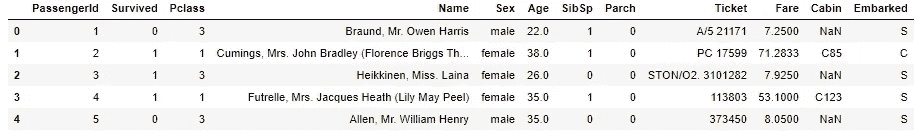
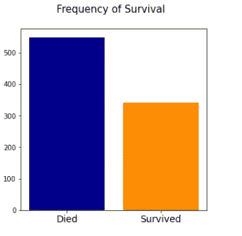
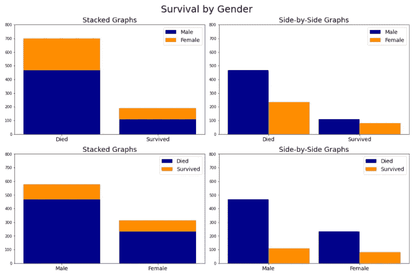
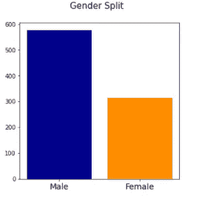
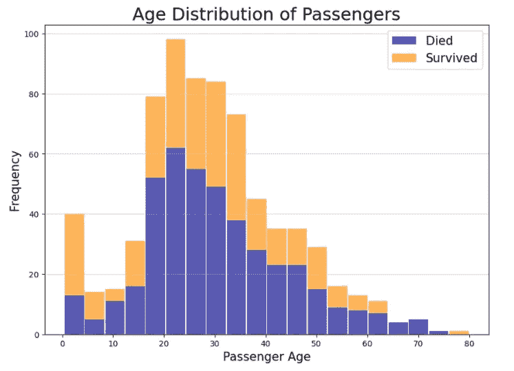

# 使用 Python 可视化统计数据-使用 Matplot 讲述故事

> 原文：<https://towardsdatascience.com/visualizing-statistics-with-python-telling-stories-with-matplot-820491bc5f57?source=collection_archive---------26----------------------->

## 用 Python 讲述数据故事

## 为泰坦尼克号数据集精心制作一个故事


[粘土银行](https://unsplash.com/@claybanks?utm_source=medium&utm_medium=referral)在 [Unsplash](https://unsplash.com?utm_source=medium&utm_medium=referral) 拍摄的照片

数据科学家可以学习的最重要的技能之一是如何使用给定的数据编写令人信服的故事。虽然我们倾向于认为我们的工作是客观的和技术性的，概括在格言“数字不会说谎”中，但我们也应该意识到它更主观的方面。我们不应该陷入这样一个陷阱，即认为我们的工作完全脱离了我们自己对世界的印象和先入为主的观念。

在这篇文章中，我将回顾相同的数据集可以被用来制作不同的(有时是相互矛盾的)关于主题的叙述的许多方法。

我们开始吧！

像往常一样，让我们导入将要使用的 Python 库。

```
import numpy as np
import pandas as pd
import matplotlib.pyplot as plt
import scipy.stats as stats
```

太好了，现在让我们导入将要使用的数据。

```
df = pd.read_csv('titanic_data.csv')
df.head()
```



数据帧的前 5 行

你可能已经注意到了，我们使用的是经典的泰坦尼克号数据，可以在 Kaggle 这里的[找到。我鼓励新的数据科学家看一看它，因为它是开始学习基本统计学的一个极好的方法。](https://www.kaggle.com/c/titanic)

让我们先来看看最明显的特征，幸存者人数。

```
fig, ax = plt.subplots(1, figsize=(5,5))
plt.suptitle('Frequency of Survival', fontsize=15)
ax.bar(dataset['Survived'].value_counts().index, 
       dataset['Survived'].value_counts().values,
       color = ['darkblue', 'darkorange'])
ax.set_xticks(range(0, 2))
ax.set_xticklabels(['Died','Survived'], fontsize = 14);
```



死亡与存活的计数图(由代码生成的图像)

正如我们所看到的，记录显示死亡人数多于存活人数。尽管这是一个有趣的统计数据，但我们并不能从中挖掘出多少故事。现在让我们加入一些其他的描述性特征，比如性别。

```
fig, ax = plt.subplots(2,2, figsize=(15,10))
plt.suptitle('Survival by Gender', fontsize=25)
ind = np.arange(2)
width = 0.45x_axis_status = dataset['Survived'].value_counts().index
x_axis_sex= dataset['Sex'].value_counts().index
male_stats = dataset[dataset['Sex'] == 'male']['Survived'].value_counts().values
female_stats = dataset[dataset['Sex'] == 'female']['Survived'].value_counts().valuesax[0][0].set_title('Stacked Graphs', fontsize = 18)  
ax[0][0].bar(x_axis, male_stats, label = 'Male', color = 'darkblue')
ax[0][0].bar(x_axis, female_stats, label = 'Female', 
             color = 'darkorange', bottom = male_stats)
ax[0][0].set_xticks(range(0, 2))
ax[0][0].set_xticklabels(['Died','Survived'], fontsize = 14)ax[0][1].set_title('Side-by-Side Graphs', fontsize = 18)  
ax[0][1].bar(ind, male_stats , width, label='Male', 
             color = 'darkblue')
ax[0][1].bar(ind + width, female_stats, width, label='Female', 
             color = 'darkorange')
plt.sca(ax[0][1])
plt.xticks(ind + width / 2, ('Died', 'Survived'), fontsize = 14)ax[1][0].set_title('Stacked Graphs', fontsize = 18)  
ax[1][0].bar('Male', male_stats[0], label = 'Died', 
             color = 'darkblue')
ax[1][0].bar('Male', male_stats[1], label = 'Survived', 
             color = 'darkorange', bottom = male_stats[0])
ax[1][0].bar('Female', female_stats[0], color = 'darkblue')
ax[1][0].bar('Female', female_stats[1], color = 'darkorange', 
             bottom = female_stats[0])
ax[1][0].set_xticklabels(['Male','Female'], fontsize = 14)ax[1][1].set_title('Side-by-Side Graphs', fontsize = 18)  
ax[1][1].bar(0, male_stats[0] , width, label='Died', 
             color = 'darkblue')
ax[1][1].bar(0 + width, male_stats[1] , width, 
             label='Survived', color = 'darkorange')
ax[1][1].bar(1, female_stats[0] , width, color = 'darkblue')
ax[1][1].bar(1 + width, female_stats[1] , width, 
             color = 'darkorange')
plt.sca(ax[1][1])
plt.xticks(ind + width / 2, ('Male', 'Female'), fontsize = 14)[axi.legend(fontsize = 14) for axi in ax.ravel()]
[axi.set_ylim(0, 800) for axi in ax.ravel()]fig.tight_layout()
plt.show();
```



图表比较(代码生成的图像)

既然我们已经纳入了性别因素，我们的分析可能会更有趣。通过设计，我们制作了四个不同版本的基本相同的图表。注意每一个微小的变化是如何突出数据的不同方面的(因此需要不同的叙述)。

上面的两张图给人的印象是，我们应该关注乘客死亡中的性别差异。如果我们看上面的图表，我们会注意到更多的人死于泰坦尼克号的沉没。然后，我们可能会忍不住得出结论，这是如何通过“妇女和儿童”优先政策实现的。然而，看下面的一组图表揭示了一些更微妙的东西。

与上面的图表不同，死亡人数中的性别差异并不是重点。实际上强调的是，男性和女性的死亡率明显相似。

“但这怎么可能呢？”你可能会问。男性显然代表了更多的死亡。那么，两性的死亡率怎么会相似呢？

答案在另一张图中。

```
fig, ax = plt.subplots(1, figsize=(5,5))
plt.suptitle('Gender Split', fontsize=15)
ax.bar(dataset['Sex'].value_counts().index, 
       dataset['Sex'].value_counts().values,
       color = ['darkblue', 'darkorange'])
ax.set_xticks(range(0, 2))
ax.set_xticklabels(['Male','Female'], fontsize = 14);
```



按性别划分的乘客计数图(由代码生成的图像)

我们可以看到，男性实际上大大超过了女性，两者相差大约 82%。这样一来，男性在死者中所占的比例就更大了，这也就说得通了，因为他们的数量本来就更多(请注意，男性也构成了幸存者的大部分)。

当然，这并不是说不存在强调保护妇女和儿童而不是成年男子的偏见。然而，当试图寻找这种特殊偏见的证据时，我们必须认识到要使用的“*正确的*数据。我们还必须认识到，完全相同的数据在被选为主要分类器时可能看起来非常不同(在我们的案例中，幸存者身份与性别)。如果我们依赖第一组图表，我们可能会夸大死亡统计中的性别差异水平。

但是现在让我们不要从性别的角度来看这些数据，而是从年龄的角度来看。

```
fig, ax = plt.subplots(figsize=(10,7))
age_died = df[df['Survived']==0]['Age']
age_survive = df[df['Survived']==1]['Age']
n, bins, patches = plt.hist(x = [age_died, age_survive], 
                            stacked = True, bins='auto', 
                            color=['darkblue', 'darkorange'],
                            alpha=0.65, rwidth=0.95)
plt.grid(axis='y', alpha=0.55)
plt.xlabel('Passenger Age', fontsize = 15)
plt.ylabel('Frequency', fontsize = 15)
plt.title('Age Distribution of Passengers', fontsize = 22)
plt.legend(['Died','Survived'], fontsize = 15);
```



按乘客年龄划分的存活率(由代码生成的图像)

从上面的图表中我们可以看出，年轻肯定有优势，因为我们注意到，存活数大于死亡数的唯一时间是在 10 岁以下。此外，我们看到一个八十多岁的老人能够在灾难中幸存下来，也许一些乘客同情他们，让他们上了救生艇。

**总之**

我们已经看到了图表中的细微变化如何对数据的整体叙述产生巨大影响。在实际的数据科学项目中，我发现简单地制作一个条形图并接受 *Matplotlib* 或 *Seaborn 的第一个输出是一种诱惑。虽然这有助于加快进程，但我们在最初查看数据时必须小心。我们必须尽力以多种方式将其可视化，以确保我们不会对数据产生错误的印象。在以后的文章中，我们将讨论更高级的统计概念以及可视化它们的最佳方式。现在，我希望这篇文章已经帮助你认识到我们的工作有时会相当主观。*