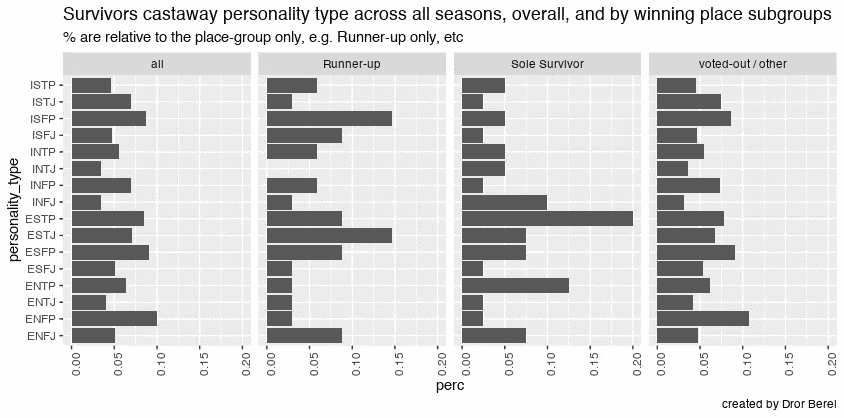
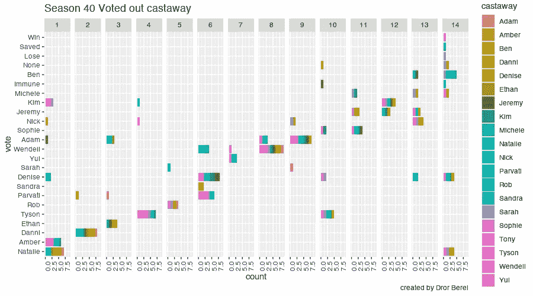
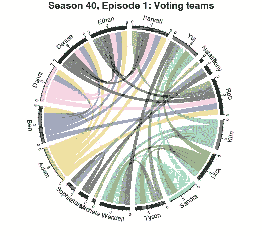
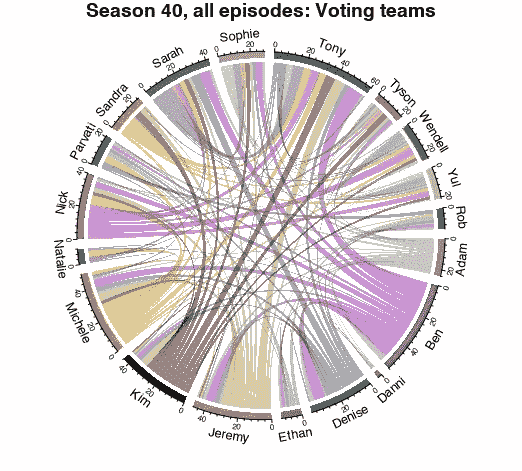

# 可视化幸存者电视节目数据集:幸存者个性和投票团队模式

> 原文：<https://towardsdatascience.com/visualizing-survivors-tv-show-data-set-castaways-personalities-and-voting-teams-patterns-a56774dda2a6?source=collection_archive---------36----------------------->

十几岁的时候，我记得电视真人秀《幸存者》每一集的精彩场面。虽然观众对角色的阴谋和策略有了接近真实的一瞥，但我们都知道真正的洞察力隐藏在原始数据中。

最近发布了一个新的公共数据集，记录了数据科学家希望在电视节目中看到的一切:从评级，到漂流者的个性，以及投票结果。

在这篇博文中，我将尝试一些我觉得有趣的可视化。

# 获奖者的性格特征是什么？

[Myers-Briggs Type Indicator](https://en.wikipedia.org/wiki/Myers%E2%80%93Briggs_Type_Indicator#Criticism)是一种流行的个性特征方法，尽管它作为一种心理测量工具的有效性一直是[许多批评](https://www.vox.com/2014/7/15/5881947/myers-briggs-personality-test-meaningless)的主题！但是有人(！？)正在努力对 40 季中的每一季进行分类，每集 20 名漂流者，参与者，以及…数据已经在那里了，所以为什么不看看呢。只是为了好玩。

```
bind_rows(
 castaways %>% ungroup %>% 
  mutate(place = case_when(
  result == ‘Sole Survivor’ ~ ‘Sole Survivor’, 
  result == ‘Runner-up’ ~ ‘Runner-up’,
                  TRUE ~ ‘voted-out / other’)) %>% 
  count(place, personality_type) %>% 
  group_by(place) %>% 
  mutate(perc = n / sum(n)) %>% 
  ungroup,

 castaways %>% ungroup %>% 
  count(personality_type) %>% 
  mutate(perc = n / sum(n)) %>% 
  mutate(place = ‘all’) 
 ) %>% 
 filter(!is.na(personality_type)) %>% 
 mutate(personality_type = as.factor(personality_type)) %>% 

 ggplot(aes(x = personality_type, y = perc)) + 
 geom_bar(position=”dodge”, stat=”identity”) +
 facet_grid(~place) +
 coord_flip() + 
 labs(title = ‘Survivors castaway personality type across all seasons, overall, and by winning place subgroups’,
 subtitle = ‘% are relative to the place-group only, e.g. Runner-up only, etc’,
 caption = ‘created by Dror Berel’) + 
 theme(axis.text.x = element_text(angle = 90))`
```



图来源:作者

首先，让我们来看看制片人是否有偏见选择，只选择特定的性格类型来表演。左侧的“所有”柱状图直观地表明，在所有 731 名遇难者中，总体上有一些平衡。接下来，我们看到赢家(“唯一幸存者”)拥有各种各样的人格类型，但可能倾向于 es 人格类型，特别是 [ESTP](http://www.breakthroughpsychologyprogram.com/what-is-my-personality-type-myers-briggs-estp.html) 。“亚军”往往也有 ES 的部分，尽管有些人拥有 IS 的特征，特别是 ISFP。

# 联盟/投票团队模式

第一次尝试用一个简单的条形图来显示被淘汰的漂流者。

```
## Barplot ----
vote_history %>% 
  filter(season == 40) %>% 
  mutate(vote = vote %>% fct_reorder(order)) %>% 
  ggplot(aes(vote, fill = castaway)) + 
  geom_bar() +
  facet_grid(.~episode) +
  coord_flip() +
  labs(title = 'Season 40 Voted out castaway',
         #subtitle = '% are relative to the place-group only, e.g. Runner-up only, etc',
         caption = 'created by Dror Berel') + 
    theme(axis.text.x = element_text(angle = 90))
```



图来源:作者

第一集展示了琥珀和娜塔莉，以及其他一些稀疏的漂流者之间的密切匹配。然后，接下来的几集没有那么多样的投票模式，也许在第六集丹尼斯和帕尔瓦蒂之间有一些额外的戏剧性时刻。

虽然上面的柱状图已经给出了一些关于哪些联盟一起投票的指示，但是下面的流程图显示了成对投票的模式。第一个仅针对第 1 集，随后是跨所有集的聚合。



图来源:作者



图来源:作者

拱门狭窄的漂流者在比赛初期就被淘汰了。在游戏中走得更远的幸存者有更长的拱门和更多的联盟。

你对特定的季节感兴趣吗？请继续关注另一篇全季全集可视化的博文。

用于可视化的 r 包: [ggplot2](https://ggplot2.tidyverse.org/) 、[circle circle](https://jokergoo.github.io/circlize_book/book/)、 [tidyverse](https://www.tidyverse.org/) 。

查看我的其他[博客文章](https://medium.com/@drorberel)和我的 [GitHub 页面](https://drorberel.github.io/)获得更多有趣的阅读。[领英](https://www.linkedin.com/in/dror-berel-1848496/)。