# 可视化超参数对支持向量机的影响

> 原文：<https://towardsdatascience.com/visualizing-the-effect-of-hyperparameters-on-support-vector-machines-b9eef6f7357b?source=collection_archive---------13----------------------->

## 直观地了解在支持向量机中使用不同的核函数和超参数时会发生什么

[万花筒](https://unsplash.com/@kaleidico?utm_source=medium&utm_medium=referral)在 [Unsplash](https://unsplash.com?utm_source=medium&utm_medium=referral) 上拍摄的照片

本文的目标是直观地查看 SVM 的每个超参数和核函数的效果，以了解它们对模型的影响。

首先简单介绍支持向量机，然后是数据集。就本项目而言，数据集是一个简单的数据集，只有两个特征，可以很容易地以二维方式可视化。数据集将分为训练数据集和验证数据集。并且，对于每个核函数，呈现了显示不同超参数的效果的可视化。

你可以在这个笔记本里找到[的源代码。](https://www.kaggle.com/carlosdg/effect-of-hyperparameters-and-kernels-on-svms)

# 目录

1.  支持向量机简介
2.  资料组
3.  流行的内核函数
4.  结论
5.  感谢

# 支持向量机简介

支持向量机是用于分类(或回归)任务的监督机器学习模型。在二元分类的情况下，有一个由𝑛观测值组成的数据集，每个观测值由𝑑维数的向量𝑥𝑖和目标变量𝑦𝑖组成，目标变量可以是 1 或 1，这取决于观测值是属于一个类还是属于另一个类。

使用这些数据，SVM 学习超平面的参数，𝑤⋅𝑥−𝑏=0 将空间分成两部分:一部分用于一个类的观察值，另一部分用于另一个类。此外，在分隔两个类的所有可能的超参数中，SVM 学习分隔它们最大的超参数，即，在每个类和超平面之间留下尽可能多的距离/余量

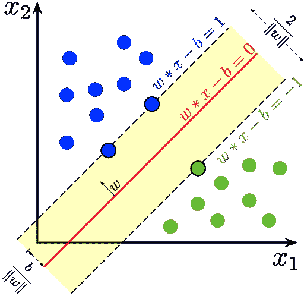

两类训练的 SVM 的最大边缘超平面和边缘。边缘上的样本被称为支持向量，因为它们是定义超平面所需的唯一样本。
图片由拉赫玛姆提供，CC BY-SA 4.0<[https://creativecommons.org/licenses/by-sa/4.0](https://creativecommons.org/licenses/by-sa/4.0)>，转自维基共享

为了学习超平面的参数，SVM 试图最大化观测值之间的间隔，并且附加约束是不同类别的观测值必须在超平面的不同侧。

本文不会详细讨论支持向量机如何获得这些参数背后的数学原理。然而，为了提供一些可能有用的直觉，有趣的是注意到当计算超平面的参数时，**训练数据、** 𝑥 **将仅作为标量积的一部分出现。**

由于这种观察，支持向量机可以利用所谓的核函数。这是一个函数，它返回两个向量之间的标量积，但不需要计算这些向量的坐标。这非常有用，因为我们可以模拟应用增加𝑥维度的操作，而不需要去更高维度，这在计算上更便宜(这被称为*内核技巧*)。

因此，支持向量机可以处理不可线性分离的数据。**SVM 不再试图为数据拟合复杂的函数，而是进入数据可以线性分离的更高维度，并在那里找到分离数据的超平面**(回到原始维度，它看起来不会像线性分离)。

因此，现在是时候说，支持向量机不计算超平面的参数，而是记住计算超平面所需的𝑥's，当新的输入数据到来时，支持向量机执行这些𝑥's(称为支持向量)和输入数据之间的标量积。同样，这是为了继续使用标量积并利用内核函数。

另一个要注意的有趣的事情是，在两个类之间找不到完美的分离是很常见的。这对于支持向量机是不利的，因为在训练(计算超平面参数)期间，它们试图最大化类别之间的间隔，并限制一个类别的观测值必须在超平面的一侧，而另一个类别的观测值必须在另一侧。为了有助于这一点，支持向量机有“软余量”，这是一个通过调节允许多少观察值通过余量来放松这一点的参数。

# 资料组

该数据集是对虹膜数据集的修改，只有两个维度，因此可以很容易地可视化。特别是，它由刚毛鸢尾和杂色鸢尾花的萼片长度和宽度组成。

下图显示了该数据集是如何划分为训练集和验证集的。此外，数据已经过预处理，具有平均值 0 和单位方差。这是一个很好的实践，因为**支持向量机使用标量积，所以如果一个变量的值范围比其他变量大，它将支配标量积的结果**。

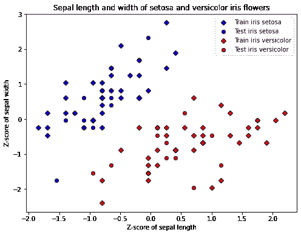

*作者图片*

# 流行的内核函数

本节介绍四种最常见的核函数以及每个超参数对 SVM 结果的影响。

# 线性核函数

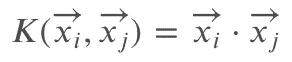

*作者图片*

这是最简单的核函数，因为它相当于不使用任何核函数。换句话说，它直接计算输入之间的标量积。它没有向 SVM 添加任何额外的超参数，并且可以很好地看到调节余量的超参数𝐶的效果。

接下来的图显示了在训练数据集上使用线性核训练 SVM 的结果

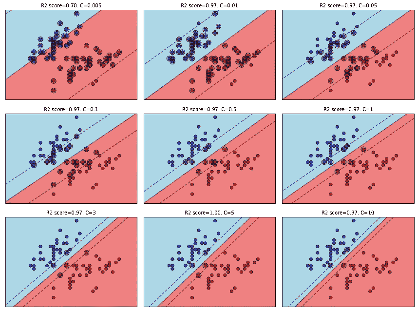

*作者图片*

背景色代表 SVM 的决定。训练数据集被表示为平面中的点，并且它们的类也用颜色表示。突出显示的点代表支持向量，即定义超平面的数据点。虚线代表 SVM 的边缘。在每个图的上方，您可以找到该 SVM 在验证数据集上的 R2 分数以及所用超参数的值。

如图所示，**增加超参数** 𝐶 **的效果是使边缘更紧**，因此，需要更少的支持向量来定义超平面。

# RBF 核函数(径向基函数)

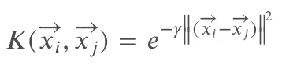

*作者图片*

该函数为调谐𝛾.增加了一个额外的超参数但是，与线性核函数的情况不同，该函数将数据映射到更高维度。从下图中可以看出，现在 SVM 可以表示非线性分离。

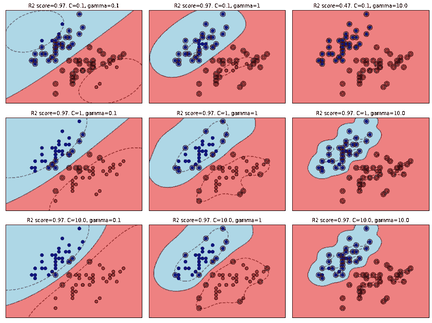

*作者图片*

从上到下，我们可以看到增加超参数𝐶的效果，如前所述，这会影响 SVM 的余量。

另一方面，从左到右，我们可以看到增加𝛾 **的效果:较低的值导致分色看起来更线性，随着** 𝛾 **的增加，它导致更复杂的分色**。

在𝛾足够高的情况下，训练集的每个观测值都是支持向量。换句话说，每个训练点都用于定义超平面，这表明明显的过拟合。此外，使用的支持向量越多，SVM 的计算开销就越大，并且它需要更多的时间来进行预测。

最后，有趣的是注意到，在数据的原始维度中观察分离，它看起来像高斯，就像核函数公式看起来像高斯一样。

# Sigmoid 核函数

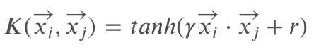

*作者图片*

在这个函数中有两个额外的超参数:𝑟和另一个也称为𝛾的超参数，正如下面可以看到的，它也影响分离的复杂性。

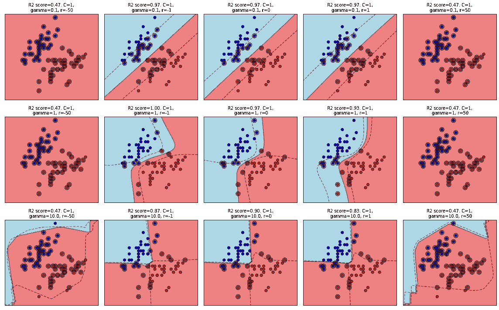

*作者图片*

现在，𝐶超参数已被修复，因为如上所示，它会影响边距。从上到下可以看到**改变** 𝛾 **的效果，这有助于使分离变得更加复杂，因为它增加了**，就像 RBF 核函数一样。

𝑟超参数变化不大，视觉效果不太清晰。但是看函数定义，tanh(γxi⋅xj + r)，**这个常数** 𝑟 **的作用是移动双曲正切:**

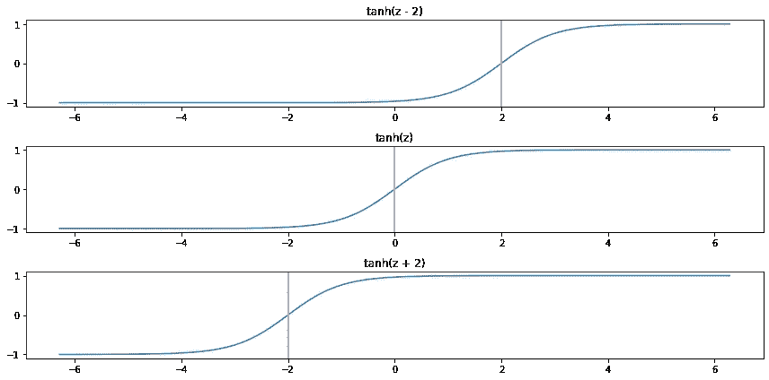

*作者图片*

**𝑟**常数的较大正值和负值支配着结果，这使得标量积更难对函数的结果产生影响。****

**如果我们将标量积解释为两个向量之间相似性的度量，那么核函数也表示相似性。因此，我们可以把𝑟的这种效应解释为使结果有偏差，如果我们知道某个类比另一个类更受偏爱，这是很有用的？**

# **多项式核函数**

**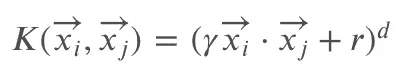**

***作者图片***

**这最后一个核函数有三个超参数:影响标量积的因子𝛾、常数𝑟和多项式的次数𝑑.**

**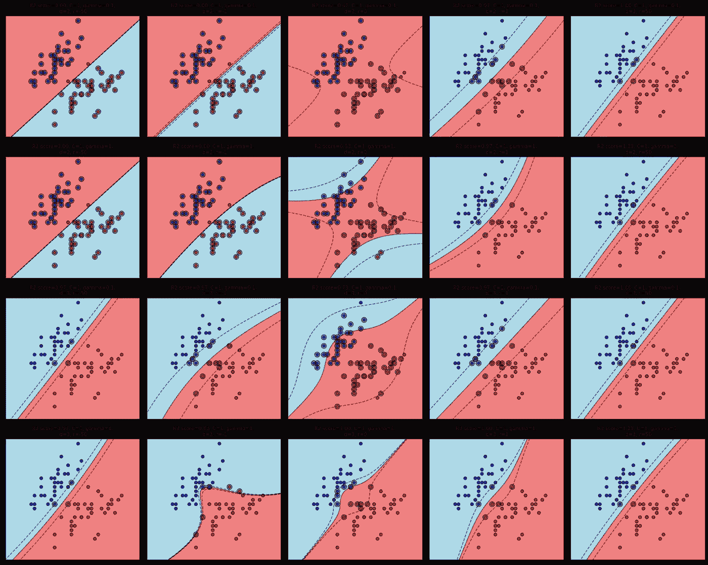**

***作者图片***

**从上到下可以看出，**增加多项式次数和** 𝛾 **的效果是进行更复杂的分离**。**

**从左到右可以看出，改变 𝑟 **的效果看起来类似于 sigmoid 函数中的** 𝑟 **所发生的情况，至少对于多项式的较低次而言是如此。****

# **结论**

**本文首先简要介绍了支持向量机，然后介绍了使用的数据集。然后，它显示了在原始数据的维度上，改变最常见的核函数的超参数的视觉效果。这些影响可以根据视觉直觉分为两类:它们影响 SVM 的边缘和/或它们影响分离的非线性。**

**通常建议使用 RBF 核作为“go-to”核函数，因为它只有两个超参数需要调整，并且可以模拟非线性分离。但是，正如许多事情一样，这可能不是任何任务的完美核函数，根据数据，可能有一个核函数可以更好地模拟类之间的分离。希望这篇文章给读者一种直觉，帮助他们选择要使用的核函数和/或更好地理解支持向量机🙂**

# **感谢**

**特别感谢[安吉尔·伊加丽塔](https://www.linkedin.com/in/angeligareta/)在本文发表前审阅了本文😊**

**感谢您阅读本文！😄有反馈吗？非常感谢🙂请在这里的评论中，或者在[笔记本](https://www.kaggle.com/carlosdg/effect-of-hyperparameters-and-kernels-on-svms)上，甚至在 [LinkedIn](https://www.linkedin.com/in/carlos-dominguez-garcia/) 上自由分享你的想法！**

**祝您愉快！🙂**