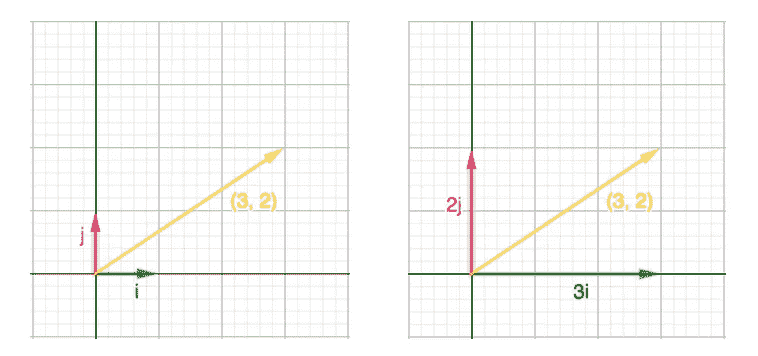
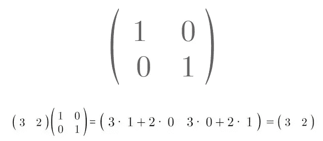
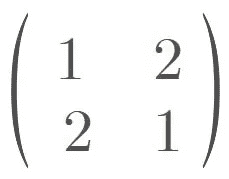
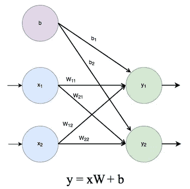
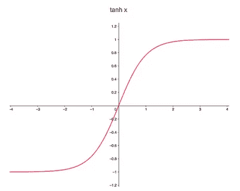

# 可视化 MLP:变换的组合

> 原文：<https://towardsdatascience.com/visualizing-the-mlp-a-composition-of-transformations-dec1c62d4eea?source=collection_archive---------33----------------------->

## 如何绘制非线性决策边界

由[乌列尔 SC](https://unsplash.com/@urielsc26?utm_source=medium&utm_medium=referral) 在 [Unsplash](https://unsplash.com?utm_source=medium&utm_medium=referral) 上拍摄的照片

# 介绍

神经网络通常被视为从数据中“学习”的黑盒。但是他们的重量实际上在学习什么呢？简而言之，他们正在学习以特定的方式操作向量空间。虽然这不是一个新的想法，但它是一个核心概念，在我打算阐述的课程中经常被忽略。在本文中，我将关注多层感知器，并理解一个复杂的决策边界是如何从一系列转换中形成的。

# 基本向量

在深入研究神经网络操作之前，我们需要一本线性代数入门书。

作者图片

*什么是基矢？*

基向量是坐标空间中独立的单位向量。在上图中，有两个基本向量定义了我们的 2D 平面:I 和 j。向量 I 的值为[1 0]，向量 j 的值为[0 1]。如上所述，平面上的所有其他矢量都可以表示为基本矢量的线性组合。这样，它们定义了坐标空间。

作者图片

让我们将两个基向量重新组织成一个矩阵，以加强这一想法，其中顶行包含向量 I，底行包含向量 j。如果我们取向量[3 ^ 2]和基向量矩阵的乘积，那么我们得到该向量在矩阵中的基向量所定义的坐标空间中的嵌入。虽然这听起来很抽象，但是通过下面的方式，这个想法是非常清晰的。

# 变换

为了更好地理解基向量如何定义坐标空间，让我们看看当我们改变基向量时会发生什么。

作者图片

向量 I 现在在[1 ^ 2]，向量 j 现在在[2 ^ 1]。在视频中，我们可以看到改变基向量如何通过线性变换来操纵坐标空间，这正是神经网络所做的。有关更深入的描述，请参见 3blue1brown 关于[线性变换](https://www.youtube.com/watch?v=kYB8IZa5AuE&list=PLZHQObOWTQDPD3MizzM2xVFitgF8hE_ab)的视频。

# 线性图层

作者图片

现在我们已经掌握了一些线性代数的基础知识，让我们来看看一个基本的线性层。在这种情况下，所有输入神经元通过明显学习的权重连接到所有输出神经元。所以每个输出神经元就是输入向量和权重向量的点积。我们可以将权重向量组织成矩阵 W，然后与输入向量 x 相乘，而不是单独编写所有这些内容。在这里，我们可以将 W 视为基本向量的矩阵，我们已经看到了更改这些值会对坐标空间产生什么影响。

但是偏见有什么作用呢？

类似于直线的方程，这里的偏差移动原点。在上面的示例中，对上述变换应用了[1，1]偏差。

# 激活功能

作者图片

激活函数通常紧接在上述线性变换之后。在这里，我们将研究双曲正切函数，它独立作用于每个输出神经元。该函数将线性运算的输出从-1 限制到 1。

众所周知，非线性在神经网络中起着重要作用，尤其是在绘制决策边界方面。但是他们实际上是如何划分这些界限的呢？他们通过变换坐标空间来实现。在上面的视频中，我们可以看到双曲正切函数是如何扭曲坐标空间的。当需要收缩或扩展不同的区域时，这种类型的行为非常有益。稍后对整个网络的可视化将阐明这一点。

# MLP 背后的直觉

既然我们已经介绍了线性图层的每个组件，那么多个图层如何一起工作呢？直观上，在 N 层的 MLP 中，前 N-1 层用于变换坐标空间，以使第 N 层更容易线性分离数据。我选择 MLP 作为基本案例来表达这个想法，因为它是最清晰的，但它可以很容易地显示其他运营商如何以不同的方式操纵坐标空间。

# 线性回归决策边界

我们已经了解了线性图层如何转换坐标空间，但现在让我们关注它如何绘制决策边界。Thomas Countz 在这里对单层感知器进行了详细的分析:

[https://medium . com/@ Thomas countz/calculate-the-decision-boundary-of-a-single-perceptron-visualizing-linear-separability-c4d 77099 ef 38](https://medium.com/@thomascountz/calculate-the-decision-boundary-of-a-single-perceptron-visualizing-linear-separability-c4d77099ef38)

总而言之，最终线性层中的权重向量(对于给定的输出神经元)定义了与决策边界正交的超平面，并且从该超平面，我们可以得到决策边界的方程如下:

*   b + w1*x + w2*y = 0
*   x 截距= (0，-b / w2)
*   y 轴截距= (-b / w1，0)
*   m = -(b / w2) / (b / w1)
*   y = (-(b / w2) / (b / w1))x + (-b / w2)

# 将它整合在一起

最后，我们可以充分了解 MLP 的运作。在上面的例子中，我们设想了一个四层的 MLP，每层分别有(2，2，2，1)个神经元。该网络在一个 2 类非线性可分螺旋数据集上进行训练，以突出显示该网络如何操纵原始坐标空间来使这两个类线性可分。

画好线后，通过反向操作将网络向后滚动到原始坐标空间。通过这个过程，我们可以看到潜在空间中的线是如何变成原始空间中的非线性决策边界的。

# 摘要

在这篇文章中，我简要介绍了从拓扑学的角度思考神经网络。我希望本教程对初学者有所启发，并且在设计新的架构时会更多地考虑组件的拓扑影响。

# 评论

本文旨在提供对神经网络如何运行的简化见解，因此我将这里省略的其他考虑留到以后的文章中。

所有的可视化都是通过开源软件 manim 的定制版本以编程方式产生的。