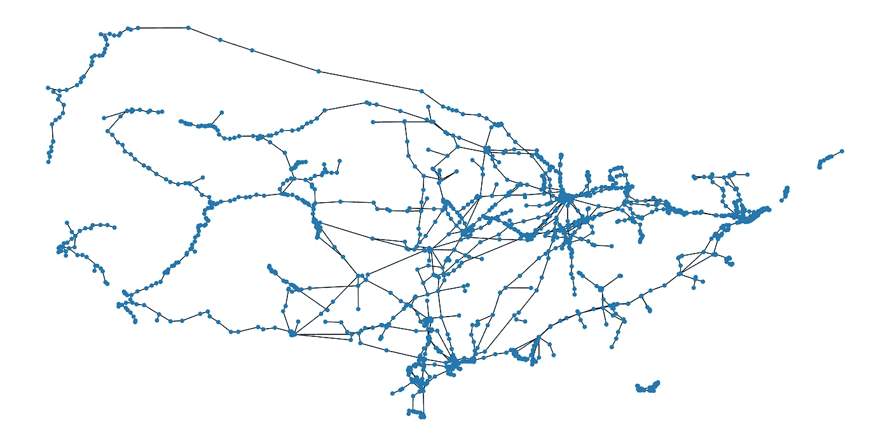

# 可视化美国石油管道网络

> 原文：<https://towardsdatascience.com/visualizing-u-s-petroleum-pipeline-networks-f46833e08dad?source=collection_archive---------29----------------------->

## 让我们用数据来理解殖民地管道在更大的美国石油产品管道网络中的作用。


美国主要的石油产品管道。来源:[环评](https://www.eia.gov/maps/layer_info-m.php)。图片来源:塞犍陀·维维克

最近殖民管道勒索软件网络攻击的影响遍及整个美国东南部。肇事者是一个著名的勒索软件组织，名为[黑暗面](https://krebsonsecurity.com/2021/05/a-closer-look-at-the-darkside-ransomware-gang/)，他们声称他们的目标从来不是扰乱社会:

> “我们的目标是赚钱，而不是给社会制造问题。从今天起，我们引入了审核机制，并检查我们的合作伙伴想要加密的每家公司，以避免未来的社会后果。”

但是人们怀疑这是否完全正确。毕竟，黑暗面的总部设在俄罗斯，最近源于俄罗斯的网络安全管理软件产品网络攻击导致多个美国政府服务器被攻破。这一事件以及最近发生的其他事件表明，俄罗斯确实有兴趣破坏美国的网络，甚至是关键的基础设施网络，例如那些穿越美国大部分地区的燃料网络。

让我们更深入地了解一下美国石油产品管道网络。这将有助于理解殖民地管道的作用。此外，来自俄罗斯、朝鲜、伊朗和中国的民族国家网络攻击的增加意味着，未来美国可能面临有针对性的攻击的风险，其目的是最大限度地破坏社会秩序。在这种情况下，最好考虑关键基础设施中的漏洞，以便在网络攻击成功的情况下建立弹性。

# 可视化管道形状文件

```
import networkx as nx
import matplotlib.pyplot as plt
import numpy as np
import pandas as pd
import re
import matplotlib.colors as mcolors
import geopandas as gpd
import contextily as ctxshapefile = gpd.read_file('./PetroleumProduct_Pipelines_US_EIA/PetroleumProduct_Pipelines_US_202001.shp')
shapefile2=shapefile[shapefile['geometry'].notnull()]shapefile3=shapefile2.to_crs(epsg=3857).sample(frac=1) #projecting to Spherical Mercator projection coordinate system for subsequent plotting on mapfig=plt.figure()
ax=shapefile3.plot(column='Shape_Leng', cmap='jet',linewidth=3,figsize=(32,16))
plt.axis('off')
ctx.add_basemap(ax)
```


美国主要的石油产品管道。来源: [EIA](https://www.eia.gov/maps/layer_info-m.php) 。图片来源:塞犍陀·维维克

我从 [EIA](https://www.eia.gov/maps/layer_info-m.php) 网站获取了美国主要石油产品管道的数据，并使用 Python GeoPandas 包加载了 shapefile。你可以看到暗红色的最大管道，这是殖民地管道。对 5 个最大管道的进一步观察证实了这一点。第二长的是从美国中西部到加拿大阿尔伯塔省的 Southern Lights 管道，第三长的是从路易斯安那到华盛顿特区的种植园管道，除了稍微短一点之外，几乎与殖民地管道相同。


5 条最大的石油产品管道|塞犍陀维维克

# 将 Shapefiles 转换为网络

```
#using shapely to convert geometry into string format
from shapely import wkt
shapefile2['str_geom'] = shapefile2.geometry.apply(lambda x: wkt.dumps(x))
net = nx.Graph()
nt=0for i in range(0,len(shapefile2)):
a=np.zeros(len(shapefile2['str_geom'][i].split())-1) #e.g. 4 points with 8 coordinates means a has 8 values
nt+=len(a)/2
for j in range (0,len(a)):
  a[j]=float(re.findall(r"[-+]?\d*\.\d+|\d+", shapefile2['str_geom'][i].split()[j+1])[0])
for k in range(0, int(len(a)/2)-1):
  net.add_edge((a[2*k],a[2*k+1]),(a[2*k+2],a[2*k+3]))positions = {n: (n[0], n[1]) for n in list(net.nodes)}fig, ax = plt.subplots(figsize=(16,8))
ax.tick_params(left=True, bottom=True, labelleft=True, labelbottom=True)
nx.draw(net, positions, ax=ax, node_size=20)
plt.tight_layout()
```



节点和边的石油产品管道网络|塞犍陀·维韦克

每个 shapefile 行包含管道中点的坐标。我将每个点表示为一个节点，并通过边连接这些点，通过边使用 NetworkX Python 包构建网络。现在我们有了网络，我们可以运行一些经典的网络算法来发现哪些节点或管道段对于整个管道网络是至关重要的。

# 中心性度量

在图论和网络分析中，[中心性度量](https://en.wikipedia.org/wiki/Centrality)确定节点在整个网络中的相对重要性。我将使用介数中心性，它是网络中一个节点对信息流(T3)(或者在这种情况下，石油流)的影响的[量。中间中心性度量如下所示:](https://neo4j.com/docs/graph-algorithms/current/labs-algorithms/betweenness-centrality/#:~:text=Betweenness%20centrality%20is%20a%20way,of%20a%20graph%20to%20another.)


中间中心性|维基百科

在等式中，分子是节点 *s* 和 *t* 之间通过节点 *v* 的最短路径的数量，分母是 *s* 和*t*之间所有最短路径的数量，求和是对所有节点对进行的。在我们的例子中，中间中心性应该给出在更大的网络中哪个管道段对石油运输最重要的感觉。

```
fig, ax = plt.subplots(figsize=(16,8))ax.tick_params(left=True, bottom=True, labelleft=True, labelbottom=True)
nodes = nx.draw_networkx_nodes(net, positions,ax=ax, node_size=20, cmap=plt.cm.jet,node_color=list(nx.betweenness_centrality(net).values()),nodelist=nx.betweenness_centrality(net).keys())edges = nx.draw_networkx_edges(net, positions,ax=ax)
plt.axis('off')
plt.title('Betweenness Centrality')
plt.colorbar(nodes)
plt.tight_layout()
```


石油产品管道网络，由中间中心值着色的节点|塞犍陀·维韦克

具有最高介数中心性的节点位于南卡罗来纳州的殖民地管道的中心。这让我感到惊讶，因为我原以为最重要的节点可能位于更靠近美国地理中心的地方

# 结论

Colonial 管道的绝对长度以及中间中心性指标都将 Colonial 管道视为美国石油产品管道网络中最重要的资产。一个更大的问题是攻击者如何最大限度地破坏社会秩序，比如一个民族国家的行为。那些后果会是什么？我们已经看到了殖民地管道勒索软件攻击后几周的天然气供应中断和价格上涨。如果多条这样的管道被关闭，情况会是怎样？我们如何建立社会对成功攻击的弹性？

我们可以通过多维数据源和灾难期间的点点滴滴来学习很多东西，以便在未来，我们作为一个社会有更好的准备。在殖民地管道网络攻击的案例中:管道网络、炼油厂和存储位置、运输供应链以及短缺加油站的位置可以帮助理解事件链。这一认识将使我们为未来的网络攻击做好更充分的准备。

总之——要让社会抵御网络攻击，还有很多事情要做。但我认为第一步在于量化复杂的社会对这种攻击的脆弱性。不幸的是(或者是故意的)——在 Colonial pipeline 事件中，数据明确显示，攻击关闭了整个美国石油产品管道网络中最重要的管道，导致几周的天然气短缺。

*有兴趣的话，下面详细介绍一下带代码的 Google Colab 笔记本。*

<https://colab.research.google.com/drive/1FaK2wiUV_3MqJViGS1m-xQYPUXGG5EaT?usp=sharing>  *如果你喜欢这篇文章——我经常写复杂系统、物理学、数据科学和社会的界面*