# 使用 Welly Python 库可视化井眼轨迹

> 原文：<https://towardsdatascience.com/visualizing-well-paths-with-the-well-python-library-2104b28e5c3?source=collection_archive---------7----------------------->

## 使用 Matplotlib 创建 3D 线图以可视化井眼轨迹

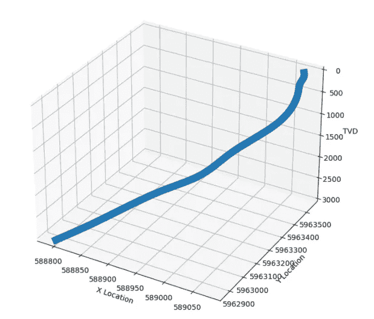

显示从 Welly Python 库生成的井眼轨迹位置的 3D 线图。图片由作者提供。

测井中使用多个深度参考来表示沿井筒的位置。这些包括测量深度(MD)、真实垂直深度(TVD)、真实水下垂直深度(TVDSS)等。所有这些都是油井成功开发和完井的关键衡量标准。

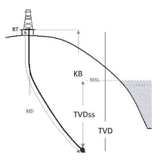

显示 MD、TVD 和 TVDSS 之间差异的图示。图片来源:[http://petroleum-companies . blogspot . com/2013/12/diffused-well-directional . html](http://petroleum-companies.blogspot.com/2013/12/deviated-well-directional.html)

上图展示了本文中提到的关键深度参考。

*   测量深度(MD)是沿井眼长度测量的井眼长度。
*   真实垂直深度(TVD)，是基准面(如转盘)和井筒中一点之间的绝对垂直距离。
*   海底真实垂直深度(TVDSS)，是平均海平面和井筒中某点之间的绝对垂直距离。

当井是垂直的时，MD 等于从同一基准面测量的 TVD。在井斜的情况下，TVD 值变得小于 MD 值。

大多数 LAS 文件都参考测量深度，通常不包含 TVD 曲线。因此，我们必须用一些数学来计算 TVD。为此，我们需要井的倾斜度，即井眼与垂直方向的偏差，我们还需要方位角，测量井眼轨迹相对于北方的方向。

在本文中，我们不会关注 TVD 背后的计算，相反，我们将了解如何使用 Welly 的位置模块来计算它。如果你想知道更多关于计算背后的数学知识，我在下面的描述中提供了一些文章的链接。

<https://www.drillingformulas.com/minimum-curvature-method/>  

## 视频版教程

如果你喜欢跟随视频，你可以在我的 YouTube 频道找到它。

# Python 教程

## 导入库和加载数据

让我们从导入将要使用的库开始。这些是来自 welly 图书馆和熊猫图书馆的位置和井模块。

```
from welly import Location
from welly import Well
import pandas as pd
```

一旦我们导入了这些，我们就可以加载数据了。本例中使用的数据来自北海的荷兰部分，可以在 [NLOG 网站](https://www.nlog.nl)或我的 [Github Repo 上找到。](https://github.com/andymcdgeo/Andys_YouTube_Notebooks)

```
data = Well.from_las('Netherlands Data/L05-15-Spliced.las')
```

## 检查数据

如果我们调用刚刚创建的`data`变量，我们可以得到油井的摘要。我们可以看到井的名称、位置以及文件中包含的数据信息。

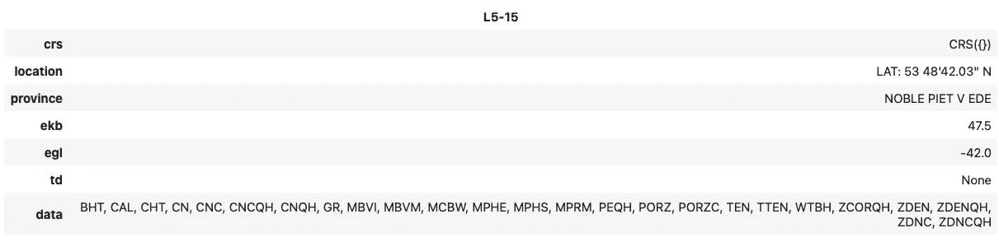

使用 Python Welly 库生成的井的摘要(图片由作者提供)

如果我们想更仔细地查看数据，我们可以调用我们的 well 对象，后跟`.data`。这提供了一个包含曲线助记符以及前 3 行和后 3 行中包含的值的 dictionary 对象。不出所料，大部分数据都丢失了。

```
data.data{'BHT': Curve([nan, nan, nan, ..., nan, nan, nan]),
 'CAL': Curve([nan, nan, nan, ..., nan, nan, nan]),
 'CHT': Curve([nan, nan, nan, ..., nan, nan, nan]),
 'CN': Curve([nan, nan, nan, ..., nan, nan, nan]),
 'CNC': Curve([nan, nan, nan, ..., nan, nan, nan]),
 'CNCQH': Curve([nan, nan, nan, ..., nan, nan, nan]),
 'CNQH': Curve([nan, nan, nan, ..., nan, nan, nan]),
 'GR': Curve([nan, nan, nan, ..., nan, nan, nan]),
 'MBVI': Curve([nan, nan, nan, ..., nan, nan, nan]),
 'MBVM': Curve([nan, nan, nan, ..., nan, nan, nan]),
 'MCBW': Curve([nan, nan, nan, ..., nan, nan, nan]),
 'MPHE': Curve([nan, nan, nan, ..., nan, nan, nan]),
 'MPHS': Curve([nan, nan, nan, ..., nan, nan, nan]),
 'MPRM': Curve([nan, nan, nan, ..., nan, nan, nan]),
 'PEQH': Curve([nan, nan, nan, ..., nan, nan, nan]),
 'PORZ': Curve([nan, nan, nan, ..., nan, nan, nan]),
 'PORZC': Curve([nan, nan, nan, ..., nan, nan, nan]),
 'TEN': Curve([nan, nan, nan, ..., nan, nan, nan]),
 'TTEN': Curve([nan, nan, nan, ..., nan, nan, nan]),
 'WTBH': Curve([   nan,    nan, 87.943, ...,    nan,    nan,    nan]),
 'ZCORQH': Curve([nan, nan, nan, ..., nan, nan, nan]),
 'ZDEN': Curve([nan, nan, nan, ..., nan, nan, nan]),
 'ZDENQH': Curve([nan, nan, nan, ..., nan, nan, nan]),
 'ZDNC': Curve([nan, nan, nan, ..., nan, nan, nan]),
 'ZDNCQH': Curve([nan, nan, nan, ..., nan, nan, nan])}
```

理解数据内容的更好方法是查看[测井曲线](https://youtu.be/yNnMY_-X0Bo)。我们可以通过调用`data.plot`并设置曲线范围的关键字参数来实现。我们可以生成一个从第一个测量值开始到最后一个测量值的图。

```
data.plot(extents='curves')
```

这将返回以下图。该图允许我们快速查看每个测井测量的内容及其特征，如果数据中存在大量曲线，则很难查看。

在本文中，我们不会对测井数据进行绘图，但是如果您感兴趣，请务必查看我在 welly 系列中的 [YouTube 视频](https://youtu.be/IUPajB6fETY)，在该视频中，我重点介绍了单井和多井的工作。

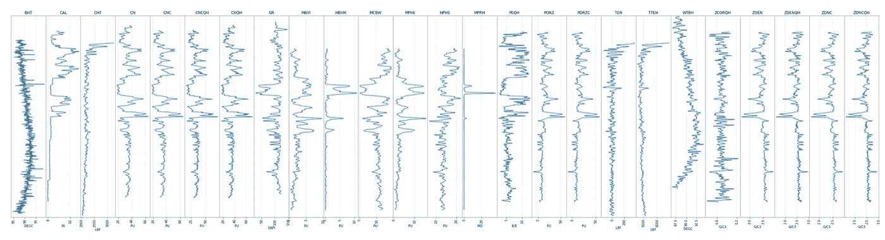

Welly 生成的显示井内容的测井图。图片由作者提供。

# 使用测量数据和 Welly

## 导入调查数据

现在我们已经加载了日志数据，我们可以开始加载调查数据了。

在钻井过程中，通常以不规则的间隔测量勘测数据。它给出了测量时测量深度(MD)、倾角(INC)和方位角(AZI)的快照。由此，我们可以计算出油井原点的真实垂直深度(TVD)、x 偏移和 y 偏移。

通常，数据以表格或 CSV 格式提供。要加载 CSV 数据，我们可以使用`pd.read_csv()`并传入文件的位置及其名称。

```
survey = pd.read_csv('Netherlands Data/L05-15-Survey.csv')
```

当我们调用调查对象时，我们看到返回了一个包含关键井位置信息的数据帧。

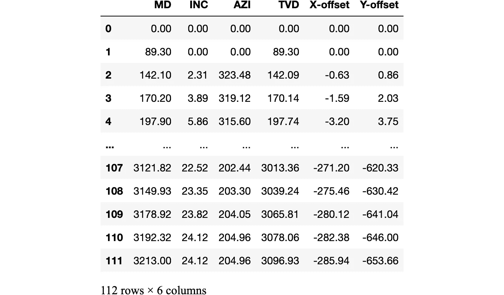

熊猫数据框中的井调查数据。图片由作者提供。

Welly 要求勘测数据包含测量的深度、倾斜度和方位角。这允许库计算 TVD、X 偏移和 Y 偏移。

我们可以通过调用调查数据框架并使用方括号传入所需列名的列表来对数据进行子集化。

```
survey_subset = survey[['MD', 'INC', 'AZI']]
```

当我们调用`survey_subset`时，我们得到下面的数据帧。

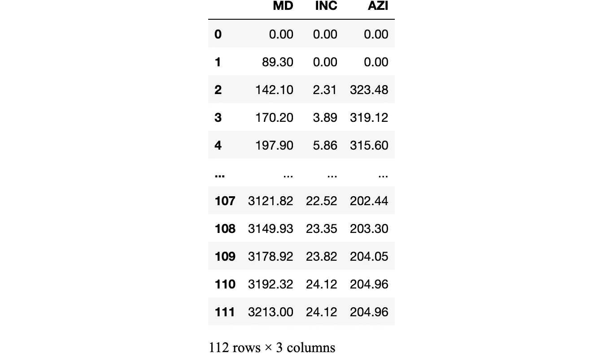

准备好要导入 Welly Python 库的测量数据。图片由作者提供。

## 向油井添加测量数据

从 CSV 文件中加载调查数据后，我们需要计算我们的位置参数。默认情况下， [Welly](https://github.com/agile-geoscience/welly) 被设置为使用最小曲率法计算这些，这是最常见和最精确的方法。

有关此方法的更多信息，请访问[https://petro wiki . SPE . org/Calculation _ methods _ for _ directional _ survey](https://petrowiki.spe.org/Calculation_methods_for_directional_survey)

要将测量数据添加到井中，我们可以调用以下内容

```
#Add deviation data to a well
data.location.add_deviation(survey_subset.values)
```

既然勘测数据已经加载到我们的 Welly well 对象中，我们可以调用`data.location.position`来查看数据。对于这个例子，我使用切片符号只返回数据的前 5 行。

```
#View first five rows of the data
data.location.position[:5]
```

返回的数组格式为:X 轴偏移量、Y 轴偏移量和 TVD。

```
array([[  0\.        ,   0\.        ,   0\.        ],
       [  0\.        ,   0\.        ,  89.3       ],
       [ -0.6333253 ,   0.8552655 , 142.08569704],
       [ -1.59422229,   2.03112298, 170.14372544],
       [ -3.19869524,   3.75201703, 197.74222054]])
```

我们可以通过分割数组将每个位置参数提取到变量中。这是通过使用方括号并使用冒号(:)后跟数组中的列来选择所有行来完成的。

```
x_loc = data.location.position[:,0]
y_loc = data.location.position[:,1]
z_loc = data.location.position[:,2]
```

如果我们调用 z_loc，它是我们的 TVD，我们得到下面的数组:

```
array([   0\.        ,   89.3       ,  142.08569704,  170.14372544,
        197.74222054,  225.68858529,  254.17872844,  282.83986178,
        311.3294853 ,  339.82739229,  368.42706739,  396.92691062,
        425.62638313,  454.22551155,  482.42473573,  511.12342097,
        539.72042719,  568.21483874,  597.00539705,  625.8900492 ,
        654.36614119,  683.22656973,  711.6691264 ,  740.00649462,
        767.54748074,  797.06893638,  825.36408467,  853.83548556,
        882.30553194,  910.5784206 ,  939.03148052,  967.35658945,
        995.56380403, 1023.95695144, 1052.22740711, 1080.54668678,
       1108.68959153, 1136.6589388 , 1164.87003188, 1192.91335907,
       1220.78632672, 1248.71483434, 1276.69724251, 1304.38501765,
       1332.02759325, 1359.48829109, 1386.59399864, 1413.47807554,
       1440.51055639, 1467.37758752, 1494.27990524, 1521.15255355,
       1547.94826077, 1574.81148851, 1601.67556214, 1628.46190115,
       1655.38744119, 1682.77094459, 1709.94467279, 1737.02953371,
       1764.09191195, 1791.3868565 , 1818.75450935, 1845.99897829,
       1873.48895669, 1900.86728951, 1928.20315443, 1955.1719983 ,
       1982.16522007, 2009.02433087, 2035.75920778, 2062.44460278,
       2088.89113734, 2115.18715337, 2141.53399746, 2167.86835015,
       2194.17601217, 2220.34087524, 2246.65950847, 2273.26101123,
       2300.13882036, 2326.97261339, 2353.95042418, 2380.81977995,
       2407.70173751, 2434.4676547 , 2460.90920154, 2472.20902514,
       2498.66491934, 2525.74629926, 2553.35452297, 2579.86481719,
       2606.67927736, 2634.67341768, 2663.73057678, 2690.48389425,
       2716.3110963 , 2743.39559139, 2770.53319932, 2798.10117685,
       2824.99473242, 2851.85337513, 2879.55133503, 2906.56976579,
       2933.96384651, 2960.25680057, 2986.50202763, 3013.35506117,
       3039.2427437 , 3065.81112303, 3078.05551274, 3096.92997476])
```

我们也可以通过调用`data.location.tvd.`来访问相同的数据

```
array([   0\.        ,   89.3       ,  142.08569704,  170.14372544,
        197.74222054,  225.68858529,  254.17872844,  282.83986178,
        311.3294853 ,  339.82739229,  368.42706739,  396.92691062,
        425.62638313,  454.22551155,  482.42473573,  511.12342097,
        539.72042719,  568.21483874,  597.00539705,  625.8900492 ,
        654.36614119,  683.22656973,  711.6691264 ,  740.00649462,
        767.54748074,  797.06893638,  825.36408467,  853.83548556,
        882.30553194,  910.5784206 ,  939.03148052,  967.35658945,
        995.56380403, 1023.95695144, 1052.22740711, 1080.54668678,
       1108.68959153, 1136.6589388 , 1164.87003188, 1192.91335907,
       1220.78632672, 1248.71483434, 1276.69724251, 1304.38501765,
       1332.02759325, 1359.48829109, 1386.59399864, 1413.47807554,
       1440.51055639, 1467.37758752, 1494.27990524, 1521.15255355,
       1547.94826077, 1574.81148851, 1601.67556214, 1628.46190115,
       1655.38744119, 1682.77094459, 1709.94467279, 1737.02953371,
       1764.09191195, 1791.3868565 , 1818.75450935, 1845.99897829,
       1873.48895669, 1900.86728951, 1928.20315443, 1955.1719983 ,
       1982.16522007, 2009.02433087, 2035.75920778, 2062.44460278,
       2088.89113734, 2115.18715337, 2141.53399746, 2167.86835015,
       2194.17601217, 2220.34087524, 2246.65950847, 2273.26101123,
       2300.13882036, 2326.97261339, 2353.95042418, 2380.81977995,
       2407.70173751, 2434.4676547 , 2460.90920154, 2472.20902514,
       2498.66491934, 2525.74629926, 2553.35452297, 2579.86481719,
       2606.67927736, 2634.67341768, 2663.73057678, 2690.48389425,
       2716.3110963 , 2743.39559139, 2770.53319932, 2798.10117685,
       2824.99473242, 2851.85337513, 2879.55133503, 2906.56976579,
       2933.96384651, 2960.25680057, 2986.50202763, 3013.35506117,
       3039.2427437 , 3065.81112303, 3078.05551274, 3096.92997476])
```

## 创建位置图

为了了解井的位置，我们可以看三幅图。

*   x 偏移与 Y 偏移(地形图)
*   x 偏移与 TVD
*   y 偏移与 TVD

为了创建这些图，我们可以使用 matplotlib 并使用 [subplot2grid](https://youtu.be/pPqLgmbyets) 创建多个图。

```
import matplotlib.pyplot as plt

fig, ax = plt.subplots(figsize=(15,5))
ax1 = plt.subplot2grid(shape=(1,3), loc=(0,0))
ax2 = plt.subplot2grid(shape=(1,3), loc=(0,1))
ax3 = plt.subplot2grid(shape=(1,3), loc=(0,2))

ax1.plot(x_loc, y_loc, lw=3)
ax1.set_title('X Location vs Y Location')

ax2.plot(x_loc, z_loc, lw=3)
ax2.set_title('X Location vs TVD')

ax3.plot(y_loc, z_loc, lw=3)
ax3.set_title('Y Location vs TVD')Text(0.5, 1.0, 'Y Location vs TVD')
```

这将返回我们的三个井剖面图。

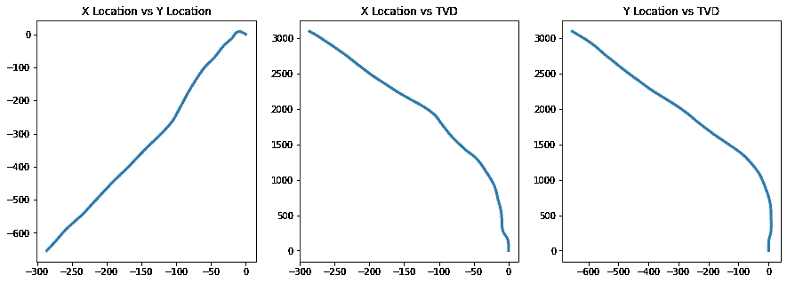

使用 matplotlib 和 Welly 生成的油井剖面。图片由作者提供。

请注意，这两个 TVD 图是颠倒的，我们将使用`ax.invert_yaxis()`进行排序。

## 为井的起点和终点添加标记

我们可以在图中添加标记，以显示井的起始位置(黑色方块)和结束位置(红星)。此外，我们将反转两个 TVD 图的 y 轴。

```
fig, ax = plt.subplots(figsize=(15,5))
ax1 = plt.subplot2grid(shape=(1,3), loc=(0,0))
ax2 = plt.subplot2grid(shape=(1,3), loc=(0,1))
ax3 = plt.subplot2grid(shape=(1,3), loc=(0,2))

ax1.plot(x_loc, y_loc, lw=3)
ax1.plot(x_loc[0], y_loc[0], marker='s', color='black', ms=8)
ax1.plot(x_loc[-1], y_loc[-1], marker='*', color='red', ms=8)
ax1.set_title('X Location vs Y Location')

ax2.plot(x_loc, z_loc, lw=3)
ax2.plot(x_loc[0], z_loc[0], marker='s', color='black', ms=8)
ax2.plot(x_loc[-1], z_loc[-1], marker='*', color='red', ms=8)
ax2.invert_yaxis()
ax2.set_title('X Location vs TVD')

ax3.plot(y_loc, z_loc, lw=3)
ax3.plot(y_loc[0], z_loc[0], marker='s', color='black', ms=8)
ax3.plot(y_loc[-1], z_loc[-1], marker='*', color='red', ms=8)
ax3.invert_yaxis()
ax3.set_title('Y Location vs TVD')Text(0.5, 1.0, 'Y Location vs TVD')
```

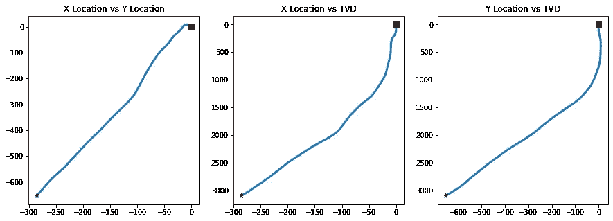

使用 matplotlib 和 Welly 生成的油井剖面。还标记了孔的开始(黑色方块)和结束(红星)位置。图片由作者提供。

## 与原始调查进行比较

幸运的是，我们有一个包含位置参数和 TVD 的测量文件，但情况可能并不总是如此。通过将数据添加到我们的图中，我们可以快速检查 Welly 计算的数据和 CSV 文件中包含的数据。

```
fig, ax = plt.subplots(figsize=(15,5))
ax1 = plt.subplot2grid(shape=(1,3), loc=(0,0))
ax2 = plt.subplot2grid(shape=(1,3), loc=(0,1))
ax3 = plt.subplot2grid(shape=(1,3), loc=(0,2))

ax1.plot(x_loc, y_loc, lw=7)
ax1.plot(x_loc[0], y_loc[0], marker='s', color='black', ms=8)
ax1.plot(survey['X-offset'], survey['Y-offset'])
ax1.plot(x_loc[-1], y_loc[-1], marker='*', color='red', ms=8)
ax1.set_title('X Location vs Y Location')

ax2.plot(x_loc, z_loc, lw=7)
ax2.plot(x_loc[0], z_loc[0], marker='s', color='black', ms=8)
ax2.plot(survey['X-offset'], survey['TVD'])
ax2.plot(x_loc[-1], z_loc[-1], marker='*', color='red', ms=8)
ax2.invert_yaxis()
ax2.set_title('X Location vs TVD')

ax3.plot(y_loc, z_loc, lw=7)
ax3.plot(y_loc[0], z_loc[0], marker='s', color='black', ms=8)
ax3.plot(survey['Y-offset'], survey['TVD'])
ax3.plot(y_loc[-1], z_loc[-1], marker='*', color='red', ms=8)
ax3.invert_yaxis()
ax3.set_title('X Location vs TVD')Text(0.5, 1.0, 'X Location vs TVD')
```

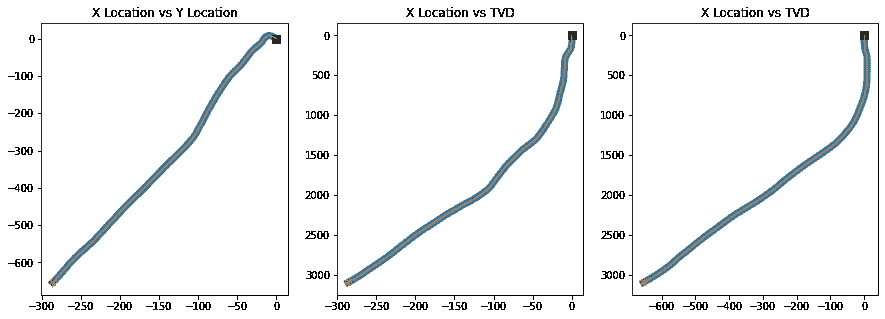

# 创建井眼轨迹的 3D 图

我们可以使用 matplotlib 以三维方式查看数据，而不是以二维方式查看数据。但首先，我们要计算连续的数据。这是通过使用`location.trajectory()`来完成的。这里我们可以提供一个数据，即地面井位的 UTM 坐标和一个垂直偏移。

如果我们看看 NLOG 网站上的下图，我们就有了油井的精确表面坐标

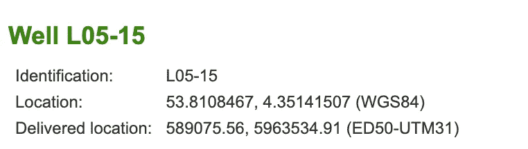

我们将在`location.trajectory()` 功能中使用交付的位置坐标。

```
# Create a trajectory of regularly sampled points
location_data = data.location.trajectory(datum=[589075.56, 5963534.91, 0], elev=False)xs = location_data[:,0]
ys = location_data[:,1]
zs = location_data[:,2]plt.plot(xs, ys)
plt.xlabel('X Location')
plt.ylabel('Y Location')
plt.ticklabel_format(style='plain')
plt.grid()
```

当我们运行此代码时，我们现在有了油井的地形图，这些值反映了油井的真实坐标。

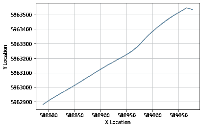

使用参考基准面的 Welly Python 库创建的井眼轨迹计划。图片由作者提供。

## 创建 3D 绘图

现在，井位已经参考了基准面，我们可以继续绘制井眼轨迹了。不需要应用前面的步骤，您可以使用 x、y 和 z 位置进行查看

为了创建 3D 绘图，我们需要从`mpl_toolkits.mplot3d`导入 Axes3D，然后当我们需要启用 3D 绘图时，使用一个神奇的 Jupyter 命令:`%matplotlib widget`。

然后，我们创建图形并将投影设置为 3d，如下面的代码所示。

```
from mpl_toolkits.mplot3d import Axes3D# Enable 3D Ploting
%matplotlib widgetfig = plt.figure(figsize=(8, 8))

ax = plt.axes(projection='3d')
ax.plot3D(xs, ys, zs, lw=10)
ax.set_zlim(3000, 0)

ax.set_xlabel('X Location')
ax.set_ylabel('Y Location')
ax.set_zlabel('TVD')

plt.ticklabel_format(style='plain')
plt.show()
```

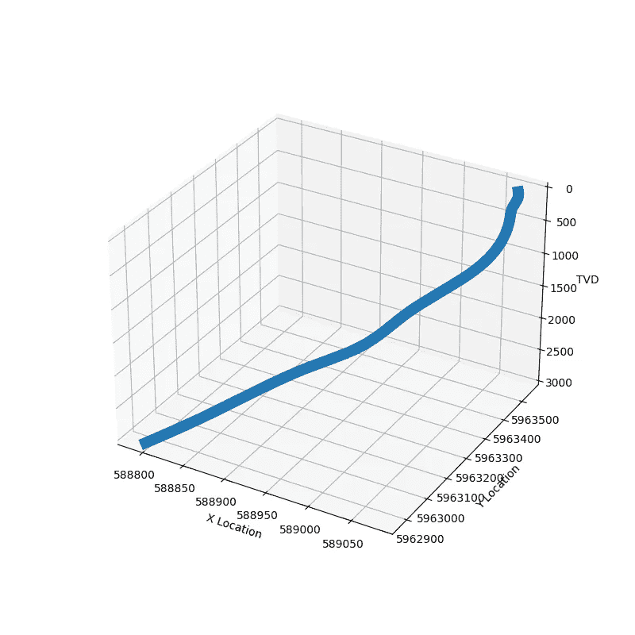

用 Welly 和 Matplotlib 创建的交互式 3D 井眼轨迹。图片由作者提供。

# 摘要

在这个简短的教程中，我们已经了解了如何将原始井测量数据与井井对象相结合，以及如何在平面图和侧视图中显示井井轨迹。我们还看到了如何使用 matplotlib 在 3D 中可视化井眼轨迹。这样，我们可以更好地了解井眼轨迹。

*感谢阅读！*

如果您觉得这篇文章有用，请随时查看我的其他文章，这些文章介绍了 Python 和测井数据的各个方面。你也可以在[*GitHub*](https://github.com/andymcdgeo)*找到我在这篇文章和其他文章中使用的代码。*

*如果你想联系我，你可以在*[*LinkedIn*](https://www.linkedin.com/in/andymcdonaldgeo/)*或者我的* [*网站*](http://andymcdonald.scot/) *找到我。*

有兴趣了解更多关于 python 和测井数据或岩石物理学的知识吗？跟我上 [*中*](https://andymcdonaldgeo.medium.com/subscribe) *。*

如果你喜欢阅读这些教程，并想支持我作为一名作家和创作者，那么请考虑报名成为一名媒体成员。一个月 5 美元，你就可以无限制地阅读数千篇各种主题的文章。如果您使用 [**我的链接**](https://andymcdonaldgeo.medium.com/membership) **，**注册，我将为您赚取一小笔佣金，无需额外费用！

<https://andymcdonaldgeo.medium.com/membership> 