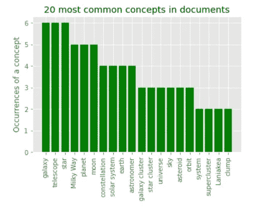
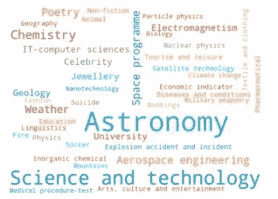

# 使用 expert.ai 可视化文档的真实内容

> 原文：<https://towardsdatascience.com/visualizing-what-docs-are-really-about-with-expert-ai-cd537e7a2798?source=collection_archive---------37----------------------->

## 关于如何使用 expert.ai NL API 检索和可视化文本文档中隐藏的相关数据的简短教程。


照片由[帕特里克·福尔](https://unsplash.com/@patrickian4?utm_source=medium&utm_medium=referral)在 [Unsplash](https://unsplash.com?utm_source=medium&utm_medium=referral) 拍摄

如果您曾经处理过文本数据集，您就会知道在数据集中检索中心信息、避免干扰或冗余是多么困难。如果你想训练你自己的模型，很多方法都可以得到很好的结果，但是这需要时间和资源。在下面的教程中，我们将探索如何使用 expert.ai NL API Python SDK 检索文本中的隐藏信息，这不需要模型训练，然后将结果可视化为可以添加到报告中的图表。

# 什么是 expert.ai NL API？

expert.ai 自然语言 API 是由 expert.ai 开发的服务，可用于轻松构建 NLP 应用程序。该库包括多种功能，如 NLP 管道(标记化、词汇化、词性标注、依存解析、句法解析、词义消歧)和即用型 IPTC 媒体主题分类器、地理分类和情感分析。命名实体识别(NER)也被执行，其中实体被链接到它们在公共知识库(例如，Wikidata、GeoNames、DBpedia)中的唯一标识。对于任何对自然语言处理感兴趣的人来说，expert.ai NL API 都是一个有用的工具，因为它易于使用并且提供了广泛的功能。该技术由 expert.ai 开发，该公司在提供语言解决方案方面拥有 20 多年的经验，这使得该 API 非常适合任何有兴趣构建业务就绪型解决方案的人。

# 第一步:安装 expert.ai NL API python SDK

在本教程中，我们将使用用于 expert.ai 自然语言 API 的 Python 客户端来为 Python 应用程序添加自然语言理解功能。
您可以使用`pip`来安装库:

```
$ pip install expertai-nlapi
```

## 建立

要使用 expert.ai NL API，您需要在 [expert.ai 开发者门户](https://developer.expert.ai/ui/)上创建您的凭证。Python 客户端代码期望 expert.ai 开发人员帐户凭据作为环境变量可用:

*   Linux:

```
**export** EAI_USERNAME**=**YOUR_USER
**export** EAI_PASSWORD**=**YOUR_PASSWORD
```

*   Windows 操作系统

```
SET EAI_USERNAME**=**YOUR_USER
SET EAI_PASSWORD**=**YOUR_PASSWORD
```

您也可以在代码中定义它们:

```
**import** os
os.environ["EAI_USERNAME"] **=** YOUR_USER
os.environ["EAI_PASSWORD"] **=** YOUR_PASSWORD
```

# 第二步:关键要素

现在，我们可以在一组文档上使用开箱即用特性来检索它们的关键元素。
首先:导入库并初始化对象。

然后，设置文本和语言:

我们可以执行第一次分析，简单地看一下文档的内容。*关键元素*通过`relevants`分析获得，并在文档中被识别为主句、主要概念(称为“同步子”)、主要引理和相关主题:

expert.ai 引擎执行词义消歧，这要归功于一个专有的知识图，它存储了每种语言的所有概念。这有助于引擎理解文档中出现的概念。
注意概念和引理的不同。一个概念可以用一个或多个同义词来表示。例如，如果我们在文本中找到 *home* 和 *house* ，expert.ai 技术理解这两个词条具有相同的含义，并为它们分配概念的首选标签——在这种情况下将是 *house* 。
让我们看看在之前的文本中找到的最相关的概念，以及它们的相关性分数:

```
CONCEPT              SCORE 

startup company      42.59
Facebook Inc.        41.09
Springfield          14.89
American               1.1
```

我们可以对一组文档做同样的事情，为每个文档检索相关的概念，并将它们聚合起来:

然后，我们可以在条形图中显示结果，选择在我们的数据集中更常见的 20 个最常见的概念:



文档中 20 个最常见概念的条形图

# 第三步:文件分类

现在，我们将学习如何根据自然语言 API 提供的 [IPTC 媒体主题分类法](https://iptc.org/standards/media-topics/)对文档进行分类。我们首先从一个示例文本开始，看看如何设置一切，然后在数据集上执行相同的操作。

我们现在可以请求根据 IPTC 媒体主题类别对之前的文本进行分类:

对于每个类别，我们可以在文本中看到其标签、唯一 ID 和频率 whitin:

```
CATEGORY                    IPTC ID    FREQUENCY

Earnings                    20000178     29.63
Social networking           20000769     21.95
```

通过数据集上的这一新功能，我们可以检索和收集文档中触发的所有 IPTC 媒体主题类别:

现在，在`collection_of_categories`中，我们找到了每一个 IPTC 媒体主题类别以及找到它的文档数量。我们现在可以看到数据集主题的标签云:



IPTC 媒体话题类词云

全部代码可在[这里](https://github.com/coprinus-comatus/key-entities-expert.ai)获得。

# 结论

借助 expert.ai 技术，可以轻松访问文本中隐藏的信息，如最重要的概念或它们描述的主题。正如我们所见，从安装到有意义数据的可视化只需要几分钟！
我们希望您喜欢本教程，并期待了解您使用 expert.ai NL API 执行的文本探索。