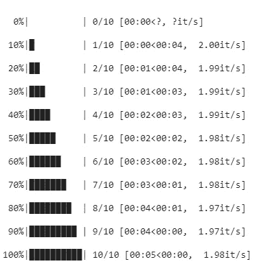
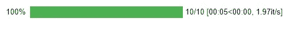
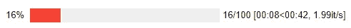

# 视觉上吸引人的进度条

> 原文：<https://towardsdatascience.com/visually-appealing-progress-bars-f41f2baf4cda?source=collection_archive---------46----------------------->

## 使用 tqdm 在 python 中创建进度条


沃洛季米尔·赫里先科在 [Unsplash](https://unsplash.com?utm_source=medium&utm_medium=referral) 上的照片

当我们想要测量特定函数或代码块的进度时，进度条非常重要。它允许我们可视化我们的代码已经运行了多少，或者告诉我们在运行时代码中是否有错误。它还允许我们查看代码块的剩余执行时间。

我们可以在 python 中使用不同的 or 库创建进度条，其中之一就是 tqdm。这是一个开源的 python 库，用于创建视觉上吸引人的进度条。Tqdm 来源于一个阿拉伯语单词，意思是进步。它很容易创建进度条，并且可以将任何代码块包装在里面。

在本文中，我们将看到一些可以使用 tqdm 创建的基本进度条。

让我们开始吧…

# 安装所需的库

我们将从使用 pip 安装 tqdm 开始。下面给出的命令可以做到这一点。

```
pip install tqdm
```

# 导入所需的库

在这一步中，我们将导入创建进度条所需的库。在这篇文章中，我将向你展示如何使用 tqdm 和 tqdm_notebook 创建一个进度条。

# 创建进度条

在这一步中，我们将看到使用 tqdm 创建进度条是多么容易。

```
for i in tqdm(range(10)): time.sleep(0.5)
```



进度条(来源:作者)

同样，我们也可以使用 tqdm_notebook 创建一个进度条。

```
for i in tqdm_notebook(range(10)): time.sleep(0.5)
```



进度条(来源:作者)

当代码执行过程中出现错误或者我们不小心停止了它时，它看起来就像下面给出的图像。



错误(来源:作者)

类似地，您可以在任何函数、循环或代码块中添加进度条，并分析特定代码块的时间和进度。您也可以在创建 python 应用程序时使用它。

继续尝试不同的代码块，创建漂亮的进度条。如果您发现任何困难，请在回复部分告诉我。

本文是与[皮尤什·英格尔](https://medium.com/u/40808d551f5a?source=post_page-----f41f2baf4cda--------------------------------)合作完成的。

# 在你走之前

***感谢*** *的阅读！如果你想与我取得联系，请随时通过 hmix13@gmail.com 联系我或我的* [***LinkedIn 个人资料***](http://www.linkedin.com/in/himanshusharmads) *。可以查看我的*[***Github***](https://github.com/hmix13)**简介针对不同的数据科学项目和包教程。还有，随意探索* [***我的简介***](https://medium.com/@hmix13) *，阅读我写过的与数据科学相关的不同文章。**