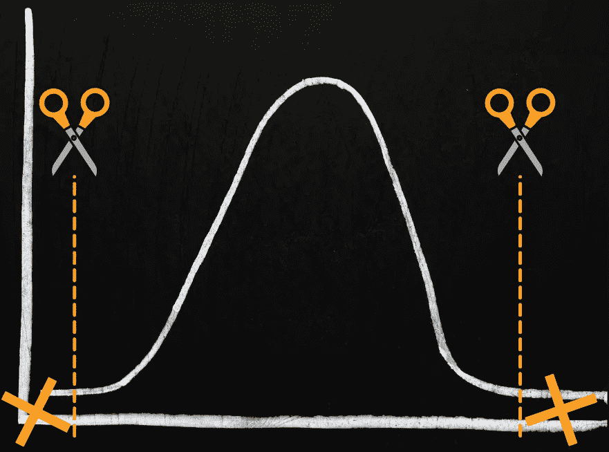

# 生命体征:评估数据健康状况和处理异常值

> 原文：<https://towardsdatascience.com/vital-signs-assessing-data-health-and-dealing-with-outliers-e6f1d2569a52?source=collection_archive---------38----------------------->

## 你的数据准备好机器学习了吗？检查它的健康状况，并学习如何处理您可能发现的异常值

杰西·奥里科在 [Unsplash](https://unsplash.com/s/photos/brain?utm_source=unsplash&utm_medium=referral&utm_content=creditCopyText) 上的照片

在医生的办公室，在医生到达之前，你和医疗助理要经历一个熟悉的例行程序。他们会检查你的生命体征——脉搏、血压、呼吸率等——并收集一些一般信息。这些步骤总结了你健康的一些重要方面，让医生直接进入更复杂的分析。

现在包含在 Alteryx 智能套件中的[数据健康工具](https://help.alteryx.com/current/designer/data-health)，为您的数据做类似的事情。它为您提供了对数据集进一步分析准备情况的快速而全面的评估，尤其是在预测分析和机器学习之前。该工具还会查找异常值，并方便地将它们放在单独的输出中，以便您可以处理它们。

让我们看看使用这些新诊断能力的最佳方式，以及如何对结果采取行动，尤其是那些异常值。

# 关于数据健康工具

数据健康工具收集数据集的“生命体征”,揭示数据集是否已准备好产生可靠、准确的见解，或者它是否会受益于一些特殊处理。具体来说，该工具可以查看数据集的缺失值、是否有异常值及其稀疏度。(如果数据集包含许多零值，则它是“稀疏的”；例如，许多购物推荐系统使用的数据集是稀疏的，因为每个购物者都没有购买过甚至没有看过许多提供的产品。)Data Health 还检查每个变量的唯一值的数量对于其数据类型和数据集的大小是否有意义。

*图像通过* [*GIPHY*](https://giphy.com/gifs/love-heart-valentines-l3q2zWh6nXHl3x8gU)

如果您是数据调查工具面板的粉丝，您可能想知道数据健康与[字段汇总工具](https://help.alteryx.com/current/designer/field-summary-tool)有何不同。您从这两种工具中确实获得了一些相同的信息；然而，值得注意的是，正如 Alteryx 数据科学产品经理 [Sonia Prakasam](https://www.linkedin.com/in/sonia-prakasam-2718239a/) 最近告诉我的那样，数据健康提供了“对数据集质量的整体衡量”。“数据健康产生更具可操作性的结果。在任何机器学习过程之前使用它来帮助为机器学习管道准备数据非常好。”

Data Health 还会为您检测和识别异常值，而 Field Summary 不会这样做。我们一会儿将讨论这个问题——包括一旦你将这些离群值收集起来，该如何处理它们。

在使用数据健康之前，最好使用[要素类型工具](https://help.alteryx.com/current/designer/feature-types)来确保您的数据类型设置正确，否则您可能会得到不同的结果。数据健康可以处理字符串、布尔和数字数据；特征类型允许您为每一列设置更详细的类型(例如，邮政编码、文本、分类等)。).Data Health 了解如何处理每一种类型，如果提供额外的信息，它将提供更好的运行状况评估。

# 诊断异常值

除了所有其他可操作的信息之外，拥有一个工具来快速发现可能给分析和建模带来挑战的异常值是非常棒的。数据健康工具使用 2008 年[同行评审研究](https://www.sciencedirect.com/science/article/abs/pii/S0167947307004434#!)中建立的方法([在此阅读](https://wis.kuleuven.be/stat/robust/papers/2008/adjboxplot-revision.pdf))。它基于一种你可能听说过的数据可视化方法:盒状图或盒须图。

*图片由*[*Schlurcher*](https://commons.wikimedia.org/wiki/User:Schlurcher)*，维基共享*

下面是[对阅读这些情节的复习](https://www.simplypsychology.org/boxplots.html#:~:text=When%20reviewing%20a%20box%20plot,whiskers%20of%20the%20box%20plot.&text=For%20example%2C%20outside%201.5%20times,Q3%20%2B%201.5%20*%20IQR).)。我们主要对代表异常值的点感兴趣。我们如何知道哪些数据点应该被定义为异常值，并显示为那些孤独的小点？当数据失真时，这种识别也变得更加棘手。一些识别异常值的方法假设您将拥有一个良好的、[正态分布的](https://www.statisticshowto.com/probability-and-statistics/normal-distributions/)数据集，但事实可能并非如此。

*图片 via* [*GIPHY*](https://giphy.com/gifs/doctorwho-doctor-who-dr-jodie-whittaker-fX1VB1UZiEKok6TiLm)

不管您的数据分布看起来如何，Data Health 识别异常值的方法已经涵盖了您。它基于一种叫做“ [medcouple](https://en.wikipedia.org/wiki/Medcouple) 的偏斜度测量方法该度量用于调整箱线图的结构。这种方法避免了不必要地将数据点标记为异常值，因为它们实际上相当接近数据分布的中心。正如研究人员解释的那样，“这使得调整后的箱线图成为自动异常值检测的有趣而快速的工具，而无需对数据的分布做出任何假设。”

在没有自动化工具的情况下寻找异常值有点复杂。Designer 中的一些选项在[本线程](https://community.alteryx.com/t5/Alteryx-Designer-Discussions/Find-Outliers-from-the-data-of-previous-months/td-p/634265?utm_content=738655&utm_source=tds)中讨论。您可以尝试使用 Python 和 pandas，如这里的[所解释的那样](https://stackoverflow.com/questions/23199796/detect-and-exclude-outliers-in-pandas-data-frame)，计算每一列中的值的 z 值，然后潜在地消除在一列或多列中包含异常值的行。另一个 Python 选项是使用本地离群因子，sklearn 中提供的[。这种方法](https://scikit-learn.org/stable/modules/generated/sklearn.neighbors.LocalOutlierFactor.html)[在此处](https://scikit-learn.org/stable/auto_examples/neighbors/plot_lof_outlier_detection.html#sphx-glr-auto-examples-neighbors-plot-lof-outlier-detection-py)演示并在下图中显示，它基于*k*-最近邻点，并根据一个数据点相对于其周围邻域的孤立度来确定该数据点是否为异常值。可怜的孤独的局外人！

每个带有局部异常值因子的数据点用红色圆圈的直径显示。图来自 [scikit-learn 示例。](https://scikit-learn.org/stable/auto_examples/neighbors/plot_lof_outlier_detection.html#sphx-glr-auto-examples-neighbors-plot-lof-outlier-detection-py)

# 所以我有离群值…有什么治疗方法？

首先，仔细看看你的异常值:

*   它们真的很稀有吗？不应该有很多古怪的价值观。如果有，你可能有其他问题要解决。
*   会不会是错别字？也许那些值可以被修正。
*   会不会有测量误差？例如，在某些情况下，传感器可能会错误地记录数据。
*   异常值是如何出现的，有什么模式吗？也许它们与另一个变量的特定值同时出现。这可能是一个重要的观察模式。
*   你的样本中是否有值得进一步研究的不寻常的人或事？异常值可能是一个线索，表明有一个全新的领域需要研究。
*   如果你的样本量很小:你的异常值可能只是出现在分布末端的前几个数据点吗？如果你收集了更多的数据，你会有更多的数据点吗？这种可能性可能很难确定，但这些异常值可能只是随着进一步的数据收集而出现的额外数据的暗示。

这次考试将决定你下一步的行动。表面上，处理异常值的方法很简单:忽略它们，删除它们，或者修改它们。您的选择可能部分取决于您对数据的计划。如果您正在进行探索性的数据分析和生成可视化，离群值可能是新奇的和/或讨论的开始，所以让它们留在原处可能不是问题。您可能希望在有异常值和无异常值的情况下运行分析，以查看您的结果有何不同。

如果您有大量数据，简单地删除异常值可能没问题。这种删除有时被称为“修剪”您的数据。通常，您会从数据中删除相同百分比的最高值和最低值。请将此视为修剪数据钟形曲线的尾部。但是，您正在非常显著地修改您的数据，这可能会引发所有的问题，并且您希望对这种方法有一个很好的理由。

修整异常值

修改你的异常值是另一个策略。离群值肯定会影响机器学习模型，有些影响更大。然而，您可能希望保留在训练模型时必须使用的每一点数据。您可以考虑以下几种修改方法:

*   [转换](https://en.wikipedia.org/wiki/Data_transformation_(statistics)):对数、平方根或逆转换有时会在预处理中使用，以减少数据的偏斜度(即，使其看起来更像正态分布)并减少异常值的潜在影响。Designer 公式工具中的 [LOG(x)函数](https://help.alteryx.com/current/designer/math-functions)可以帮助进行对数转换。
*   [裁剪，又名 winsorization](https://en.wikipedia.org/wiki/Winsorizing#:~:text=Winsorizing%20or%20winsorization%20is%20the,Winsor%20(1895%E2%80%931951).) :这个方法对变量可以拥有的值进行限制。例如，数据的 90% winsorization 将取前 10%和后 10%的值，并分别用第 90 百分位和第 10 百分位的值替换它们。与修剪相反，你没有删除数据点；您正在用更接近数据其余部分的值替换曲线两端最远的值(以前的异常值)。

*裁剪或 winsorization 用更多的中心值替换离群值*

均值或中值替换:一些参考文献建议用变量的均值或中值替换异常值，假设仅用非异常值计算。这可能不是一个好主意，因为在这个讨论中阐述了[的许多原因。](https://stats.stackexchange.com/questions/78063/replacing-outliers-with-mean)

有了数据健康工具，一旦您的异常值被识别出来，如何处理它们就取决于您了。您可以在工具的第三个输出锚点中找到它们，并进一步查看它们。您可以添加一个字段，将它们标记为异常值，并将它们连接回您的主数据集。您可以绘制数据并使用该标志标记异常值，方法是使用不同的颜色来标识异常值(例如，在散点图上)，或者使用数据调查工具来进一步探究这些异常值及其与其他变量的关系。您还可以将异常值输出连接到主数据源，然后从您的分析中排除异常值。无论你选择做什么，记住上面的警告。

总的来说，数据健康工具为分析和机器学习提供了对数据质量和就绪性的快速和极其有用的洞察。在它的帮助下，您可以自信地快速进入下一步，因为您已经查看了数据集的关键生命体征。

# 附加阅读

*   [为什么离群值对科学有好处](https://rss.onlinelibrary.wiley.com/doi/full/10.1111/j.1740-9713.2018.01105.x)(还有其他领域！)
*   [40 年的箱型电影](https://vita.had.co.nz/papers/boxplots.pdf)，作者:哈德利·威克姆和丽莎·斯特莱杰斯基
*   [关于 Winsorization 和 Trimming 的一些观察](http://www.johnmyleswhite.com/notebook/2015/12/03/some-observations-on-winsorization-and-trimming/)

*原载于 Alteryx 社区* [*数据科学门户*](http://community.alteryx.com/datascience?utm_content=738655&utm_source=tds) *。*