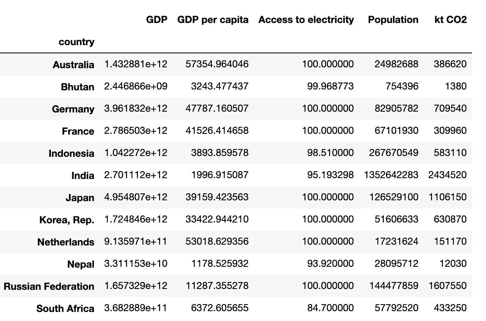
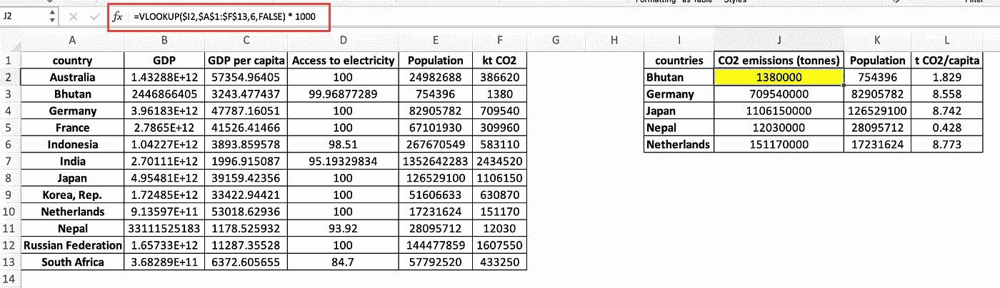
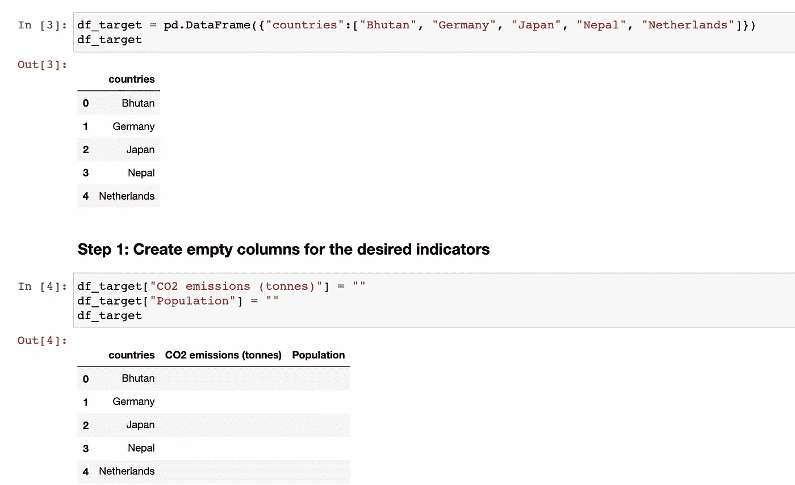
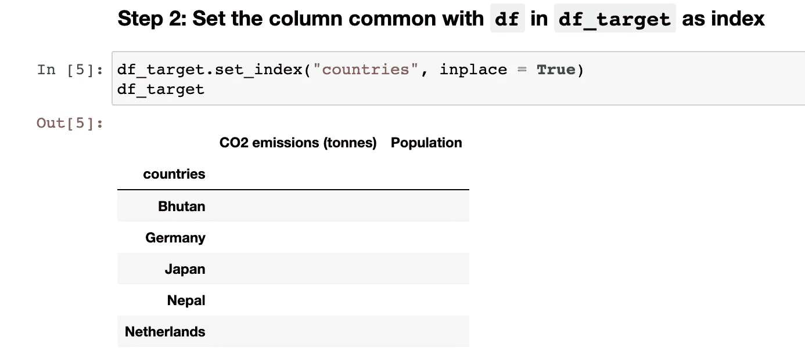

# 用 Python 通过三个简单的步骤实现 VLOOKUP

> 原文：<https://towardsdatascience.com/vlookup-implementation-in-python-in-three-simple-steps-93b5a290fd72?source=collection_archive---------1----------------------->

通常，在数据分析领域，数据清理和处理需要花费最多的时间和精力。虽然与模型开发等更有趣的部分相比，数据清理、过滤和预处理等步骤通常被低估或忽略，但决定输出质量的是数据质量。正如正确的说法，垃圾输入=垃圾输出，反之亦然。

在 Excel 中，VLOOKUP、HLOOKUP、xlookup 和 INDEX MATCH 等函数对于从数据表或区域中查找满足给定条件的所需数据非常有用。在本文中，我将描述一种简单的方法，用 Python 通过三个简单的步骤复制 Excel 的 VLOOKUP 函数。本文使用的脚本可以在这个 [GitHub 资源库](https://github.com/hbshrestha/Data_Analytics)中获得。让我们开始吧。

图片来自 [Unsplash](https://unsplash.com/) 作者 [Jonnelle Yancovic](https://unsplash.com/@jey_photography)

## 数据

首先，我将描述我们在这篇文章中使用的数据。

世界银行开放数据是一个关于全球发展的免费和开放的数据来源。人们可以从世界银行的[数据库](https://datacatalog.worldbank.org/collections)中找到数百个与全球发展相关主题的数据集，包括经济、人口、气候变化、卫生、基础设施、能源等。分析这些指标的时间序列数据对于制定适合一个国家或地区的政策、制度和监管框架至关重要。

世界银行的数据可以以 Excel 或 CSV 格式直接从数据库中下载，也可以使用`pandas_datareader`从 Python 中直接访问，如下面的脚本所示:

在这篇文章中，我将使用特定国家特定年份的选择性指标。我从世界银行数据库中选择了国内生产总值、人均国内生产总值、电力供应、人口和二氧化碳排放数据，并提供了这些指标的代码，这些数据也可以从网站上获得。接下来，我通过提供 ISO 代码随机选择了 12 个国家，并下载了 2018 年的数据。我用指标名称而不是代码来重命名列，并且只选择索引中的国家。数据帧`df`如下所示:

2018 年选自世界银行数据库的发展指标

## **Excel 中的 VLOOKUP 实现**

在这一节中，我将描述 VLOOKUP 函数如何在 Excel 中从数据表或数据区域中获取所需的数据子集。如下面的 Excel 截图所示，A 到 F 列表示与`df`中相同的数据。在 I 到 L 列中，我想从第一个表中获得二氧化碳排放量和人口数据。

在 Excel 中实现的 VLOOKUP 函数在右边的表(I1:L6)中从左边的表(A1:F13)中获取值

在 Excel 屏幕截图中用红色矩形表示的公式栏中，我们可以看到用于单元格 J2 的公式。

`=VLOOKUP($I2, $A$1:$F$13,6,FALSE) * 1000`

其中，

`$I2`代表我们要在第一个表中查找的国家不丹；

`$A$1:$F$13`表示整个第一个表，在该表中可以找到查找值和要返回的数据

`6`代表栏号(此处代表 kt CO2 栏),将从该栏返回相应的数值(不丹),以及

`FALSE`表示完全匹配。

## 用 Python 实现它的三个简单步骤

在这里，我描述了上面在 Excel 中使用的相同函数的实现，但是用 Python 分三个简单的步骤:

**首先，**我们创建一个名为`df_target`的数据帧，我们希望在其中包含所需的子集数据。最初，数据框架包括五个所需国家的名称。然后我们为想要从`df`返回的指标`CO2 emissions (tonnes)`和`Population`创建空列。

第一步

`df_target`中的`countries`列与`df`中的`country`列共用。因此，**其次，**我们将`df_target`中的`countries`列设置为索引。

第二步

**第三步，**这是我们将`df_target`中的索引映射到`df`以获取所需列的数据作为输出的主要步骤。例如，`df`的`kt CO2`列的值乘以 1000 后返回给`df_target`的`CO2 emissions (tonnes)`列。 [map()函数](https://pandas.pydata.org/docs/reference/api/pandas.Series.map.html)根据输入对应关系映射系列的值，并用于将系列中的每个值替换为另一个值，该值可从函数、字典或系列中提取。

第三步

在本文中，我们学习了一种简单的技术，用 Python 通过三个简单的步骤实现 Excel 的 VLOOKUP 函数。Python 中不同包的功能和模块使得几个步骤自动化，否则将花费大量的时间和精力，从这个意义上说，这是优化成本和资源的真正福音。