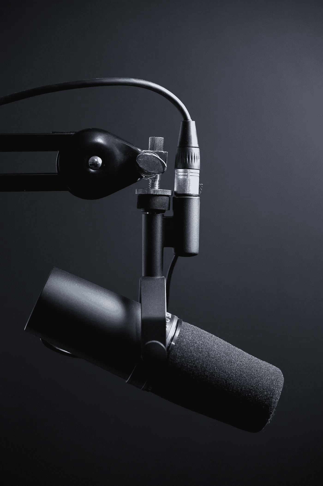
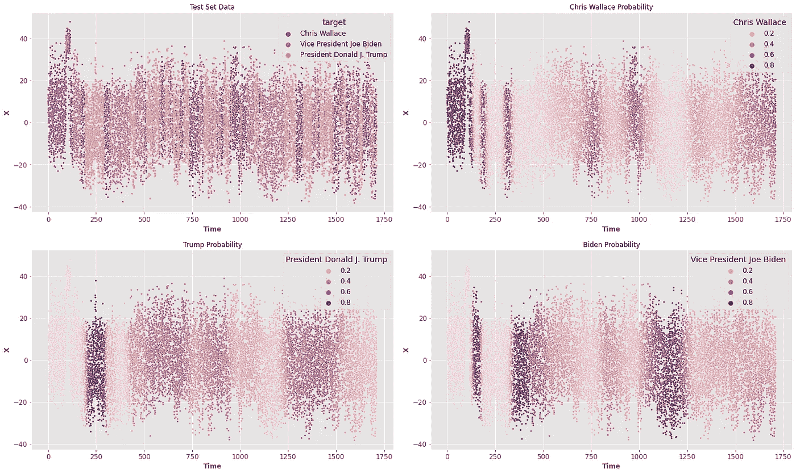

# 语音分类使用深度学习，用 Python

> 原文：<https://towardsdatascience.com/voice-classification-using-deep-learning-with-python-6eddb9580381?source=collection_archive---------7----------------------->

Jukka Aalho 在 [Unsplash](https://unsplash.com/s/photos/audio?utm_source=unsplash&utm_medium=referral&utm_content=creditCopyText) 上拍摄的照片

## 以下是如何使用深度学习对音轨的声音进行分类

有时人类能够非常容易地做某些事情，但是他们不能恰当地描述他们是如何做的。**例如，当两个不同的声音说话时，我们能够清楚地区分它们，但很难描述我们用来区分它们的确切特征**。由于任务很难描述，教计算机如何做就更难了。幸运的是，我们有数据，我们可以用这些例子来训练我们的机器。

我们开始吧！

## 1.设置

如题，我用过 **Python** 。特别是，我使用了这些库:

我们将在此过程中使用它们。

## 2.数据集

我用了第一场美国 2020 年总统辩论的前 30 分钟。具体来说，任务是区分三种声音:

*   **克里斯·华莱士(主持人)**
*   **(前任)总统唐纳德·特朗普**
*   **(前任)副总统乔拜登**

音频可以在[这里](https://www.kaggle.com/headsortails/us-election-2020-presidential-debates?select=us_election_2020_1st_presidential_debate.mp3)找到。特别是，你有一个. csv 文件，一步一步地描述所有的争论。然后，你有一个. mp3 文件，这是辩论的音频。我对它进行了裁剪，得到了一个 30 分钟的音频(为了让过程更快)，并将其命名为“ **trimmed.mp3** ”。然后我做了音频的**梅尔频谱图**。很多人比我解释得更好([例如](https://medium.com/analytics-vidhya/understanding-the-mel-spectrogram-fca2afa2ce53))，但是你可以认为 **MEL 频谱图是音频信号的频率表示，它被转换以更接近我们对声音的感知。**最终结果如下:

因此，信号基本上有 20 个频率。采样率为 22010 Hz，**因此，可以使用代码**提取时间向量

现在，由于已经使用了**监督学习方法，是时候使用。csv 文件。**特别是，它由三列组成:

*   演讲者**(华莱士、拜登或特朗普)**
*   结束分钟**(分:秒或小时:分:秒)**
*   **演讲**

因为我们有以秒为单位的时间，所以我们将结束分钟转换为秒:

现在我们完成了。

尽管如此，它是关于整个演讲，而正如已经说过的，音频较短。**由于这个原因，数据集的一部分也被取走了。**

**让我们来看看:**

现在可以轻松地将**音频数据转换成熊猫数据帧:**

开始了。所以现在我们有 20 列 X 74200+行…非常大。**为此，已执行****主成分分析(PCA)缩减:**

****现在，我们要合并。带有 pca_data 数据帧的 csv 文件。**为了做到这一点，我们定义了另一个列，告诉你，对于那个特定的点，说话者:**

**现在，**我们来看看。****

**因为这是可以预测的，所以有必要查看时间序列以了解正在发生的事情。为了简单起见，让我们使用**互信息**来选择最具信息性的特征，并从中提取出一个**时间序列**。**

****信息量最大的是 2 组分。****

**事情是这样的:**

****使用 LabelEncoder():****

****定义字典:****

## ****3。深度学习****

**现在我们已经有了我们需要的一切，我们来谈谈深度学习。虽然众所周知，卷积神经网络对图像非常有效，但很少有人知道它们对时间序列也很有效。**其实我们会用一个 CNN 来区分三种声音。****

****让我们使用一个训练测试分割并混合数据:****

****定义模型:****

****训练模型:****

****评估模型:****

**该模型以 softmax 结尾。这意味着我们基本上获得了特朗普、拜登或华莱士发言的概率。这里有一个例子:**

****让我们来探索一下测试集:****

****结果如下:****

****

****正如可能看到的，当他们实际说话时，概率很高，这是一个好迹象！**此外，如果我们直接评估准确性，我们是严格的，因为该算法在几分之一秒内工作，而人类语音不能变化如此之快(例如，强制预测不变，直到某个时间增量被验证，这可能是一个好主意)。**

**尽管如此，让我们严肃一会儿，让我们画出困惑矩阵:**

****和分类报告:****

**所以我们有 68%的准确率。**

# **摘要**

**简而言之，已经开展的进程如下:**

*   ****获取音频数据，修整并应用 MEL 频谱图****
*   ****使用主成分分析降低维数****
*   ****使用。标记音频数据的 csv 数据****
*   ****定义深度学习 CNN 模型****
*   ****得到结果****

**如果你喜欢这篇文章，你想知道更多关于机器学习的知识，或者你只是想问我一些你可以问的问题:**

**A.在 [**Linkedin**](https://www.linkedin.com/in/pieropaialunga/) 上关注我，我在那里发布我所有的故事
B .订阅我的 [**简讯**](https://piero-paialunga.medium.com/subscribe) 。这会让你了解新的故事，并给你机会发短信给我，让我收到你所有的更正或疑问。
C .成为 [**推荐会员**](https://piero-paialunga.medium.com/membership) ，这样你就不会有任何“本月最大故事数”，你可以阅读我(以及数千名其他机器学习和数据科学顶级作家)写的任何关于最新可用技术的文章。**