# VoxMorphia:使用人工智能进行歌词风格转换

> 原文：<https://towardsdatascience.com/voxmorphia-using-ai-for-style-transfer-of-song-lyrics-fe22d52128dd?source=collection_archive---------15----------------------->

## 我如何使用 GPT-3 重新想象鲍勃·马利、电台司令和梅根·赛恩风格的经典歌曲

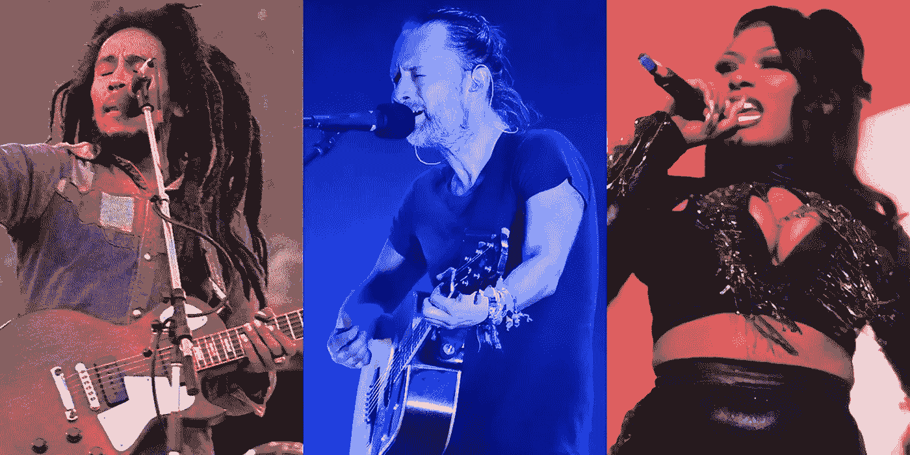

**鲍勃·马利**作者[埃迪·马林](https://commons.wikimedia.org/wiki/File:Bob-Marley_3_(cropped).jpg)，电台司令**汤姆·约克**作者[克里斯](https://commons.wikimedia.org/wiki/File:Thom_Yorke_Austin_Texas_2016_(cropped).jpg)、**和梅根·赛恩**作者[阿尔弗雷德·马罗奎因](https://commons.wikimedia.org/wiki/File:Megan_Thee_Stallion_BBWM_Awards_2019.jpg)，作者图片说明，来源图片来自[commons.wikimedia.org](https://commons.wikimedia.org/wiki/Main_Page)经 2.0 许可在 [CC 下使用](https://creativecommons.org/licenses/by/2.0/deed.en)

OpenAI 的第三代转换器 GPT-3 是目前最先进的文本生成模型[1]。只要给出几个例子，它就可以创建高质量的文本。我想看看能否提示系统采用一位作家的写作风格，并将其转移到另一位作家的作品中。

在这个我称之为 VoxMorphia 的实验中，我选择了转换公共领域的歌曲，包括像“是的，先生，那是我的宝贝”这样的经典歌曲。使用 GPT-3 和一些额外的开源项目，我将经典歌曲的歌词改编成鲍勃·马利、来自电台司令的汤姆·约克、梅根·赛恩和其他 43 位歌曲作者的抒情风格。

我选择突出这三位录音艺术家，以展示一系列风格:鲍勃·马利在复古雷鬼节奏中流畅的旋律线条，汤姆·约克在复杂的另类摇滚模式中充满焦虑的漫谈，以及梅根·赛恩在甜美的嘻哈节拍中巧妙而露骨的说唱。

# 概观

我将首先展示主要系统组件是如何连接在一起的，然后介绍 GPT-3 是什么以及它是如何工作的。接下来，我将介绍我用来转换歌词风格的过程，并展示一首具有三种不同歌词风格的歌曲的样本输出。

在附录中，我将展示三首不同风格的不同歌曲的较长示例。

这个项目的源代码可以在 [GitHub](https://github.com/robgon-art/VoxMorphia) 上获得，你可以使用这个 [Google Colab](https://colab.research.google.com/github/robgon-art/VoxMorphia/blob/main/VoxMorphia.ipynb) 来试验代码。请注意，您需要一个来自 OpenAI 的帐户来运行代码。你可以加入等候名单，进入他们的测试程序[这里](https://openai.com/blog/openai-api/)。

# 系统组件

这个项目的主要工作是由 GPT-3 生成歌词，谷歌的通用句子编码器[2]帮助对文本进行预处理和后处理。

以下是该系统的组成部分及其工作原理的示例。

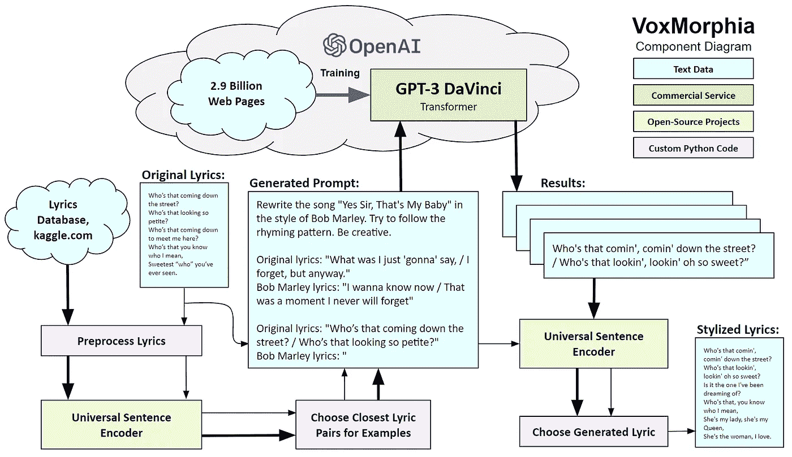

**VoxMorphia 组件图**，图片作者

该系统首先对 Kaggle 数据库中的歌词和一首老歌进行预处理，例如，Gus Kahn 1925 年的“是的，先生，那是我的宝贝”。Google 的通用句子编码器用于从目标歌曲作者(例如 Bob Marley)中查找紧密匹配的旧歌词和新歌词对。这些配对被添加到一个提示中，作为商业服务运行的 GPT-3 的输入。该提示包含三个用简单英语编写的部分:说明、前/后示例和输入文本。您可以在上面生成的提示块中看到一个例子。

在被提示后，GPT-3 以鲍勃·马利的风格返回“是的，先生”的五个候选歌词行。再次使用通用句子编码器来选择最佳候选。理想情况下，新歌词将(A)抓住原始歌词的精髓，但(B)不完全相同，(C)不会相差太远。

在我进入 VoxMorphia 的细节之前，我将介绍 GPT-3 的简短历史和概述，并展示它是如何工作的。

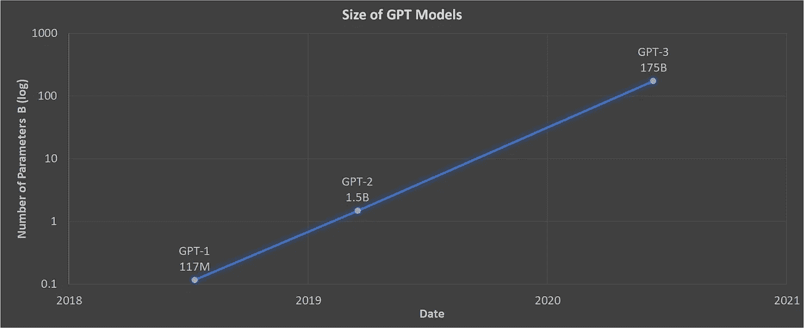

**GPT 模型的大小(对数标度)随着时间的推移，大约每六个月就会增加 10 倍**，图表由作者绘制

# GPT 三号背景

在使用更大的变压器模型进行自然语言处理(NLP)之前，人工智能模型被训练来执行特定的任务，如文本分类、回答问题、创建摘要等。

## GPT 一号

2018 年 6 月，OpenAI 发布了其初始生成式预训练变压器(GPT)，其神经网络规模为 1.17 亿个参数。它接受了 7000 本未出版书籍的训练[3]。该系统可以执行一般的 NLP 任务，而不需要太多的预先训练。

## GPT-2

2019 年 2 月，OpenAI 发布了拥有 15 亿个参数的 GPT-2。它在 800 万个网页上进行了训练，并成为许多自然语言任务的最先进的系统[4]。我在我的 [PlotJam](/got-writers-block-it-s-plotjam-to-the-rescue-e555db9f3272) 和 [InventorBot](https://medium.com/geekculture/inventorbot-using-ai-to-generate-new-ideas-in-any-field-9345f9042df) 项目中使用了 GPT-2。

## GPT-3

2020 年 6 月，OpenAI 发布了 GPT-3 的测试版。它使用 29 亿个网页进行训练，拥有 1750 亿个参数[1]。作为参考，一个典型的人脑大约有 1000 亿个神经元[5]。正如我们在波斯顿所说，GPT 三号是“邪恶的史迈特”

缺德斯迈特到底有多聪明？当我被邀请参加 OpenAI 的测试程序时，我做的第一件事是对我为我的 [AI-8 Ball](/building-an-ai-8-ball-with-roberta-2bfbf6f5519b) 项目所做的事情进行一个快速测试，以神奇 8 球的方式回答是/否问题。

我登录 OpenAI 的 playground 运行测试，用粗体键入以下提示，GPT-3 回答了。

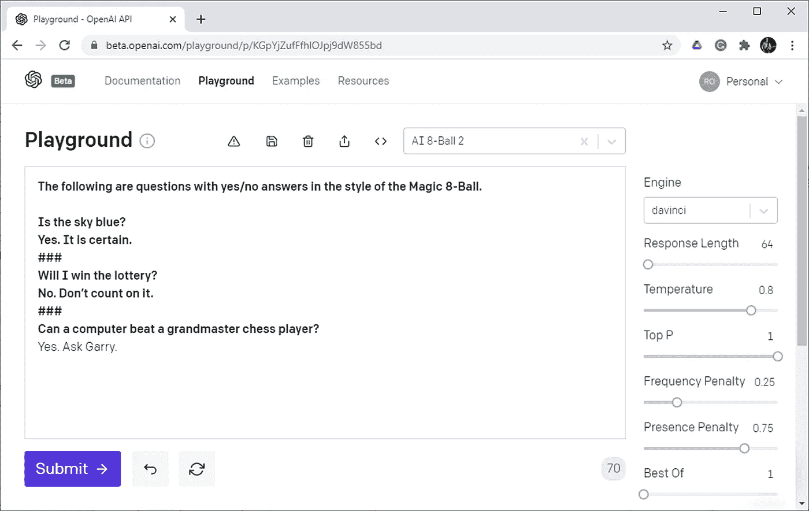

**GPT 3 号游乐场由 OpenAI** 拍摄，图片由作者提供

## 文本提示

与其他生成文本的人工智能模型不同，OpenAI 目前不允许微调 GPT-3。但是，它允许您用英语告诉转换器做什么，并在提供输入文本之前提供几个例子。这称为“少量”学习，通过提供文本提示来完成。

从示例中，您可以看到提示的三个部分:说明、前/后示例和文本输入。这是上例中的提示，部分用括号标注。

```
The following are questions with yes/no answers in the style of the Magic 8-Ball. **(Instructions)**Is the sky blue? 
Yes. It is certain. **(Example 1)**
###
Will I win the lottery?
No. Don’t count on it **(Example 2)**
###
Can a computer beat a grandmaster chess player? **(Text Input)**
```

然后，系统将为文本输入中的问题写下答案。

```
Yes. Ask Garry. **(Response Created by GPT-3)**
```

爆笑！它没有完全做到我想要的，因为它没有使用魔术 8 球的标准答案之一。但是它很好地提到了加里·卡斯帕罗夫，他在 1997 年输给了 IBM 的深蓝电脑。

## 控制参数

上面操场的截图显示了控制生成文本的参数集。这里是我使用的设置的每个参数的简要描述。

1.  **引擎** -要使用的 AI 模型。*达芬奇*型号 175B 参数能力最强， *Ada* 最快 2.7B 参数。*居里*和*巴氏合金*型号介于两者之间分别为 13B 和 6.7B 参数。我为这个项目使用了 ***达芬奇*** 模型。
2.  **响应长度** -要生成的最大文本量，用令牌指定。令牌大致相当于单词中的一个音节。对于上面的示例，提示中有 62 个标记，结果中有 8 个标记。对于 8 球问题，我将响应长度设置为 64，对于生成歌词，我将**设置为 128** 。
3.  **温度** -控制响应的变化，范围从 0.0 到 1.0。默认是 0.7，但是我用了 **0.8** 。
4.  **顶部 P** -控制输出的多样性。我一直盯住 **1.0** 。
5.  **频率惩罚** -在响应中避免重复的程度。我将此设置为 **0.25** 。
6.  **存在惩罚** -控制在生成的文本中改变主题的能力。我将此设置为 **0.75** 。
7.  **之最——在服务器端生成多少响应。如果设置为大于 1，那么 GPT-3 将只发送最好的一个。我把这个设置保持为 **1** 。**

**请注意，温度和 Top P 参数是相似的。将它们移向 0，结果会变得乏味且可预测，将它们移向 1，结果会变得更加随机。你可以在 Ben Mann 的文章[这里](/how-to-sample-from-language-models-682bceb97277)中了解这些参数是如何工作的。**

**频率和出席惩罚也是相似的。弗拉德·亚历克斯在他的[帖子](https://medium.com/merzazine/the-art-to-start-settings-game-11f054a136)中实验了这些参数。他发现增加频率惩罚会导致与先前生成的文本产生新的偏差。并且增加存在惩罚允许 GPT-3 将**新主题**插入文本。**

## **定价**

**正如我上面提到的，OpenAI 提供 GPT 3 作为商业服务。当我注册测试版时，他们给了我 30 万个免费代币，4 个月后到期。我在两个月内用完了免费代币，现在为使用*达芬奇*模型支付每 1000 个代币 0.06 美元。上述 8 球的例子总共使用了 70 个代币，总成本为 0.004 美元，约为 0.5 美分。其他车型的费率计划在这里，[beta.openai.com/pricing](https://beta.openai.com/pricing)。运行模型的成本基于它们的大小。参数越多=成本越高。**

# **体视吗啡系统详情**

**在这一节中，我将介绍 VoxMorphia 使用的过程，并解释系统组件是如何工作的。**

## **创建提示**

**我不想自己为转换歌词风格创建自定义提示，所以我设计了一个自动完成这项工作的方法。下面是一个样式转换提示示例，包含三个部分:指令、前/后示例和要转换的输入行。**

## **说明**

**这是我给 GPT 3 号的指令。**

```
Rewrite the song "Yes Sir, That's My Baby" in the style of Bob Marley. Try to follow the rhyming pattern. Be creative.
```

**这些指令相当简单。我试验了各种变化，发现效果很好。**

****前/后示例****

**这里有几个 before/示例来帮助 GPT-3 了解它被要求做的事情的要点。**

```
Original lyrics: "What was I just 'gonna' say, / I forget, but anyway."
Bob Marley lyrics: "I wanna know now / That was a moment I never will forget"Original lyrics: "Who's the 'who' I rave about? / In the Winter, Summer, Spring and Fall?"
Bob Marley lyrics: "Who is Mr. Brown? I wanna know now / Winter is here"
```

**对于之前的部分，我从原来的歌词开始。对于之后的部分，我使用了来自 kaggle.com[网站](https://www.kaggle.com/paultimothymooney/poetry)的一组歌词。我对歌词进行预处理，以拆分长行并删除空白。**

**然后，我使用谷歌的[通用句子编码器](https://tfhub.dev/google/universal-sentence-encoder/4)找到目标风格的最佳歌词前/后。**

> **通用句子编码器将文本编码成高维向量，这些向量可用于文本分类、语义相似性、聚类和其他自然语言任务。该模型针对大于单词长度的文本(如句子、短语或短段落)进行了训练和优化。—丹尼尔·瑟尔等人，谷歌[2]**

**为了找到最好的例子，我对原始歌曲的歌词进行编码，并与数据集中所有鲍勃·马利歌词的编码歌词进行比较。这有效地运行了语义搜索，寻找前后具有相似含义的行。**

**举例来说，下面是原始歌曲第二节的一对歌词，以及数据集中与鲍勃·马利的歌词最接近的语义匹配:**

*****原文→鲍勃马利*** *我刚才“打算”说什么→我现在想知道
我忘了，但无论如何→那是我永远不会忘记的一刻***

**即使这些匹配不太好，在提示符下添加两到三个这样的匹配对 GPT 3 号来说已经足够完成任务了。我试图在提示中添加更多的例子，但结果是收益递减。这些例子只是帮助系统做我要求的事情，而不是教它作曲者的风格。它已经从训练中了解了风格。**

****输入文本****

**提示的第三部分是我希望设置风格的一组行。我用第一组双引号引导 GPT-3 以鲍勃·马利的风格写下这些诗句。**

```
Original lyrics: "Who’s that coming down the street? / Who’s that looking so petite?"
Bob Marley lyrics: "
```

****Python API****

**接下来，我使用 OpenAI 的 API 来设置参数，并将提示发送到 GPT-3。下面是我为此编写的代码。**

**这个调用相当简单。它设置参数，调用 *openai。Completion.create()，*并返回响应。**

**下面是对提示的回应。**

> ****原创→由 GPT 生成的鲍勃·马利风格-3**
> 街上走来的是谁？ **→** 谁来了，沿着街道来了？
> 那个长得这么娇小的是谁？谁在看，看起来如此甜美？**

**好吧，它改变了一些单词，但保留了押韵方案。还不错。**

## **示例输出**

**在我展示更多 GPT-3 输出的例子之前，这里是 OpenAI 建议我展示的法律免责声明，这都是真的。**

***作者使用 OpenAI 的大规模语言生成模型 GPT-3 生成了以下文本。在生成草稿语言后，作者根据自己的喜好审阅、编辑和修订语言，并对本出版物的内容承担最终责任。***

**这是鲍勃·马利风格的“是的，先生，那是我的宝贝”的第一段和副歌。**

**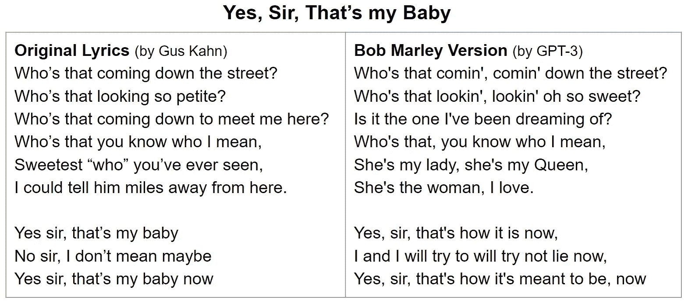******

****格斯·卡恩和 GPT-3 作词，鲍勃·马利**摄影[埃迪·马林](https://commons.wikimedia.org/wiki/File:Bob-Marley_3_(cropped).jpg)来自[commons.wikimedia.org](https://commons.wikimedia.org/wiki/Main_Page)根据 [CC 通过 2.0](https://creativecommons.org/licenses/by/2.0/deed.en) 许可使用**

**这是电台司令风格的相同歌词。**

**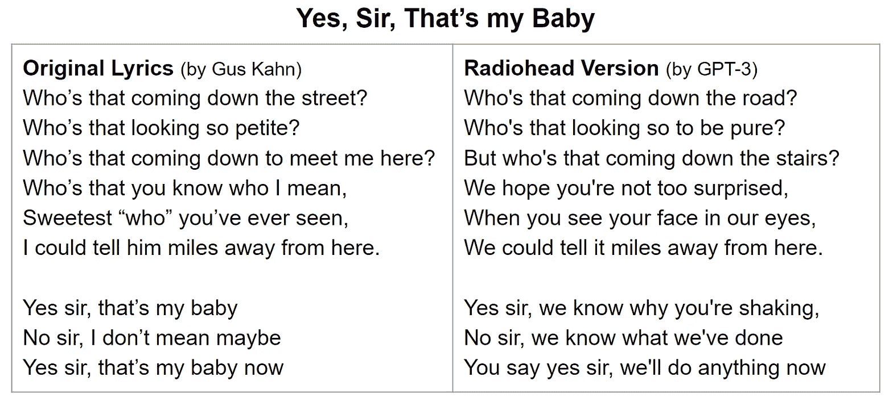****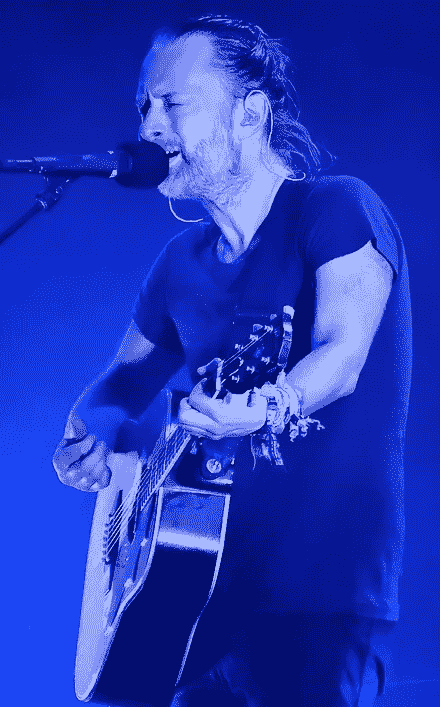**

****格斯·卡恩和 GPT 作词-3、**T22、汤姆·约克[克里斯](https://commons.wikimedia.org/wiki/File:Thom_Yorke_Austin_Texas_2016_(cropped).jpg)摄影来自[commons.wikimedia.org](https://commons.wikimedia.org/wiki/Main_Page)在 [CC 下使用通过 2.0](https://creativecommons.org/licenses/by/2.0/deed.en) 许可**

**最后，在父母的忠告警告之后，这里又是种马梅根风格的歌词。**

****

****家长咨询，**来源:[commons.wikimedia.org](http://commons.wikimedia.org)**

**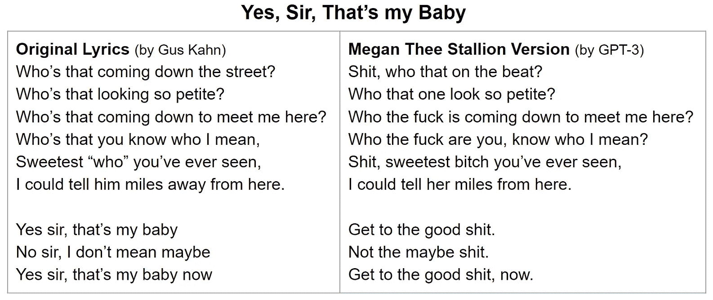******

****由格斯·卡恩和** **GPT-3，梅根·赛恩**作词[阿尔弗雷德·马罗奎因](https://commons.wikimedia.org/wiki/File:Megan_Thee_Stallion_BBWM_Awards_2019.jpg)来自[commons.wikimedia.org](https://commons.wikimedia.org/wiki/Main_Page)由 2.0 许可在 [CC 下使用](https://creativecommons.org/licenses/by/2.0/deed.en)**

**请注意，GPT-3 将输出标记为安全、敏感或不安全。以下是 OpenAI 对这些术语的定义。**

> ****0 -** 文字安全。**
> 
> ****1 -** 这段文字比较敏感。这意味着文本可能在谈论一个敏感的话题，一些政治的，宗教的，或者谈论一个受保护的阶层，比如种族或国籍。**
> 
> ****2 -** 这段文字不安全。这意味着文本包含亵渎的语言，偏见或仇恨的语言，可能是 NSFW 教的东西，或以有害的方式描绘某些群体/人的文本。**

**对于上述示例，系统偶尔会将鲍勃·马利和电台司令风格的歌词标记为敏感。但它总是把梅根·赛恩标为不安全。**

# **摘要**

**因为我运行着 GPT-3，所以我用它来创建本文的摘要。我在前三段粘贴，加了“TL；博士，“这代表”太长了；没看。”这促使 GPT-3 产生了一个两句话的总结。**

**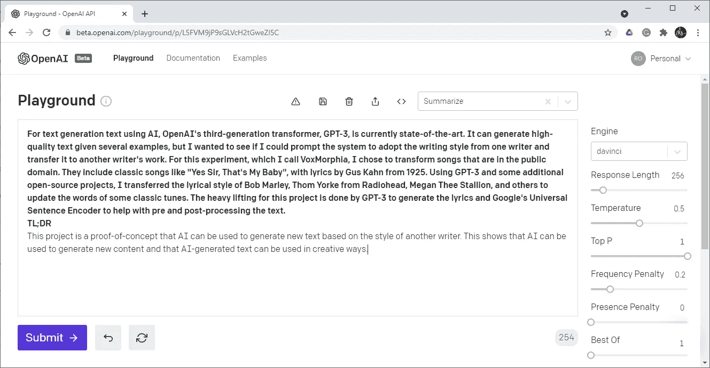**

****GPT 3 号游乐场由 OpenAI** 拍摄，图片由作者提供**

> **这个项目是一个概念证明，人工智能可以用来根据另一位作家的风格生成新的文本。这表明人工智能可以用来生成新的内容，人工智能生成的文本可以以创造性的方式使用。- GPT-3**

**这 254 枚代币花了我 0.015 美元。因此，这就像为 GPT 3 的想法支付一便士来获得它的 2 美分。😃**

# **未来的工作**

**另一个潜在的项目是将风格转移用于其他类型的创造性写作。这可能包括诗歌、小说和电影剧本。电影剧本创作中一个有趣的应用是观察不同的角色如何表达相同的思想。**

**我还想尝试 OpenAI 的新指令系列模型，这些模型经过微调，使提示更容易。**

> **Instruct 系列是一套新的模型，它可以让你更容易地告诉 API 你想要它做什么:只需给 API 一些指令和输入数据，API 就会尽最大努力遵循你的指令。这是我们朝着建立符合人类利益的安全模型的目标迈出的重要一步。— OpenAI**

**这些新模型正在接受训练，只需在提示符下输入指令和数据。不需要举例。这就是所谓的“零距离”学习。**

# **讨论**

**我从这个项目中得到的第一个收获是 GPT 3 号有着巨大的潜力。但是哄骗它使用样式转换来自动生成文本是很棘手的。使用 GPT-3 将焦点从编写好的代码转移到编写好的提示。**

**随着通用人工智能变得更加智能，我们很可能能够用一些简单的事情来提示未来的系统，“用梅根·赛恩的风格把歌词改写成‘是的，先生，那是我的宝贝’。”(顺便说一下，我用达芬奇的*和达芬奇的*的*模型对 GPT-3 进行了测试，但都没有成功。他们只是重复了多次提示。)***

# **源代码**

**这个项目的所有源代码都可以在 [GitHub](https://github.com/robgon-art/VoxMorphia) 上获得。您可以使用这个 [Google Colab](https://colab.research.google.com/github/robgon-art/VoxMorphia/blob/main/VoxMorphia.ipynb) 来试验代码。我在 [CC BY-SA 许可](https://creativecommons.org/licenses/by-sa/4.0/)下发布了源代码。**

****

**归属共享相似**

# **感谢**

**我要感谢詹尼弗·林对这个项目的帮助。我还要感谢 Oliver Strimpel、Penny Lennox 和 Fez Aswat 审阅了这篇文章并提供了有益的反馈。**

# **参考**

**[1] **GPT-3** 、布朗、汤姆·b、本杰明·曼、尼克·赖德、梅勒妮·苏比亚、贾里德·卡普兰、普拉富拉·达瑞瓦尔、阿尔温德·尼拉坎坦等，“语言模型是很少出手的学习者。”，2020 年 7 月 22 日。[https://arxiv.org/abs/2005.14165](http://arxiv.org/abs/2005.14165)**

**[2] **通用语句编码器**、Cer、Daniel、杨、孔胜义、南华、Nicole Limtiaco、Rhomni St John、Noah Constant 等人【通用语句编码器】[、](https://arxiv.org/abs/1803.11175)**

**[3] **GPT-1** 、拉德福德 a .、纳拉西姆汉 n .、萨利曼斯 t .、苏茨基弗 I .，《通过生成性预训练提高语言理解》，2018 年，[https://www . cs . UBC . ca/~ amuham 01/ling 530/papers/radford 2018 Improving . pdf](https://www.cs.ubc.ca/~amuham01/LING530/papers/radford2018improving.pdf)**

**[4] **GPT-2** 、a、、吴 j、、Child R、、Luan d、、Amodei、d、、Sutskever、I .，《语言模型是无监督的多任务学习者》，2019 年 2 月，[https://cdn . open ai . com/better-Language-Models/Language _ Models _ are _ Unsupervised _ multask _ leaders . pdf](https://cdn.openai.com/better-language-models/language_models_are_unsupervised_multitask_learners.pdf)**

**【5】**100 b 神经元，**赫库兰诺-胡泽尔，苏珊娜。"数字中的人脑:线性放大的灵长类大脑."*人类神经科学前沿* 3 (2009)。【https://doi.org/10.3389/neuro.09.031.2009 **

**[6] **深蓝诉卡斯帕罗夫**，chessgames.com，1996–1997，[https://www.chessgames.com/perl/chess.pl?pid=29912&PID 2 = 15940](https://www.chessgames.com/perl/chess.pl?pid=29912&pid2=15940)**

# **附录**

**下面的歌词是基于公共领域的三首不同的歌曲，按照鲍勃·马利、电台司令和梅根·赛恩的风格重新构思的。**

**这是鲍勃·马利 1892 年创作的《黛西·贝尔》。**

********

****哈利·戴克和**GPT 作词**-3**，**鲍勃·马利**摄影[埃迪·马林](https://commons.wikimedia.org/wiki/File:Bob-Marley_3_(cropped).jpg)来自[commons.wikimedia.org](https://commons.wikimedia.org/wiki/Main_Page)根据 [CC 通过 2.0](https://creativecommons.org/licenses/by/2.0/deed.en) 许可使用**

**这是 1911 年电台司令风格的“亚历山大拉格泰姆乐队”。**

**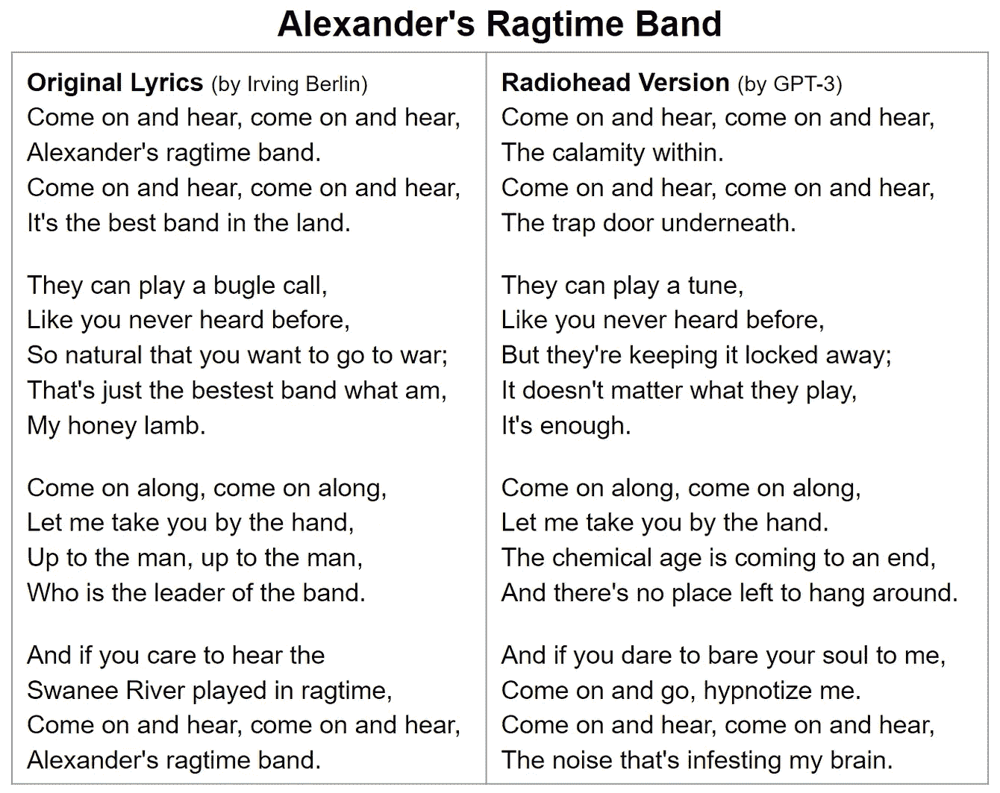****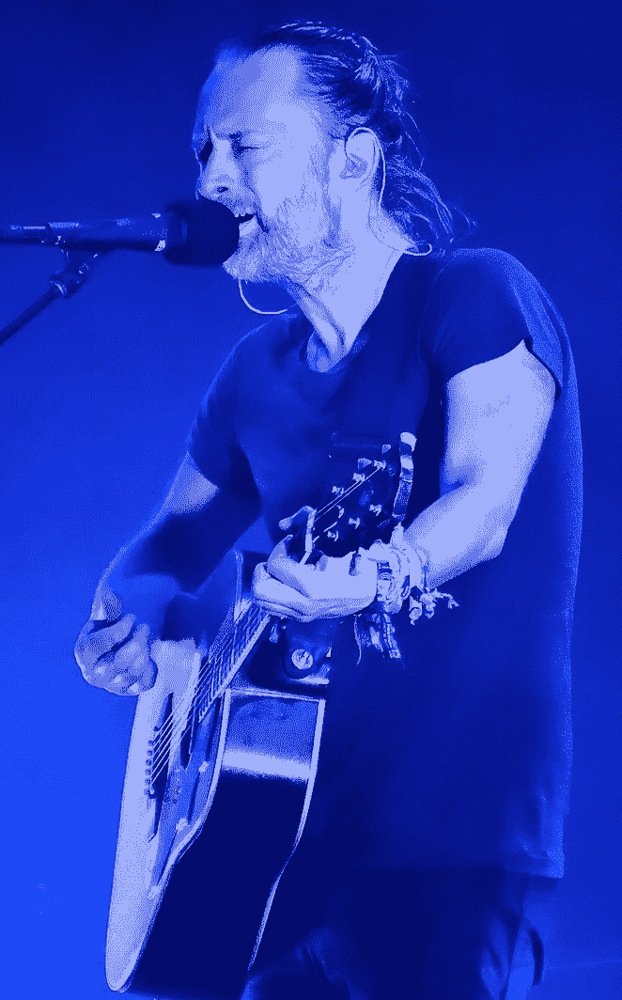**

****格斯·卡恩和 GPT 作词-3、** **汤姆·约克**照片[克里斯](https://commons.wikimedia.org/wiki/File:Thom_Yorke_Austin_Texas_2016_(cropped).jpg)来自[commons.wikimedia.org](https://commons.wikimedia.org/wiki/Main_Page)在 [CC 下使用通过 2.0](https://creativecommons.org/licenses/by/2.0/deed.en) 许可**

**最后，这是 1923 年梅根·赛恩风格的“是的，我们没有香蕉”。**

****

****家长咨询，**来源:[commons.wikimedia.org](http://commons.wikimedia.org)**

**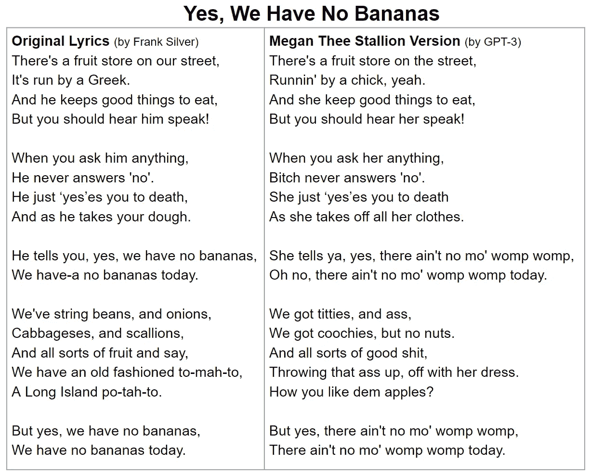****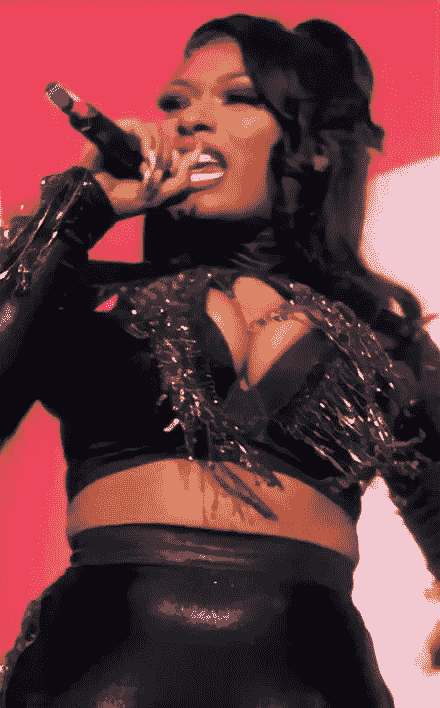**

****由弗兰克·西尔弗和 GPT-3，梅根·赛恩作词**由[阿尔弗雷德·马罗奎因](https://commons.wikimedia.org/wiki/File:Megan_Thee_Stallion_BBWM_Awards_2019.jpg)摄影来自[commons.wikimedia.org](https://commons.wikimedia.org/wiki/Main_Page)根据 [CC 通过 2.0](https://creativecommons.org/licenses/by/2.0/deed.en) 许可使用**

**为了无限制地访问 Medium 上的所有文章，[成为会员](https://robgon.medium.com/membership)，每月支付 5 美元。非会员每月只能看三个锁定的故事。**