# 每个程序员都应该知道的 VSCode 快捷方式和“窍门”

> 原文：<https://towardsdatascience.com/vscode-shortcuts-and-hacks-every-programmer-should-know-8d544bf6ab85?source=collection_archive---------5----------------------->

## [小窍门](https://towardsdatascience.com/tagged/tips-and-tricks)

## “一天一条捷径让手指远离”——我

让我们从简单的开始吧——如果你喜欢快捷方式，你最好知道 VSCode 快捷方式配置页面的快捷方式。

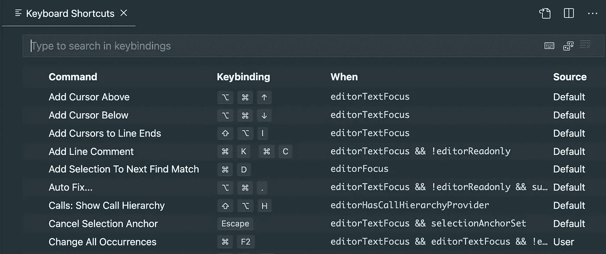

VSCode 快捷方式页面(图片由作者提供)

好吧，我希望你通过了。答案如下:

```
**Mac**: Cmd[⌘]-K Cmd[⌘]-S
**Windows**: Ctrl-K Ctrl-S
```

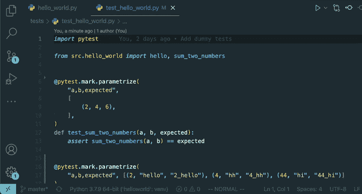

VSCode 快捷菜单 GIF by author

好吧，我想这并不容易。让我将这篇文章分成三个不同的部分:

嗯，你可能已经知道了……对吗？**2)我想你可能还不知道…**
**3)我打赌你不知道！**

> 请注意，下面看到的 VSCode 上的所有快捷方式实际上都可以通过上面显示的配置页面进行**定制**。

# 呸，你可能已经知道了…对吗？

这些可能是最简单的日常快捷方式，所有程序员都应该知道，因为它们以如此少的资源改善了我们的生活质量。

**1。切换浏览器/面板/终端**

```
# Explorer
**Mac**: Cmd[⌘]-B
**Windows**: Ctrl-B# Panel
**Mac**: Cmd[⌘]-J
**Windows**: Ctrl-J# Terminal **Mac**: Ctrl-`
**Windows**: Ctrl-`
```

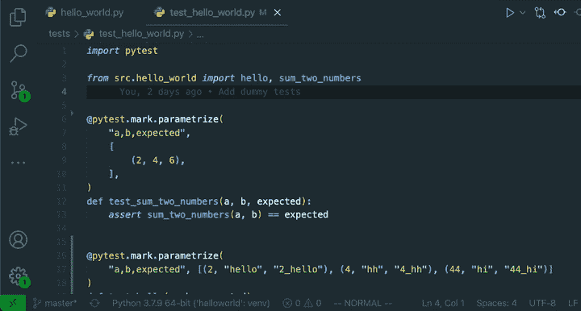

vs code Toggles-GIF by author

**2。分割(并选择)编辑器**

VSCode 和任何编辑器的优点在于，人们可以很容易地一次查看和编辑多个文件。以下是如何创建多个编辑器窗口并在它们之间切换:

```
**Mac**: Cmd[⌘]-\ 
**Windows**: Ctrl-\# To select which editor to use:
**Mac**: Cmd[⌘]-[1-9] # select editor 1 to 9
**Windows**: Ctrl-[1-9]
```

**3。在您的工作空间中搜索并打开文件**

是的，永远不要从文件浏览器中点击打开文件。对于一个新手程序员来说，这绝对是一个危险的信号。

```
**Mac**: Cmd[⌘]-P, Enter
**Windows**: Ctrl-P, Enter
```

结合[2]和[3]，我们可以实现以下目标:

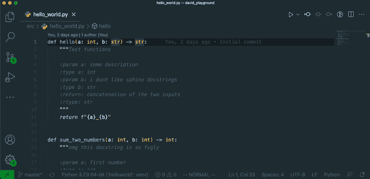

使用拆分编辑器(2)和搜索文件(3)-GIF(按作者)

**4。打开命令面板**

毫无疑问，你**必须**知道的最简单和最有效的快捷键之一——打开命令面板可以让你做几乎任何事情，包括通过键盘访问所有的扩展。

```
**Mac**: Cmd[⌘]-Shift-P
**Windows**: Ctrl-Shift-P
```

这包括通过键盘触发扩展功能或更改主题。

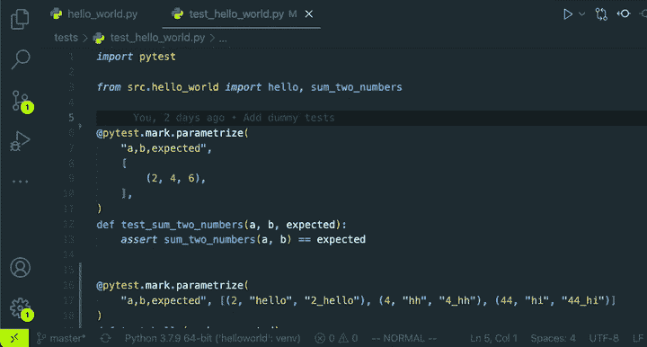

**5。向上/向下移动线**

```
**Mac:** ⌥ + ↓ (down) / ⌥ ↑ (up)
**Windows**: Alt + ↓ (down) / Alt + ↑ (up)
```

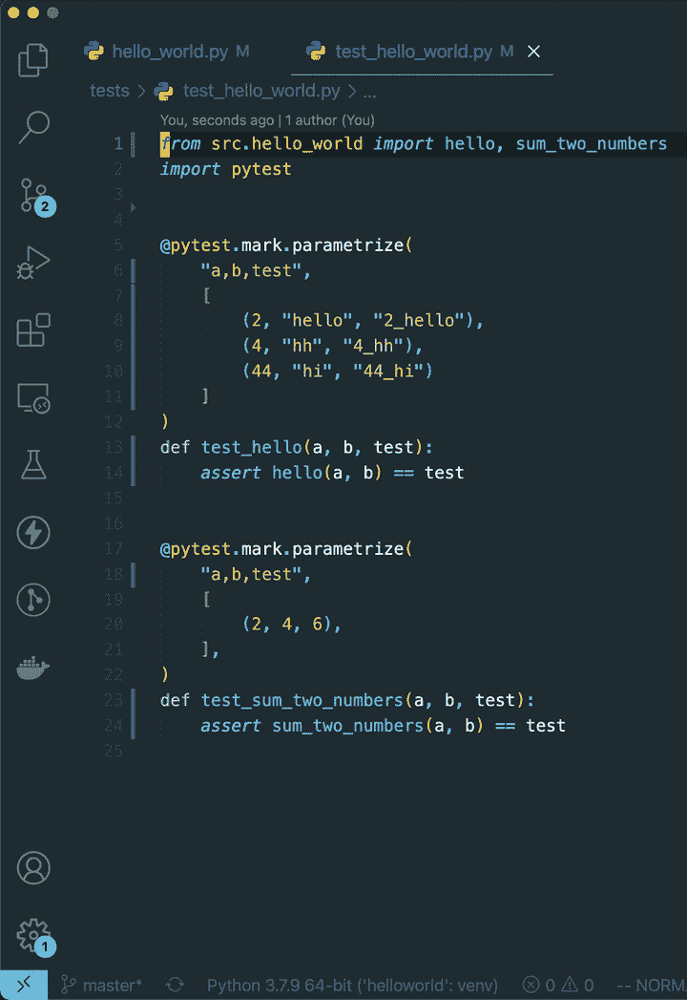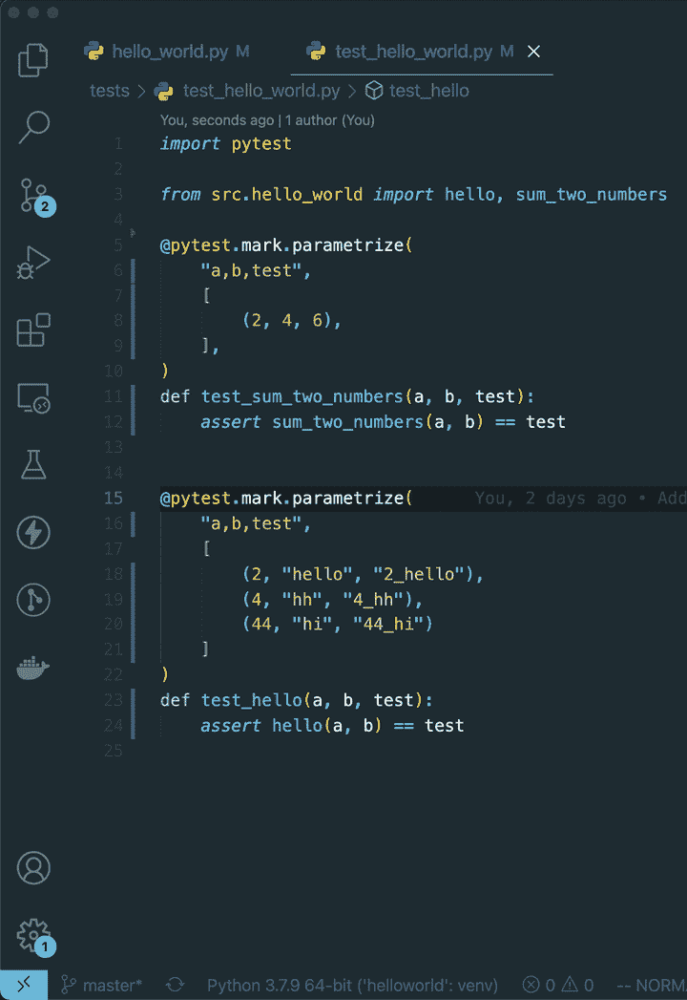

向上/向下(向左)移动一行；向上/向下移动段落(右)-按作者排列的 gif

# 我想你可能还不知道…

好吧，我想我们大多数人都知道容易的，所以我们不要在他们身上浪费太多时间。让我们继续有趣的话题。

**1。选择并编辑所有出现的单词**

当试图在一个文件中编辑一个单词的多次出现时，这是非常有用的。(**注意** : *这与* `*Cmd-D*` *非常相似，在这里选择下一个出现的单词。*)

```
**Mac**: Cmd[⌘]-F2
**Windows**: Ctrl-F2
```

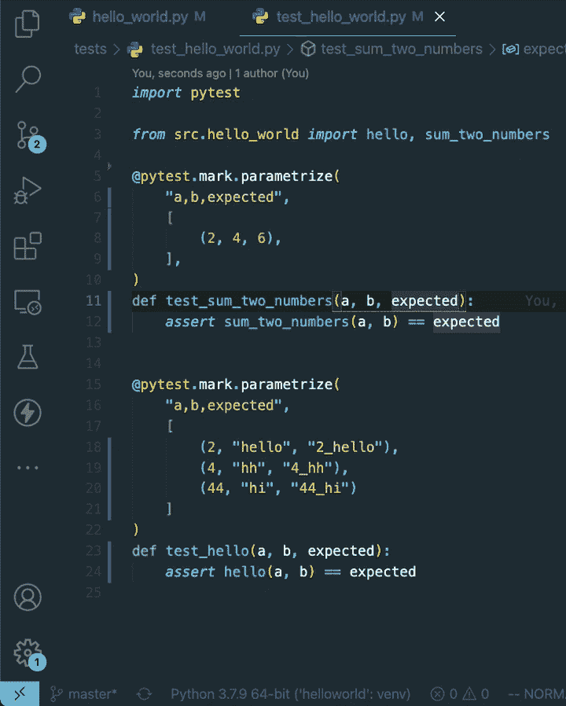

VSCode 上的 cmd-F2(GIF 由作者提供)

**2。使用 VSCode 的源代码控制**

即使对于喜欢使用命令行的人来说，拥有一个 GUI ( **源代码控制**)有时也有助于提高我们的生活质量，尤其是当发生合并冲突时。通过直观地检查我们想要提交的文件，它给了我们保证，因为我们知道我们将要提交什么文件，并且节省了我们键入一些 git 命令的时间！

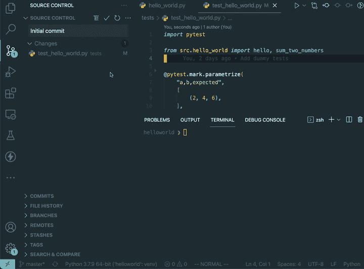

VSCode 源代码控制演示—作者 GIF

**3。多个光标**

能够随心所欲地同时在*不同的地方进行选择性编辑*就像是创建了自己的多个副本！有什么更好的方法来提高生产率？

为此，按住`Alt`键并选择您想要放置光标的位置(您可以一次选择多个！).完成后，只需按下`Esc`即可恢复到单个光标。

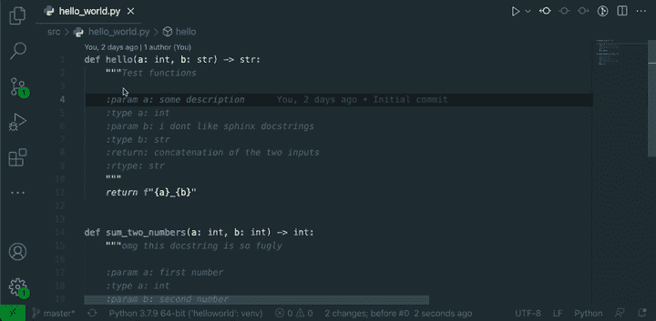

多光标-作者 GIF

# 我打赌你不知道！

现在，本节中的这些快捷方式/技巧有些晦涩，老实说，没有多少人会使用它们，除非他们是经验丰富的程序员，尽可能地在他们的开发工作流中挤出每一英寸的效率。

**1。用户片段**

如果你已经使用了足够多的编程语言，你应该知道你最常用的代码片段/样板文件。要定制您自己的代码片段，请转到**首选项>配置用户代码片段**。然后，您可以在一个**全局**(跨所有工作区使用)片段文件或一个仅用于您当前工作区的文件之间进行选择。

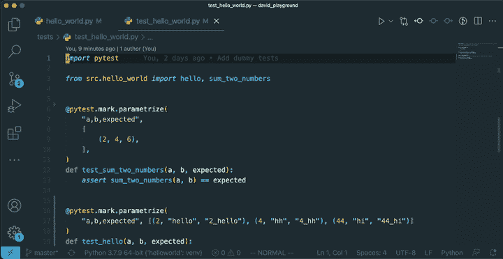

接下来，我们定义几个关键字段:

(a) `scope`:将该代码片段应用到的项目的语言
(b) `prefix`:您要键入以触发该代码片段的“键绑定”或前缀
(c ) `body`:实际的代码片段本身，其中每一行都是列表项
(d) `description`:对代码片段正在做的事情的可选描述

例如，我为 Pytest 的`parametrize`创建了一个代码片段:

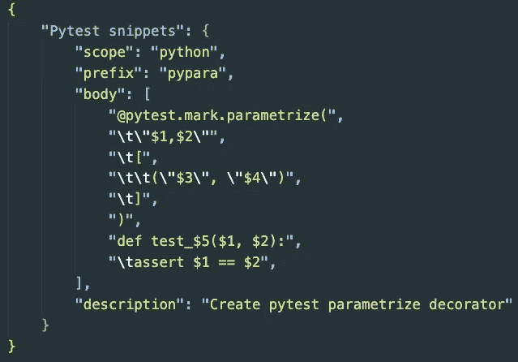

Pytest 参数化片段—作者提供的图片

注意`$<number>`定义了一旦代码片段被触发，用户应该输入的字段。使用`tab`将允许用户在所需的输入之间切换。

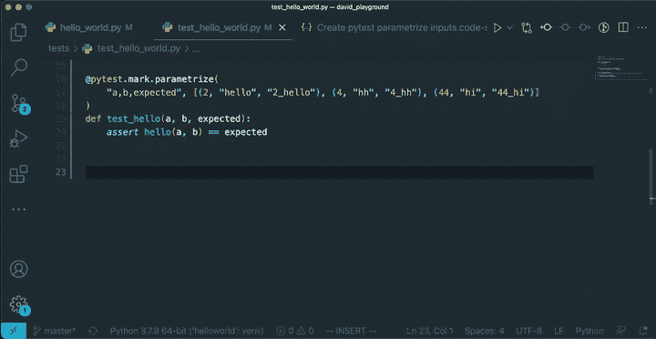

如何使用示例 Pytest 片段— GIF by author

**2a。VIM 扩展**

VIM 是你讨厌或喜欢的技能之一。我再怎么强调了解 VIM 的基础知识对于加快一个人的工作流程是多么重要也不为过。我认为使用 VSCode 的 VIM 最有力的论据是，您只需学习一组快捷键(键绑定),就可以在终端或 VSCode 上应用它们。

比如 VSCode 剪行的快捷键是`Cmd-X`。但是，如果您了解 VIM，您可以应用一个等价的键绑定`dd`来剪切一行，这样就不需要学习另一组键绑定了！此外，VIM 键绑定通常更简洁，随着时间的推移，可以节省更多的击键次数。

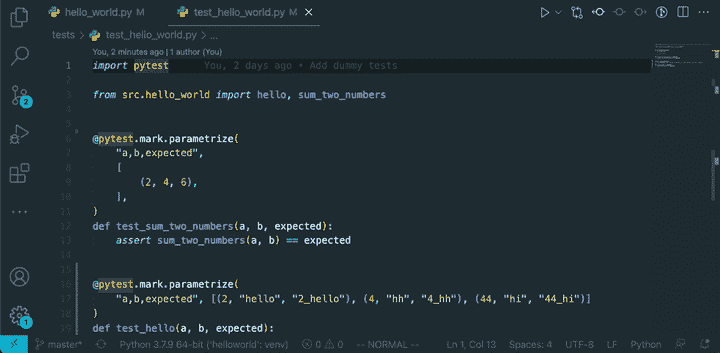

VIM 与 VSCode 键绑定— GIF by by author

我使用的分机是:

```
Name: Vim
Id: vscodevim.vim
Description: Vim emulation for Visual Studio Code
Version: 1.21.8
Publisher: vscodevim
VS Marketplace Link: [https://marketplace.visualstudio.com/items?itemName=vscodevim.vim](https://marketplace.visualstudio.com/items?itemName=vscodevim.vim)
```

一定要看看我下面的文章，我简要介绍了 VIM 和一些我最喜欢的在 VIM 中使用的键绑定。

</a-machine-learning-engineers-toolkit-23def8d819e2>  

**2b。将** `**CAPS LOCK**` **键重新映射到** `**ESC**`

这是使用 VIM 的延续，因为退出键在 VIM 中用于退出任何当前模式。把你的左手伸到键盘的角落去按那个退出键实在是太没有效率了！相比之下，使用`CAPS LOCK`键逃跑——你一生中小拇指移动距离的总和将会大大增加。

在这一点上相信我。

**3。打开设置(UI)和**和`**settings.json**`

令人惊讶的是，VSCode 对此没有 keybinding！然而，作为一个喜欢尽可能自定义我的 VSCode 工作空间的人，我经常访问设置(首选项>设置)和`settings.json`。以下是我为自己设定的按键。

```
# Open settings (UI)
**Mac**: Cmd[⌘]-,
**Windows**: Ctrl-,# Open `settings.json`
**Mac**: Cmd[⌘]-Shift-,
**Windows**: Ctrl-Shift-,
```

# 最后的想法

如果你想要更多关于生产力黑客的文章，请在评论中告诉我！:)

***支持我！*** —如果你喜欢我的内容并且*没有*订阅 Medium，请考虑支持我并通过我的推荐链接[在这里](https://davidcjw.medium.com/membership)(注:*你的一部分会员费将作为推荐费分摊给我*)。


[戴红帽](https://unsplash.com/@girlwithredhat?utm_source=medium&utm_medium=referral)的女孩在 [Unsplash](https://unsplash.com?utm_source=medium&utm_medium=referral) 上的照片