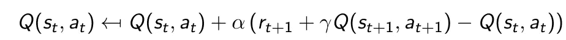
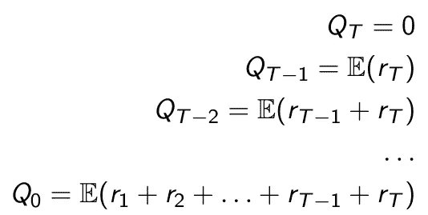
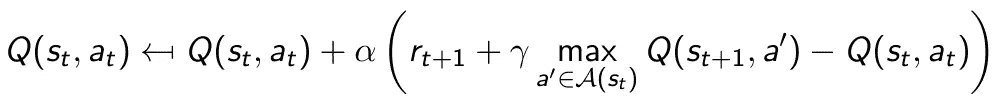
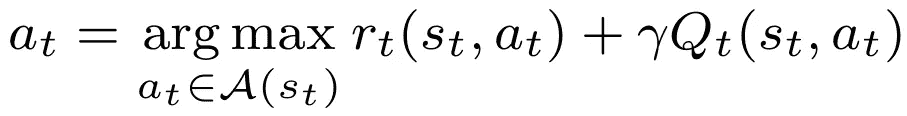
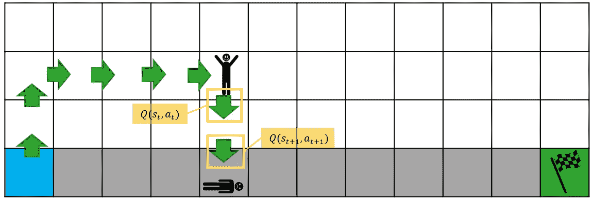
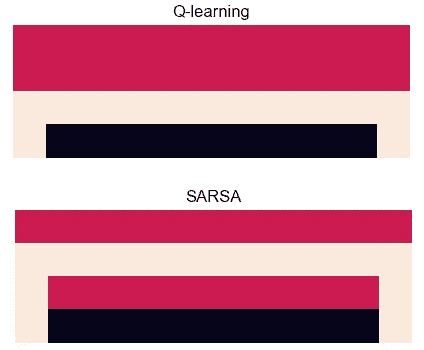
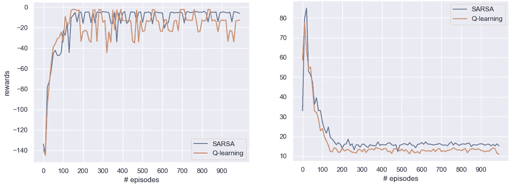

# 用非策略强化学习走下悬崖

> 原文：<https://towardsdatascience.com/walking-off-the-cliff-with-off-policy-reinforcement-learning-7fdbcdfe31ff?source=collection_archive---------21----------------------->

## 政策外强化学习和政策内强化学习的深入比较

一座悬崖，作为背景。艾伦·卡里略在 [Unsplash](https://unsplash.com?utm_source=medium&utm_medium=referral) 拍摄的照片

为了学习强化学习(RL)的基础知识，萨顿和巴尔托[1]的教科书悬崖行走的例子是一个很好的开始，提供了 Q-学习和 SARSA 的例子。你可能知道，SARSA 是 **S** tate、**A**action、 **R** eward、 **S** tate、**A**action 的缩写——用来更新价值函数的轨迹。为了保持类比，Q-learning 可以概括为 **S** tate，**A**action， **R** eward， **S** tate 或者 SARS(注意第二个动作无所谓！).不同之处在于，SARSA 是 **on-policy** 而 Q-learning 是 **off-policy** 。这到底是什么意思？

# 操纵悬崖

在进入那个问题之前，我们先来定义一下我们的悬崖世界。我们勇敢的特工站在悬崖边，试图走最少的步数(允许的步数有*左*、*右*、*上*、*下*)到达悬崖的另一边。为了建立这个目标的模型，达到目标结束这一集并给予+10 的奖励，每个中间步骤花费-1，掉下悬崖花费高达-100。不用说，应该避免走下悬崖。

悬崖行走环境，有奖励，起点和终点。步入悬崖或球门瓷砖结束了学习插曲。

一开始，我们完全不知道，但是我们通过观察很快就学会了。在几次从悬崖上滚下来或者在无人区里漫游之后，我们应该学会如何到达目的地。每走一步，我们观察一个奖励，并使用时间差(TD)更新方程。我们先来看看 **SARSA** :

SARSA:时间差分更新方程

简单地说:我们将自己的预测与观察到的回报进行比较，并利用这种差异做出更好的预测。在简单的数学中:我们测量误差`(r_t+1 + Q_t+1)-Q_t`，并用该误差更新我们对`Q_t`的估计。注意，当`Q_t=(r_t+1+Q_t+1)`适用于所有状态和动作时，我们的算法已经收敛。

让我们写出 Q 值代表什么，因为这对理解很重要。考虑一整集的回报轨迹。使用简化符号，我们可以将 Q 值定义如下:

q 值(没有状态、动作和折扣的简化表示)。请注意，每个 Q 值估计的是累积的未来回报。

当然，回报是不确定的，所以我们不能简单地将我们的 Q 值设定为等于单一的回报轨迹。这个想法很简单。Q 值预测轨迹的值。当`r_T=-100`由于坠入悬崖，所有的 Q 值都会受到严重影响。

现在， **Q-learning** 的工作方式与 SARSA 略有不同:

Q-learning:时间差分更新方程

你知道为什么 Q-learning 可能被称为 SARS 算法:对于我们的更新，当评估我们的行动`a_t` — `r_t+1`时，我们在`a_t+1`采取的实际行动无关紧要。也许`a_t+1`在我们真实的样本轨迹中把我们引下悬崖；这无关紧要，因为我们取的是未来行动的*最大值*，而不是真实值。

# 在探索中学习

在训练过程中，两种算法都选择每块瓷砖的最佳动作，*给定我们当前的信念*(“贪婪”动作选择):

为当前 Q 值选择最佳行动的最大化问题

特别是在早期，这些信念(Q 值)可能是完全错误的——如果我们总是走最长的路，因为它曾经有效，我们永远不会知道有捷径。探索是获得更好政策的关键。

ε-贪婪策略通常遵循贪婪方法，但有时也会做些别的事情。假设有 5% ( `ϵ=0.05`)的时间，我们采取随机行动。当站在边缘时，那个随机的动作可能只是告诉我们*‘向右走’*当我们真的，真的不应该的时候。对于我们的 Q-learning 代理和 SARSA 代理来说，这样的行动不会有好结果。

站在离悬崖一瓦远的地方会变得更有趣。我们可以看到为什么我们稳健的 Q-learning 非常舒服地靠近边缘，而我们摇摆不定的 SARSA 朋友可能更喜欢保持安全的距离。对于奖励更新，Q-learning 只是简单地看不到未来多一步；下一个图块的*实际*动作无关紧要。

用 SARSA 更新时间差(按策略)。使用**实际轨迹**，在跌落悬崖时获得的大的负奖励被用于更新所有先前状态和动作的 Q(s，a)值。[作者自己的作品]

使用 Q 学习的时间差异更新(偏离策略)。掉下悬崖时获得的巨大负回报不会影响早期的 Q 值，因为**最优轨迹**用于更新。[作者自己的作品]

结果呢？一个训练有素的 Q-learning agent 通常遵循最优路径，而 SARSA agent 则需要走一点弯路。例如，参见下面的模拟样本路径:

学习完成后 Q-learning 和 SARSA 的示例路径。注意，SARSA 绕过了悬崖，因为政策更新更重视跌入悬崖。

# 超越悬崖(政策上与政策外)

到目前为止还好，但是悬崖漫步是一个程式化的教科书例子。一只山羊可以弄明白这一点(它们实际上每天都在这么做)。对于实际的 RL 问题，我们可以用这些信息做什么呢？

一只山羊。[穆罕默德·努里·伊塞诺鲁](https://unsplash.com/@saikturi?utm_source=medium&utm_medium=referral)在 [Unsplash](https://unsplash.com?utm_source=medium&utm_medium=referral) 上的照片

你不太可能使用 SARSA 或 Q-learning 来解决更具挑战性的强化学习问题。在这两种情况下，我们都需要用 Q 值来填充表格。为了获得准确的查找表，我们必须多次观察每个状态-动作对，以了解所有的`Q(s,a)`。悬崖行走问题只有 192 个状态-动作对(48*4)，但典型的 RL 问题太大了，无法在查找表中捕获。

尽管没有使用实际的算法，策略学习和非策略学习的*原则*是相同的。简而言之:(I)使用实际回报轨迹来更新 Q 值的更新函数是符合政策的，(ii)包括最大值算子的更新函数可能不符合政策。无论我们使用什么样的探索方案，政策上/政策外的两难选择仍然是相关的——我们将在后面深入探讨。悬崖漫步问题仅仅阐明了权衡和行为。

# 行为策略还是目标策略？

为了充分理解政策上和政策外之间的困境，我们应该掌握行为政策和目标政策之间的区别。评估 RL 算法时，明确我们实际测量的性能非常重要。

**行为策略**是包含随机探索的策略，**目标策略**不包含随机探索。如果我们总是遵循我们学到的最佳路径(目标策略)，就没有理由绕过悬崖。如果我们在现实中部署行为策略，我们应该谨慎。通常，我们使用行为策略在安全的环境中学习——很可能是模拟——并在现实生活中部署最终的目标策略。然而，情况并非总是如此。

举例来说:假设我们训练一个真实的机器人(而不是虚拟代理)安全地机动到悬崖的另一边。你不希望你昂贵的机器人在快乐探索的同时驶下悬崖。如果新的观察有现实生活中的后果，你在探索时显然会谨慎得多。还可以考虑用历史数据来测试你的交易算法，或者用真钱在股票市场上释放它来学习——这是非常不同的含义。

仔细探索的一个更常见的原因是实验通常计算量很大。由于 Q-learning 具有不太一致的回报模式，轨迹比 SARSA 具有更大的方差，并且收敛更具挑战性。此外，嵌入式最大化问题`max a` ∈ A(s_t)`可能需要大量的努力来解决——不是每个动作空间都只包含四个移动。

探索很少是“免费的”，即使是在虚拟环境中。

# 正面交锋

燃眉之急:哪种算法更好？你应该用哪一个？Q-learning 还是 SARSA？

从表面上看，Q-learning 显然提供了一条更短的路径(通常是最优的)，从而提供了一个更好的解决方案，但这忽略了隐藏在下面的细微差别。下图显示了一个清晰的**权衡**；平均来说，SARSA 会得到更大的奖励，而 Q-learning 平均来说需要更少的步骤。当然，这只适用于*行为*策略——用 Q-learning 得到的*目标*策略显然更胜一筹。

**左:**奖励对比。平均而言，由于坠入悬崖的次数较少，SARSA 会产生更高的回报。**右:**步骤对比。平均来说，Q-learning 需要更少的步骤，因为它对跌落悬崖不太敏感。

再说一次，我们不能简单地比较目标政策并得出 Q-learning 更好的结论。恰好对`ϵ=0.05`成立，但是用`ϵ=0.001`代替它，我们可以用两者获得最优路径。随着探索趋向于 0，SARSA 和 Q-learning 收敛到相同的方法。学习过程中探索通常会减少——例如通过设置`ϵ=1/n`——并且表面上看起来 Q-learning 的好处也随之消失。

*“视情况而定”将是对“哪一个更好？”这个问题最忠实的回答，但不是最有用的一个。让我们试着推导出一些经验法则。*

***在下列情况下使用策略学习(SARSA):***

*   *学习是昂贵的*
*   *计算工作量是一个瓶颈*
*   *你不需要探索一切*
*   *行动问题很难解决*
*   *你不介意微调探索参数*
*   *你愿意为了稳健而牺牲一些回报*
*   *学习时的奖励很重要*
*   *你厌恶风险*

***在下列情况下使用偏离策略学习(Q-learning):***

*   *学习是廉价的*
*   *计算工作量不太相关*
*   *你想探索很多东西*
*   *行动问题很容易解决*
*   *你不想麻烦微调探索*
*   *学习时的奖励并不重要*
*   *只有目标策略的性能才是重要的*
*   *你喜欢冒险*

*还是那句话，两者都能达到同样的解决质量，适当的调优是必不可少的，这取决于问题和目的，不存在*一刀切*等答案。等等。毕竟，它们是经验法则。确定您需要哪种方法的最佳方式？去站在悬崖边，感受一下这种感觉。*

*想看完整的代码吗？在我的 [GitHub 库](https://github.com/woutervanheeswijk/cliff_walking_public)上查看一下吧。*

**有兴趣用深度 Q-learning 解决悬崖行走问题？请查看我关于 TensorFlow 实现的文章:**

* [## 悬崖行走问题的深度 Q 学习

### 一个完整的 Python 实现，用 TensorFlow 2.0 导航悬崖。

towardsdatascience.com](/deep-q-learning-for-the-cliff-walking-problem-b54835409046) 

*转而寻找政策梯度实施？*

 [## 基于离散策略梯度算法的悬崖行走问题

### 用 Python 实现了一个完整的增强算法。手动执行这些步骤来说明内部…

towardsdatascience.com](/cliff-walking-problem-with-the-discrete-policy-gradient-algorithm-59d1900d80d8) 

## 参考

[1]萨顿和巴尔托(2018 年)。*强化学习:简介*。麻省理工出版社。*