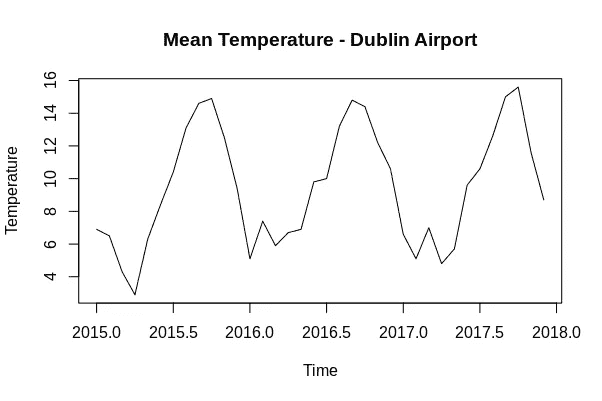
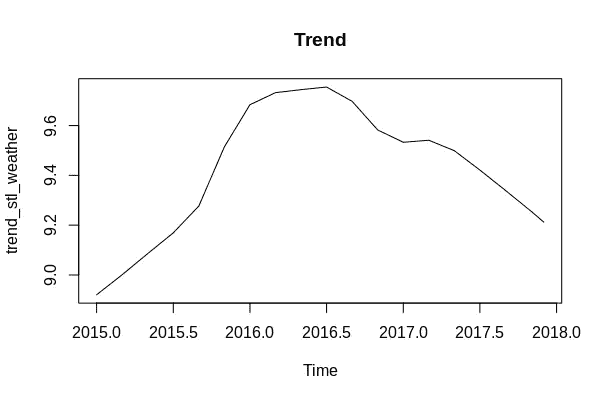
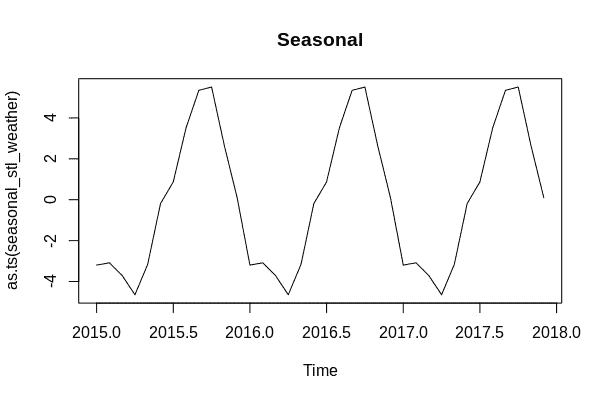
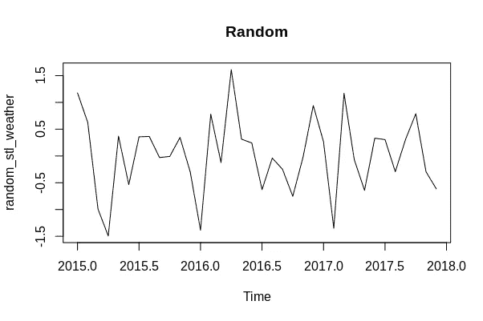
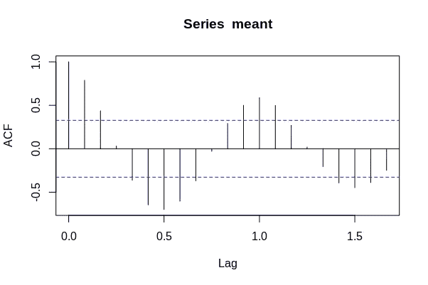
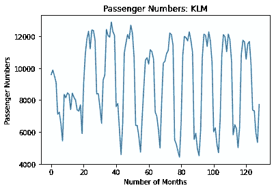

# 想要擅长时间序列预测吗？预测天气。

> 原文：<https://towardsdatascience.com/want-to-get-good-at-time-series-forecasting-predict-the-weather-a2fc745b9b3?source=collection_archive---------19----------------------->

## 了解时间序列的组成部分

来源:图片由 [geralt](https://pixabay.com/users/geralt-9301/) 从 [Pixabay](https://pixabay.com/photos/thermometer-summer-heiss-heat-sun-4294021/) 拍摄

对于一个最初来自经济学背景的人来说，我会花一些时间来建立可以预测[天气模式](https://medium.com/analytics-vidhya/sarima-forecasting-seasonal-data-with-python-and-r-2e7472dfad83)的模型，这可能看起来很奇怪。

我自己也经常质疑这一点——但这是有原因的。温度模式是最容易预测的时间序列之一。

# 时间序列组件

当时间序列被分解或分解成单个元素时，序列由以下部分组成:

*   **趋势:**时间序列在一段重要时间内的大致方向
*   **季节性:**在时间序列中频繁重复的模式
*   **随机:**时间序列中的随机波动

仔细想想，温度数据的组成非常明显。

至少在北半球的大部分地区，总的趋势是气温随着夏季月份的到来而上升，随着冬季月份的到来而下降。

例如，这是爱尔兰都柏林机场 2015-2018 年的平均温度波动，来源于[气象局](https://www.met.ie/climate/available-data/historical-data):

资料来源:RStudio

分解这个时间序列直观地揭示了以下内容:

**趋势**

资料来源:RStudio

**季节性**

资料来源:RStudio

**随机**

资料来源:RStudio

正如我们在上面的图表中看到的，季节模式清楚地显示了一个年度周期。例如，自相关函数揭示了每 12 个月温度数据的强相关性。这是有道理的，因为显而易见的是，一月份的气温将与其他年份记录的一月份气温表现出最大的相关性。在比较七月的温度时也是如此，以此类推。

资料来源:RStudio

对这些组成部分的直观理解有助于更好地理解它们在其他时间序列中的应用。

例如，航空乘客数量的季节性模式(至少在新冠肺炎之前)是，夏季几个月航空乘客较多，冬季乘客总体较少。下面是一个乘客数量波动的例子，它是使用来自[旧金山开放数据](https://data.sfgov.org/Transportation/Air-Traffic-Passenger-Statistics/rkru-6vcg)的数据生成的:

来源:Jupyter 笔记本输出

领域知识对于识别时间序列的组成部分也很重要。例如，专门从事能源市场分析的数据科学家会直觉地知道，商业用电量往往遵循每周一次的模式，而不是每年一次的季节性模式。也就是说，消费倾向于在高使用率的日子(如星期一)达到峰值，而在周末显著下降。

# 首先可以预测一个时间序列吗？

很多时候，那些时间序列分析的新手会试图预测数据中存在大量内在随机性的序列。

例如，股票价格往往遵循非常随机的模式。这些时间序列通常是由**周期性**而不是季节性驱动的，因此时间序列中的波峰和波谷不会以特定的间隔出现。

因此，尽管整体趋势可能会给出股票方向的长期观点，但直接预测时间序列仍然非常困难，因为时间序列中的模式通常不会重复。

也就是说，很多时候，人们可能试图使用 ARIMA 模型来预测股票价格，而没有花足够的时间来理解时间序列的组成部分。我也为过去犯的这个错误感到内疚。

此外，值得注意的是，温度数据不会受到人为干预的影响。然而，许多时间序列可以(包括股票价格)，因此，过去的数据无法解释这些干预。

使用一个单独的例子，假设我试图使用谷歌的[社区移动数据来尝试预测一个主要城市在六个月内的移动趋势。](https://www.google.com/covid19/mobility/)

这种预测毫无意义，因为它完全依赖于时间序列本身以外的因素，如政府封锁、新冠肺炎流通等。

# 结论

严格来说，在预测时间序列时，不必从天气模式开始。但是，您应该从一组易于预测且具有可预测趋势和季节性模式的数据开始。

人们犯的一个大错误是试图预测一个具有许多内在随机性的时间序列。你不仅无法对这些数据做出可信的预测，而且像**自相关函数**这样的术语对你来说也没有直观的意义。

预测一个不受外部因素影响的时间序列(温度模式是极少数因素之一)将让你更好地理解**为什么**诸如自相关、平稳和其他因素具有理论相关性。事实上，当需要预测更复杂的数据(如销售数据)时，您将能够更好地理解 1)模型的理论工作方式，以及 2)使用不同时间序列模型对数据的优缺点。

*免责声明:本文是在“原样”的基础上编写的，没有担保。它旨在提供数据科学概念的概述，不应被解释为专业建议。本文中的发现和解释是作者的发现和解释，不被本文中提到的任何第三方认可或隶属于任何第三方。*