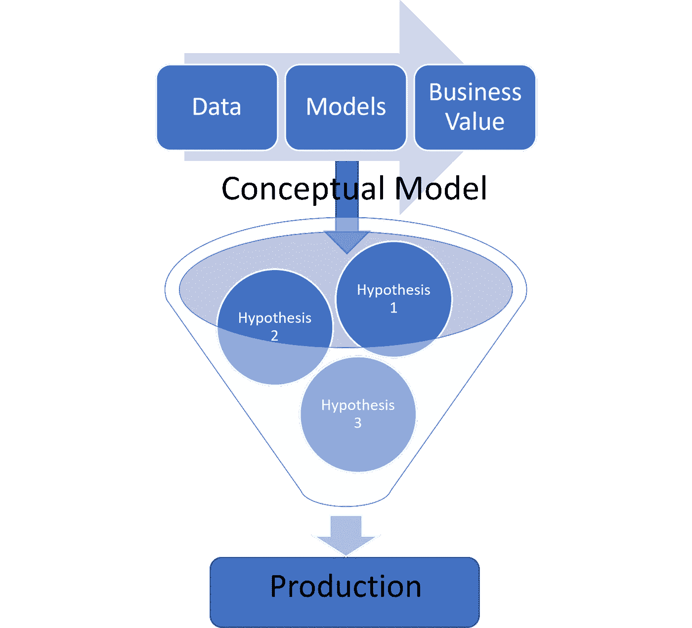
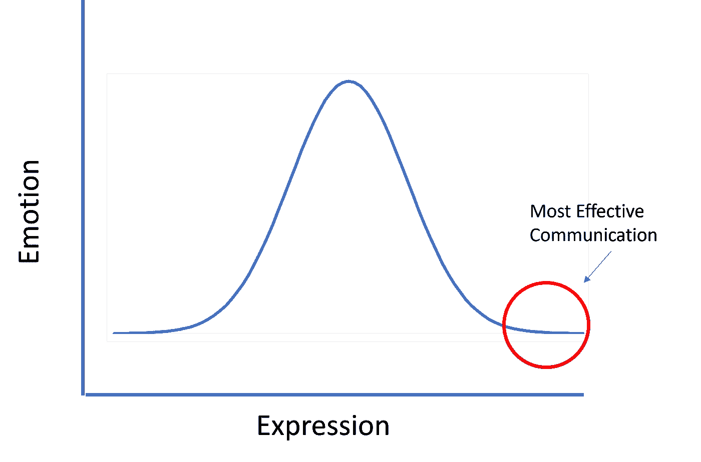

# 想在数据科学领域赚更多的钱？不要成为管理者，要成为领导者

> 原文：<https://towardsdatascience.com/want-to-make-more-money-in-data-science-dont-become-a-manager-become-a-leader-85f60187b80e?source=collection_archive---------14----------------------->

## [行业笔记](https://towardsdatascience.com/tagged/notes-from-industry)

## 领导数据科学团队的 4 项基本技能

图片来自 [PublicDomainPictures](https://pixabay.com/users/publicdomainpictures-14/?utm_source=link-attribution&utm_medium=referral&utm_campaign=image&utm_content=2205) 来自 [Pixabay](https://pixabay.com/?utm_source=link-attribution&utm_medium=referral&utm_campaign=image&utm_content=2205)

对许多人来说，在数据科学领域赚更多的钱意味着进入管理层。

事实上，一项研究显示经理“价值 1.75 名员工”

这一统计表明，经理的收入几乎是非管理人员的两倍。尽管工资差异因行业和职位类型而异，但有一点是明确的:经理通常会得到更多的报酬。

但获得晋升不一定与管理有关。更关键的是，钱不在管理上。钱在领导身上。

管理是一种领导角色吗？绝对的。你应该学习如何成为一名优秀的经理来获得晋升吗？不一定。

在本文中，我想介绍我从开发人员到经理再到数据科学团队主管这些年来学到的一些顶级技能。

**TLDR**；学会成为数据科学领导者，而不是数据科学管理者。

有没有见过这样一个迷因，它展示了一个象形文字般的角色坐在一个“任务”盒子上，被其他象形文字般的角色拉着，看起来绑在一起？在图像中，有一个箭头指向标签为“boss”的盒子顶部的字符

该图像的正下方是一个类似的图像，但是没有人坐在盒子上面。相反，有一个箭头指向前面的字符，标签为“leader ”,因为该字符指向前方。

我喜欢这个形象，因为它说明了领导的价值高于管理。换句话说，领导者不仅要管理，还要努力指明方向。由于其复杂性，这种品质对于数据科学领导者来说更加重要。

但是形象并没有告诉我们如何成为领导者。它没有告诉我们需要什么技能。它没有为我们提供图像传达给我们的成千上万个词中最关键的 4 个词。所以我会努力的。

# 数据科学家的 4 项领导技能

## 1.思考概念，而不是工具和技术

为了有效地领导数据科学团队，理解您作为开发人员所处理的工具和技术与高阶概念的关系是至关重要的。例如，像 Google BigQuery 这样的数据库只是存储某些类型信息的简单方式。概念是存储，技术是 BigQuery，工具是 SQL。

领导团队需要我们调整我们的思维来设定概念方向，并理解可以支持概念方向的工具和技术正在讨论中。这有点像学者如何使用理论来发展假设，以帮助测试他们的理论。

在商业中，理论是如何为商业问题带来更多商业价值的概念模型。领导者帮助建立这些概念模型，而开发人员致力于各种假设，将这些模型变为现实。假设的测试要求我们使用可用的特定工具和技术，因此优秀的开发人员擅长应用这些工具/技术并将它们联系在一起，而领导者则确保他们符合最终带来价值的概念方向。

我把它看作一种漏斗，概念模型在顶部，假设在中间，所有这些最终导致生产。

漏斗底部是操作人员。那些知道一套独立的工具和技术，可以帮助把工作的假设变成商业规模的实际产品的人。

数据科学领导者了解这些部分，同时不断确保它们的开发方式与她/他/他们设定的概念方向一致。

作者图片

## 2.沟通

当领导者看到他们的概念模型变得栩栩如生并带来商业价值时，他们会感到兴奋；当数据科学家修复错误、实现新的模型代码并训练精确的模型时，他们会感到兴奋。重点是？兴奋很重要，情绪很重要，即使在数据科学中也是如此。

但是没有解释的结果没有什么商业价值。领导者不仅帮助创造商业价值，而且他们还通过团队的激励传达这种价值。换句话说，领导者帮助翻译数据科学成果，帮助非数据科学家理解他们的产品带来的商业价值。

不幸的是，对于数据科学来说，能够有效地传达让数据科学开发人员兴奋的商业价值是令人沮丧的困难。这种困难的部分原因是，大量的开发工作都是在实验中度过的(参见上面漏斗中的假设阶段)。此外，解释我们能够创建数据的图形表示以提取图形属性作为特征来提高模型准确性是多么酷，就像对业务利益相关者说克林贡语一样。

因此，与其他团队相比，有效沟通对于数据科学领导的重要性对于数据科学团队的成功更为重要。这意味着数据科学的领导者甚至不想解释他们的开发人员对什么感兴趣。相反，领导人会等待集体兴奋降温。他们反思围绕概念模型的执行而建立的情感，然后他们交付该价值的有效商业翻译。

作者图片

## 3.连接到 KPI

商业利益相关者看重的到底是什么？他们重视关键绩效指标或 KPI。

你问什么是 KPI？KPI 到底是什么取决于具体的业务。也就是说，每个企业都有一些用美元定义的 KPI。但是知道 KPI 是什么只是成功的一半。

有效传达数据科学的价值意味着知道如何将数据科学成果与企业重视的 KPI 联系起来。理想情况下，在设定概念方向时，这些都被确定或至少被广泛定义(见第 1 点)。

因为数据科学很少产生最终用户直接交互的解决方案，所以领导者还必须了解在数据科学团队之外需要采取哪些步骤来与业务部门进行适当的沟通，还必须有谁参与将数据科学输出与将确定业务价值的特定 KPI 联系起来。

## 4.支持计划

随着概念模型的确定、沟通技巧的增强以及可转化为 KPI，领导者还必须知道需要什么资源来支持他们的产品。在早期，从数据科学实验中获得的见解可能足以证明其对企业的价值，因为企业仍在试图理解他们最初是如何获得这种见解的。随着领域的发展、团队的壮大和薪水的上涨，数据科学领导者在实施团队工作方面面临越来越大的压力。

因此，数据科学的成果必须嵌入业务直接受益的业务产品中。这些嵌入可以是改善用户体验的应用程序，也可以是帮助员工提高效率的工作流。不管应用程序如何，这些数据科学成果现在都在与生产环境交互。

这意味着数据科学产品必须遵守为生产环境设置的业务策略、服务级别协议和安全协议。因此，对于数据科学领导者来说，了解 DevOps 以及在真实生产环境中支持其产品所需的资源变得越来越重要。这一新要求的重要性可以从企业对 MLOps 专家不断增长的需求中看出。MLOps 专家了解如何将数据科学家的工作与生产软件系统的需求联系起来。数据科学领导者必须知道如何根据运营团队的要求管理他们的开发团队，并为开发人员提供充分的计划，以支持他们已经投入生产的产品。

说到底，当经理远不如当领导有价值。在这里，我提供了一些关于我在数据科学领导生涯中已经学到(并且还在学习)的关键技能的想法。一如既往，我期待您的想法、反馈和想法。

比如参与学习更多关于数据科学、职业发展或糟糕的商业决策的知识？[加入我](https://www.facebook.com/groups/thinkdatascience)。