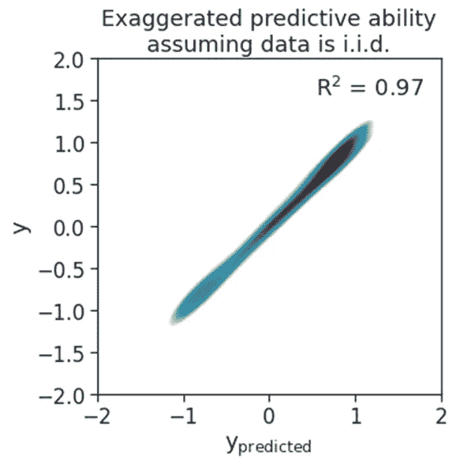
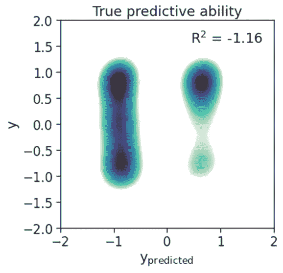

# 对于性能更好的模型，不要未经检查就假设数据是独立的

> 原文：<https://towardsdatascience.com/want-to-ruin-your-model-assume-data-is-i-i-d-78c61a0b2076?source=collection_archive---------40----------------------->

## 关注数据中的自相关可以帮助您构建更好的预测模型


[Ehimetalor Akhere Unuabona](https://unsplash.com/@theeastlondonphotographer?utm_source=medium&utm_medium=referral) 在 [Unsplash](https://unsplash.com?utm_source=medium&utm_medium=referral) 拍摄的照片

首先，一个小测验。

在下面的两个例子中，报告的准确性可信吗？

1.  Shivram 想到了一个绝妙的主意，仅仅通过 iPhone 的移动来预测心率。他从数千名同意的用户那里收集 iPhone 动作的时间同步数据和 Apple watch 的心率数据。然后，他将数据*随机*一秒一秒地分成训练集、验证集和测试集。在他对自己的模型感到满意之后，他报告说，他能够从 iPhone 的运动中预测心率，在测试集上的准确率高达 98%!
2.  Abhilash 希望利用卫星图像来寻找森林的位置。他获得了一些卫星图像和人类绘制的森林地理位置图的训练数据。然后，他将像素随机分成训练集、验证集和测试集。在他对他的模型满意之后，他报告他的测试准确率为 99%！

在上述两种情况下，报告的准确性可信吗？

不要！

在这篇文章中，我们将了解为什么他们不是。我们还将学习一些基本的预处理原则，人们可以遵循这些原则来避免将来出现这样的陷阱。

# 为什么要关心数据是否是 id？

独立同分布数据(i.i.d .)在预测设置中有许多好的特性[在预测设置中，知道一个数据点并不能告诉你关于另一个数据点的任何事情。当我们为模型训练拆分数据时，必须知道数据是否是独立的。](/independent-and-identically-distributed-ce250ad1bfa8)

将数据分为训练集、验证集和测试集是在监督学习设置中测试模型性能的最标准方法之一。即使在我们进入建模之前(这在机器学习中几乎受到了所有的关注)，不关心上游过程，如数据来自哪里，它们是否真的相同，以及我们如何分割它们，都会对预测的质量产生影响。

当数据具有高自相关性时，这尤其重要。点之间的自相关仅仅意味着一个点上的值与其周围的值相似。以温度为例。预计任何时刻的温度都与前一分钟的温度相似。因此，如果我们希望预测温度，我们需要特别注意分割数据。具体来说，我们需要确保在训练、验证和测试集之间没有可能夸大模型性能的数据泄漏。

# 模型性能会因信息泄露而被夸大到什么程度？

看完以上，很自然的会问，这是一个足够重要的问题，值得我去关心吗？通过一个高度自相关数据的例子，我们会看到答案当然是肯定的！我们将把这个例子分成两部分。首先，我们将数据随机分为训练集和验证集，并在验证集上实现非常高的准确性。然后，我们将使用分层随机抽样来分割数据，从而减少信息泄漏。然后，我们将看到同样的模型如何具有几乎为零的精度。

# 交互式示例

如果您希望以交互方式了解这个示例，您可以使用[这个 colab 笔记本](https://colab.research.google.com/drive/1EJFCIX4enOvwLby_0DPFX4-KwG-S7YTF#scrollTo=lgm0yAIwN6O9)。

我们先导入相关的包。

```
import matplotlib.pyplot as plt
import numpy as np
import pandas as pd
import seaborn as sns
import sklearn.model_selection
import sklearn.linear_model
import sklearn.ensemble
```

我们来做一些响应变量自相关性高的合成数据。

```
# number of examples in our data
n = int(100*2*np.pi)
# Seed for reproducebility
np.random.seed(4)
# make one feature (predictor)
x = np.arange(n)
# make one response (variable to predict) which has high autocorrelation. Use a
# sine wave.
y =  np.sin(x/n*7.1*np.pi)+np.random.normal(scale = 0.1, size = n)
# merge them into a dataframe to allow easy manipulation later
df = pd.DataFrame({"x":np.array(x), "y":np.array(y), "y_pred":np.nan})
# visualize the response versus feature
sns.set(style = "ticks", font_scale = 1.5)
sns.regplot(x="x",y="y",data=df)
```

## 数据的随机分割

让我们将数据随机分为训练集和验证集，看看模型的表现如何。

```
# Use a helper to split data randomly into 5 folds. i.e., 4/5ths of the data is chosen *randomly* and put into the train set, while the rest is put into# is chosen *randomly* and put into the train set, while the rest is put into# the validation set.kf = sklearn.model_selection.KFold(n_splits=5, shuffle=True, random_state=42)# Use a random forest model with default parameters.# The hyperaparameter of the model are not important for this example because we# will use the same model twice- once with data split randomly and (later) with# data split with stratificationreg = sklearn.ensemble.RandomForestRegressor()# use k-1 folds to train. Predict on the kth fold and store in the dataframefor fold, (train_index, test_index) in enumerate(kf.split(df)):reg.fit(df.loc[train_index, "x"].values.reshape(-1, 1), df.loc[train_index, "y"])df.loc[test_index, "y_pred"] = reg.predict(df.loc[test_index, "x"].values.reshape(-1, 1))# visualize true y versus predicted yfig, ax = plt.subplots(figsize = (5,5))sns.kdeplot(data=df, x="y_pred", y="y",fill=True, thresh=0.3, levels=100, cmap="mako_r",ax=ax)ax.set_xlim(-2,2)ax.set_ylim(-2,2)ax.set_xlabel(r"y$_{\rm predicted}$")ax.set_title("Exaggerated predictive ability\nassuming data is i.i.d.")r2 = sklearn.metrics.r2_score(df.y, df.y_pred)ax.annotate(f"R$^2$ = {r2:0.2f}", xy =(0.95,0.95), ha = "right", va = "top", xycoords = "axes fraction")print(f"[INFO] Coefficient of determination of the model is {r2:0.2f}.")
```



假设数据是独立的，夸大了预测能力(但实际上不是)。

哇哦。！我们实现了 97%的 R2！似乎我们的模型在模拟正弦响应函数方面做得非常出色。

但是……模型*真的*能够理解 x 和 y 之间的响应函数吗？或者它只是作为一个最近邻插值？换句话说，模型只是通过记忆训练数据，输出最接近训练样本的 y 值来作弊吗？让我们通过使模型难以作弊来找出答案。

## 数据的分层分割

现在，我们将沿着 x(特征)轴将数据分成 5 个块，而不是随机分割数据。然后，我们将把 4 个数据块放入训练数据，1 个数据块放入验证集。

> 通过沿着自相关特征对数据进行分层，我们尊重了数据的非独立身份性质。

让我们看看模型是否有同样的精度。

```
# How many chunks to split data in? 
nbins = 5
df["fold"] = pd.cut(df.x, bins = nbins, labels = range(nbins))# Split the data into training and validation data based on the chunks.
# Train on 4 chunks, predict on the remaining chunk.
for fold in sorted(df.fold.unique()):
  train_index = df.loc[df.fold!=fold].index
  test_index = df.loc[df.fold==fold].index
  reg.fit(df.loc[train_index, "x"].values.reshape(-1, 1), df.loc[train_index, "y"])
  df.loc[test_index, "y_pred"] = reg.predict(df.loc[test_index, "x"].values.reshape(-1, 1))
# Visualize true y versus precited y.
fig, ax = plt.subplots(figsize = (5,5))
sns.kdeplot(
    data=df, x="y_pred", y="y",
    fill=True, thresh=0.3, levels=100, cmap="mako_r",ax=ax
)
ax.set_xlim(-2,2)
ax.set_ylim(-2,2)
ax.set_xlabel(r"y$_{\rm predicted}$")
ax.set_title("True predictive ability")
r2 = sklearn.metrics.r2_score(df.y, df.y_pred)
ax.annotate(f"R$^2$ = {r2:0.2f}", xy =(0.95,0.95), ha = "right", va = "top", xycoords = "axes fraction")
print(f"[INFO] Coefficient of determination of the model is {r2:0.2f}.")
```



同一模型的真实预测能力

现在，我们看到我们的模型具有低于随机的性能(旁注:不知道决定系数怎么会是负的？[在这里阅读更多](/r²-or-r²-when-to-use-what-4968eee68ed3))！这表明，我们的初始模型并没有真正使用 x 作为 y 的信息预测器，而只是从训练集中找到最接近的 x，并吐出相应的 y。因此，如果我们不小心数据中的自相关，我们可能会夸大模型性能。

更糟糕的是，我们可能错误地推断出 x 的重要性，并进而得出几个科学结论。然而，我们的模型仅使用 x 来插入/记忆响应。不幸的是，这不是一个虚构的例子。[这篇论文](https://www.nature.com/articles/s41467-020-18321-y)表明，地球科学中试图预测植被生物量的几篇论文(类似于本文开头 Abhilash 的例子)都被这个问题弄得千疮百孔。

# 结论

拆分数据可能会产生巨大的后果。如果有任何证据表明数据是自相关的，或者更一般地说是非同分布的，则分层分裂或使用信号分解来解相关数据的其他技术可能是有用的。至少，在开始建模之前将数据可视化是非常有益的。因此，下次你遇到 Shivram、Abhilash 或其他任何声称在随机拆分他们的数据后实现了非常高的建模性能的人时，你已经准备好帮助他们提出更好的预测模型，而不会夸大模型性能。