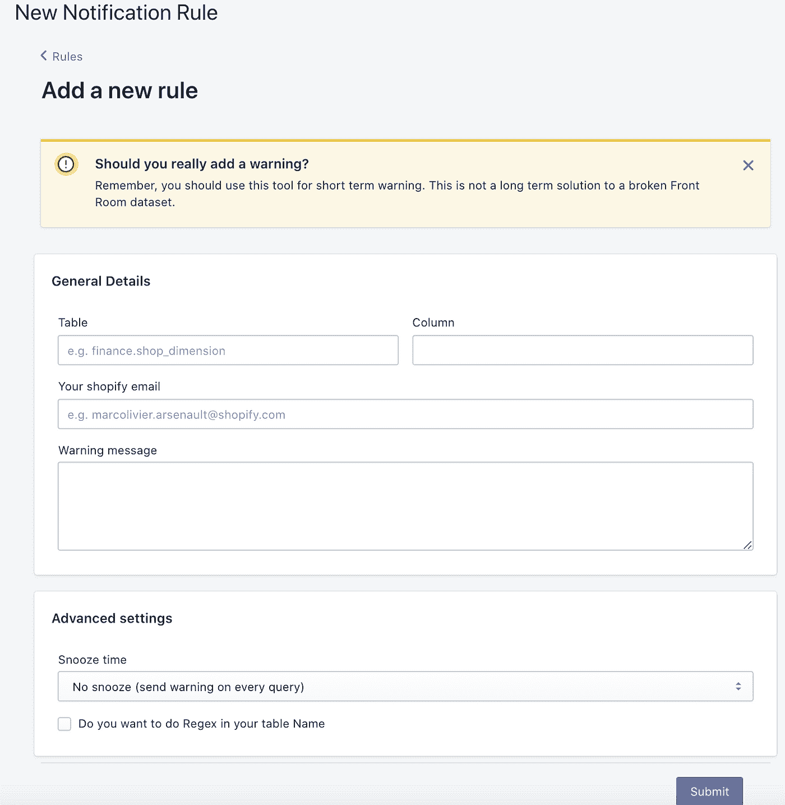

# 数据仓库中的预警系统

> 原文：<https://towardsdatascience.com/warning-systems-on-data-warehouse-37d57a8fee57?source=collection_archive---------49----------------------->

## 关于我如何以及为什么建造了 beoneer 的故事，这是一个允许我们在环境中的任何桌子上设置警告的系统。

在过去的几年里，我和 Shopify 的其他一些人一直在寻找一种在特定的桌子上设置警告的聪明方法。为什么是警告？原因很简单，正如我在这个[以前的博客](https://coffeeanddata.ca/how-to-thrive-in-the-face-of-disruption-tips-from-shopify-data-team)中解释的那样，我们花了很多时间来构建高质量的前厅数据集。也就是说，由于许多原因，这些数据集可能会随着时间的推移而开始退化。让我向你介绍一下这个问题，我们以前尝试过什么，以及我们是如何解决的。

# 问题是

是的，在 Shopify，我们非常关心数据集的质量，我们对所有数据集进行同行评审，尽可能地记录它们。当我们发布数据集时，它们是完美的。也就是说，我们工作在一个不断变化的环境中。然后，在某个时候，数据集质量会下降。这里有几个例子:

*   **有些数据不再可用**:单看起来很容易，但当它是更大数据集的一部分，隐藏在 6 个连接之下时，识别和修复就不是那么简单了。
*   **原始数据的变化**:你建立数据集时的假设可能会改变。有可能数据点开始返回一个新类型的值，或者在预先设定的范围之外(例如从 0 到 1)，可能以前不能为 null 的东西，现在可以为 null。
*   **业务规则的变化**:我们的一些数据集确实建模或复制了业务逻辑、商业合同、SLA 等。当这些契约发生变化时，我们需要修改数据集以包含新的现实。

当这三件事发生时，有两个主要步骤。首先，我们需要意识到并确定变化，其次，我们必须修复或废弃数据集。由于第一个值得关注，并且 Shopify 是很好的工具，所以我不想谈论太多。在这里我真的想重点讲第二个，因为虽然听起来很简单，但这是现实生活中的另一个故事。

每次我们遇到这种情况，我们都不得不问自己，“好吧，我们需要修理 XYZ，但是我们没有时间了。选项 A)我们删除数据集，选项 B)我们修复它”。在一个快速的头脑风暴会议后，我们不能用 A，因为它为其他资产提供动力，我们也不能用 B，因为我们没有时间去做。因此，我们最终会让数据集保持原样，即使我们知道它已经损坏。我们不能优先考虑其他工作，错误的影响不是很大(目前)。

结论:让我们警告数据集的用户，让他们意识到错误，然后我们将问题添加到 backlog 中

# 真正的问题是

真正的问题是，有一天，有人会查询你的数据集。这个人不会意识到这个问题，并且会得出错误的结论。当他们联系你，因为他们和他们一半的老板都被这个结果吓坏了，你告诉他们最糟糕的答案，哦，是的，对不起，我们知道这是一个错误。

# 我们到目前为止所做的努力

正如我们所说，我们多次面临这些问题，以下是我们已经尝试过的一些方法:

*   **传播 bug** :在 Slack 上发一封令人讨厌的`@here`或者广泛传播的电子邮件，让每个人都知道你的数据集有 bug。如果有人要使用它，那就太好了。因为除此之外，从现在起的 6 个星期内，很少有机会有人会记得你，而且你刚刚用你的广播惹恼了很多人。
*   **文档**:像大多数其他地方一样，我们有自己的文档库。你可以去那里并在这个特定的数据集上添加注释，但是除非有人去读它，否则没有人会看到。此外，所有经常使用您的数据集的现有仪表板或数据科学家不会在每次运行查询/报告时都去读取文档。
*   找出谁在使用它:这是了解这个 bug 有多糟糕的关键。它将帮助您了解您需要给予修复多少优先级，但是首先，在此期间，它不能修复任何东西，其次，即使没有很多依赖项，也不意味着将来会有人使用它。

# 解决办法

所以我在寻找一种方法来解决这个问题，尤其是在像上面解释的那样糟糕的情况下，有些人真的对完全有效的查询结果感到压力。我们需要一种方式来警告用户这个数据集有特定的问题。

经过一番挖掘，我意识到一些聪明的数据工程师已经将[Presto](https://prestodb.io/)[event listener](https://prestodb.io/docs/current/develop/event-listener.html)设置为针对特定的 kafka 主题发送。换句话说，我们的 Presto 集群上的每个查询都生成一个 Kafka 事件。

注意:Presto 是在 Shopify 查询数据集的默认引擎。

“我意识到我可以构建一个软件来监控这个 Kafka 主题，执行一些正则表达式来识别查询是否是关于表的错误，我可以向用户发送一条 Slack 消息。”

为什么 Slack，Slack 是 Shopify 的主要沟通工具，人们通过这种方式监控他们的电子邮箱。所以一条松弛的消息是警告他们的最好方式。我有个计划

# 履行

在 Shopify，我们有一个叫 Hackday 的东西。连续三天，我们停止“正常”的工作，开始特殊的项目。每个人都选择了自己的项目。我决定试一试。我从事专业软件开发已经有几年了，但我确信我能做点什么。

我的申请基本上就是这四个步骤:

1.  听听卡夫卡的话题
2.  做一些聪明的正则表达式，以确定它是否是我的表
3.  找到 Slack 句柄并向用户发送 Slack 消息。
4.  让所有这些在某个地方运行。

所以我被这个快速卡夫卡式的话题解决了，我可以简单地听它。2 可以通过一个基本的网页来解决，数据科学家可以在特定的表格上添加警告并使用正则表达式。对于#3 和#4，我对 Shopify 的开发文化和环境印象深刻。已经有一个网络服务可以将用户的电子邮件(我从 Kafka 的消息中得到的)转换成一个松散的句柄。我也可以通过他们的 API 轻松连接到 Slack。对于最近的部分，它比我能想到的还要简单。基本上，如果我能在 Ruby on Rails 中找到这样做的方法，我只需点击一下鼠标就能部署我的应用程序。

# 结果

直到今天，我仍然对这个结果印象深刻。如果您在查询完成后的 3 秒内查询任何带有警告的数据集，您会收到如下所示的 Slack 消息。

数据科学家现在可以轻松地在任何表上添加警告消息:

# 特征

我一直在开发这个工具的特性。我补充道:

*   小睡选项:这样用户就不会在每次查询表时疲惫不堪。
*   特定列过滤:如果除了一列之外，您的所有数据集都正常，那么您只能警告使用该列的用户。
*   表名中的正则表达式，可能有多个表受到影响。您可以设置一个正则表达式样式的表名。

# 统计数据

大约 3 个月后，举报人

*   向 148 个不同的用户发送了 1300 多个警告。
*   每天扫描大约 43 000 个 Presto 查询。
*   在小时后**发送了 300 个警告。**

我对此非常高兴，尤其是下班后的 300 个警告。这意味着 300 次，有人收到一个警告，指示他很可能因为其他团队成员不在那里提供帮助而无法获得支持。

这个工具太棒了，我现在晚上可以睡得更好了，因为我知道如果有人查询这些表，他们会得到警告，并且不会对结果做出任何错误的决定。

旁注:当你给内部项目告密者打电话时，有多少人联系你，这真的令人印象深刻

*原载于 2021 年 1 月 29 日*[*https://coffeeanddata . ca*](https://coffeeanddata.ca/warning-systems-on-data-warehouse)*。*