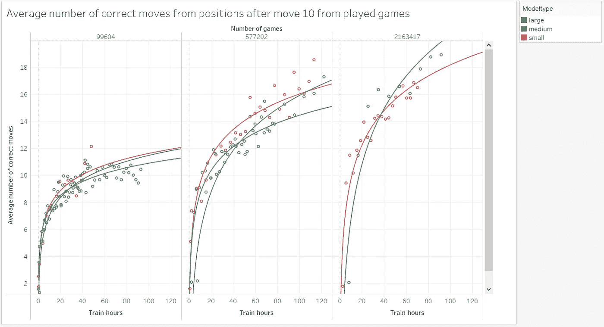
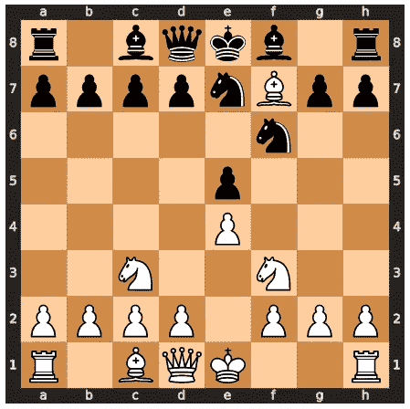
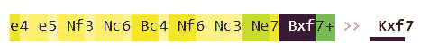
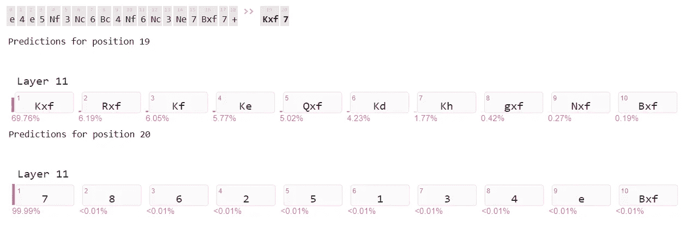
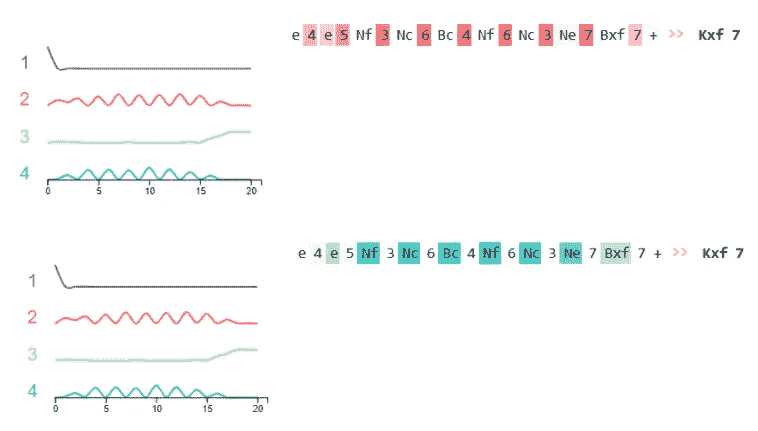
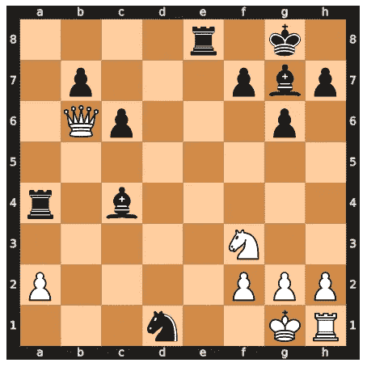
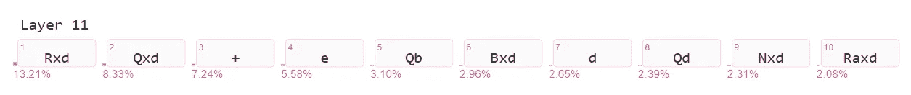
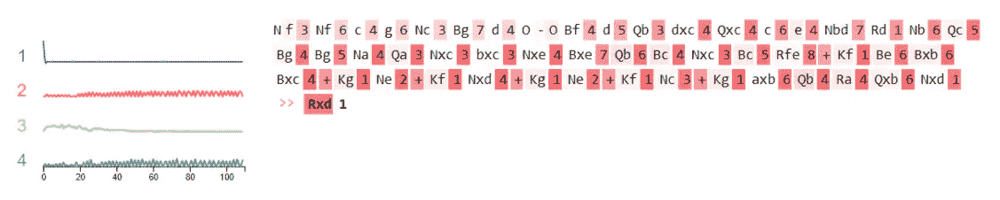

# 观看语言模型学习下棋

> 原文：<https://towardsdatascience.com/watching-a-language-model-learning-play-chess-f6e6c0e094c?source=collection_archive---------23----------------------->

## 根据象棋符号训练 GPT2 模型的结果

图片:www.pexels.com

在之前的一篇[文章](/chess2vec-map-of-chess-moves-712906da4de9) (Chess2Vec)中，我分析了国际象棋比赛中的哪些走法是接近的，也就是说，它们经常出现在游戏中类似的情况下。如果两个或两个以上的移动在另一个之后或之前，它们被认为是以某种方式相关的。我分析的来源是国际象棋服务器 [Lichess](http://www.lichess.org/) 上的游戏文件。

在这篇文章中，我想更进一步，调查是否可能只从文本文件形式的记录游戏中学习国际象棋的规则？为此，我使用机器学习模型，这些模型实际上是为分析自然语言而设计的——语言模型。

# 语言模型适合象棋吗？

自然语言处理被应用于与 NLP 任务没有或没有直接联系的各种目的，并且数据以除文本之外的形式被处理。例如，计算机视觉和蛋白质折叠预测是利用自然语言处理原理的过程的例子。

我们调查了一个领域中最先进的语言建模技术，这个领域起初似乎超出了他们的范围，即计算机象棋。因为规则是明确的，而不是模糊或模棱两可的，这是因为明确的规则控制着这里发生的事情，而不是因为人们有许多不同的方式来解释语言。

例如，[的 GPT3 论文](https://arxiv.org/abs/2005.14165)表明，通过用抓取的网站数据训练语言模型，人们可以在某种程度上发展算术能力。在这个过程中，简单的运算只能在给定的数字空间内学习，而不能超出这个空间。这是模型能力不足、训练时间不足，还是仅仅是数据不足的结果？

我们以广受关注的“计算机象棋”领域为例，评估语言模型的学习能力以及模型大小、训练时间和可获得的训练数据的影响。

因为国际象棋比赛是在不断增长的互联网国际象棋服务器上记录的，所以测试区是研究语言模型训练的理想场所。另一个优点是，语言模型的质量不仅可以使用语言模型的典型评估度量来测试，例如困惑，还可以通过测试好的游戏是否是根据国际象棋规则产生的来测试。

几十年来，国际象棋一直是一个受欢迎的人工智能试验场，由于 [Deepmind](https://deepmind.com/) 的努力，它在过去几年里变得特别热门。在那里，一个国际象棋引擎被创造出来，它通过仅利用规则和新的强化学习方法(“AlphaZero”)在游戏强度方面超越了以前存在的一切。

作为之前学习的后续，不再需要规则知识。新算法[穆泽罗](https://deepmind.com/blog/article/muzero-mastering-go-chess-shogi-and-atari-without-rules)在不知道游戏规则的情况下，超过了 AlphaZero 在之前研究中的超人表现。

为了构建一个可以从头开始发现国际象棋规则的系统，我从一种完全不同的方法开始。只有游戏抄本被用来训练语言模型。然后我们将检查这些模型，看看这个系统是如何学习国际象棋的规则的。

# 数据和预处理

我们需要大量的游戏数据来教授语言模型。例如，我们可能从国际象棋服务器 Lichess 获得这些信息。自 2013 年以来，服务器上托管的所有游戏都按月份排列在一个列表中。每个月的压缩 PGN 文件是可用的。总的来说，有超过 400 GB 的压缩数据，玩了超过 17 亿个游戏。

虽然预处理(例如删除元数据)后数据量会显著减少，但此时数据量仍然很大。鉴于最初的 GPT2 语言模型是在 40GB 的互联网文本上训练的，我们在训练期间有足够的空间来试验不同数量的数据。

游戏的质量在这项研究中起着次要的作用，因为它只涉及简单地学习规则。然而，玩家的 ELO 评级对他们的游戏实力的影响可以通过基于他们的元数据过滤游戏来评估。然而，为了避免由于服务器上缺乏游戏活动而在早期被放弃的游戏，我们将使用最小长度进行过滤。一个名为“ [pgnextract](https://www.cs.kent.ac.uk/people/staff/djb/pgn-extract/) ”的命令行程序将 PGN 文件转换成个人电脑可以读取的格式，然后用象棋引擎软件对其进行处理。该程序通过使用用于操作 PGN 文件的命令行应用程序预处理批量数据来处理几乎所有需要的操作。pgnextract 可以在合理的时间内执行所需的转换，即使数据量很大。

游戏中的所有移动数字、结果、注释、变化和其他信息都在这些清理中被删除，只显示带有 SAN 符号的纯字符串。每场比赛被记录到一个文件中的一行。所有少于 20 步的游戏都被排除。

# 模型的训练

培训是在 Kubernetes 集群上进行的，该集群配备了英伟达 RTX 3090 GPU，每个 GPU 都有 24 GB 的视频 RAM 和 256 GB 的主内存。为了实现，使用了基于 Pytorch 的来自 [HuggingFace](https://huggingface.co/) 的变形金刚包。

在相同的条件下，如果一个单词序列是由语言模型生成的，那么它将会重复自己，除非下次选择最可能的单词。此外，模型经常重复短语。这也影响了这里棋牌游戏的制作。因此，利用诸如 top-k 抽样和 top-p 抽样的随机过程来生成游戏。这些方法有助于最大限度地减少重复，尽管重复仍然会发生。

# 模型评估

为了检验模型，使用了各种方法来制作游戏:

*   两次移动后的典型开仓位置列表。
*   在给定数量的移动之后从游戏数据集中的游戏位置。
*   在给定次数的移动后从随机产生的位置

对于这些游戏中的每一个，跟踪产生的正确移动的总数。语言模型将不得不处理三个特定于国际象棋的度量来评估生成的移动。为第一个评估标准开发合法移动是最容易的，因为所有的测试情况都出现在大量的训练数据游戏中，因此模型记住数据就足够了。一种形式上的概括，即象棋规则实际上是被学习的，只需要用于非常长的生成的移动序列。

随着给定数量的移动的长度增加，第二种方法更加困难。因为研究中使用的游戏数据集不包括在训练数据中，所以随着所提供的序列长度的增长，将会出现越来越多的模型从未见过的位置。因此，模型必须学习规则，以生成合法的移动。

第三项措施需要由随机的棋步序列产生起始位置。由于这种高度的不可预测性，这些步骤中的大部分以前从未出现在人类游戏或测试数据集中。因此，模型很难为这些序列生成规则的移动。即使对人类来说，处理这样的随机位置也是非常困难的。在对国际象棋大师和业余爱好者的实验中发现，虽然优秀的国际象棋选手可以很容易地记住典型的位置，但他们对随机位置有问题。

# 结果

为了了解这两个变量如何影响学习过程，我们用不同数量的游戏(99，604；577,202;2163417 场)。几个时期后，使用上一节中描述的评估指标对每个模型进行评估，以评估结果。

通过这些统计数据，我们可以看到，当研究范围内的更多游戏用于训练时，在相同的时间内可以获得更好的结果。然而，模型的复杂性并没有这么大的影响。还值得注意的是，语言模型的典型评估指标，预测准确性和困惑度，在这里没有提供这方面的信息。

作者从移动 10 次/图像后的位置的平均正确移动次数

# 象棋知识是如何存储在模型中的？

我们已经看到模型中有更多的参数和更多的训练数据如何帮助语言模型更好地学习国际象棋规则。现在，我们将寻找在模型参数中如何表示国际象棋规则信息的任何模式。为此，我们将使用不同的可视化。

当适当地可视化和研究时，神经元激活可以揭示单个神经元和神经元群所扮演的角色。我们使用 [Ecco 库](https://jalammar.github.io/hidden-states/)进行分析。

让我们来看看一个经过训练的模型在不同情况下的内部运作。第一个位置来自开放阶段，当只有一个合法选项存在时，它是一次性发生的。

位置 1 /作者图片

如果我们观察序列的单个部分对新移动的影响，我们会发现最后部分的影响最大，但除此之外，整个序列也会影响输出。

颜色代码显示影响的强度，或者，我们也可以用百分比显示各个部分的影响。

模型有多确定生成的移动是正确的？

在生成器组件的最后一层的末尾，我们评估模型对于每个可能的令牌的机会。移动分两个阶段产生，两个部分都有很高的可能性被创造出来，但是，只有一个部分有 100%的可能性。

让我们来看看神经元的激活，看看模型如何根据移动序列跟踪棋盘。为了生成可接受的走法，语言模型需要棋盘及其棋子的表示。

通过检查神经元组的激活，我们看到一组(红色)活跃在棋盘的行信息上，另一组(蓝色)活跃在棋盘的列和块信息上。另外两个在绳子的两端被激活。

作者图片

现在让我们看看另一个位置，它来自所谓的“[世纪游戏](https://en.wikipedia.org/wiki/The)”。在具有大量选项的复杂中间位置，该模型达到了其极限。

位置 2 /作者图片

它识别出 d 文件上的一个片段是最后捕获的，并希望用 Rxd 或 Qxd 将其捕获回来。但是，在此位置没有有效的移动。棋盘在神经元中的表现是不正确的，所以没有可行的移动被创造出来。

许多潜在的 next 令牌分布在网络最后一层的多个候选中。

在第二个位置，可以看出，实际上先前移动的整个序列对将要产生的新移动有影响。

在这个例子中，神经元组在行信息以及图形和列信息上的专门化是明显的。另一方面，激活在序列开始时较少。

作者图片

在两个示例位置中，可以看到整个序列对生成的移动有影响，这对于生成正确的移动是必要的。通过观察神经元的活动，我们可以看到关于行、列和图形类型的信息存储在不同的神经元组中。因此，该模型似乎组织了表示棋盘状态所必需的信息的存储。

[论文发表在](https://aclanthology.org/2021.ranlp-main.153.pdf)自然语言处理最新进展国际会议(RANLP 2021)的会议录上。所有的细节都可以在那里找到。