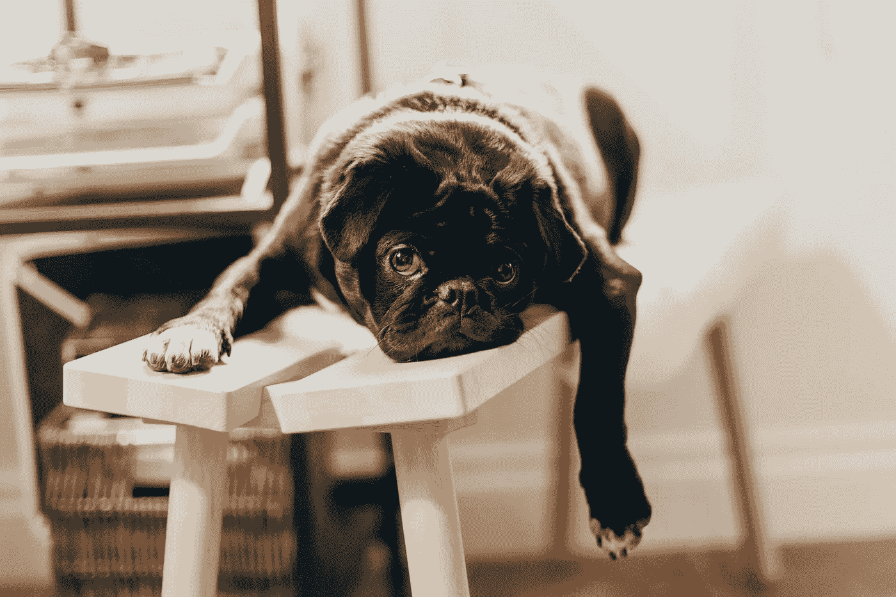
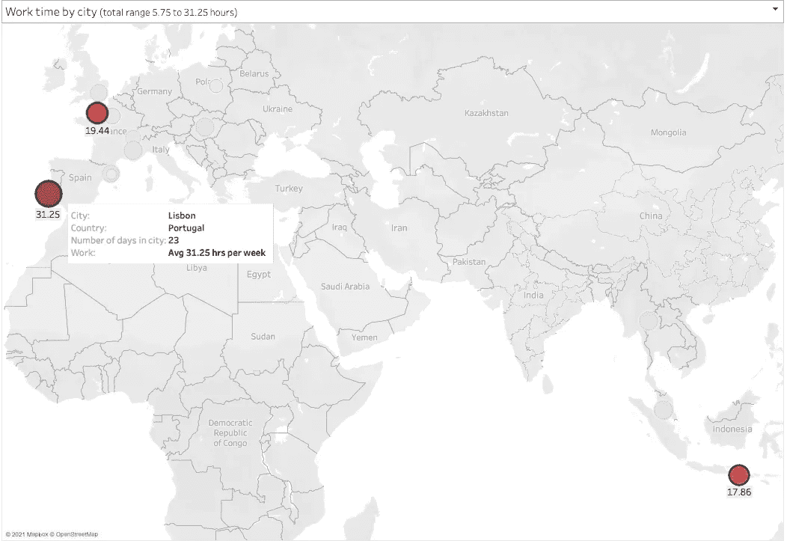
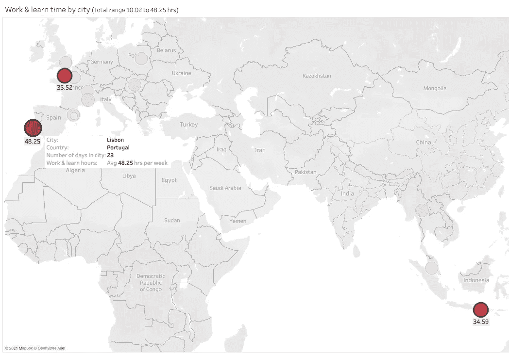
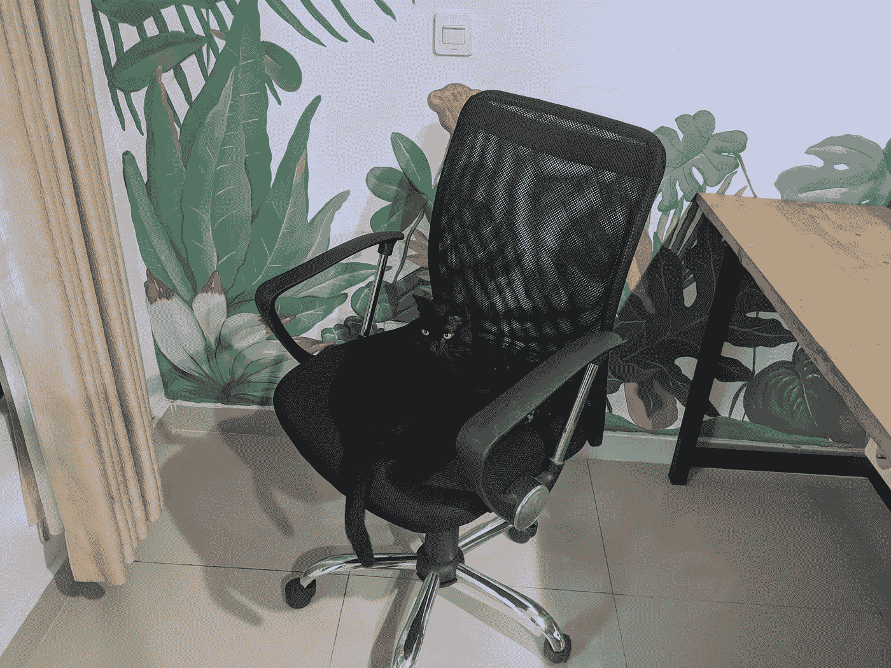
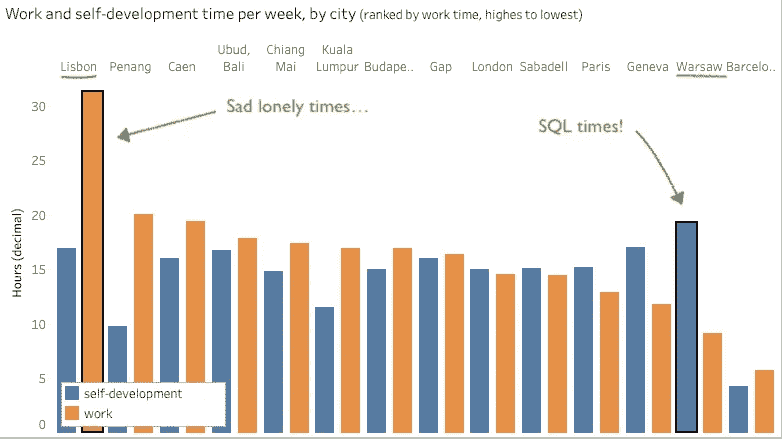
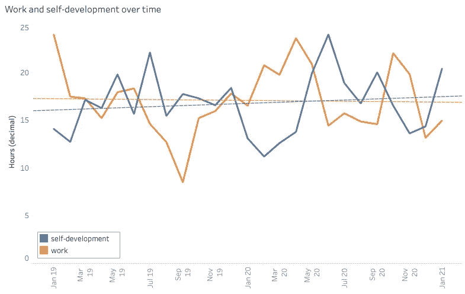
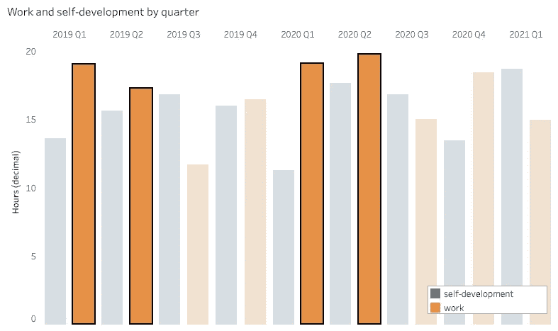
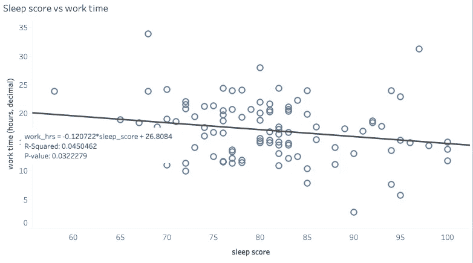

# 水冷却器谈话:你真正工作了多少？

> 原文：<https://towardsdatascience.com/water-cooler-talk-how-much-do-you-really-work-d1039fb97538?source=collection_archive---------32----------------------->

## 850 天工作、学习和睡眠数据的分析和可视化。哪个位置让我更有效率？

Priscilla Du Preez 在 Unsplash 上拍摄的照片。

**你每天工作多长时间？**我说的工作，不是指在饮水机旁聊天，花 15 分钟泡一杯咖啡，或者在厕所里回复你所有的 Whatsapp 信息。还有 ***而不是*** 偶尔上推特，或者写“就一封”个人电子邮件，里面有 100 个关于你最近一次尝试制作康普茶的细节。

我是说**真正的**工作时间。

衡量它的一种方法是跟踪和分类你在笔记本电脑上花费的时间。如果有任何有趣的趋势，或者工作时间与情绪或睡眠之间的相关性，它会让你清楚地看到你实际上在做什么。

*猜猜是什么*。一位痴迷于自我追踪、有抱负的数据分析师做到了！🎉你马上就会知道她发现了什么。

这篇文章中的数据来自我的每日和每周自我跟踪表，我已经填写了两年多了——你猜对了*——每日和每周。这些表格记录了我的心情、地点、正在服用的药物、习惯，我用它们来记录各种提示下的一些日志式的想法。睡眠数据来自 [Oura 戒指](https://medium.com/u/617390312b05?source=post_page-----d1039fb97538--------------------------------)，我也戴了两年多了。*

这篇文章的一个简短版本也以一个[场景故事的形式存在。](https://public.tableau.com/profile/marta.krzeminska#!/vizhome/Workstory/work_story)

# 最努力工作的城市

我过去经常旅行，所以在这个数据集中首先要调查的是我工作最多的城市。

排名如下:

1.葡萄牙里斯本🇵🇹 (31.25 小时)

2.法国🇫🇷卡昂(19.44 小时)

3.印度尼西亚巴厘岛🇮🇩 (17.86 小时)

但是，**看数值**。里斯本以**的优势赢了卡昂**。

那里发生了什么事？你可能会想知道。

这很简单。我没有我的伴侣，作为一个相当不合群的人，没有太多事情可做。

你可能想知道的第二件事是，*“哎呀，其他人平均每周只工作 17-9 小时？，你好像工作不多啊！*”

但是，还记得这篇课文的第一段吗？⬆️:嗯，我相信许多所谓的每周工作 40 小时的办公室工作最多是 25 小时的工作。所以，我的工作时间可能与你的没有太大的不同……我向你挑战，开始跟踪它——准备好大吃一惊吧。

不要误解我，这不是对任何人懒惰的评论，而是对我们感知的不准确的评论。如果你花那么多时间在办公室，看起来你好像“工作”了 40 个小时。

我认为这也是对不完善的工作标准的评论。

> 如果你能在 10 小时内完成和其他人 30 小时内完成的一样多的事情，你应该被要求在剩下的 20 小时里坐在办公室里吗？

**我不这么认为。**而且，你们可能应该根据结果而不是花费的时间获得相同的报酬。

# 工作时间短？故事的第二部分。

注意到我经常发布关于数据的帖子了吗？嗯，我正在重新培训成为一名数据分析师。这需要大量的学习，这也是我花费大量时间的地方。

下图显示了各个城市工作和学习时间的综合价值。

“赢家”和上一个案例中的一样:**里斯本、卡昂和巴厘岛。但是，现在的数字要高得多。(仍然没有包括饮水机谈话，当我给我妈妈写任何康普茶尝试的时候，计时器被切换到跟踪“家庭时间”。)**

☝️:这些数字应该是数字流浪者光辉形象的更新，他们每周在巴厘岛的游泳池边工作几个小时。没有。

真实的形象看起来很像这样:利用生活的低成本作为一个机会，尽可能多地投入时间到学习中，同时试图找到一个有空调的房间和一把像样的椅子来坐，但不是为此支付一大笔钱。你没有财产，你一周只工作 15 小时，记得吗？

我找到了一把好椅子，但有人比我快。*好色客别墅，巴厘岛乌布(印度尼西亚)。*

# 有工作城市和学习城市吗？

将工作时间和学习时间分开来看，我们可以算出在哪个城市的哪项活动上花费了更多的时间。

看起来里斯本在工作时间方面彻底击败了竞争对手，在工作时间和学习时间的差异方面也是如此。

图表的另一边是华沙，在那里我花在学习上的时间比工作上的时间多得多。我还记得那段时间，那是一些繁重的 SQL 查询的时期，我试图申请两份工作，并且有非常苛刻的选择过程。

不用说，他们的 SQL SELECT 没有返回我。这就是为什么你仍然可以享受我的职位。否则，我现在会在别的地方赚钱并产生巨大的积极影响。😛

# 时间趋势？

看一下趋势线，总体来说，我花在工作上的时间更少了，而花在学习上的时间更多了。

这怎么可能？现在是我想知道了。

一种解释可能是，随着时间的推移，我的经验增加了，作为一名自由职业者，我收取更多费用的能力也增强了。换句话说，我每小时挣得更多，因此在同样的经济效益下，我可以干更少的活。(如果我可以花一点时间自怜的话，这是一个更低、更悲惨的选择。)

把这些数字按季度分组怎么样？

当按季度分组时，过去两年讲述了一个早年赚钱动机的故事，随着时间的推移，这变成了对自我改善的长期收益的关注。💰🥳🌹

好吧，这是一个严重的过度解读。

它唯一显示的是，在过去的两年里，我花在工作上的时间比上半年花在学习上的时间还多。我敢肯定，你——读到这篇文章的两个人之一——对于 2021 年 Q1 和 Q2 的选举结果，正**坐立不安。**

# 更高的睡眠分数，而不是更多的工作🤷‍♀️

最后，我很好奇睡眠是否会影响我的工作时间。我的睡眠数据被一个 Oura 环跟踪，每天晚上，它都会根据我的睡眠质量计算出一个睡眠分数。分数越高，我的睡眠越好。

这是一个散点图，有一条趋势线来衡量相关性。

在绘制这张图表之前，我会*假设*高质量的睡眠会增加我的动力和注意力，从而让我花更多的时间在工作上。

但是，令人惊讶的是，事情似乎正好相反！

> 睡眠得分越高，我花在工作上的时间就越少。

*为什么？也许更好的睡眠让我有时间反思我的优先事项，意识到工作是对生命的浪费，我应该去欣赏我凝视的每一根倒下的树枝。或者，有了更好的睡眠质量，我会更加专注，在更短的时间内完成所有工作。或者，一千个其他的解释。*

重要的是，其他图表显示**减少了花在工作上的时间，并不与花在学习上的时间显著增加相一致**。有少量增加，但没有统计学意义。

# 后续步骤

不仅要衡量长度，还要衡量工作和学习的质量，这是很有价值的。这将有助于量化工作时间的减少意味着生产率的降低还是提高，并更精确地了解睡眠对这些指标的影响。

如果您对数据故事感兴趣，请查看以下内容:

*   [🙋‍♀️Does 表情符号的使用与推特互动相关吗？](https://medium.com/swlh/%EF%B8%8Fdoes-emoji-use-correlate-with-twitter-engagement-388775467be)
*   [在疫情茁壮成长？😳数据揭示了我的睡眠模式](https://krzem-m.medium.com/thriving-in-a-pandemic-what-the-data-revealed-about-my-sleep-patterns-2746dca01481)
*   所有俄罗斯人都热爱他们的工作吗？🧐工作的乐趣如何改变你对时间的重视程度。