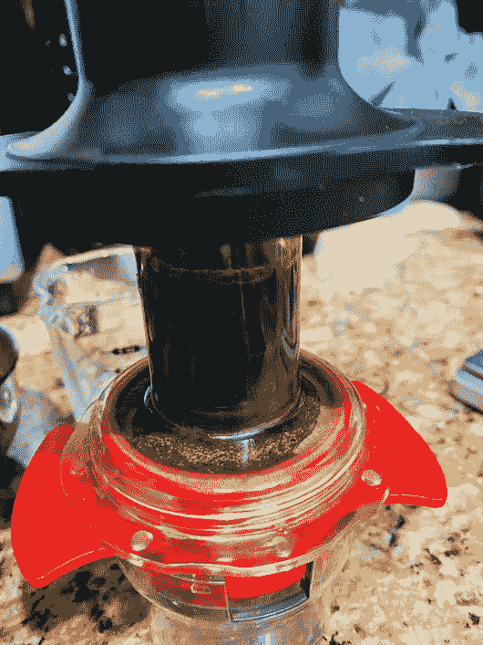
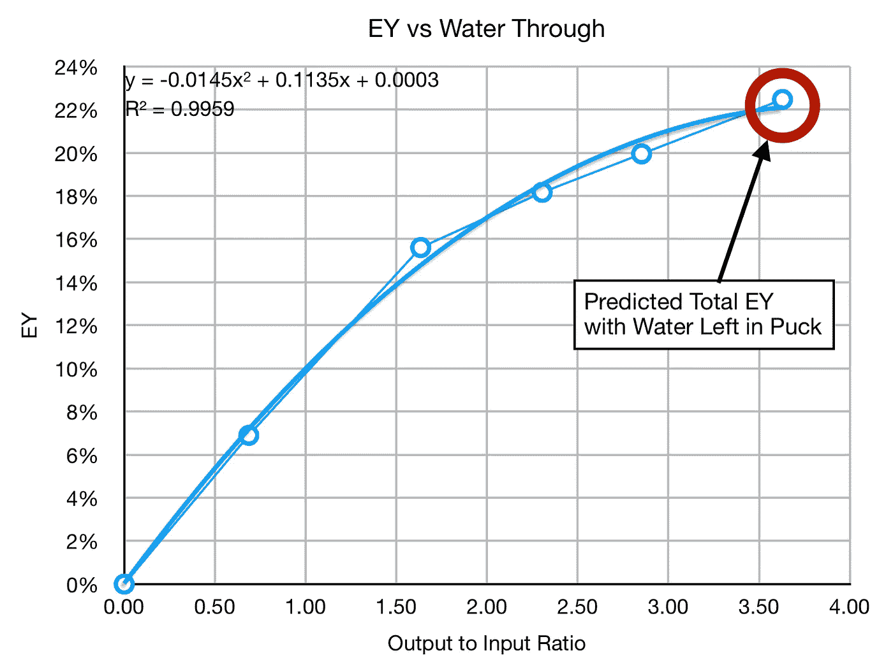

# 水变成咖啡:浓缩咖啡

> 原文：<https://towardsdatascience.com/water-into-coffee-espresso-c7b0d50f3c63?source=collection_archive---------23----------------------->

## 咖啡数据科学

## 压榨前将水和咖啡渣混合

几个月前，我尝试了一杯浓缩咖啡，将冰球放在盛有水的篮子里一整夜。其中一条[评论](https://m.facebook.com/groups/homeespressoaficionados/permalink/1339491346385814/?comment_id=1339874776347471&notif_t=group_comment&notif_id=1608062558015563&ref=m_notif)问，如果我在咖啡中混合少量的水，然后用勺子把它放进压榨机里挤出咖啡，会发生什么？这是一个足够小的实验，所以我试了一下。

我从 9 克咖啡和 18 克水开始。我把它们放在碗里搅拌，直到所有的咖啡渣都变湿。我算了一下，我可以拿出大约 9 克咖啡液。这是终极预湿。

所有图片由作者提供

我确定稠度像泥浆，我给它几分钟。一些克莉玛已经显露出来了。

然后我把这些泥放进一个 Kompresso，但是我用了 Kompresso 的上半部分，这样我可以更好地观察发生了什么。

第一轮没进多少液体，就多加了 19 克水。

第一位果然是暗的。对于这种类型的测试，一切似乎都很正常。

事后我看了看咖啡冰球，没有看到任何奇怪的通灵现象。

我查看了几个输出样本的提取率(EY)。他们都遵循一条直线前进的趋势线。10%在 1:1 中被提取，这看起来很低，可能是水温较低的结果。最终的 EY 在输出比的良好范围内。

我看了数据，还估算了冰球中剩余的水。如果我假设它测量的 TDS 和最后一点流出的咖啡液体是一样的，我就能看到我错过了什么。

基于这一预测，最终的镜头将有超过 22%的 EY，但最终的比例是 3.6:1，这是我的典型比例的两倍多。

这是一个奇怪的测试。我有点想用热水再做一次。我的主要问题是，在整个实验过程中，水温会下降。主要的问题是，如果没有更长的浸泡时间、更高的压力或更高的温度，就不可能获得更高的提取率。

如果你愿意，可以在 Twitter 和 YouTube 上关注我，我会在那里发布不同机器上的浓缩咖啡视频和浓缩咖啡相关的东西。你也可以在 [LinkedIn](https://www.linkedin.com/in/robert-mckeon-aloe-01581595?source=post_page---------------------------) 上找到我。也可以关注我[中](https://towardsdatascience.com/@rmckeon/follow)。

# 我的进一步阅读:

[个人故事和关注点](https://rmckeon.medium.com/personal-stories-and-concerns-51bd8b3e63e6?source=your_stories_page-------------------------------------)

[乐高故事启动页面](https://rmckeon.medium.com/lego-story-splash-page-b91ba4f56bc7?source=your_stories_page-------------------------------------)

[浓缩咖啡系列文章](https://rmckeon.medium.com/a-collection-of-espresso-articles-de8a3abf9917?source=your_stories_page-------------------------------------)

[一台用于制作优质浓缩咖啡的叶片研磨机](https://medium.com/overthinking-life/a-blade-grinder-for-great-espresso-cf4f5a561ba6?source=your_stories_page-------------------------------------)

[浓缩咖啡:群头水温分析](https://medium.com/@rmckeon/espresso-grouphead-water-temperature-analysis-25cc00556d5c?source=your_stories_page-------------------------------------)

[真空罐能更快去除咖啡豆中的气体吗？](/can-vacuum-jars-remove-gas-from-coffee-beans-faster-4a5a40981be2?source=your_stories_page-------------------------------------)

在水中跌跌撞撞:浓缩咖啡水实验

克莉玛，嗯，它有什么用？

[南印度咖啡](https://medium.com/@rmckeon/southern-indian-coffee-b363b08b6d8b?source=your_stories_page-------------------------------------)

[重新研磨用过的咖啡，制成意式浓缩咖啡](/re-grinding-used-coffee-for-espresso-3f6d06318f8b?source=your_stories_page-------------------------------------)

[冲泡咖啡渣](https://medium.com/@rmckeon/brewing-coffee-residue-c8ba9b8bb7bb?source=your_stories_page-------------------------------------)

[咖啡水果茶 via Flair Espresso](https://medium.com/overthinking-life/coffee-fruit-tea-via-flair-espresso-88717ff07e9c?source=your_stories_page-------------------------------------)

[强迫症工具对浓缩咖啡不起作用](/ocd-tools-dont-work-for-espresso-5b2f988af495?source=your_stories_page-------------------------------------)