# 浓缩咖啡的水温

> 原文：<https://towardsdatascience.com/water-temperature-for-espresso-1abe656b54d3?source=collection_archive---------15----------------------->

## 咖啡数据科学

## 提高提取温度

多年来，水温一直是浓缩咖啡和普通咖啡的有趣话题。取决于冲泡方法和咖啡烘焙，水温对味道有很大的影响。

然而，我们经常混淆水温和机器温度，因为使用加压机器，水可以达到比炉子上高得多的温度。结果，水一接触到咖啡，温度就下降了。即使把水加热到接近 100 摄氏度也会很棘手，因为它正在蒸发。

> 温度是需要跟踪的变量，尤其是对于杠杆式机器。

我收集了几个温度下的一些照片，以展示温度对味道和提取的影响有多大。我用了金特快和韩国磨床。我对每一次注射都遵循相同的协议，这意味着每一次注射都是不连续的，有 60 秒的预输注和输注期间的压力脉冲。

咖啡豆是中度烘焙的，所以如果你用的是较深的烘焙，你可能要用较低的温度。

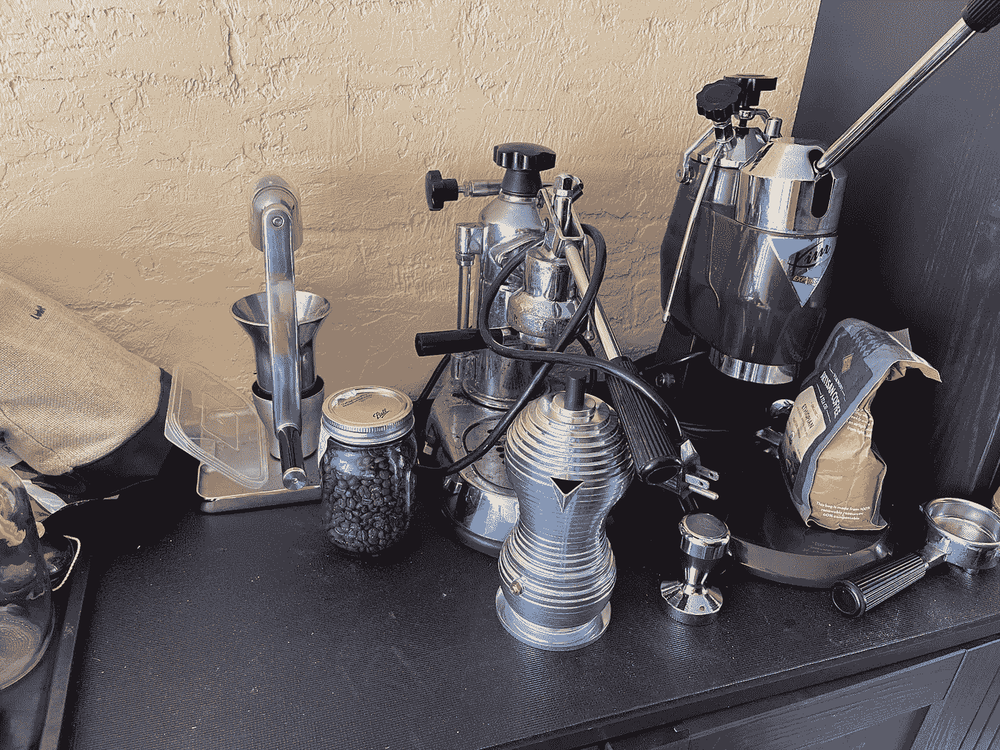

所有图片由作者提供

# 机器温度

我通常用测温枪测量机器温度。我见过测试条，但温度枪对我有用，因为我的机器是喷漆的。在收集这些数据时，我意识到机器的温度与输出水温并不相同。所以我收集了一些数据，发现机器温度和输出水温之间存在线性相关性。

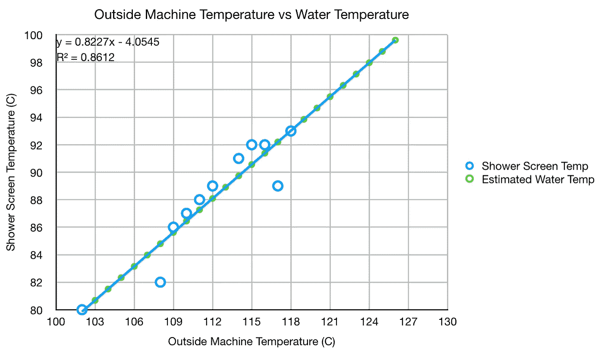

我以此为指导，推动高于正常水平。在过去的一年里，我的目标是将机器温度控制在 114 摄氏度，但这导致水温在 91 摄氏度左右。当我开始尝试更高的高度时，我发现我可能错过了一些更好的镜头。

# 绩效指标

我使用两个指标来评估技术之间的差异:最终得分和咖啡萃取。

[**最终得分**](https://towardsdatascience.com/@rmckeon/coffee-data-sheet-d95fd241e7f6) 是评分卡上 7 个指标(辛辣、浓郁、糖浆、甜味、酸味、苦味和回味)的平均值。当然，这些分数是主观的，但它们符合我的口味，帮助我提高了我的拍摄水平。分数有一些变化。我的目标是保持每个指标的一致性，但有时粒度很难确定。

**使用折射仪测量总溶解固体量(TDS)，这个数字结合咖啡的输出重量和输入重量用于确定提取到杯中的咖啡的百分比，称为**提取率(EY)** 。**

# **多个温度下的数据**

**我在这里显示的温度是使用上面的曲线从机器温度计算得到的水温。**

**温差的第一个视觉信号是水流得更快。对于 97C，我不得不将预输注减少到 30s，因为它流动得太快了。**

******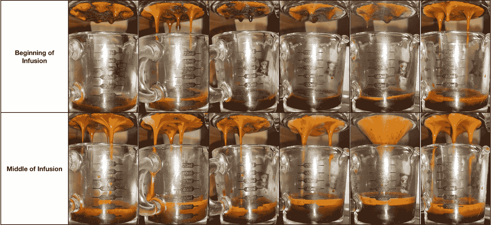****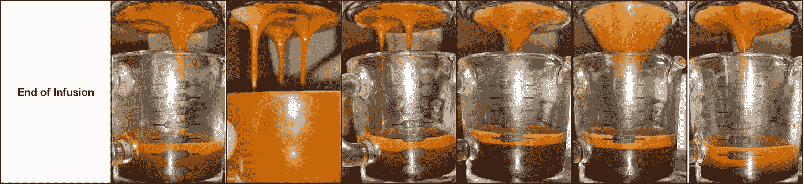**

**从圆盘的底部看，较低温度下有暗点，表示流动缓慢，但是当温度达到 97℃时，圆盘的整体颜色变浅，暗点变少，表示流动均匀，提取率更高。**

**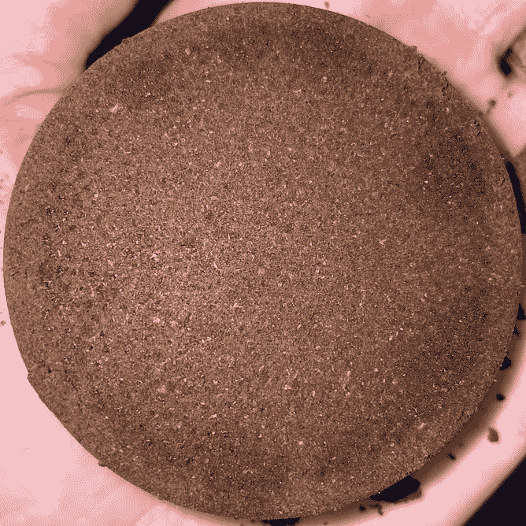****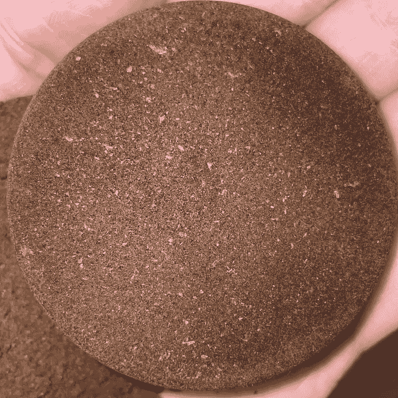****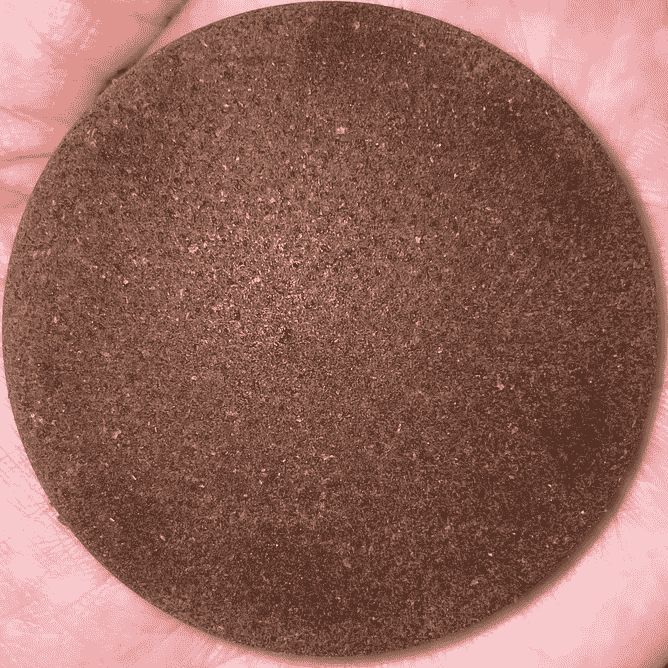****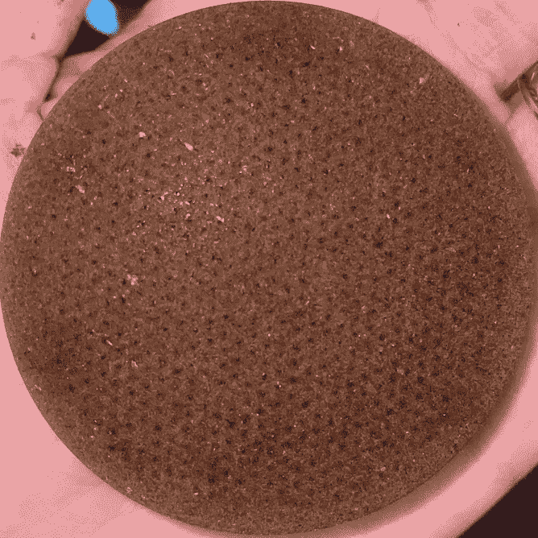****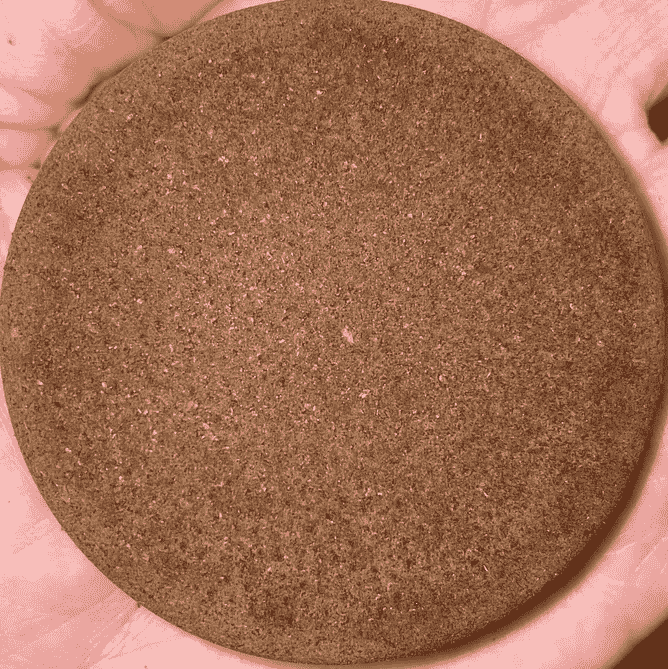****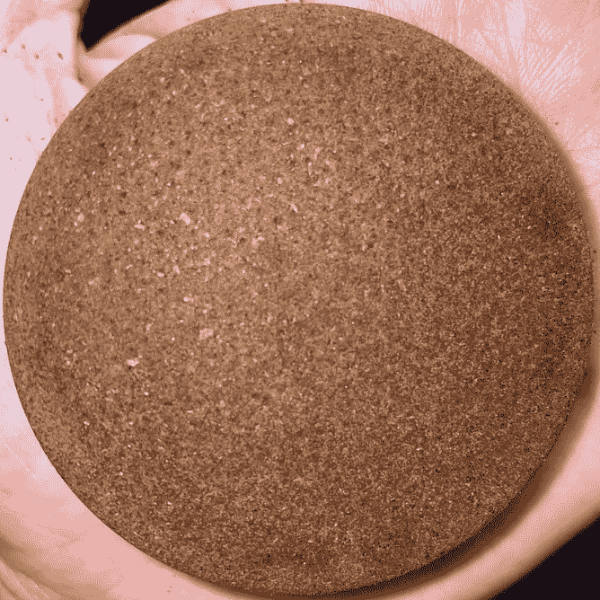**

**顺序:顶配:85C、87C、90C 底部:92C、95C 和 97C**

**证据就在味道和 EY。味道真的在上升到 97C 的路上提升了。**

**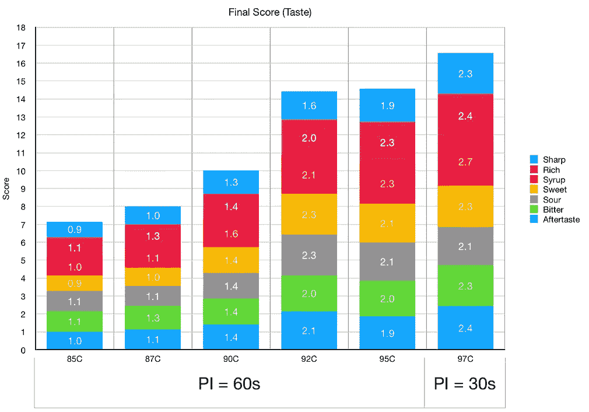****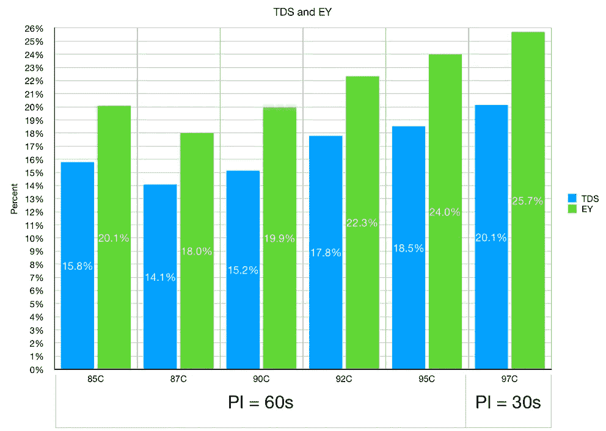**

**总时间随着温度的升高而下降，因为水流得更快了。**

**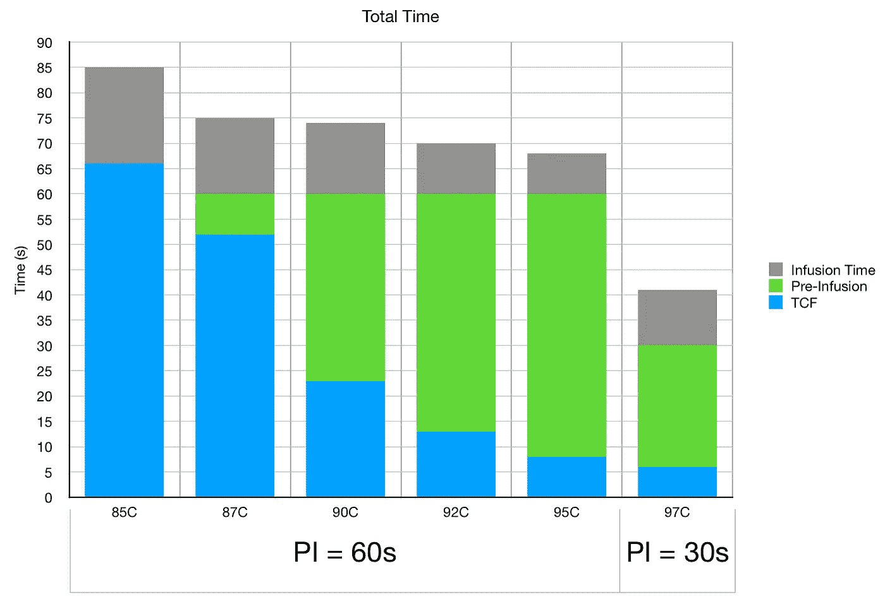**

**我真的很喜欢这个实验，因为它揭示了我没有充分加热我的机器。热水还会增加机器中的压力，进而影响预浸压力。也许实验的另一个设计是使用压力计来了解压力，然后释放压力以使比较更加公平，或者使用 DE1。**

**关键是要实验，因为水温会有不同的影响，取决于机器和烘烤。**

**如果你愿意，可以在 Twitter 和 YouTube 上关注我，我会在那里发布不同机器上的浓缩咖啡视频和浓缩咖啡相关的东西。你也可以在 [LinkedIn](https://www.linkedin.com/in/robert-mckeon-aloe-01581595?source=post_page---------------------------) 上找到我。也可以关注我[中](https://towardsdatascience.com/@rmckeon/follow)和[订阅](https://rmckeon.medium.com/subscribe)。**

# **[我的进一步阅读](https://rmckeon.medium.com/story-collection-splash-page-e15025710347):**

**[浓缩咖啡系列文章](https://rmckeon.medium.com/a-collection-of-espresso-articles-de8a3abf9917?postPublishedType=repub)**

**[工作和学校故事集](https://rmckeon.medium.com/a-collection-of-work-and-school-stories-6b7ca5a58318?source=your_stories_page-------------------------------------)**

**[个人故事和关注点](https://rmckeon.medium.com/personal-stories-and-concerns-51bd8b3e63e6?source=your_stories_page-------------------------------------)**

**[乐高故事启动页面](https://rmckeon.medium.com/lego-story-splash-page-b91ba4f56bc7?source=your_stories_page-------------------------------------)**

**[摄影飞溅页面](https://rmckeon.medium.com/photography-splash-page-fe93297abc06?source=your_stories_page-------------------------------------)**

**[使用图像处理测量咖啡研磨颗粒分布](https://link.medium.com/9Az9gAfWXdb)**

**[改善浓缩咖啡](https://rmckeon.medium.com/improving-espresso-splash-page-576c70e64d0d?source=your_stories_page-------------------------------------)**

**[断奏生活方式概述](https://rmckeon.medium.com/a-summary-of-the-staccato-lifestyle-dd1dc6d4b861?source=your_stories_page-------------------------------------)**

**[测量咖啡磨粒分布](https://rmckeon.medium.com/measuring-coffee-grind-distribution-d37a39ffc215?source=your_stories_page-------------------------------------)**

**[咖啡萃取](https://rmckeon.medium.com/coffee-extraction-splash-page-3e568df003ac?source=your_stories_page-------------------------------------)**

**[咖啡烘焙](https://rmckeon.medium.com/coffee-roasting-splash-page-780b0c3242ea?source=your_stories_page-------------------------------------)**

**[咖啡豆](https://rmckeon.medium.com/coffee-beans-splash-page-e52e1993274f?source=your_stories_page-------------------------------------)**

**[浓缩咖啡用纸质过滤器](https://rmckeon.medium.com/paper-filters-for-espresso-splash-page-f55fc553e98?source=your_stories_page-------------------------------------)**

**[浓缩咖啡篮及相关话题](https://rmckeon.medium.com/espresso-baskets-and-related-topics-splash-page-ff10f690a738?source=your_stories_page-------------------------------------)**

**[意式咖啡观点](https://rmckeon.medium.com/espresso-opinions-splash-page-5a89856d74da?source=your_stories_page-------------------------------------)**

**[透明 Portafilter 实验](https://rmckeon.medium.com/transparent-portafilter-experiments-splash-page-8fd3ae3a286d?source=your_stories_page-------------------------------------)**

**[杠杆机维修](https://rmckeon.medium.com/lever-machine-maintenance-splash-page-72c1e3102ff?source=your_stories_page-------------------------------------)**

**[咖啡评论和想法](https://rmckeon.medium.com/coffee-reviews-and-thoughts-splash-page-ca6840eb04f7?source=your_stories_page-------------------------------------)**

**[咖啡实验](https://rmckeon.medium.com/coffee-experiments-splash-page-671a77ba4d42?source=your_stories_page-------------------------------------)**