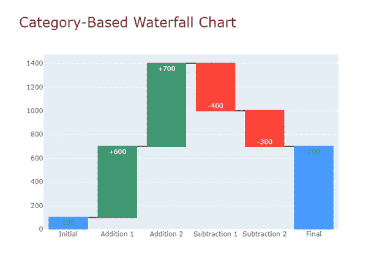
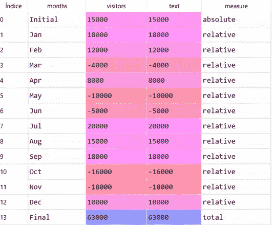
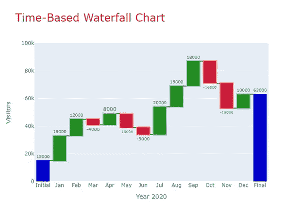

# 用 Plotly 制作瀑布图

> 原文：<https://towardsdatascience.com/waterfall-charts-with-plotly-43822918e9eb?source=collection_archive---------7----------------------->

## **为什么&如何**


图片由 Muhamad Rizal Firmansyah 从 Unsplash 拍摄

# **瀑布图**

**又名**:飞砖图、浮砖图、马里奥图

**原因:**是一个 2D 图，用于表示在一段时间内或在多个分类步骤内连续添加正值或负值的累积效果。随着时间或**基于时间的瀑布图**表示一段时间内的增加和减少。分类步骤或**基于类别的瀑布图**表示收入和费用或任何其他变量的加减，依次为正值和负值。

**如何**:瀑布图(WCs)由一系列竖条(柱)组成。初始值和最终值由全列表示(通常从零基线开始)，而中间值显示为代表加法和减法的**浮动列**。最后一个竖线表示这种加法和减法的结果。加法通常用绿色表示，而减法通常用红色表示。另外，习惯上用另一种颜色表示起始列和结束列。建议通过**用连接横线连接各列来展示累积效果的理念。**


图 1:瀑布图的示意图。作者用 Plotly 做的。

现在应该清楚为什么它们被称为飞砖或浮砖图了。有人将它们命名为马里奥图表，因为它与流行的视频游戏有一定的相似性。

**讲故事** : WCs 通常用于金融和商业中的**在正值和负值之间波动的数据。**基于时间的 WCs 显示每月或每年的总变化，同时显示整月或整年的利润或亏损。基于类别的 WCs 显示**给定变量的连续增加的正值或负值的累积效应**。正值可能是收入、收益、仓库库存增加、积极变化或收入流。负值可能是费用、损失、仓库存货、负变化或流出量。请记住，阅读是从左到右依次进行的。

WC 是一种有价值的数据可视化技术，因为它允许分析师清楚地确定哪些时段或项目显示最大收益，何时观察到最大损失，以及在评估的时间段内净变化是什么。它提供了比其他类似图表更多的上下文信息。

# **瀑布图与 Plotly**

我们使用了开源的图形库 **Plotly** ，它提供了一组名为 *graph objects* 的类来构造图形。*图*是具有数据属性和布局属性的主类。数据属性指的是一个**轨迹**，一个带有相应参数的特殊类型的图表。布局属性指定图形的标题、轴、图例和其他属性。

对于本文中的瀑布图，Plotly trace 为`*go.Waterfall()*`对应的参数为:`*x=*`设置 x 坐标(一般为字符串或日期时间对象)；`*y=*`设置 y 坐标(通常是一列 con 数值，包括*无*)； `*base=*`设置数值基线。

最重要的参数是`*measure=*` *，*一个具有下列值之一的数组:*相对；绝对；总计*。*相对值*，默认值，表示增加或减少。*绝对值*设置初始值，而*总和*计算代数和。

这是图 1 中瀑布图的代码:

```
import plotly.graph_objects as gofig1  = go.Figure()hrz = ["Initial", "Addition 1","Addition 2",
       "Subtraction 1","Subtraction 2","Final"]vrt = [100, 600, 700, -400, -300, None]fig1.add_trace(go.Waterfall(                 
                  x = hrz, y = vrt,
                  base = 0,
                  measure = [ "absolute","relative",    
                              "relative","relative",
                              "relative","total" ]                        
                )) fig1.show()
```

我们更新了图表以改进讲故事:`text`为每个条形设置注释；`textposition`将文字列表*定位在*内或将*定位在*外；`update.layout` 设置标题文本和标题字体。

这是图 2 中瀑布图的代码:

```
import plotly.graph_objects as gofig2  = go.Figure()hrz = [ "Initial",  "Addition 1", "Addition 2",
       "Subtraction 1","Subtraction 2","Final"]vrt  = [100, 600, 700, -400, -300, None]text = ['100', '+600', '+700', '-400', '-300', '700']fig2.add_trace(go.Waterfall(
               x = hrz, y = vrt,
               base = 0,
               text = text, textposition = 'inside',   measure = ["absolute",  "relative", "relative",
                          "relative","relative","total"]  
               )) fig2.update_layout(
                   title_text = "Category-Based Waterfall Chart",
                   title_font=dict(size=25,family='Verdana', 
                                   color='darkred')
                   )fig2.show()
```



图 2:瀑布图的示意图。作者用 Plotly 做的。

在我们的第二个例子中，我们将使用一个基于时间的瀑布图来表示一个虚构的地方每月访客数量依次增加和减少的累积效应。

首先，我们将创建一个数据框架，其中包含我们应该收集的关于访问者数量增减的数据。我们需要将库**Numpy**&**Pandas**分别导入为 *np* 和 *pd* 。

```
import numpy  as np
import pandas as pdmonths =   ['Initial', 'Jan', 'Feb', 'Mar', 'Apr', 'May', 'Jun',
            'Jul', 'Aug', 'Sep', 'Oct', 'Nov', 'Dec', 'Final']visitors = [15000, +18000, +12000, -4000,  +8000, 
           -10000, -5000,  +20000, +15000, +18000,
           -16000, -18000, +10000, 63000]df = pd.DataFrame({'months' : months, 'visitors' : visitors,
                   'text' : visitors})
```

我们需要在 dataframe 中创建一个列，指示与`*measure*`相关的值。记住这个参数可以取以下三个值中的任意一个:*absolute；相对的；总计。*为了填充名为`*measure*` 的列，我们使用了 Numpy 方法`np.select()`，该方法根据条件列表返回一个从 *choicelist* 中的元素提取的数组。

```
conditionlist = [(df['months'] == 'Initial'),
                 (df['months'] == 'Final'),
            (df['months'] != 'Initial') & (df['months'] != 'Final')]choicelist   = ['absolute', 'total', 'relative']df['measure'] = np.select(conditionlist, choicelist,
                          default='absolute')
```

下面的屏幕截图显示了数据集的 14 条记录:



现在我们准备画 WC 了。

Plotly 允许通过 `*increasing*`、`*decreasing*`和`*totals*.`自定义浮动条的颜色

```
fig3  = go.Figure()fig3.add_trace(go.Waterfall(
               x = df['months'], y = df['visitors'],
               measure = df['measure'],
               base = 0,
               text = df['visitors'],
               textposition = 'outside',
               decreasing = {"marker":{"color":"crimson",                 
                  "line":{"color":"lightsalmon","width":2}}},
               increasing = {"marker":{"color":"forestgreen",
                  "line":{"color":"lightgreen", "width":2}}},
               totals     = {"marker":{"color":"mediumblue"}}
               ))
```

我们决定将注释*放在*条的外面，以避免混乱。最后，我们设置了标题并更新了坐标轴:

```
fig3.update_layout(
                   title_text = "Time-Based Waterfall Chart",
                   title_font = dict(size=25,family='Verdana',
                                     color='darkred'))fig3.update_yaxes(title = 'Visitors' , range = [0, 100000])
fig3.update_xaxes(title = 'Year 2020')fig3.show()
```



图 3:基于时间的瀑布图。作者用 Plotly 做的。

**总而言之:**瀑布图的关键概念是传达一段时间内或一系列相关项目中正值和负值的变化。它们很容易实现，尤其是用 Plotly。它们广泛用于金融分析和商业环境。

如果你发现了这篇感兴趣的文章，请阅读我之前的(https://medium.com/@dar.wtz):

分歧棒线，为什么&如何，用分歧讲故事

[](/diverging-bars-why-how-3e3ecc066dce) [## 背离棒线，为什么&如何

### 用分歧讲故事

towardsdatascience.com](/diverging-bars-why-how-3e3ecc066dce) 

斜率图表，为什么和如何，用斜率讲故事

[](/slope-charts-why-how-11c2a0bc28be) [## 斜率图表，为什么和如何

### 用斜坡讲故事

towardsdatascience.com](/slope-charts-why-how-11c2a0bc28be)