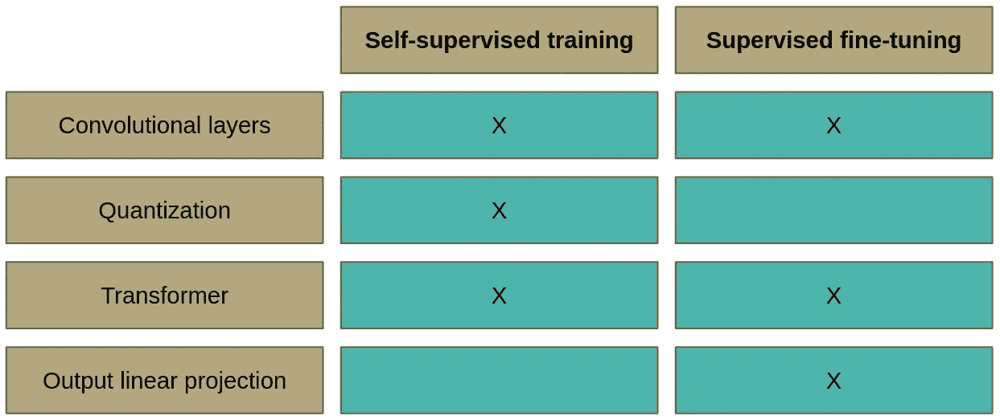

# Wav2Vec 2.0:语音表示的自我监督学习框架

> 原文：<https://towardsdatascience.com/wav2vec-2-0-a-framework-for-self-supervised-learning-of-speech-representations-7d3728688cae?source=collection_archive---------1----------------------->

## [思想和理论](https://towardsdatascience.com/tagged/thoughts-and-theory)

## 解释语音识别模型

图片由[下雪](https://pl.freepik.com/snowing)发自[Freepik.com](https://pl.freepik.com/darmowe-zdjecie/pojecie-audiobooku-ksiazki-na-stol-ze-sluchawkami-na-nich_1203112.htm#page=1&query=audiobook&position=0)

Wav2Vec 2.0 是自动语音识别的当前最新模型之一，这是由于在该领域中自我监督训练是一个相当新的概念。这种训练方式允许我们在未标记的数据上预先训练模型，这总是更容易获得。然后，可以针对特定目的在特定数据集上对模型进行微调。正如以前的作品所显示的，这种训练方式是非常有力的[4]。

# 主要思想

如下图所示，模型分两个阶段进行训练。第一阶段是在自我监督模式下，这是使用未标记的数据完成的，其目的是尽可能实现最佳的语音表示。你可以用类似于思考单词嵌入的方式来思考这个问题。单词嵌入还旨在实现自然语言的最佳表示。主要区别在于 Wav2Vec 2.0 处理的是音频而不是文本。训练的第二阶段是监督微调，在此期间，标记的数据被用来教导模型预测特定的单词或音素。如果你不熟悉“音素”这个词，你可以把它想成特定语言中最小的声音单位，通常用一两个字母来表示。

图一。Wav2Vec 2.0 的训练阶段(图片由作者提供)

第一阶段的培训是这种模式的主要优势。学习一个非常好的语音表示能够在少量的标记数据上实现最先进的结果。例如，该论文的作者已经在一个巨大的 LibriVox 数据集上对模型进行了预训练。然后，他们使用整个 Libri 语音数据集进行微调，在测试清理子集上产生了 1.8% *的单词错误率(WER)* ，在测试其他子集上产生了 3.3%的 WER。使用少了近 10 倍的数据，允许在测试-清理上获得 2.0%的 WER，在测试-其他上获得 4.0%。仅使用 10 分钟的标记训练数据(几乎没有数据)，在 Libri 语音的 test-clean / test-other 子集上产生 4.8% / 8.2%的 WER。根据代码为的*论文，它在 2018 年 1 月将会达到最先进的水平[5]。*

图二。Wav2Vec 2.0 的结果(图片由作者提供)

# Wav2Vec 2.0 模型架构

用于预测的最终模型的架构包括三个主要部分:

*   处理原始波形输入以获得潜在表示的卷积层-*，*
*   *变形金刚图层，创造情境化的表现- ***C*** ，*
*   *线性投影到输出-*。**

****

**图 3。微调的 Wav2Vec 2.0 模型架构(图片由作者提供，基于 wav2vec 2.0:语音表示的自我监督学习框架)**

**这就是模型经过最终微调后的样子，可以在生产环境中开发了。整个魔术发生在训练的第一阶段，在自我监督模式下，当模型看起来有点不一样。该模型在没有线性投影生成输出预测的情况下被训练。**

**基本上，本文*主旨*部分提到的语音表征对应于图 4 中的‘语境表征***C***’。预训练的主要思想类似于 BERT:变换器的部分输入被屏蔽，目的是猜测屏蔽的潜在特征向量表示*。然而，作者用对比学习改进了这个简单的想法。***

## ***对比学习***

***对比学习是一个输入以两种不同方式转化的概念。之后，模型被训练以识别输入的两个变换是否仍然是相同的对象。在 Wav2Vec 2.0 中，变换层是第一种变换方式，第二种方式是通过量化，这将在本文的后续部分进行解释。更正式地说，对于一个被掩蔽的潜在表征***【zₜ】***，我们希望得到这样一个上下文表征***【cₜ】***以便能够在其他量化表征中猜出正确的量化表征***【qₜ】***。很好地理解前面的句子是很重要的，所以如果你需要的话，不要犹豫就此打住:-)用于自我监督训练的 Wav2Vec 2.0 版本如图 4 所示。***

****

**图 4。用于自我监督训练的 Wav2Vec 2.0 模型架构(图片由作者提供，基于 wav2vec 2.0:语音表示的自我监督学习框架)**

**为了总结我们到目前为止所学的内容，请看看表 1。**

****

**表 1。Wav2Vec 2.0 自我监督学习和监督学习的比较**

## **量化**

**量化是将连续空间中的值转换为离散空间中有限的一组值的过程。**

**但是我们如何在自动语音识别中实现这一点呢？让我们假设一个潜在语音表示向量 ***、zₜ*** 覆盖两个音素。一种语言中音位的数量是有限的。此外，所有可能的音素对的数量是有限的。这意味着它们可以被相同的潜在语音表征完美地表征。此外，它们的数量是有限的，所以我们可以创建一个包含所有可能的音素对的码本。然后，量化归结为从码本中选择正确的码字。然而，你可以想象所有可能的声音的数量是巨大的。为了更容易训练和使用，Wav2Vec 2.0 的作者创建了 *G* 码书，每个码书都由 *V* 码字组成。为了创建量化表示，应该从每个码本中选择最佳字。然后，将选择的向量连接起来，用线性变换进行处理，以获得量化的表示。该过程如图 5 所示。**

****

**图 5。量化(作者图片)**

**我们如何从每个码本中选择最佳码字？答案是 **Gumbel softmax** :**

****

**其中:**

*   *****sim***——*余弦相似度*，**
*   *****l****ϵℝ****ᴳˣ****ⱽ*—logits 由 ***z*** 计算得出，**
*   ****=-log(-log(uₖ)、****
*   *****uₖ*** 从均匀分布 *U(0，1)* 中取样，**
*   **𝜏——温度。**

**由于这是一项分类任务，softmax 函数似乎是在每个码本中选择最佳码字的自然选择。为什么在我们的例子中， *Gumbel softmax* 比普通的 *softmax* 好？它有两个改进:随机化和温度 **𝜏** 。由于随机化，模型更愿意在训练期间选择不同的码字，然后更新它们的权重。重要的是，特别是在训练的开始，防止只使用代码簿的子集。温度随着时间从 2 降低到 0.5，因此随机化的影响随着时间变小。**

## **掩饰**

**让我们深入到掩蔽的细节。它由两个超参数定义:***p***= 0.065*和 ***M*** = 10，并按以下步骤进行:***

1.  **从潜在言语表征的空间中取出所有时间步骤 ***Z*** 。**
2.  **样品没有替换比例 ***p*** 来自上一步的向量。**
3.  **选择的时间步长是起始索引。**
4.  **对于每个索引 ***i*** ，连续的 ***M*** 时间步长被屏蔽。**

**如下图所示，我们采样了两个标有橙色的向量作为起始索引。**

****

**图 6。选择蒙版的起始索引(图片由作者提供)**

**然后，从每个选择的向量开始， ***M*** = 10 个连续的时间步长被屏蔽。跨度可能重叠，由于它们之间的间隙等于 3 个时间步长，我们屏蔽了 14 个连续的时间步长。**

****

**图 7。屏蔽 M 个连续的时间步长(图片由作者提供)**

**最后，对比损失仅针对掩模的中心时间步长进行计算。**

## **培训目标**

****

**训练目标是两个损失函数之和:**对比损失**和**多样性损失**。目前，只提到了对比损失。它负责训练模型来预测 *K + 1* 量化候选表示***q’****∈****qₜ.中正确的量化表示 ***qₜ****** 集合 ***Qₜ*** 由目标 ***qₜ*** 和 *K* 干扰子组成，这些干扰子是从其他掩码时间步中均匀采样的。**

**

*字母 **κ** 是训练过程中恒定的温度。 *Sim* 代表*余弦相似度*。函数的主要部分*类似于 softmax，但是我们取上下文表示***【cₜ***和量化表示 ***q*** 之间的*余弦相似度*。为了更容易优化，我们还将 *-log* 放在那个分数上。**

****多样性损失**是一种正则化技术。作者设置了 ***G*** =2 个码本，每个码本中有 ***V*** =320 个码字。理论上它给出了 320*320=102400 个可能的量化表示。然而，我们不知道该模型是否真的会使用所有这些可能性。否则，它将仅学习使用例如来自每个码本的 100 个码字，并且它将浪费码本的全部潜力。这就是多样性损失有用的原因。它基于熵，熵可通过以下公式计算:**

****

**其中:**

*   *****x*** —离散随机变量𝒳的一种可能结果，**
*   *****P(x)*** —事件发生的概率 ***x*** 。**

**当数据分布均匀时，熵取最大值。在我们的例子中，这意味着所有的码字都以相同的频率使用。这样，我们可以在整批训练样本上计算每个码本的熵，以检查码字是否以相同的频率使用。这个熵的最大化将鼓励模型利用所有码字。最大化等于负熵最小化，负熵是多样性损失。**

****

## **微调**

**由于 Wav2Vec 2.0 的微调阶段并不包含任何突破性的发现，所以作者并没有太关注他们论文的这一部分。在训练的这个阶段，不使用量化。取而代之的是，在上下文表示 ***C*** 的顶部添加一个随机初始化的线性投影层。然后用标准的*连接主义者时态分类(CTC)* loss 和一个修改版本的 *SpecAugment* 对模型进行微调，这超出了本文的范围。有趣的是，作者并没有放弃掩蔽，因为它仍然可以作为一种正则化技术。**

# **结论**

**Wav2Vec 2.0 使用自我监督的训练方法进行自动语音识别，该方法基于*对比学习*的思想。在巨大的原始(未标记)数据集上学习语音表示减少了获得满意结果所需的标记数据量。**

**这篇文章的要点是:**

*   **Wav2Vec 2.0 利用了自我监督的训练，**
*   **它使用卷积层来预处理原始波形，然后应用变换器来增强具有上下文的语音表示，**
*   **其目标是两个损失函数的加权和:**
*   **对比损失，**
*   **多样性丧失，**
*   **量化用于在自我监督学习中创建目标。**

**我希望你喜欢我的文章，它能帮助你理解 Wav2Vec 2.0 的思想。要了解更多细节，我鼓励你阅读原文[1]。**

# **参考**

**[1] A. Baevski，H. Zhou，A. Mohamed 和 M. Auli， [wav2vec 2.0:语音表征的自我监督学习框架](https://arxiv.org/pdf/2006.11477.pdf) (2020)，CoRR**

**[2] A. Kim，[香农熵背后的直觉](/the-intuition-behind-shannons-entropy-e74820fe9800) (2018)，走向数据科学**

**[3] [熵(信息论)](https://en.wikipedia.org/wiki/Entropy_(information_theory))，维基百科。**

**[4] J. Devlin，M. Chang，K. Lee，K. Toutanova， [BERT:用于语言理解的深度双向变压器的预训练](https://arxiv.org/abs/1810.04805) (2019) *。***

**[5][LibriSpeech 上的语音识别测试-clean](https://paperswithcode.com/sota/speech-recognition-on-librispeech-test-clean) ，试卷用代码。**