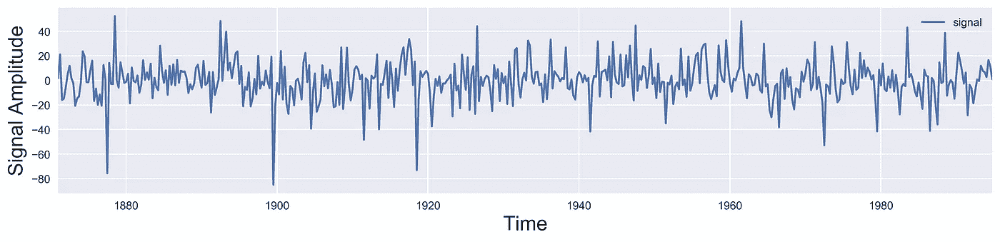
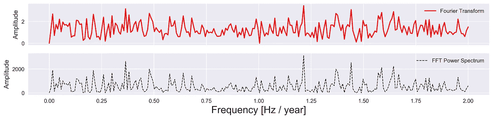
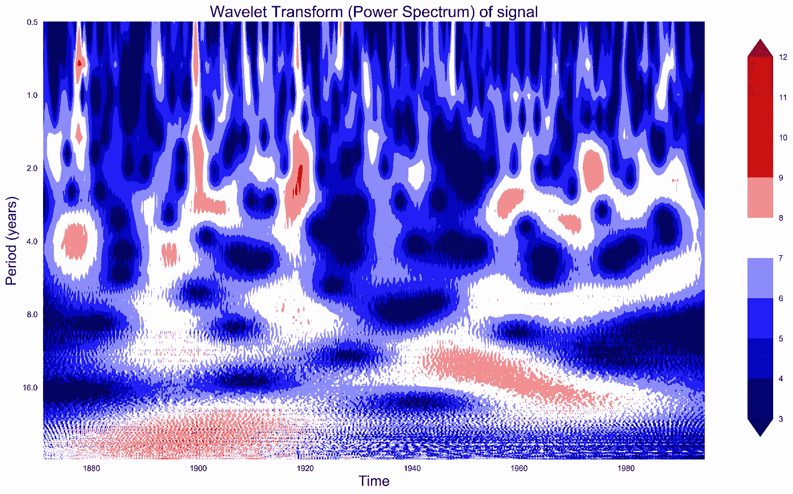
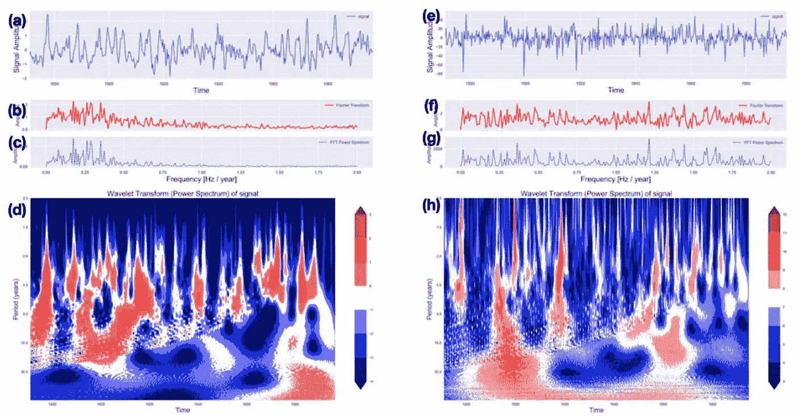

# Python 中 ENSO 和季风数据的小波&傅立叶分析

> 原文：<https://towardsdatascience.com/wavelet-fourier-analysis-on-the-enso-and-monsoon-data-in-python-31504eeadc2c?source=collection_archive---------10----------------------->

小波级数通过由小波生成的某个标准正交级数来表示实值或复值函数。我们不能简单地用傅立叶变换的基本知识来解释小波变换。


[万花筒](https://unsplash.com/@kaleidico?utm_source=medium&utm_medium=referral)在 [Unsplash](https://unsplash.com?utm_source=medium&utm_medium=referral) 上拍摄的照片

# 傅里叶变换

傅立叶变换是将信号从时域变换到频域的有用工具。频谱中的峰值对应于信号中出现最多的频率。当频谱稳定时(信号中存在的频率不依赖于时间)，傅立叶变换是可靠的。然而，整个时间序列的傅立叶变换不能告诉特定频率上升的瞬间。

一个快速的解决方法是使用滑动窗口找到一个给出时间和频率信息的频谱图(著名的短时傅立叶变换)。然而，这使用了窗口的刚性长度，因此限制了频率分辨率。这是由于信号分析中的不确定性原理(持续时间-带宽定理)在频率和时间分辨率之间进行了权衡(帕普利斯 1977；Franks 1969)，类似于量子力学中关于粒子位置和动量的海森堡测不准原理。

# 小波变换

因为在地球科学中，我们主要处理动态系统，所以大多数信号在本质上都是非平稳的。在这种情况下，小波变换是一种更好的方法。

小波变换在时域和频域中都保持高分辨率(Torrence & Compo 1998Chao 等 2014)。它告诉我们信号中存在的频率细节及其在时间上的位置。这是通过分析不同尺度的信号来实现的。与使用一系列不同频率的正弦波的傅立叶变换不同，小波变换使用一系列称为小波的函数，每个函数具有不同的尺度来分析信号。使用小波的优点是小波在时间上是局部的，不像它们在傅立叶变换中的对应物。可以通过将信号与时间上不同位置的小波相乘来利用小波的这种时间局部化特性，从信号的开头开始，慢慢地向信号的结尾移动。这个过程被称为卷积。我们可以通过在每次迭代中增加小波的尺度来迭代整个过程。这将给出小波频谱图(或标度图)。标度类似于傅立叶变换中的频率。标度可以通过以下关系式转换为伪频率:


这种关系表明，较高的比例因子(较长的小波)对应于较小的频率。因此，在时域中缩放小波可以用于分析频域中的较小频率。

# 小波分析在厄尔尼诺-南方涛动海表温度和印度季风降水资料中的应用

我将小波分析概念应用于以摄氏度为单位的厄尔尼诺-南方涛动(ENSO)海洋表面温度(1871-1997)和以毫米为单位的印度季风降雨量(1871-1995)(Torrence & Webster 1999)的季度数据集。小波频谱图中的颜色模式取为 log2(幂)。用于此分析的小波是复数 Morlet 小波，带宽为 1.5，归一化中心频率为 1.0。如果比例过低，则可能会因违反奈奎斯特频率而发生混叠。如果尺度太大，小波计算可能是计算密集型的。

```
import pywt
import numpy as np
import matplotlib.pyplot as plt
import pandas as pd
plt.style.use('seaborn')

dataset = "monsoon.txt"
df_nino = pd.read_table(dataset, skiprows=19, header=None)

N = df_nino.shape[0]
t0 = 1871
dt = 0.25
time = np.arange(0, N) * dt + t0

signal = df_nino.values.squeeze() #to get the scalar values
signal = signal - np.mean(signal)

scales = np.arange(1, 128) #set the wavelet scales

def plot_signal(time, signal, average_over=5, figname=None):
    fig, ax = plt.subplots(figsize=(15, 3))
    ax.plot(time, signal, label='signal')
    ax.set_xlim([time[0], time[-1]])
    ax.set_ylabel('Signal Amplitude', fontsize=18)
    # ax.set_title('Signal + Time Average', fontsize=18)
    ax.set_xlabel('Time', fontsize=18)
    ax.legend()
    if not figname:
        plt.savefig('signal_plot.png', dpi=300, bbox_inches='tight')
    else:
        plt.savefig(figname, dpi=300, bbox_inches='tight')
    plt.close('all')

plot_signal(time, signal) #plot and label the axis
```

在上面的代码中，我使用了 pandas `read_table`方法来读取`monsoon.txt`中的数据。我不确定我最初是从哪里获得季风数据集的，所以我不能引用来源。如果有人知道，请在下面评论。上面的脚本使用模块`wavelet_visualize`来计算和绘制下图。



**信号图**(图片由作者提供)

```
def get_fft_values(y_values, T, N, f_s):
    f_values = np.linspace(0.0, 1.0/(2.0*T), N//2)
    fft_values_ = np.fft.fft(y_values)
    fft_values = 2.0/N * np.abs(fft_values_[0:N//2])
    return f_values, fft_values

def plot_fft_plus_power(time, signal, figname=None):
    dt = time[1] - time[0]
    N = len(signal)
    fs = 1/dt
    fig, ax = plt.subplots(2, 1, figsize=(15, 3), sharex=True)
    variance = np.std(signal)**2
    f_values, fft_values = get_fft_values(signal, dt, N, fs)
    fft_power = variance * abs(fft_values) ** 2  # FFT power spectrum
    ax[0].plot(f_values, fft_values, 'r-', label='Fourier Transform')
    ax[1].plot(f_values, fft_power, 'k--',
               linewidth=1, label='FFT Power Spectrum')
    ax[1].set_xlabel('Frequency [Hz / year]', fontsize=18)
    ax[1].set_ylabel('Amplitude', fontsize=12)
    ax[0].set_ylabel('Amplitude', fontsize=12)
    ax[0].legend()
    ax[1].legend()
    # plt.subplots_adjust(hspace=0.5)
    if not figname:
        plt.savefig('fft_plus_power.png', dpi=300, bbox_inches='tight')
    else:
        plt.savefig(figname, dpi=300, bbox_inches='tight')
    plt.close('all')

plot_fft_plus_power(time, signal)
```



**傅立叶变换图**(图片由作者提供)

```
def plot_wavelet(time, signal, scales, waveletname='cmor1.5-1.0', cmap=plt.cm.seismic, title='Wavelet Transform (Power Spectrum) of signal', ylabel='Period (years)', xlabel='Time', figname=None):
    dt = time[1] - time[0]
    [coefficients, frequencies] = pywt.cwt(signal, scales, waveletname, dt)
    power = (abs(coefficients)) ** 2
    period = 1\. / frequencies

    scale0 = 8
    numlevels = 10

    levels = [scale0]
    for ll in range(1, numlevels):
        scale0 *= 2
        levels.append(scale0)

    contourlevels = np.log2(levels)
    fig, ax = plt.subplots(figsize=(15, 10))
    im = ax.contourf(time, np.log2(period), np.log2(power),
                     contourlevels, extend='both', cmap=cmap)
    ax.set_title(title, fontsize=20)
    ax.set_ylabel(ylabel, fontsize=18)
    ax.set_xlabel(xlabel, fontsize=18)
    yticks = 2**np.arange(np.ceil(np.log2(period.min())),
                          np.ceil(np.log2(period.max())))
    ax.set_yticks(np.log2(yticks))
    ax.set_yticklabels(yticks)
    ax.invert_yaxis()
    ylim = ax.get_ylim()
    ax.set_ylim(ylim[0], -1)
    cbar_ax = fig.add_axes([0.95, 0.15, 0.03, 0.7])
    fig.colorbar(im, cax=cbar_ax, orientation="vertical")
    if not figname:
        plt.savefig('wavelet_{}.png'.format(waveletname),
                    dpi=300, bbox_inches='tight')
    else:
        plt.savefig(figname, dpi=300, bbox_inches='tight')
    plt.close('all')

plot_wavelet(time, signal, scales)
```



**小波变换图**(图片作者提供)

# 决赛成绩

对于 ENSO 数据集的分析[下图(a-d)]，我们看到大部分功率集中在 2 到 8 年的周期内(或 0.125–0.5Hz)。我们可以看到，直到 1920 年，电力波动很大，而在那之后就没有那么多了。我们还可以看到，随着时间的推移，有一种从长到短的转变。对于印度季风数据集[下图(e-h)]，虽然能量在不同时期均匀分布，但随着时间的推移，能量也从较长时期向较短时期略有转移。因此，小波变换有助于可视化信号的这种动态行为。



**ENSO(a-d)和印度季风降雨(e-h)时间序列的小波分析**
(a)和(e)分别显示了 ENSO 和印度季风的时间序列，单位为 C 和 mm。(b)和(f)显示傅立叶变换，(c)和(g)分别显示 ENSO 和印度季风的功率谱。(图片由作者提供)

# 参考

1.  赵本峰、钟文伟、施志忠、谢永元(2014)。地球自转变化:小波分析。史前新纪元，第 26 卷第 4 期，第 260-264 页。[https://doi.org/10.1111/ter.12094](https://doi.org/10.1111/ter.12094)
2.  弗兰克斯，L. E. (1969 年)。信号理论。
3.  帕普利斯(1977 年)。信号分析(第 191 卷)。纽约麦格劳希尔公司。
4.  c .托伦斯和 G. P .康普公司(1998 年)。小波分析实用指南。美国气象学会通报，79(1)，61–78。
5.  [小波变换(维基百科)](https://en.wikipedia.org/wiki/Wavelet_transform)

*原载于 2021 年 4 月 5 日*[*【https://www.earthinversion.com】*](https://www.earthinversion.com/geophysics/Wavelet-analysis-applied-to-the-real-dataset-in-a-quick-and-easy-way/)*。*