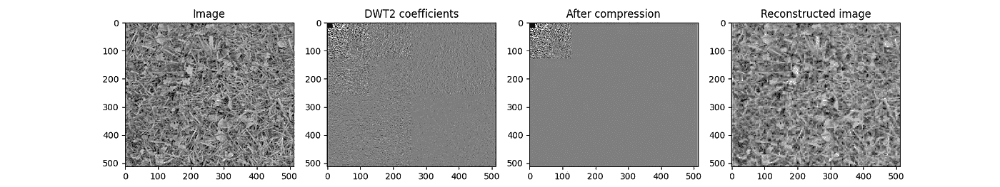
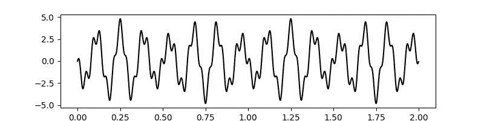
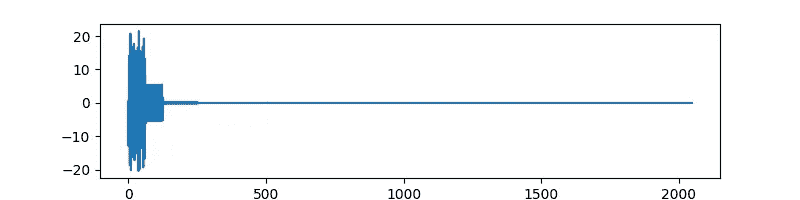
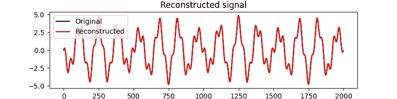
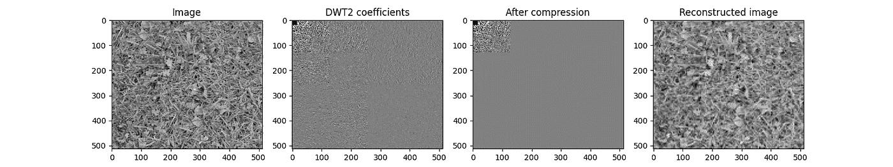

# 用谷歌 JAX 在 Python 中实现小波变换

> 原文：<https://towardsdatascience.com/wavelet-transforms-in-python-with-google-jax-cfd7ca9a39c6?source=collection_archive---------5----------------------->

## 一个简单的数据压缩例子



来自 [scikit-image](https://scikit-image.org/docs/dev/api/skimage.data.html#skimage.data.grass) 的草样本图像(左)，作者进行的小波系数计算、压缩和重建

小波变换是信号分析的关键工具之一。它们广泛应用于科学和工程领域。一些特定的应用包括数据压缩、步态分析、信号/图像去噪、数字通信等。本文通过使用 [CR-Sparse](https://cr-sparse.readthedocs.io/en/latest/) 库中提供的 DWT(离散小波变换)支持，关注一个简单的有损数据压缩应用程序。

有关小波变换的详细介绍，请参见:

*   [维基百科，小波变换](https://en.wikipedia.org/wiki/Wavelet_transform)
*   [小波教程，第一部分](https://ccrma.stanford.edu/~unjung/mylec/WTpart1.html)
*   C. Valens，一本真正友好的小波指南
*   [韦达科维奇和穆勒，儿童小波，教程介绍](http://www.gtwavelet.bme.gatech.edu/wp/kidsA.pdf)

## Python 中的小波

Python 中有几个包支持小波变换。让我列举几个:

*   [py wavelet](https://pywavelets.readthedocs.io/en/latest/)是 python 中对离散和连续小波支持最全面的实现之一。
*   [py torch-wavelet](https://pytorch-wavelets.readthedocs.io/en/latest/readme.html)支持 2D 离散小波和 2d 双树复小波变换。
*   [scipy](https://docs.scipy.org/doc/scipy/reference/generated/scipy.signal.cwt.html) 为连续小波变换提供了一些基本的支持。

PyWavelet 可能是可用的最成熟的库。它的覆盖面和性能都很棒。然而，该库的主要部分是用 c 编写的，因此，为 GPU 硬件实现重定向是不可能的。这也是人们想出更新的实现的原因之一，例如在 PyTorch 之上，py torch 提供了必要的 GPU 支持。

## 谷歌 JAX

[CR-Sparse](https://cr-sparse.readthedocs.io/en/latest/index.html) 库现在支持使用[谷歌 JAX](https://jax.readthedocs.io/en/latest/) 库计算离散和连续小波变换。

JAX 通过利用 [XLA](https://www.tensorflow.org/xla) 提供高性能数值计算。XLA 是一个特定领域的线性代数编译器。JAX 提供了一个类似 NumPy 的 API 和一个 JIT 编译器，这样使用 JAX 编写的代码可以很容易地被及时编译(使用 XLA)成特定硬件架构的机器代码。

因此，您可以在 JAX API 的基础上编写纯 Python 代码，并构建复杂的数值算法，这些算法可以高效地交叉编译到不同的 GPU 架构。

JAX 有像 [pmap](https://jax.readthedocs.io/en/latest/jax-101/06-parallelism.html) 这样的工具，它使得代码的并行评估变得简单明了。对于大型数据集，JAX 甚至在 CPU 上轻松胜过 NumPy。

然而，利用 JAX 确实需要一些工作。我们必须以某种方式编写我们的数值算法，以便它们可以被 JIT 编译。一个特定的需求是所有的代码都是使用函数式编程原则编写的。例如，JAX 数组是不可变的(而 NumPy 数组不是),所以对数组的任何更改实际上都在 Python 代码级别创建了一个新数组。XLA 编译器很聪明，可以重用内存。在某种程度上，以函数方式重写数值算法是一种非常有益的体验。它让您专注于基本的数学，避免不必要的全局状态操作，保持实现相当干净和简单。

## CR-稀疏中的小波支持

CR-Sparse 专注于稀疏信号处理的功能模型和算法，即在信号处理问题中利用信号表示的稀疏性。小波变换是构造常见信号稀疏表示的关键工具。因此，它们构成了 CR-Sparse 库的重要部分。该实现是纯 Python，使用 JAX 遵循的函数式编程原则编写，并及时编译为 CPU/GPU/TPU 架构，无缝提供出色的性能。[小波模块 API](https://cr-sparse.readthedocs.io/en/latest/source/wavelets.html) 受到[py wavelet](https://pywavelets.readthedocs.io/en/latest/index.html)的启发并与之相似。此外，小波功能已经被包装成类似于 [PyLops](https://pylops.readthedocs.io/en/latest/index.html) 的 1D 和 2D 线性算子。

请参考我以前的文章[用谷歌 JAX 在 Python 中实现线性操作符](/implementing-linear-operators-in-python-with-google-jax-c56be3a966c2)以获得更多关于线性操作符设计的信息。

# 简单的小波数据压缩

## 分解和重构

小波变换是可逆的。

*   我们可以使用小波分解信号，通过称为离散小波变换(DWT)的算法获得小波系数。信号被分解成两组系数:近似系数(信号的低通分量)和细节系数(高频。
*   我们可以使用一种称为离散小波逆变换(IDWT)的算法从小波系数中重建信号。

多级分解

*   通常，小波分解要进行多次。
*   我们从信号开始，计算近似和细节系数，然后对近似系数再次应用 DWT。
*   我们多次重复这一过程，以实现信号的多级分解。

以下示例显示了一个 4 级分解

```
X => [A1 D1] => [A2 D2 D1] => [A3 D3 D2 D1] => [A4 D4 D3 D2 D1]A1, D1 = DWT(X)
A2, D2 = DWT(A1)
A3, D3 = DWT(A2)
A4, D4 = DWT(A3)
```

*   通过应用 DWT，信号 X 被分成近似和细节系数 A1 和 D1。如果信号有 N 个系数，那么分解将有 N/2 个近似系数和 N/2 个细节系数(从技术上讲，如果我们在计算 DWT 时使用周期化扩展，其他扩展会导致更多的系数)。
*   通过应用 DWT，近似系数 A1 已经再次分裂成近似和细节系数 A2 和 D2。
*   我们重复这个过程 2 次以上。
*   通过连接 A4、D4、D3、D2、D1 中的系数来获得 X 的 4 级分解。
*   如果信号 X 有 N 个样本，那么小波分解也将由 N 个系数组成。

信号的重建过程如下:

```
A3 = IDWT(A4, D4)
A2 = IDWT(A3, D3)
A1 = IDWT (A2, D2)
X = IDWT(A1, D1)
```

## 简单数据压缩

*   结果表明，如果我们丢弃一些细节系数，信号仍然可以在相当高的信噪比下如实重建。
*   如果我们去掉 D1 系数，我们可以实现 50%的压缩。如果我们降低 D1 和 D2 系数，我们可以实现 75%的压缩。

一个重要的考虑是在从剩余系数重构信号之后测量[信噪比](https://en.wikipedia.org/wiki/Signal-to-noise_ratio)。如果压缩技术好，信噪比就会高。

这是对压缩问题的一种非常简单的处理方式，但它足以满足本文的目的。

我们现在展示使用 1D 和 2D 小波变换进行信号和图像压缩和重建的示例代码。详细的示例代码可以在示例库(在 CR-Sparse 文档中)[这里](https://cr-sparse.readthedocs.io/en/latest/gallery/lop/wt_op.html)找到。

此示例针对存储库中的最新版本运行，该版本可通过以下软件安装:

```
python -m pip install git+https://github.com/carnotresearch/cr-sparse.git
```

# 1D 信号分解、压缩、重建

第一，必要的进口。我们还需要 JAX，matplotlib 和 scikit-image 库。

```
**import** **jax.numpy** **as** **jnp**
**import** **matplotlib.pyplot** **as** **plt**
**import** **cr.sparse** **as** **crs**
**from** **cr.sparse** **import** lop
**from** **cr.sparse** **import** metrics
**import** **skimage.data**
**from** **cr.sparse.dsp** **import** time_values
```

在本例中，我们将构建一个由不同频率和幅度的多个正弦波组成的信号。

```
fs = 1000.
[T](https://docs.python.org/3/library/functions.html#int) = 2
t = time_values(fs, [T](https://docs.python.org/3/library/functions.html#int))
[n](https://docs.python.org/3/library/functions.html#int) = t.size
x = jnp.zeros([n](https://docs.python.org/3/library/functions.html#int))
freqs = [25, 7, 9]
amps = [1, -3, .8]
**for**  (f, amp) **in** zip(freqs, amps):
    sinusoid = amp * jnp.sin(2 * jnp.pi * f * t)
    x = x + sinusoid
```



正弦波混合样本(作者提供)

CR 稀疏线性算子模块(lop)包括 1D 小波变换算子。我们将构造操作符。我们将提供信号的大小、小波类型和分解的级数作为这个操作符的参数。

```
DWT_op = lop.dwt(n, wavelet='dmey', level=5)
```

通过对数据应用线性算子来计算小波系数。阅读[这里的](https://cr-sparse.readthedocs.io/en/latest/source/lop.html)了解线性操作符如何在 CR-Sparse 中工作。

```
alpha = DWT_op.times(x)
```



信号的小波系数(由作者计算)

有趣的是，大部分细节系数可以忽略不计。小波系数的大小表示该系数携带的信号能量部分。丢弃这些系数不会导致很高的重建误差。

让我们去掉 10%的系数(压缩):

```
cutoff = [n](https://docs.python.org/3/library/functions.html#int) // 10
alpha2 = alpha.at[cutoff:].set(0)
```

出于我们的目的，我们只是将这些系数设置为 0。在数字通信设置中，这些系数不会被传输，并且会被接收器假定为零。我们还看到数组更新的语法有点困难。由于数组在 JAX 中是不可变的，因此 JAX 提供了通过更新旧数组的一部分来构造新数组的函数变体。详见[此处](https://jax.readthedocs.io/en/latest/notebooks/Common_Gotchas_in_JAX.html#in-place-updates)。

我们现在通过应用 DWT 线性算子的伴随算子(恰好是它的逆算子)从剩余的系数中重构原始信号。

```
x_rec = DWT_op.trans(alpha2)
snr = metrics.signal_noise_ratio(x, x_rec)
print(snr)
```

信噪比为 36.56 dB。



使用逆 DWT 完成重建(作者)

从这个图中我们可以看出，重建误差可以忽略不计。

# 2D 图像分解、压缩、重建

现在让我们在 2D 图像上试试运气。在这个演示中，我们将从 [scikit-image](https://scikit-image.org/) 库中获取一个草地图像样本。

```
image = skimage.data.grass()
```

2D DWT 是 1D DWT 的直接扩展。

*   给定大小为 NxN 的图像 X，计算每一列的 DWT。我们得到两个新图像 CA 和 CD，每个图像的大小为 N/2×N(即行数的一半)。
*   对 CA 的每一行应用 DWT，以获得 CAA 和 CAD 图像(每个图像的大小为 N/2 x N/2)。
*   对 CD 的每一行应用 DWT 以获得 CDA 和 CDD 图像。
*   这样我们把 X 分割成[CAA，CAD，CDA，CDD] 4 个子图。
*   我们可以组合这些子图像以形成单个系数图像。
*   我们递归地在 CAA 部分上重复 2D DWT 分解，以计算多级分解。

2D IDWT 将[CAA，CAD，CDA，CDD]作为输入，并将 X 作为输出返回(首先对行应用 IDWT，然后对列应用 IDWT)。

我们将使用具有 5 级分解的 2D·哈尔小波变换算子。

```
DWT2_op = lop.dwt2D(image.shape, wavelet='haar', level=5)
DWT2_op = lop.jit(DWT2_op)
```

计算小波系数就是对图像应用线性算子:

```
coefs = DWT2_op.times(image)
```

让我们只保留 1/16 的系数(即只有 6.25%的系数)。我们将删除第一级和第二级细节系数。

```
h, w = coefs.shape
coefs2 = jnp.zeros_like(coefs)
coefs2 = coefs2.at[:h//4, :w//4].set(coefs[:h//4, :w//4])
```

重构包括应用恰好是其逆算子的伴随算子。重建后，我们将计算[峰值信噪比](https://en.wikipedia.org/wiki/Peak_signal-to-noise_ratio)来衡量重建的质量。

```
image_rec = DWT2_op.trans(coefs2)
# PSNR
psnr = metrics.peak_signal_noise_ratio(image, image_rec)
print(psnr)
```

PSNR 是 19.38 分贝。



作者仅使用 6.25%的小波系数进行图像重建(来自 scikit-image 的草地样本图像)

小波系数只有 6%的 19 dB PSNR 并不坏。此外，图像的细节得到很好的保留，没有块状伪像。

我希望这篇文章很好地介绍了 CR-Sparse 中可用的小波变换功能。

对于更高级的用法，请查看使用 LSQR 和 FISTA 算法的[图像去模糊示例](https://cr-sparse.readthedocs.io/en/latest/gallery/lop/deblurring.html#sphx-glr-gallery-lop-deblurring-py)。